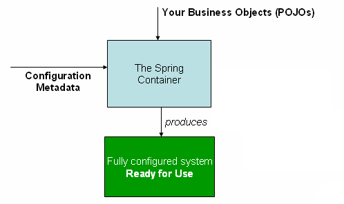

# 1.2. Container Overview

<!-- tabs:start -->

#### ** English **

The `org.springframework.context.ApplicationContext` interface represents the Spring IoC container and is responsible for instantiating, configuring, and assembling the beans. The container gets its instructions on what objects to instantiate, configure, and assemble by reading configuration metadata. The configuration metadata is represented in XML, Java annotations, or Java code. It lets you express the objects that compose your application and the rich interdependencies between those objects.
#### ** Chinese **

`org.springframework.context.ApplicationContext`接口代表Spring IoC容器，负责实例化、配置和组装Bean。容器通过读取配置元数据来获取关于要实例化、配置和组装哪些对象的指令。配置元数据用 XML、Java 注解或 Java 代码来表示。它可以让你表达组成你的应用程序的对象以及这些对象之间的丰富的相互依赖关系。

<!-- tabs:end -->


<!-- tabs:start -->

#### ** English **

Several implementations of the `ApplicationContext` interface are supplied with Spring. In stand-alone applications, it is common to create an instance of [`ClassPathXmlApplicationContext`](https://docs.spring.io/spring-framework/docs/5.2.6.RELEASE/javadoc-api/org/springframework/context/support/ClassPathXmlApplicationContext.html) or [`FileSystemXmlApplicationContext`](https://docs.spring.io/spring-framework/docs/5.2.6.RELEASE/javadoc-api/org/springframework/context/support/FileSystemXmlApplicationContext.html). While XML has been the traditional format for defining configuration metadata, you can instruct the container to use Java annotations or code as the metadata format by providing a small amount of XML configuration to declaratively enable support for these additional metadata formats.
#### ** Chinese **

Spring提供了几个 `ApplicationContext` 接口的实现。在独立的应用程序中，通常会创建一个[`ClassPathXmlApplicationContext`](https://docs.spring.io/spring-framework/docs/5.2.6.RELEASE/javadoc-api/org/springframework/context/support/ClassPathXmlApplicationContext.html)或[`FileSystemXmlApplicationContext`](https://docs.spring.io/spring-framework/docs/5.2.6.RELEASE/javadoc-api/org/springframework/context/support/FileSystemXmlApplicationContext.html)的实例。虽然 XML 一直是定义配置元数据的传统格式，但您可以通过提供少量的 XML 配置来声明性地启用对这些附加元数据格式的支持，从而指示容器使用 Java 注解或代码作为元数据格式。
<!-- tabs:end -->


<!-- tabs:start -->

#### ** English **

In most application scenarios, explicit user code is not required to instantiate one or more instances of a Spring IoC container. For example, in a web application scenario, a simple eight (or so) lines of boilerplate web descriptor XML in the `web.xml` file of the application typically suffices (see [Convenient ApplicationContext Instantiation for Web Applications](https://docs.spring.io/spring/docs/5.2.6.RELEASE/spring-framework-reference/core.html#context-create)). If you use the [Spring Tools for Eclipse](https://spring.io/tools) (an Eclipse-powered development environment), you can easily create this boilerplate configuration with a few mouse clicks or keystrokes.
#### ** Chinese **

在大多数应用场景中，不需要显式用户代码来实例化一个或多个Spring IoC容器的实例。例如，在 Web 应用程序场景中，在应用程序的 `web.xml` 文件中，只需在应用程序的 `web.xml` 文件中简单的八行（或更多）的 Web 描述符 XML 就足够了（请参阅 [方便的 Web 应用程序的 ApplicationContext Instantiation](https://docs.spring.io/spring/docs/5.2.6.RELEASE/spring-framework-reference/core.html#context-create)）。如果你使用[Spring Tools for Eclipse](https://spring.io/tools)(一个由Eclipse驱动的开发环境)，你只需点击几下鼠标或敲击几下键盘，就可以轻松地创建这个模板配置。
<!-- tabs:end -->


<!-- tabs:start -->

#### ** English **

The following diagram shows a high-level view of how Spring works. Your application classes are combined with configuration metadata so that, after the `ApplicationContext` is created and initialized, you have a fully configured and executable system or application.
#### ** Chinese **

下图显示了Spring工作原理的高级视图。您的应用程序类与配置元数据相结合，这样，在`ApplicationContext`创建并初始化后，您就拥有了一个完全配置好的、可执行的系统或应用程序。
<!-- tabs:end -->




**Figure 1. The Spring IoC container** 

### **1.2.1. Configuration Metadata** 

<!-- tabs:start -->

#### ** English **

As the preceding diagram shows, the Spring IoC container consumes a form of configuration metadata. This configuration metadata represents how you, as an application developer, tell the Spring container to instantiate, configure, and assemble the objects in your application.
#### ** Chinese **

如上图所示，Spring IoC 容器会消耗一种形式的配置元数据。此配置元数据代表了您作为应用程序开发人员如何告诉Spring容器在应用程序中实例化、配置和组装对象。
<!-- tabs:end -->


<!-- tabs:start -->

#### ** English **

Configuration metadata is traditionally supplied in a simple and intuitive XML format, which is what most of this chapter uses to convey key concepts and features of the Spring IoC container.
#### ** Chinese **

配置元数据传统上是以简单直观的XML格式提供的，本章的大部分内容都是用它来传达Spring IoC容器的关键概念和特性。
<!-- tabs:end -->


<!-- tabs:start -->

#### ** English **

XML-based metadata is not the only allowed form of configuration metadata. The Spring IoC container itself is totally decoupled from the format in which this configuration metadata is actually written. These days, many developers choose [Java-based configuration](https://docs.spring.io/spring/docs/5.2.6.RELEASE/spring-framework-reference/core.html#beans-java) for their Spring applications.
#### ** Chinese **

基于 XML 的元数据不是唯一允许的配置元数据形式。Spring IoC 容器本身与这种配置元数据实际写入的格式完全脱钩。这些天来，许多开发者选择了[基于Java的配置](https://docs.spring.io/spring/docs/5.2.6.RELEASE/spring-framework-reference/core.html#beans-java)作为他们的Spring应用程序。
<!-- tabs:end -->


<!-- tabs:start -->

#### ** English **

For information about using other forms of metadata with the Spring container, see:
#### ** Chinese **

有关在 Spring 容器中使用其他形式的元数据的信息，请参阅。
<!-- tabs:end -->


<!-- tabs:start -->

#### ** English **

- [Annotation-based configuration](https://docs.spring.io/spring/docs/5.2.6.RELEASE/spring-framework-reference/core.html#beans-annotation-config): Spring 2.5 introduced support for annotation-based configuration metadata.

- [Java-based configuration](https://docs.spring.io/spring/docs/5.2.6.RELEASE/spring-framework-reference/core.html#beans-java): Starting with Spring 3.0, many features provided by the Spring JavaConfig project became part of the core Spring Framework. Thus, you can define beans external to your application classes by using Java rather than XML files. To use these new features, see the [`@Configuration`](https://docs.spring.io/spring-framework/docs/current/javadoc-api/org/springframework/context/annotation/Configuration.html), [`@Bean`](https://docs.spring.io/spring-framework/docs/current/javadoc-api/org/springframework/context/annotation/Bean.html), [`@Import`](https://docs.spring.io/spring-framework/docs/current/javadoc-api/org/springframework/context/annotation/Import.html), and [`@DependsOn`](https://docs.spring.io/spring-framework/docs/current/javadoc-api/org/springframework/context/annotation/DependsOn.html) annotations.

#### ** Chinese **

- 基于注解的配置](https://docs.spring.io/spring/docs/5.2.6.RELEASE/spring-framework-reference/core.html#beans-annotation-config)。Spring 2.5引入了对基于注解的配置元数据的支持。

- [基于Java的配置](https://docs.spring.io/spring/docs/5.2.6.RELEASE/spring-framework-reference/core.html#beans-java)。从Spring 3.0开始，Spring JavaConfig项目提供的许多功能成为Spring框架核心的一部分。因此，您可以通过使用Java而不是XML文件来定义应用程序类外部的Bean。要使用这些新特性，请参见 [`@Configuration`](https://docs.spring.io/spring-framework/docs/current/javadoc-api/org/springframework/context/annotation/Configuration.html)、[`@Bean`](https://docs.spring.io/spring-framework/docs/current/javadoc-api/org/springframework/context/annotation/Bean.html)、[`@Import`](https://docs.spring.io/spring-framework/docs/current/javadoc-api/org/springframework/context/annotation/Import.html)和[`@DependsOn`](https://docs.spring.io/spring-framework/docs/current/javadoc-api/org/springframework/context/annotation/DependsOn.html)注解。
<!-- tabs:end -->

<!-- tabs:start -->

#### ** English **

Spring configuration consists of at least one and typically more than one bean definition that the container must manage. XML-based configuration metadata configures these beans as `<bean/>` elements inside a top-level `<beans/>` element. Java configuration typically uses `@Bean`-annotated methods within a `@Configuration` class.
#### ** Chinese **

Spring 配置由容器必须管理的至少一个、通常不止一个bean定义组成。基于 XML 的配置元数据将这些 bean 配置为 `<bean/>` 元素，并在一个顶层 `<beans/>` 元素中配置这些 bean。Java 配置通常是 `@Configuration`类中的带`@Bean`注解的方法。
<!-- tabs:end -->


<!-- tabs:start -->

#### ** English **

These bean definitions correspond to the actual objects that make up your application. Typically, you define service layer objects, data access objects (DAOs), presentation objects such as Struts `Action` instances, infrastructure objects such as Hibernate `SessionFactories`, JMS `Queues`, and so forth. Typically, one does not configure fine-grained domain objects in the container, because it is usually the responsibility of DAOs and business logic to create and load domain objects. However, you can use Spring’s integration with AspectJ to configure objects that have been created outside the control of an IoC container. See [Using AspectJ to dependency-inject domain objects with Spring](https://docs.spring.io/spring/docs/5.2.6.RELEASE/spring-framework-reference/core.html#aop-atconfigurable).
#### ** Chinese **

这些Bean定义对应于构成你的应用程序的实际对象。通常情况下，你会定义服务层对象、数据访问对象（DAO）、展示对象（如Struts `Action`实例）、基础架构对象（如Hibernate `SessionFactories`、JMS `Queues`等）。通常情况下，人们不会在容器中配置细粒度的域对象，因为通常由DAO和业务逻辑负责创建和加载域对象。但是，您可以使用Spring与AspectJ的集成来配置在IoC容器控制之外创建的对象。请参见[使用 AspectJ 来依赖注入域对象与 Spring](https://docs.spring.io/spring/docs/5.2.6.RELEASE/spring-framework-reference/core.html#aop-atconfigurable)。
<!-- tabs:end -->


<!-- tabs:start -->

#### ** English **

The following example shows the basic structure of XML-based configuration metadata:
#### ** Chinese **

下面的例子展示了基于XML的配置元数据的基本结构。
<!-- tabs:end -->


```xml
<?xml version="1.0" encoding="UTF-8"?>
<beans xmlns="http://www.springframework.org/schema/beans"
    xmlns:xsi="http://www.w3.org/2001/XMLSchema-instance"
    xsi:schemaLocation="http://www.springframework.org/schema/beans
        https://www.springframework.org/schema/beans/spring-beans.xsd">

    <bean id="..." class="..."> (1) (2)
        <!-- collaborators and configuration for this bean go here -->
    </bean>

    <bean id="..." class="...">
        <!-- collaborators and configuration for this bean go here -->
    </bean>

    <!-- more bean definitions go here -->

</beans>
```

<!-- tabs:start -->

#### ** English **

(1)The `id` attribute is a string that identifies the individual bean definition.
#### ** Chinese **

(1)`id`属性是标识单个Bean定义的字符串。
<!-- tabs:end -->


<!-- tabs:start -->

#### ** English **

(2)The `class` attribute defines the type of the bean and uses the fully qualified classname.
#### ** Chinese **

(2)`class`属性定义了Bean的类型，并使用完全限定的类名。
<!-- tabs:end -->


<!-- tabs:start -->

#### ** English **

The value of the `id` attribute refers to collaborating objects. The XML for referring to collaborating objects is not shown in this example. See [Dependencies](https://docs.spring.io/spring/docs/5.2.6.RELEASE/spring-framework-reference/core.html#beans-dependencies) for more information.
#### ** Chinese **

`id`属性的值是指协作对象。这个例子中没有显示用于引用协作对象的XML。更多信息，请参阅[Dependencies](https://docs.spring.io/spring/docs/5.2.6.RELEASE/spring-framework-reference/core.html#beans-dependencies)。
<!-- tabs:end -->


### **1.2.2. Instantiating a Container** 

<!-- tabs:start -->

#### ** English **

The location path or paths supplied to an `ApplicationContext` constructor are resource strings that let the container load configuration metadata from a variety of external resources, such as the local file system, the Java `CLASSPATH`, and so on.
#### ** Chinese **

提供给`ApplicationContext`构造函数的位置路径或路径是资源字符串，它允许容器从各种外部资源中加载配置元数据，如本地文件系统、Java `CLASSPATH`等。
<!-- tabs:end -->


```java
ApplicationContext context = new ClassPathXmlApplicationContext("services.xml", "daos.xml");
```

<!-- tabs:start -->

#### ** English **

After you learn about Spring’s IoC container, you may want to know more about Spring’s `Resource` abstraction (as described in [Resources](https://docs.spring.io/spring/docs/5.2.6.RELEASE/spring-framework-reference/core.html#resources)), which provides a convenient mechanism for reading an InputStream from locations defined in a URI syntax. In particular, `Resource` paths are used to construct applications contexts, as described in [Application Contexts and Resource Paths](https://docs.spring.io/spring/docs/5.2.6.RELEASE/spring-framework-reference/core.html#resources-app-ctx).
#### ** Chinese **

在了解了Spring的IoC容器之后，你可能想了解更多关于Spring的`Resource`抽象（如[Resources](https://docs.spring.io/spring/docs/5.2.6.RELEASE/spring-framework-reference/core.html#resources)中描述的那样），它提供了一种方便的机制，可以从URI语法中定义的位置读取InputStream。特别是，`Resource`路径被用来构建应用程序上下文，如[应用程序上下文和资源路径](https://docs.spring.io/spring/docs/5.2.6.RELEASE/spring-framework-reference/core.html#resources-app-ctx)中描述的那样。
<!-- tabs:end -->


<!-- tabs:start -->

#### ** English **

The following example shows the service layer objects `(services.xml)` configuration file:
#### ** Chinese **

下面的示例显示了服务层对象`(services.xml)`配置文件。
<!-- tabs:end -->


```xml
<?xml version="1.0" encoding="UTF-8"?>
<beans xmlns="http://www.springframework.org/schema/beans"
    xmlns:xsi="http://www.w3.org/2001/XMLSchema-instance"
    xsi:schemaLocation="http://www.springframework.org/schema/beans
        https://www.springframework.org/schema/beans/spring-beans.xsd">

    <!-- services -->

    <bean id="petStore" class="org.springframework.samples.jpetstore.services.PetStoreServiceImpl">
        <property name="accountDao" ref="accountDao"/>
        <property name="itemDao" ref="itemDao"/>
        <!-- additional collaborators and configuration for this bean go here -->
    </bean>

    <!-- more bean definitions for services go here -->

</beans>
```

<!-- tabs:start -->

#### ** English **

The following example shows the data access objects `daos.xml` file:
#### ** Chinese **

下面的例子显示了数据访问对象`daos.xml`文件。
<!-- tabs:end -->


```xml
<?xml version="1.0" encoding="UTF-8"?>
<beans xmlns="http://www.springframework.org/schema/beans"
    xmlns:xsi="http://www.w3.org/2001/XMLSchema-instance"
    xsi:schemaLocation="http://www.springframework.org/schema/beans
        https://www.springframework.org/schema/beans/spring-beans.xsd">

    <bean id="accountDao"
        class="org.springframework.samples.jpetstore.dao.jpa.JpaAccountDao">
        <!-- additional collaborators and configuration for this bean go here -->
    </bean>

    <bean id="itemDao" class="org.springframework.samples.jpetstore.dao.jpa.JpaItemDao">
        <!-- additional collaborators and configuration for this bean go here -->
    </bean>

    <!-- more bean definitions for data access objects go here -->

</beans>
```

<!-- tabs:start -->

#### ** English **

In the preceding example, the service layer consists of the `PetStoreServiceImpl` class and two data access objects of the types `JpaAccountDao` and `JpaItemDao` (based on the JPA Object-Relational Mapping standard). The `property name` element refers to the name of the JavaBean property, and the `ref` element refers to the name of another bean definition. This linkage between `id` and `ref` elements expresses the dependency between collaborating objects. For details of configuring an object’s dependencies, see [Dependencies](https://docs.spring.io/spring/docs/5.2.6.RELEASE/spring-framework-reference/core.html#beans-dependencies).
#### ** Chinese **

在前面的例子中，服务层由`PetStoreServiceImpl`类和两个类型为`JpaAccountDao`和`JpaItemDao`的数据访问对象（基于JPA对象关系映射标准）组成。`property name`元素指的是JavaBean属性的名称，而`ref`元素指的是另一个Bean定义的名称。`id`和`ref`元素之间的这种联系表达了协作对象之间的依赖关系。关于配置一个对象的依赖关系的细节，请参阅[Dependencies](https://docs.spring.io/spring/docs/5.2.6.RELEASE/spring-framework-reference/core.html#beans-dependencies)。
<!-- tabs:end -->


### **Composing XML-based Configuration Metadata** 

<!-- tabs:start -->

#### ** English **

It can be useful to have bean definitions span multiple XML files. Often, each individual XML configuration file represents a logical layer or module in your architecture.
#### ** Chinese **

让Bean定义跨越多个XML文件是非常有用的。通常情况下，每个单独的XML配置文件代表了你的架构中的逻辑层或模块。
<!-- tabs:end -->


<!-- tabs:start -->

#### ** English **

You can use the application context constructor to load bean definitions from all these XML fragments. This constructor takes multiple `Resource` locations, as was shown in the [previous section](https://docs.spring.io/spring/docs/5.2.6.RELEASE/spring-framework-reference/core.html#beans-factory-instantiation). Alternatively, use one or more occurrences of the `<import/>` element to load bean definitions from another file or files. The following example shows how to do so:
#### ** Chinese **

你可以使用应用程序上下文构造函数来加载所有这些XML片段中的Bean定义。这个构造函数需要多个`Resource`位置，如[上一节](https://docs.spring.io/spring/docs/5.2.6.RELEASE/spring-framework-reference/core.html#beans-factory-instantiation)所示。另外，也可以使用一个或多个 `<import/>` 元素的一个或多个出现，从另一个或多个文件中加载Bean定义。下面的例子显示了如何做到这一点。
<!-- tabs:end -->


```xml
<beans>
    <import resource="services.xml"/>
    <import resource="resources/messageSource.xml"/>
    <import resource="/resources/themeSource.xml"/>

    <bean id="bean1" class="..."/>
    <bean id="bean2" class="..."/>
</beans>
```

<!-- tabs:start -->

#### ** English **

In the preceding example, external bean definitions are loaded from three files: `services.xml`, `messageSource.xml`, and `themeSource.xml`. All location paths are relative to the definition file doing the importing, so `services.xml` must be in the same directory or classpath location as the file doing the importing, while `messageSource.xml` and `themeSource.xml` must be in a `resources` location below the location of the importing file. As you can see, a leading slash is ignored. However, given that these paths are relative, it is better form not to use the slash at all. The contents of the files being imported, including the top level `<beans/>` element, must be valid XML bean definitions, according to the Spring Schema.
#### ** Chinese **

在前面的例子中，外部Bean定义是从三个文件中加载的。 `services.xml`、`messageSource.xml`和`themeSource.xml`。所有的位置路径都是相对于进行导入的定义文件而言的，所以`services.xml`必须与导入的文件在同一目录或classpath位置，而`messageSource.xml`和`themeSource.xml`必须在导入文件的位置下方的`resources`位置。正如你所看到的，前导斜线被忽略了。但是，考虑到这些路径是相对的，最好不要使用斜线。根据Spring Schema，被导入的文件的内容，包括顶层`<beans/>`元素，必须是有效的XML bean定义。
<!-- tabs:end -->


<!-- tabs:start -->

#### ** English **

It is possible, but not recommended, to reference files in parent directories using a relative "../" path. Doing so creates a dependency on a file that is outside the current application. In particular, this reference is not recommended for `classpath:` URLs (for example, `classpath:../services.xml`), where the runtime resolution process chooses the “nearest” classpath root and then looks into its parent directory. Classpath configuration changes may lead to the choice of a different, incorrect directory.
#### ** Chinese **

可以，但不建议使用相对"./"路径引用父目录中的文件。这样做会对当前应用程序之外的文件产生依赖。特别是，不建议对 `classpath:` URL（例如，`classpath:../services.xml`）使用这种引用，因为运行时解析进程会选择 "最近的 "classpath根目录，然后查找其父目录。classpath 配置的更改可能会导致选择不同的、不正确的目录。
<!-- tabs:end -->


<!-- tabs:start -->

#### ** English **

You can always use fully qualified resource locations instead of relative paths: for example, `file:C:/config/services.xml` or `classpath:/config/services.xml`. However, be aware that you are coupling your application’s configuration to specific absolute locations. It is generally preferable to keep an indirection for such absolute locations — for example, through "${…​}" placeholders that are resolved against JVM system properties at runtime.
#### ** Chinese **

您可以始终使用完全限定的资源位置而不是相对路径：例如，`file:C:/config/services.xml`或`classpath:/config/services.xml`。但是，要注意的是，你的应用程序的配置被耦合到特定的绝对位置。一般情况下，最好是为这些绝对位置保留一个隐含的位置--例如，通过"${...}"占位符，在运行时对JVM系统属性进行解析。
<!-- tabs:end -->


<!-- tabs:start -->

#### ** English **

The namespace itself provides the import directive feature. Further configuration features beyond plain bean definitions are available in a selection of XML namespaces provided by Spring — for example, the `context` and `util` namespaces.
#### ** Chinese **

命名空间本身提供了导入指令功能。在Spring提供的一系列XML命名空间中提供了除纯Bean定义之外的其他配置功能，例如，`context`和`util`命名空间。
<!-- tabs:end -->


### **The Groovy Bean Definition DSL** 

<!-- tabs:start -->

#### ** English **

As a further example for externalized configuration metadata, bean definitions can also be expressed in Spring’s Groovy Bean Definition DSL, as known from the Grails framework. Typically, such configuration live in a ".groovy" file with the structure shown in the following example:
#### ** Chinese **

作为外部化配置元数据的另一个例子，Bean定义也可以用Spring的Groovy Bean Definition DSL来表达，就像Grails框架中的Grails一样。通常情况下，这样的配置在一个".groovy "文件中，其结构如下图所示。
<!-- tabs:end -->


```
beans {
    dataSource(BasicDataSource) {
        driverClassName = "org.hsqldb.jdbcDriver"
        url = "jdbc:hsqldb:mem:grailsDB"
        username = "sa"
        password = ""
        settings = [mynew:"setting"]
    }
    sessionFactory(SessionFactory) {
        dataSource = dataSource
    }
    myService(MyService) {
        nestedBean = { AnotherBean bean ->
            dataSource = dataSource
        }
    }
}
```

<!-- tabs:start -->

#### ** English **

This configuration style is largely equivalent to XML bean definitions and even supports Spring’s XML configuration namespaces. It also allows for importing XML bean definition files through an `importBeans` directive.
#### ** Chinese **

这种配置样式基本上等同于XML bean定义，甚至支持Spring的XML配置命名空间。它还允许通过`importBeans`指令导入XML bean定义文件。
<!-- tabs:end -->


### **1.2.3. Using the Container** 

<!-- tabs:start -->

#### ** English **

The `ApplicationContext` is the interface for an advanced factory capable of maintaining a registry of different beans and their dependencies. By using the method `T getBean(String name, Class<T> requiredType)`, you can retrieve instances of your beans.
#### ** Chinese **

`ApplicationContext`是一个高级工厂的接口，能够维护不同Bean及其依赖关系的注册表。通过使用方法`T getBean(String name, Class<T> requiredType)`，你可以获取你的Bean的实例。
<!-- tabs:end -->


<!-- tabs:start -->

#### ** English **

The `ApplicationContext` lets you read bean definitions and access them, as the following example shows:
#### ** Chinese **

`ApplicationContext`允许你读取Bean定义并访问它们，如下例所示。
<!-- tabs:end -->


```java
// create and configure beans
ApplicationContext context = new ClassPathXmlApplicationContext("services.xml", "daos.xml");

// retrieve configured instance
PetStoreService service = context.getBean("petStore", PetStoreService.class);

// use configured instance
List<String> userList = service.getUsernameList();
```

<!-- tabs:start -->

#### ** English **

With Groovy configuration, bootstrapping looks very similar. It has a different context implementation class which is Groovy-aware (but also understands XML bean definitions). The following example shows Groovy configuration:
#### ** Chinese **

用Groovy配置，bootstrapping看起来非常相似。它有一个不同的上下文实现类，这个类是Groovy感知的（但也能理解XML bean定义）。下面的例子显示了Groovy配置。
<!-- tabs:end -->


```java
ApplicationContext context = new GenericGroovyApplicationContext("services.groovy", "daos.groovy");
```

<!-- tabs:start -->

#### ** English **

The most flexible variant is `GenericApplicationContext` in combination with reader delegates — for example, with `XmlBeanDefinitionReader` for XML files, as the following example shows:
#### ** Chinese **

最灵活的变体是`GenericApplicationContext`与读取器委托代理结合在一起--例如，用`XmlBeanDefinitionReader`来读取XML文件，如下例所示。
<!-- tabs:end -->


```java
GenericApplicationContext context = new GenericApplicationContext();
new XmlBeanDefinitionReader(context).loadBeanDefinitions("services.xml", "daos.xml");
context.refresh();
```

<!-- tabs:start -->

#### ** English **

You can also use the `GroovyBeanDefinitionReader` for Groovy files, as the following example shows:
#### ** Chinese **

你也可以使用`GroovyBeanDefinitionReader`来处理Groovy文件，如下例所示。
<!-- tabs:end -->


```java
GenericApplicationContext context = new GenericApplicationContext();
new GroovyBeanDefinitionReader(context).loadBeanDefinitions("services.groovy", "daos.groovy");
context.refresh();
```

<!-- tabs:start -->

#### ** English **

You can mix and match such reader delegates on the same `ApplicationContext`, reading bean definitions from diverse configuration sources.
#### ** Chinese **

你可以在同一个`ApplicationContext`上混合和匹配这样的读取器委托，从不同的配置源读取Bean定义。
<!-- tabs:end -->


<!-- tabs:start -->

#### ** English **

You can then use `getBean` to retrieve instances of your beans. The `ApplicationContext` interface has a few other methods for retrieving beans, but, ideally, your application code should never use them. Indeed, your application code should have no calls to the `getBean()` method at all and thus have no dependency on Spring APIs at all. For example, Spring’s integration with web frameworks provides dependency injection for various web framework components such as controllers and JSF-managed beans, letting you declare a dependency on a specific bean through metadata (such as an autowiring annotation).
#### ** Chinese **

然后你可以使用`getBean`来检索Bean的实例。`ApplicationContext`接口有一些其他的方法来检索Bean，但理想情况下，你的应用程序代码不应该使用这些方法。事实上，你的应用程序代码应该完全不需要调用`getBean()`方法，因此完全不需要依赖Spring API。例如，Spring与Web框架的集成为各种Web框架组件（如控制器和JSF管理的Bean）提供了依赖注入，让你通过元数据（如自动布线注解）声明对特定Bean的依赖。
<!-- tabs:end -->


[下一章](Spring-Framework-5.2.6.RELEASE/Core%20Technologies/1.3.%20Bean%20Overview.md)


[回目录](Spring-Framework-5.2.6.RELEASE/Core%20Technologies/summary.md)

[回首页](/README)
