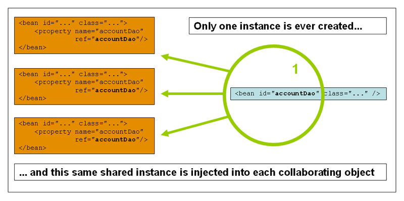
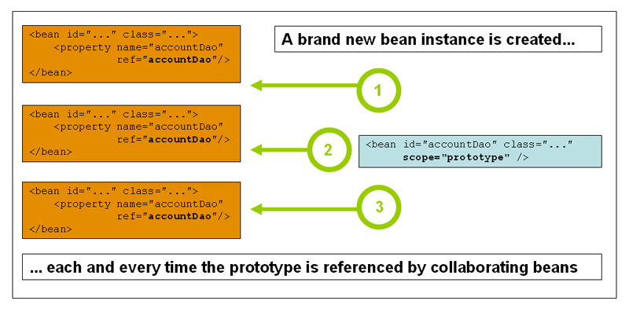

# 1.5. Bean Scopes

<!-- tabs:start -->

#### ** English **

When you create a bean definition, you create a recipe for creating actual instances of the class defined by that bean definition. The idea that a bean definition is a recipe is important, because it means that, as with a class, you can create many object instances from a single recipe.
#### ** Chinese **

当你创建一个Bean定义时，你创建了一个食谱，用于创建该Bean定义所定义的类的实际实例。Bean定义是一个配方的想法很重要，因为它意味着，就像类一样，你可以从一个配方中创建许多对象实例。
<!-- tabs:end -->


<!-- tabs:start -->

#### ** English **

You can control not only the various dependencies and configuration values that are to be plugged into an object that is created from a particular bean definition but also control the scope of the objects created from a particular bean definition. This approach is powerful and flexible, because you can choose the scope of the objects you create through configuration instead of having to bake in the scope of an object at the Java class level. Beans can be defined to be deployed in one of a number of scopes. The Spring Framework supports six scopes, four of which are available only if you use a web-aware `ApplicationContext`. You can also create [a custom scope.](https://docs.spring.io/spring/docs/5.2.6.RELEASE/spring-framework-reference/core.html#beans-factory-scopes-custom)
#### ** Chinese **

你不仅可以控制由特定的Bean定义创建的对象所要插入的各种依赖关系和配置值，还可以控制由特定Bean定义创建的对象的范围。这种方法是强大而灵活的，因为你可以通过配置来选择所创建的对象的范围，而不必在Java类级别上烘托对象的范围。Bean可以被定义为在许多作用域中的一个部署。Spring框架支持六个作用域，其中四个作用域只有在您使用web感知的`ApplicationContext`时才可用。您还可以创建[自定义作用域。](https://docs.spring.io/spring/docs/5.2.6.RELEASE/spring-framework-reference/core.html#beans-factory-scopes-custom)
<!-- tabs:end -->


<!-- tabs:start -->

#### ** English **

The following table describes the supported scopes:
#### ** Chinese **

下表介绍了所支持的范围：
<!-- tabs:end -->


Scope | Description 
-|-
singleton | (Default) Scopes a single bean definition to a single object instance for each Spring IoC container. 
prototype | Scopes a single bean definition to any number of object instances. 
request | Scopes a single bean definition to the lifecycle of a single HTTP request. That is, each HTTP request has its own instance of a bean created off the back of a single bean definition. Only valid in the context of a web-aware Spring ApplicationContext. 
session | Scopes a single bean definition to the lifecycle of an HTTP Session. Only valid in the context of a web-aware Spring ApplicationContext. 
application | Scopes a single bean definition to the lifecycle of a ServletContext. Only valid in the context of a web-aware Spring ApplicationContext. 
websocket | Scopes a single bean definition to the lifecycle of a WebSocket. Only valid in the context of a web-aware Spring ApplicationContext. 


<!-- tabs:start -->

#### ** English **

As of Spring 3.0, a thread scope is available but is not registered by default. For more information, see the documentation for [`SimpleThreadScope`](https://docs.spring.io/spring-framework/docs/5.2.6.RELEASE/javadoc-api/org/springframework/context/support/SimpleThreadScope.html). For instructions on how to register this or any other custom scope, see [Using a Custom Scope](https://docs.spring.io/spring/docs/5.2.6.RELEASE/spring-framework-reference/core.html#beans-factory-scopes-custom-using).
#### ** Chinese **

从Spring 3.0开始，线程作用域是可用的，但默认情况下没有注册。有关详细信息，请参阅 [`SimpleThreadScope`](https://docs.spring.io/spring-framework/docs/5.2.6.RELEASE/javadoc-api/org/springframework/context/support/SimpleThreadScope.html)的文档。有关如何注册这个或任何其他自定义作用域的说明，请参阅 [使用自定义作用域](https://docs.spring.io/spring/docs/5.2.6.RELEASE/spring-framework-reference/core.html#beans-factory-scopes-custom-using)。
<!-- tabs:end -->


### **1.5.1. The Singleton Scope** 

<!-- tabs:start -->

#### ** English **

Only one shared instance of a singleton bean is managed, and all requests for beans with an ID or IDs that match that bean definition result in that one specific bean instance being returned by the Spring container.
#### ** Chinese **

只管理一个单子bean的共享实例，所有对具有与该bean定义相匹配的ID或ID的bean的请求都会由Spring容器返回该特定的bean实例。
<!-- tabs:end -->


<!-- tabs:start -->

#### ** English **

To put it another way, when you define a bean definition and it is scoped as a singleton, the Spring IoC container creates exactly one instance of the object defined by that bean definition. This single instance is stored in a cache of such singleton beans, and all subsequent requests and references for that named bean return the cached object. The following image shows how the singleton scope works:
#### ** Chinese **

换句话说，当您定义了一个bean定义并将其作为单子定义时，Spring IoC容器会创建一个由该bean定义所定义的对象的一个实例。这个单一的实例存储在此类单体Bean的缓存中，随后对该命名的Bean的所有请求和引用都会返回缓存对象。下面的图片显示了单子对象作用域的工作原理。
<!-- tabs:end -->




<!-- tabs:start -->

#### ** English **

Spring’s concept of a singleton bean differs from the singleton pattern as defined in the Gang of Four (GoF) patterns book. The GoF singleton hard-codes the scope of an object such that one and only one instance of a particular class is created per ClassLoader. The scope of the Spring singleton is best described as being per-container and per-bean. This means that, if you define one bean for a particular class in a single Spring container, the Spring container creates one and only one instance of the class defined by that bean definition. The singleton scope is the default scope in Spring. To define a bean as a singleton in XML, you can define a bean as shown in the following example:
#### ** Chinese **

Spring的单子豆的概念不同于Gang of Four（GoF）模式书中定义的单子模式。GoF单子模式对对象的作用域进行了硬编码，即每个ClassLoader只创建一个特定类的一个实例。Spring 单元的作用域最好描述为每个容器和每个bean。这意味着，如果您在单个Spring容器中为一个特定类定义了一个Bean，那么Spring容器将为该Bean定义的类创建一个且仅有一个实例。单一的作用域是Spring中的默认作用域。要在 XML 中将 bean 定义为单子类，可以按照下面的例子来定义一个 bean。
<!-- tabs:end -->


```xml
<bean id="accountService" class="com.something.DefaultAccountService"/>

<!-- the following is equivalent, though redundant (singleton scope is the default) -->
<bean id="accountService" class="com.something.DefaultAccountService" scope="singleton"/>
```

### **1.5.2. The Prototype Scope** 

<!-- tabs:start -->

#### ** English **

The non-singleton prototype scope of bean deployment results in the creation of a new bean instance every time a request for that specific bean is made. That is, the bean is injected into another bean or you request it through a `getBean()` method call on the container. As a rule, you should use the prototype scope for all stateful beans and the singleton scope for stateless beans.
#### ** Chinese **

bean部署的非单体原型范围导致每次对该特定的bean提出请求时，都会创建一个新的bean实例。也就是说，这个bean被注入到另一个bean中，或者你通过容器上的`getBean()`方法调用来请求它。作为一项规则，你应该对所有有状态的Bean使用原型作用域，对无状态的Bean使用单子作用域。
<!-- tabs:end -->


<!-- tabs:start -->

#### ** English **

The following diagram illustrates the Spring prototype scope:
#### ** Chinese **

下图是Spring原型范围的示意图。
<!-- tabs:end -->




<!-- tabs:start -->

#### ** English **

(A data access object (DAO) is not typically configured as a prototype, because a typical DAO does not hold any conversational state. It was easier for us to reuse the core of the singleton diagram.)
#### ** Chinese **

(数据访问对象(DAO)一般不会被配置为原型，因为典型的DAO不会持有任何对话状态。对我们来说，重用单子图的核心更容易一些，所以我们可以重用单子图的核心)
<!-- tabs:end -->


<!-- tabs:start -->

#### ** English **

The following example defines a bean as a prototype in XML:
#### ** Chinese **

下面的例子将一个bean定义为XML中的原型。
<!-- tabs:end -->


```xml
<bean id="accountService" class="com.something.DefaultAccountService" scope="prototype"/>
```

<!-- tabs:start -->

#### ** English **

In contrast to the other scopes, Spring does not manage the complete lifecycle of a prototype bean. The container instantiates, configures, and otherwise assembles a prototype object and hands it to the client, with no further record of that prototype instance. Thus, although initialization lifecycle callback methods are called on all objects regardless of scope, in the case of prototypes, configured destruction lifecycle callbacks are not called. The client code must clean up prototype-scoped objects and release expensive resources that the prototype beans hold. To get the Spring container to release resources held by prototype-scoped beans, try using a custom [bean post-processor](https://docs.spring.io/spring/docs/5.2.6.RELEASE/spring-framework-reference/core.html#beans-factory-extension-bpp), which holds a reference to beans that need to be cleaned up.
#### ** Chinese **

与其他作用域不同的是，Spring并不管理一个原型Bean的整个生命周期。容器实例化、配置和以其他方式组装一个原型对象并将其交给客户机，而对该原型实例没有进一步的记录。因此，尽管初始化生命周期回调方法无论作用域如何，都会在所有对象上调用，但在原型的情况下，配置好的销毁生命周期回调方法不会被调用。客户端代码必须清理prototype-scope对象，并释放prototype beans所持有的昂贵资源。要让Spring容器释放由prototype-scoped beans持有的资源，可以尝试使用自定义的[bean后处理程序](https://docs.spring.io/spring/docs/5.2.6.RELEASE/spring-framework-reference/core.html#beans-factory-extension-bpp)，它持有需要清理的bean的引用。
<!-- tabs:end -->


<!-- tabs:start -->

#### ** English **

In some respects, the Spring container’s role in regard to a prototype-scoped bean is a replacement for the Java `new` operator. All lifecycle management past that point must be handled by the client. (For details on the lifecycle of a bean in the Spring container, see [Lifecycle Callbacks](https://docs.spring.io/spring/docs/5.2.6.RELEASE/spring-framework-reference/core.html#beans-factory-lifecycle).)
#### ** Chinese **

在某些方面，Spring容器对prototype-scoped bean的作用是对Java `new`操作符的替代。所有的生命周期管理都必须由客户端来处理。(关于Spring容器中Bean的生命周期的详细信息，请参阅[生命周期回调](https://docs.spring.io/spring/docs/5.2.6.RELEASE/spring-framework-reference/core.html#beans-factory-lifecycle)。
<!-- tabs:end -->


### **1.5.3. Singleton Beans with Prototype-bean Dependencies** 

<!-- tabs:start -->

#### ** English **

When you use singleton-scoped beans with dependencies on prototype beans, be aware that dependencies are resolved at instantiation time. Thus, if you dependency-inject a prototype-scoped bean into a singleton-scoped bean, a new prototype bean is instantiated and then dependency-injected into the singleton bean. The prototype instance is the sole instance that is ever supplied to the singleton-scoped bean.
#### ** Chinese **

当你使用具有依赖性的prototype bean的单子对象Scoped bean时，请注意，依赖性是在实例化时解决的。因此，如果你依赖性注入一个prototype-scoped bean到一个单子系统的bean中，一个新的prototype bean被实例化，然后依赖性注入到单子系统的bean中。原型实例是唯一一个被提供给单元Scoped Bean的实例。
<!-- tabs:end -->


<!-- tabs:start -->

#### ** English **

However, suppose you want the singleton-scoped bean to acquire a new instance of the prototype-scoped bean repeatedly at runtime. You cannot dependency-inject a prototype-scoped bean into your singleton bean, because that injection occurs only once, when the Spring container instantiates the singleton bean and resolves and injects its dependencies. If you need a new instance of a prototype bean at runtime more than once, see [Method Injection](https://docs.spring.io/spring/docs/5.2.6.RELEASE/spring-framework-reference/core.html#beans-factory-method-injection)
#### ** Chinese **

但是，假设你想让单子对象-scoped bean在运行时重复获取一个新的prototype-scoped bean的实例。你不能依赖注入一个prototype-scoped bean到你的singleton bean中，因为当Spring容器实例化singleton bean并解析和注入其依赖关系时，这种注入只发生一次。如果你在运行时需要一个新的prototype bean实例，请参见[方法注入](https://docs.spring.io/spring/docs/5.2.6.RELEASE/spring-framework-reference/core.html#beans-factory-method-injection)
<!-- tabs:end -->


### **1.5.4. Request, Session, Application, and WebSocket Scopes** 

<!-- tabs:start -->

#### ** English **

The `request`, `session`, `application`, and `websocket` scopes are available only if you use a web-aware Spring `ApplicationContext` implementation (such as `XmlWebApplicationContext`). If you use these scopes with regular Spring IoC containers, such as the `ClassPathXmlApplicationContext`, an `IllegalStateException` that complains about an unknown bean scope is thrown.
#### ** Chinese **

`request`、`session`、`application`和`websocket`作用域只有在您使用web感知的Spring `ApplicationContext`实现（如`XmlWebApplicationContext`）时才可用。如果您将这些作用域与常规的Spring IoC容器（如`ClassPathXmlApplicationContext`）一起使用这些作用域，则会抛出一个`IllegalStateException`，该异常会抱怨未知的Bean作用域。
<!-- tabs:end -->


### **Initial Web Configuration** 

<!-- tabs:start -->

#### ** English **

To support the scoping of beans at the `request`, `session`, `application`, and `websocket` levels (web-scoped beans), some minor initial configuration is required before you define your beans. (This initial setup is not required for the standard scopes: `singleton` and `prototype`.)
#### ** Chinese **

为了支持在`request`、`session`、`application`和`websocket`级别（web-scoped beans）的 beans 的范围化，在定义你的 beans 之前，需要进行一些小的初始配置。标准作用域不需要这个初始设置。 `singleton`和`prototype`的标准作用域不需要这个初始设置。)
<!-- tabs:end -->


<!-- tabs:start -->

#### ** English **

How you accomplish this initial setup depends on your particular Servlet environment.
#### ** Chinese **

如何完成这个初始设置取决于你的特定Servlet环境。
<!-- tabs:end -->


<!-- tabs:start -->

#### ** English **

If you access scoped beans within Spring Web MVC, in effect, within a request that is processed by the Spring `DispatcherServlet`, no special setup is necessary. `DispatcherServlet` already exposes all relevant state.
#### ** Chinese **

如果您在Spring Web MVC中访问Scoped Bean，实际上，在Spring `DispatcherServlet`处理的请求中访问Scoped Bean，则不需要特殊设置。 `DispatcherServlet`已经暴露了所有相关状态。
<!-- tabs:end -->


<!-- tabs:start -->

#### ** English **

If you use a Servlet 2.5 web container, with requests processed outside of Spring’s `DispatcherServlet` (for example, when using JSF or Struts), you need to register the `org.springframework.web.context.request.RequestContextListener` `ServletRequestListener`. For Servlet 3.0+, this can be done programmatically by using the `WebApplicationInitializer` interface. Alternatively, or for older containers, add the following declaration to your web application’s `web.xml` file:
#### ** Chinese **

如果你使用Servlet 2.5 Web容器，在Spring的`DispatcherServlet`之外处理请求（例如，当使用JSF或Struts时），你需要注册`org.springframework.web.context.request.RequestContextListener` `ServletRequestListener`。对于Servlet 3.0 ，可以通过使用`WebApplicationInitializer`接口编程来完成。另外，或者对于旧的容器，在你的web应用程序的`web.xml`文件中添加以下声明。
<!-- tabs:end -->


```xml
<web-app>
    ...
    <listener>
        <listener-class>
            org.springframework.web.context.request.RequestContextListener
        </listener-class>
    </listener>
    ...
</web-app>
```

<!-- tabs:start -->

#### ** English **

Alternatively, if there are issues with your listener setup, consider using Spring’s `RequestContextFilter`. The filter mapping depends on the surrounding web application configuration, so you have to change it as appropriate. The following listing shows the filter part of a web application:
#### ** Chinese **

另外，如果你的监听器设置有问题，可以考虑使用Spring的`RequestContextFilter`。筛选器的映射取决于周围的web应用程序配置，所以你必须适当地改变它。下面的列表显示了一个Web应用程序的过滤器部分。
<!-- tabs:end -->


```xml
<web-app>
    ...
    <filter>
        <filter-name>requestContextFilter</filter-name>
        <filter-class>org.springframework.web.filter.RequestContextFilter</filter-class>
    </filter>
    <filter-mapping>
        <filter-name>requestContextFilter</filter-name>
        <url-pattern>/*</url-pattern>
    </filter-mapping>
    ...
</web-app>
```

<!-- tabs:start -->

#### ** English **

`DispatcherServlet`, `RequestContextListener`, and `RequestContextFilter` all do exactly the same thing, namely bind the HTTP request object to the `Thread` that is servicing that request. This makes beans that are request- and session-scoped available further down the call chain.
#### ** Chinese **

`DispatcherServlet`、`RequestContextListener`和`RequestContextFilter`都做了同样的事情，即将HTTP请求对象绑定到服务于该请求的`Thread`。这使得请求和会话范围的Bean可以在调用链的更远处使用。
<!-- tabs:end -->


### **Request scope** 

<!-- tabs:start -->

#### ** English **

Consider the following XML configuration for a bean definition:
#### ** Chinese **

考虑下面的Bean定义的XML配置。
<!-- tabs:end -->


```xml
<bean id="loginAction" class="com.something.LoginAction" scope="request"/>
```

<!-- tabs:start -->

#### ** English **

The Spring container creates a new instance of the `LoginAction` bean by using the `loginAction` bean definition for each and every HTTP request. That is, the `loginAction` bean is scoped at the HTTP request level. You can change the internal state of the instance that is created as much as you want, because other instances created from the same `loginAction` bean definition do not see these changes in state. They are particular to an individual request. When the request completes processing, the bean that is scoped to the request is discarded.
#### ** Chinese **

Spring 容器通过使用 `loginAction` bean 定义为每个 HTTP 请求创建一个新的 `LoginAction` bean 实例。也就是说，`loginAction` bean是在HTTP请求级别的范围内。您可以随意更改创建的实例的内部状态，因为从相同的`loginAction` bean定义中创建的其他实例不会看到这些状态的变化。它们是特定于单个请求的。当请求完成处理后，将丢弃与该请求相关的Bean。
<!-- tabs:end -->


<!-- tabs:start -->

#### ** English **

When using annotation-driven components or Java configuration, the `@RequestScope` annotation can be used to assign a component to the `request` scope. The following example shows how to do so:
#### ** Chinese **

当使用注解驱动的组件或Java配置时，可以使用`@RequestScope`注解将组件分配给`request`作用域。下面的示例显示了如何做到这一点。
<!-- tabs:end -->


```java
@RequestScope
@Component
public class LoginAction {
    // ...
}
```

### **Session Scope** 

<!-- tabs:start -->

#### ** English **

Consider the following XML configuration for a bean definition:
#### ** Chinese **

考虑下面的Bean定义的XML配置。
<!-- tabs:end -->


```xml
<bean id="userPreferences" class="com.something.UserPreferences" scope="session"/>
```

<!-- tabs:start -->

#### ** English **

The Spring container creates a new instance of the `UserPreferences` bean by using the `userPreferences` bean definition for the lifetime of a single HTTP `Session`. In other words, the `userPreferences` bean is effectively scoped at the HTTP `Session` level. As with request-scoped beans, you can change the internal state of the instance that is created as much as you want, knowing that other HTTP `Session` instances that are also using instances created from the same `userPreferences` bean definition do not see these changes in state, because they are particular to an individual HTTP `Session`. When the HTTP `Session` is eventually discarded, the bean that is scoped to that particular HTTP `Session` is also discarded.
#### ** Chinese **

Spring 容器通过使用 `UserPreferences` bean 的定义为单个 HTTP `Session` 的生命周期创建一个新的 `UserPreferences` bean 实例。换句话说，`userPreferences` bean实际上是在HTTP `Session`级别的范围内。与请求范围化的 bean 一样，您可以随意更改所创建的实例的内部状态，因为您知道同样使用相同的 `userPreferences` bean 定义创建的其他 HTTP `Session` 实例不会看到这些状态的变化，因为它们是单个 HTTP `Session` 的特定状态。当HTTP `Session`最终被丢弃时，对该特定的HTTP `Session`进行范围化的Bean也会被丢弃。
<!-- tabs:end -->


<!-- tabs:start -->

#### ** English **

When using annotation-driven components or Java configuration, you can use the `@SessionScope` annotation to assign a component to the `session` scope.
#### ** Chinese **

当使用注解驱动的组件或Java配置时，可以使用`@SessionScope`注解将组件分配给`session`作用域。
<!-- tabs:end -->


```java
@SessionScope
@Component
public class UserPreferences {
    // ...
}
```

### **Application Scope** 

<!-- tabs:start -->

#### ** English **

Consider the following XML configuration for a bean definition:
#### ** Chinese **

考虑下面的Bean定义的XML配置。
<!-- tabs:end -->


```xml
<bean id="appPreferences" class="com.something.AppPreferences" scope="application"/>
```

<!-- tabs:start -->

#### ** English **

The Spring container creates a new instance of the `AppPreferences` bean by using the `appPreferences` bean definition once for the entire web application. That is, the `appPreferences` bean is scoped at the `ServletContext` level and stored as a regular `ServletContext` attribute. This is somewhat similar to a Spring singleton bean but differs in two important ways: It is a singleton per `ServletContext`, not per Spring 'ApplicationContext' (for which there may be several in any given web application), and it is actually exposed and therefore visible as a `ServletContext` attribute.
#### ** Chinese **

Spring 容器通过使用 `AppPreferences` bean 定义为整个 Web 应用程序创建一个新的 `AppPreferences` bean 实例。也就是说，`appPreferences` bean在`ServletContext`级别上被覆盖，并作为常规的`ServletContext`属性存储。这有点类似于Spring的单体Bean，但有两个重要的区别。它是每个`ServletContext`的单子，而不是每个SpringApplicationContext（在任何给定的Web应用程序中可能有多个），而且它实际上是作为一个`ServletContext`属性暴露出来的，因此是可见的。
<!-- tabs:end -->


<!-- tabs:start -->

#### ** English **

When using annotation-driven components or Java configuration, you can use the `@ApplicationScope` annotation to assign a component to the `application` scope. The following example shows how to do so:
#### ** Chinese **

当使用注解驱动的组件或Java配置时，可以使用`@ApplicationScope`注解将组件分配给`application`作用域。下面的示例显示了如何做到这一点。
<!-- tabs:end -->


```java
@ApplicationScope
@Component
public class AppPreferences {
    // ...
}
```

### **Scoped Beans as Dependencies** 

<!-- tabs:start -->

#### ** English **

The Spring IoC container manages not only the instantiation of your objects (beans), but also the wiring up of collaborators (or dependencies). If you want to inject (for example) an HTTP request-scoped bean into another bean of a longer-lived scope, you may choose to inject an AOP proxy in place of the scoped bean. That is, you need to inject a proxy object that exposes the same public interface as the scoped object but that can also retrieve the real target object from the relevant scope (such as an HTTP request) and delegate method calls onto the real object.
#### ** Chinese **

Spring IoC 容器不仅可以管理对象（Bean）的实例化，还可以管理协作者（或依赖关系）的布线。如果您想将 HTTP 请求范围化的 Bean 注入（例如）一个 HTTP 请求范围化的 bean 到另一个较长的范围化的 bean 中，您可以选择注入 AOP 代理来代替范围化的 bean。也就是说，你需要注入一个代理对象，这个代理对象暴露了与scoped对象相同的公共接口，但它也可以从相关的作用域（如HTTP请求）中获取真正的目标对象，并将方法调用委托给真正的对象。
<!-- tabs:end -->


<!-- tabs:start -->

#### ** English **

You may also use `<aop:scoped-proxy/>` between beans that are scoped as `singleton`, with the reference then going through an intermediate proxy that is serializable and therefore able to re-obtain the target singleton bean on deserialization.
#### ** Chinese **

你也可以在被Scoped为`singleton`的bean之间使用`<aop:scoped-proxy/>`，然后通过一个可序列化的中间代理来进行引用，从而在反序列化时能够重新获取目标单体bean。
<!-- tabs:end -->


<!-- tabs:start -->

#### ** English **

When declaring `<aop:scoped-proxy/>` against a bean of scope `prototype`, every method call on the shared proxy leads to the creation of a new target instance to which the call is then being forwarded.
#### ** Chinese **

当针对作用域`prototype`的Bean声明`<aop:scoped-proxy/>`时，在共享代理上的每一次方法调用都会导致创建一个新的目标实例，然后将调用转发到该实例。
<!-- tabs:end -->


<!-- tabs:start -->

#### ** English **

Also, scoped proxies are not the only way to access beans from shorter scopes in a lifecycle-safe fashion. You may also declare your injection point (that is, the constructor or setter argument or autowired field) as `ObjectFactory<MyTargetBean>`, allowing for a `getObject()` call to retrieve the current instance on demand every time it is needed — without holding on to the instance or storing it separately.
#### ** Chinese **

此外，Scoped proxies 并不是从较短的作用域中以生命周期安全的方式访问bean的唯一方法。您也可以将注入点（也就是构造函数或设置器参数或自动接线字段）声明为 `ObjectFactory<MyTargetBean>`，这样就可以在每次需要的时候调用`getObject()`来按需检索当前实例，而无需保留该实例或单独存储该实例。
<!-- tabs:end -->


<!-- tabs:start -->

#### ** English **

As an extended variant, you may declare `ObjectProvider<MyTargetBean>`, which delivers several additional access variants, including `getIfAvailable` and `getIfUnique`.
#### ** Chinese **

作为一个扩展变体，你可以声明`ObjectProvider<MyTargetBean>`，它提供了几个额外的访问变体，包括`getIfAvailable`和`getIfUnique`。
<!-- tabs:end -->


<!-- tabs:start -->

#### ** English **

The JSR-330 variant of this is called `Provider` and is used with a `Provider<MyTargetBean>` declaration and a corresponding `get()` call for every retrieval attempt. See [here](https://docs.spring.io/spring/docs/5.2.6.RELEASE/spring-framework-reference/core.html#beans-standard-annotations) for more details on JSR-330 overall.
#### ** Chinese **

JSR-330的变体称为`Provider`，它与`Provider<MyTargetBean>`声明和相应的`get()`调用一起使用。关于JSR-330的更多详情，请参见[这里](https://docs.spring.io/spring/docs/5.2.6.RELEASE/spring-framework-reference/core.html#beans-standard-annotations)。
<!-- tabs:end -->


<!-- tabs:start -->

#### ** English **

The configuration in the following example is only one line, but it is important to understand the “why” as well as the “how” behind it:
#### ** Chinese **

下面这个例子中的配置只有一行，但必须了解其背后的 "为什么 "以及 "如何"。
<!-- tabs:end -->


```xml
<?xml version="1.0" encoding="UTF-8"?>
<beans xmlns="http://www.springframework.org/schema/beans"
    xmlns:xsi="http://www.w3.org/2001/XMLSchema-instance"
    xmlns:aop="http://www.springframework.org/schema/aop"
    xsi:schemaLocation="http://www.springframework.org/schema/beans
        https://www.springframework.org/schema/beans/spring-beans.xsd
        http://www.springframework.org/schema/aop
        https://www.springframework.org/schema/aop/spring-aop.xsd">

    <!-- an HTTP Session-scoped bean exposed as a proxy -->
    <bean id="userPreferences" class="com.something.UserPreferences" scope="session">
        <!-- instructs the container to proxy the surrounding bean -->
        <aop:scoped-proxy/> (1)
    </bean>

    <!-- a singleton-scoped bean injected with a proxy to the above bean -->
    <bean id="userService" class="com.something.SimpleUserService">
        <!-- a reference to the proxied userPreferences bean -->
        <property name="userPreferences" ref="userPreferences"/>
    </bean>
</beans>
```

<!-- tabs:start -->

#### ** English **

(1)The line that defines the proxy.
#### ** Chinese **

(1)定义代理的线。
<!-- tabs:end -->


<!-- tabs:start -->

#### ** English **

To create such a proxy, you insert a child `<aop:scoped-proxy/>` element into a scoped bean definition (see [Choosing the Type of Proxy to Create](https://docs.spring.io/spring/docs/5.2.6.RELEASE/spring-framework-reference/core.html#beans-factory-scopes-other-injection-proxies) and [XML Schema-based configuration](https://docs.spring.io/spring/docs/5.2.6.RELEASE/spring-framework-reference/core.html#xsd-schemas)). Why do definitions of beans scoped at the `request`, `session` and custom-scope levels require the `<aop:scoped-proxy/>` element? Consider the following singleton bean definition and contrast it with what you need to define for the aforementioned scopes (note that the following `userPreferences` bean definition as it stands is incomplete):
#### ** Chinese **

要创建这样一个代理，你需要在scoped Bean定义中插入一个子 `<aop:scoped-proxy/>`元素（参见 [选择要创建的代理类型](https://docs.spring.io/spring/docs/5.2.6.RELEASE/spring-framework-reference/core.html#beans-factory-scopes-other-injection-proxies) 和 [基于XML Schema的配置](https://docs.spring.io/spring/docs/5.2.6.RELEASE/spring-framework-reference/core.html#xsd-schemas)）。为什么在 `request`、`session` 和 custom-scope 级别的 bean 定义需要 `<aop:scoped-proxy/>` 元素？考虑一下下面的singleton bean定义，并将其与你需要为上述作用域定义的内容进行对比（注意下面的`userPreferences` bean定义是不完整的）。
<!-- tabs:end -->


```xml
<bean id="userPreferences" class="com.something.UserPreferences" scope="session"/>

<bean id="userManager" class="com.something.UserManager">
    <property name="userPreferences" ref="userPreferences"/>
</bean>
```

<!-- tabs:start -->

#### ** English **

In the preceding example, the singleton bean (`userManager`) is injected with a reference to the HTTP `Session`-scoped bean (`userPreferences`). The salient point here is that the `userManager` bean is a singleton: it is instantiated exactly once per container, and its dependencies (in this case only one, the `userPreferences` bean) are also injected only once. This means that the `userManager` bean operates only on the exact same `userPreferences` object (that is, the one with which it was originally injected.
#### ** Chinese **

在前面的例子中，单子Bean (`userManager`)被注入了HTTP `Session`-scoped Bean (`userPreferences`)的引用。这里最重要的一点是，`userManager` bean是一个单子：它在每个容器中被实例化一次，它的依赖（在本例中只有一个，即`userPreferences` bean）也只被注入一次。这意味着，`userManager` bean只在完全相同的`userPreferences`对象上操作（也就是最初被注入的对象）。
<!-- tabs:end -->


<!-- tabs:start -->

#### ** English **

This is not the behavior you want when injecting a shorter-lived scoped bean into a longer-lived scoped bean (for example, injecting an HTTP `Session`-scoped collaborating bean as a dependency into singleton bean). Rather, you need a single `userManager` object, and, for the lifetime of an HTTP `Session`, you need a `userPreferences` object that is specific to the HTTP `Session`. Thus, the container creates an object that exposes the exact same public interface as the `UserPreferences` class (ideally an object that is a `UserPreferences` instance), which can fetch the real `UserPreferences` object from the scoping mechanism (HTTP request, `Session`, and so forth). The container injects this proxy object into the `userManager` bean, which is unaware that this `UserPreferences` reference is a proxy. In this example, when a `UserManager` instance invokes a method on the dependency-injected `UserPreferences` object, it is actually invoking a method on the proxy. The proxy then fetches the real `UserPreferences` object from (in this case) the HTTP `Session` and delegates the method invocation onto the retrieved real `UserPreferences` object.
#### ** Chinese **

当你将一个寿命较短的scoped bean注入到寿命较长的scoped bean时，这不是你想要的行为（例如，将一个HTTP `Session`-scoped协作bean作为依赖注入到singleton bean中）。相反，你需要一个单一的`userManager`对象，而且，对于HTTP `Session`的生命周期来说，你需要一个特定于HTTP `Session`的`userPreferences`对象。因此，容器会创建一个对象，该对象暴露了与`UserPreferences`类完全相同的公共接口（最好是一个`UserPreferences`实例的对象），它可以从覆盖机制（HTTP请求、`Session`等）中获取真正的`UserPreferences`对象。容器将这个代理对象注入到`userManager` bean中，而后者并不知道这个`UserPreferences`引用是一个代理。在这个例子中，当 `UserManager`实例在依赖注入的 `UserPreferences` 对象上调用方法时，它实际上是在代理上调用一个方法。然后，代理从（在本例中）HTTP `Session`中获取真实的`UserPreferences`对象，并将方法调用委托给检索到的真实的`UserPreferences`对象。
<!-- tabs:end -->


<!-- tabs:start -->

#### ** English **

Thus, you need the following (correct and complete) configuration when injecting `request-` and `session-scoped` beans into collaborating objects, as the following example shows:
#### ** Chinese **

因此，在将`request-`和`session-scoped` beans注入协作对象时，你需要以下（正确且完整的）配置，如下例所示。
<!-- tabs:end -->


```xml
<bean id="userPreferences" class="com.something.UserPreferences" scope="session">
    <aop:scoped-proxy/>
</bean>

<bean id="userManager" class="com.something.UserManager">
    <property name="userPreferences" ref="userPreferences"/>
</bean>
```

### **Choosing the Type of Proxy to Create** 

<!-- tabs:start -->

#### ** English **

By default, when the Spring container creates a proxy for a bean that is marked up with the `<aop:scoped-proxy/>` element, a CGLIB-based class proxy is created.
#### ** Chinese **

默认情况下，当Spring容器为一个用`<aop:scoped-proxy/>`元素标记的bean创建代理时，会创建一个基于CGLIB的类代理。
<!-- tabs:end -->


<!-- tabs:start -->

#### ** English **

CGLIB proxies intercept only public method calls! Do not call non-public methods on such a proxy. They are not delegated to the actual scoped target object.
#### ** Chinese **

CGLIB代理只拦截公共方法调用! 请不要在这样的代理上调用非公共方法。它们不会被委托给实际的Scoped目标对象。
<!-- tabs:end -->


<!-- tabs:start -->

#### ** English **

Alternatively, you can configure the Spring container to create standard JDK interface-based proxies for such scoped beans, by specifying `false` for the value of the `proxy-target-class` attribute of the `<aop:scoped-proxy/>` element. Using JDK interface-based proxies means that you do not need additional libraries in your application classpath to affect such proxying. However, it also means that the class of the scoped bean must implement at least one interface and that all collaborators into which the scoped bean is injected must reference the bean through one of its interfaces. The following example shows a proxy based on an interface:
#### ** Chinese **

另外，您还可以通过为`<aop:scoped-proxy/>`元素的`proxy-target-class`属性的值指定`false`来配置Spring容器，从而为这类scoped beans创建标准的基于JDK接口的代理。使用基于 JDK 接口的代理，意味着你不需要在应用程序的classpath中添加额外的库来影响这种代理。但是，这也意味着scoped bean的类必须至少实现一个接口，而且所有被注入到scoped bean的合作者必须通过其接口之一引用该bean。下面的例子显示了一个基于接口的代理。
<!-- tabs:end -->


```xml
<!-- DefaultUserPreferences implements the UserPreferences interface -->
<bean id="userPreferences" class="com.stuff.DefaultUserPreferences" scope="session">
    <aop:scoped-proxy proxy-target-class="false"/>
</bean>

<bean id="userManager" class="com.stuff.UserManager">
    <property name="userPreferences" ref="userPreferences"/>
</bean>
```

<!-- tabs:start -->

#### ** English **

For more detailed information about choosing class-based or interface-based proxying, see [Proxying Mechanisms](https://docs.spring.io/spring/docs/5.2.6.RELEASE/spring-framework-reference/core.html#aop-proxying).
#### ** Chinese **

关于选择基于类或基于接口的代理的详细信息，请参阅[代理机制](https://docs.spring.io/spring/docs/5.2.6.RELEASE/spring-framework-reference/core.html#aop-proxying)。
<!-- tabs:end -->


### **1.5.5. Custom Scopes** 

<!-- tabs:start -->

#### ** English **

The bean scoping mechanism is extensible. You can define your own scopes or even redefine existing scopes, although the latter is considered bad practice and you cannot override the built-in `singleton` and `prototype` scopes.
#### ** Chinese **

Bean的作用域机制是可扩展的。你可以定义自己的作用域，甚至可以重新定义现有的作用域，尽管后者被认为是不好的做法，而且你不能覆盖内置的`singleton`和`prototype`作用域。
<!-- tabs:end -->


### **Creating a Custom Scope** 

<!-- tabs:start -->

#### ** English **

To integrate your custom scopes into the Spring container, you need to implement the `org.springframework.beans.factory.config.Scope` interface, which is described in this section. For an idea of how to implement your own scopes, see the `Scope` implementations that are supplied with the Spring Framework itself and the [`Scope`](https://docs.spring.io/spring-framework/docs/5.2.6.RELEASE/javadoc-api/org/springframework/beans/factory/config/Scope.html) javadoc, which explains the methods you need to implement in more detail.
#### ** Chinese **

要将您的自定义作用域集成到Spring容器中，您需要实现`org.springframework.beans.factory.config.Scope`接口，本节将对该接口进行描述。要了解如何实现自己的作用域，请参阅 Spring Framework 本身提供的 `Scope`实现，以及 [`Scope`](https://docs.spring.io/spring-framework/docs/5.2.6.RELEASE/javadoc-api/org/springframework/beans/factory/config/Scope.html) javadoc，它详细解释了您需要实现的方法。
<!-- tabs:end -->


<!-- tabs:start -->

#### ** English **

The `Scope` interface has four methods to get objects from the scope, remove them from the scope, and let them be destroyed.
#### ** Chinese **

`Scope`接口有四个方法，可以从作用域中获取对象，从作用域中删除对象，并让其被销毁。
<!-- tabs:end -->


<!-- tabs:start -->

#### ** English **

The session scope implementation, for example, returns the session-scoped bean (if it does not exist, the method returns a new instance of the bean, after having bound it to the session for future reference). The following method returns the object from the underlying scope:
#### ** Chinese **

例如，会话作用域的实现，返回session-scope bean（如果它不存在，该方法返回一个新的 bean 实例，在将其绑定到session后，用于将来的引用）。下面的方法从底层作用域中返回对象。
<!-- tabs:end -->


```java
Object get(String name, ObjectFactory<?> objectFactory)
```

<!-- tabs:start -->

#### ** English **

The session scope implementation, for example, removes the session-scoped bean from the underlying session. The object should be returned, but you can return null if the object with the specified name is not found. The following method removes the object from the underlying scope:
#### ** Chinese **

会话作用域的实现，例如，将session-scope Bean从底层会话中删除。这个对象应该被返回，但如果没有找到指定名称的对象，可以返回null。下面的方法从底层作用域中删除对象。
<!-- tabs:end -->


```java
Object remove(String name)
```

<!-- tabs:start -->

#### ** English **

The following method registers the callbacks the scope should execute when it is destroyed or when the specified object in the scope is destroyed:
#### ** Chinese **

下面的方法注册了当作用域被销毁或作用域中的指定对象被销毁时应执行的回调。
<!-- tabs:end -->


```java
void registerDestructionCallback(String name, Runnable destructionCallback)
```

<!-- tabs:start -->

#### ** English **

See the [javadoc](https://docs.spring.io/spring-framework/docs/5.2.6.RELEASE/javadoc-api/org/springframework/beans/factory/config/Scope.html#registerDestructionCallback) or a Spring scope implementation for more information on destruction callbacks.
#### ** Chinese **

有关销毁回调的更多信息，请参阅[javadoc](https://docs.spring.io/spring-framework/docs/5.2.6.RELEASE/javadoc-api/org/springframework/beans/factory/config/Scope.html#registerDestructionCallback)或Spring作用域实现。
<!-- tabs:end -->


<!-- tabs:start -->

#### ** English **

The following method obtains the conversation identifier for the underlying scope:
#### ** Chinese **

下面的方法可以获得底层作用域的对话标识符。
<!-- tabs:end -->


```java
String getConversationId()
```

<!-- tabs:start -->

#### ** English **

This identifier is different for each scope. For a session scoped implementation, this identifier can be the session identifier.
#### ** Chinese **

这个标识符对每个作用域来说都是不同的。对于一个会话范围的实现，这个标识符可以是会话标识符。
<!-- tabs:end -->


### **Using a Custom Scope** 

<!-- tabs:start -->

#### ** English **

After you write and test one or more custom `Scope` implementations, you need to make the Spring container aware of your new scopes. The following method is the central method to register a new `Scope` with the Spring container:
#### ** Chinese **

在您编写并测试了一个或多个自定义`Scope`实现后，您需要让Spring容器意识到您的新作用域。下面的方法是向Spring容器注册新的`Scope`的中心方法。
<!-- tabs:end -->


```java
void registerScope(String scopeName, Scope scope);
```

<!-- tabs:start -->

#### ** English **

This method is declared on the `ConfigurableBeanFactory` interface, which is available through the `BeanFactory` property on most of the concrete `ApplicationContext` implementations that ship with Spring.
#### ** Chinese **

该方法在`ConfigurableBeanFactory`接口上声明，该方法可通过`BeanFactory`属性在Spring自带的大多数具体`ApplicationContext`实现中的`BeanFactory`属性来实现。
<!-- tabs:end -->


<!-- tabs:start -->

#### ** English **

The first argument to the `registerScope(..)` method is the unique name associated with a scope. Examples of such names in the Spring container itself are `singleton` and `prototype`. The second argument to the `registerScope(..)` method is an actual instance of the custom `Scope` implementation that you wish to register and use.
#### ** Chinese **

`registerScope(..)`方法的第一个参数是与作用域相关联的唯一名称。Spring 容器本身中的此类名称的例子是 `singleton` 和 `prototype`。`registerScope(..)`方法的第二个参数是您希望注册和使用的自定义`Scope`实现的实际实例。
<!-- tabs:end -->


<!-- tabs:start -->

#### ** English **

Suppose that you write your custom `Scope` implementation, and then register it as shown in the next example.
#### ** Chinese **

假设你写了你的自定义`Scope`实现，然后按照下一个例子中所示的那样注册它。
<!-- tabs:end -->


<!-- tabs:start -->

#### ** English **

The next example uses `SimpleThreadScope`, which is included with Spring but is not registered by default. The instructions would be the same for your own custom `Scope` implementations.
#### ** Chinese **

下一个示例使用了`SimpleThreadScope`，它已经包含在Spring中，但默认没有注册。对于您自己的自定义 `Scope`实现，说明也是一样的。
<!-- tabs:end -->


```java
Scope threadScope = new SimpleThreadScope();
beanFactory.registerScope("thread", threadScope);
```

<!-- tabs:start -->

#### ** English **

You can then create bean definitions that adhere to the scoping rules of your custom `Scope`, as follows:
#### ** Chinese **

然后，您可以创建遵循自定义`Scope`的范围规则的bean定义，如下所示。
<!-- tabs:end -->


```xml
<bean id="..." class="..." scope="thread">
```

<!-- tabs:start -->

#### ** English **

With a custom `Scope` implementation, you are not limited to programmatic registration of the scope. You can also do the `Scope` registration declaratively, by using the `CustomScopeConfigurer` class, as the following example shows:
#### ** Chinese **

使用自定义的`Scope`实现，你就不限于对作用域进行程序化注册。您也可以通过使用`CustomScopeConfigurer`类来声明性地进行`Scope`注册，如下例所示。
<!-- tabs:end -->


```xml
<?xml version="1.0" encoding="UTF-8"?>
<beans xmlns="http://www.springframework.org/schema/beans"
    xmlns:xsi="http://www.w3.org/2001/XMLSchema-instance"
    xmlns:aop="http://www.springframework.org/schema/aop"
    xsi:schemaLocation="http://www.springframework.org/schema/beans
        https://www.springframework.org/schema/beans/spring-beans.xsd
        http://www.springframework.org/schema/aop
        https://www.springframework.org/schema/aop/spring-aop.xsd">

    <bean class="org.springframework.beans.factory.config.CustomScopeConfigurer">
        <property name="scopes">
            <map>
                <entry key="thread">
                    <bean class="org.springframework.context.support.SimpleThreadScope"/>
                </entry>
            </map>
        </property>
    </bean>

    <bean id="thing2" class="x.y.Thing2" scope="thread">
        <property name="name" value="Rick"/>
        <aop:scoped-proxy/>
    </bean>

    <bean id="thing1" class="x.y.Thing1">
        <property name="thing2" ref="thing2"/>
    </bean>

</beans>
```

<!-- tabs:start -->

#### ** English **

When you place `<aop:scoped-proxy/>` in a `FactoryBean` implementation, it is the factory bean itself that is scoped, not the object returned from `getObject()`.
#### ** Chinese **

当您在`FactoryBean`实现中放置`<aop:scoped-proxy/>`时，被scoped的是工厂Bean本身，而不是从`getObject()`返回的对象。
<!-- tabs:end -->


[下一章](Spring-Framework-5.2.6.RELEASE/Core%20Technologies/1.6.%20Customizing%20the%20Nature%20of%20a%20Bean.md)


[回目录](Spring-Framework-5.2.6.RELEASE/summary.md)

[回首页](/README)
