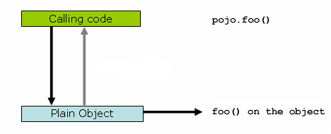
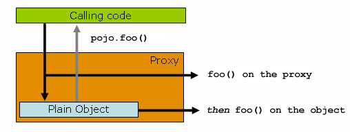

# 5. Aspect Oriented Programming with Spring


<!-- tabs:start -->

#### ** English **

Aspect-oriented Programming (AOP) complements Object-oriented Programming (OOP) by providing another way of thinking about program structure. The key unit of modularity in OOP is the class, whereas in AOP the unit of modularity is the aspect. Aspects enable the modularization of concerns (such as transaction management) that cut across multiple types and objects. (Such concerns are often termed “crosscutting” concerns in AOP literature.)
#### ** Chinese **

面向对象编程（AOP）是对面向对象编程（OOP）的补充，它提供了另一种思考程序结构的方式。在OOP中，模块化的关键单位是类，而在AOP中，模块化的单位是方面。元素实现了跨越多种类型和对象的关注点（如事务管理）的模块化。(这类关注点在AOP文献中通常被称为 "交叉 "关注点)。
<!-- tabs:end -->


<!-- tabs:start -->

#### ** English **

One of the key components of Spring is the AOP framework. While the Spring IoC container does not depend on AOP (meaning you do not need to use AOP if you don’t want to), AOP complements Spring IoC to provide a very capable middleware solution.
#### ** Chinese **

Spring的关键组件之一是AOP框架。虽然Spring IoC容器并不依赖AOP（意味着如果你不想使用AOP，就不需要使用AOP），但AOP是对Spring IoC的补充，提供了一个非常有能力的中间件解决方案。
<!-- tabs:end -->


<!-- tabs:start -->

#### ** English **

Spring AOP with AspectJ pointcuts
#### ** Chinese **

带有AspectJ点切点的Spring AOP
<!-- tabs:end -->


<!-- tabs:start -->

#### ** English **

Spring provides simple and powerful ways of writing custom aspects by using either a [schema-based approach](https://docs.spring.io/spring/docs/5.2.6.RELEASE/spring-framework-reference/core.html#aop-schema) or the [@AspectJ annotation style](https://docs.spring.io/spring/docs/5.2.6.RELEASE/spring-framework-reference/core.html#aop-ataspectj). Both of these styles offer fully typed advice and use of the AspectJ pointcut language while still using Spring AOP for weaving.
#### ** Chinese **

Spring通过使用[基于模式的方法](https://docs.spring.io/spring/docs/5.2.6.RELEASE/spring-framework-reference/core.html#aop-schema)或[@AspectJ注解样式](https://docs.spring.io/spring/docs/5.2.6.RELEASE/spring-framework-reference/core.html#aop-ataspectj)提供了简单而强大的自定义方面的编写方法。这两种样式都提供了完全类型化的建议和使用AspectJ点切语言，同时仍然使用Spring AOP进行编织。
<!-- tabs:end -->


<!-- tabs:start -->

#### ** English **

This chapter discusses the schema- and @AspectJ-based AOP support. The lower-level AOP support is discussed in [the following chapter](https://docs.spring.io/spring/docs/5.2.6.RELEASE/spring-framework-reference/core.html#aop-api).
#### ** Chinese **

本章讨论了基于模式和@AspectJ的AOP支持。在[下一章](https://docs.spring.io/spring/docs/5.2.6.RELEASE/spring-framework-reference/core.html#aop-api)中讨论了底层的AOP支持。
<!-- tabs:end -->


<!-- tabs:start -->

#### ** English **

AOP is used in the Spring Framework to:
#### ** Chinese **

AOP被用于Spring框架中，以。
<!-- tabs:end -->


<!-- tabs:start -->

#### ** English **

- Provide declarative enterprise services. The most important such service is [declarative transaction management](https://docs.spring.io/spring/docs/5.2.6.RELEASE/spring-framework-reference/data-access.html#transaction-declarative).

- Let users implement custom aspects, complementing their use of OOP with AOP.

#### ** Chinese **

- 提供声明式企业服务。这类服务中最重要的是【声明式事务管理】(https://docs.spring.io/spring/docs/5.2.6.RELEASE/spring-framework-reference/data-access.html#transaction-declarative)。

- 让用户实现自定义的方面，用AOP补充他们对OOP的使用。

<!-- tabs:end -->

<!-- tabs:start -->

#### ** English **

If you are interested only in generic declarative services or other pre-packaged declarative middleware services such as pooling, you do not need to work directly with Spring AOP, and can skip most of this chapter.
#### ** Chinese **

如果你只对通用的声明式服务或其他预打包的声明式中间件服务（如池化）感兴趣，则不需要直接使用Spring AOP工作，可以跳过本章的大部分内容。
<!-- tabs:end -->


### **5.1. AOP Concepts** 

<!-- tabs:start -->

#### ** English **

Let us begin by defining some central AOP concepts and terminology. These terms are not Spring-specific. Unfortunately, AOP terminology is not particularly intuitive. However, it would be even more confusing if Spring used its own terminology.
#### ** Chinese **

首先，让我们定义一下AOP的一些核心概念和术语。这些术语并不是Spring特有的。不幸的是，AOP术语不是特别直观。然而，如果Spring使用了自己的术语，那就更加混乱了。
<!-- tabs:end -->


<!-- tabs:start -->

#### ** English **

- Aspect: A modularization of a concern that cuts across multiple classes. Transaction management is a good example of a crosscutting concern in enterprise Java applications. In Spring AOP, aspects are implemented by using regular classes (the [schema-based approach](https://docs.spring.io/spring/docs/5.2.6.RELEASE/spring-framework-reference/core.html#aop-schema)) or regular classes annotated with the `@Aspect` annotation (the [@AspectJ style](https://docs.spring.io/spring/docs/5.2.6.RELEASE/spring-framework-reference/core.html#aop-ataspectj)).

- Join point: A point during the execution of a program, such as the execution of a method or the handling of an exception. In Spring AOP, a join point always represents a method execution.

- Advice: Action taken by an aspect at a particular join point. Different types of advice include “around”, “before” and “after” advice. (Advice types are discussed later.) Many AOP frameworks, including Spring, model an advice as an interceptor and maintain a chain of interceptors around the join point.

- Pointcut: A predicate that matches join points. Advice is associated with a pointcut expression and runs at any join point matched by the pointcut (for example, the execution of a method with a certain name). The concept of join points as matched by pointcut expressions is central to AOP, and Spring uses the AspectJ pointcut expression language by default.

- Introduction: Declaring additional methods or fields on behalf of a type. Spring AOP lets you introduce new interfaces (and a corresponding implementation) to any advised object. For example, you could use an introduction to make a bean implement an `IsModified` interface, to simplify caching. (An introduction is known as an inter-type declaration in the AspectJ community.)

- Target object: An object being advised by one or more aspects. Also referred to as the “advised object”. Since Spring AOP is implemented by using runtime proxies, this object is always a proxied object.

- AOP proxy: An object created by the AOP framework in order to implement the aspect contracts (advise method executions and so on). In the Spring Framework, an AOP proxy is a JDK dynamic proxy or a CGLIB proxy.

- Weaving: linking aspects with other application types or objects to create an advised object. This can be done at compile time (using the AspectJ compiler, for example), load time, or at runtime. Spring AOP, like other pure Java AOP frameworks, performs weaving at runtime.

#### ** Chinese **

- 侧面。一个跨越多个类的关注点的模块化。事务管理是企业级Java应用中一个很好的交叉关注的例子。在Spring AOP中，通过使用正则类([基于模式的方法](https://docs.spring.io/spring/docs/5.2.6.RELEASE/spring-framework-reference/core.html#aop-schema))或用`@Aspect`注解的正则类([@AspectJ样式](https://docs.spring.io/spring/docs/5.2.6.RELEASE/spring-framework-reference/core.html#aop-ataspectj))来实现方面。

- 连接点。程序执行过程中的一个点，例如方法的执行或异常的处理。在Spring AOP中，Join点总是代表方法的执行。

- 建议：建议。一个方面在特定的连接点所采取的行动。不同类型的建议包括 "周围"、"之前 "和 "之后 "的建议。(建议类型将在后面讨论。)许多AOP框架，包括Spring在内，都将建议建模为一个拦截器，并围绕着连接点维护一个拦截器链。

- Pointcut。匹配连接点的谓词。Advice与点切点表达式相关联，并在任何由点切点匹配的join点上运行（例如，执行一个具有特定名称的方法）。由点cut表达式匹配的连接点的概念是AOP的核心，Spring默认使用AspectJ点cut表达式语言。

- 介绍。代表一个类型声明额外的方法或字段。Spring AOP允许你为任何建议对象引入新的接口（以及相应的实现）。例如，你可以使用引入来使一个bean实现`IsModified`接口，以简化缓存。引入在AspectJ社区中被称为类型间声明）。

- 目标对象。被一个或多个方面建议的对象。也被称为 "劝告对象"。因为Spring AOP是通过使用运行时代理来实现的，所以这个对象始终是一个代理对象。

- AOP代理。由AOP框架创建的对象，用于实现方面合约（建议方法执行等）。在Spring框架中，AOP代理是JDK动态代理或CGLIB代理。

- 编织：将方面与其他应用程序类型或对象连接起来，创建一个建议对象。这可以在编译时（例如使用AspectJ编译器）、加载时或运行时完成。Spring AOP和其他纯Java AOP框架一样，在运行时执行编织。

<!-- tabs:end -->

<!-- tabs:start -->

#### ** English **

Spring AOP includes the following types of advice:
#### ** Chinese **

春季AOP包括以下类型的建议：
<!-- tabs:end -->


<!-- tabs:start -->

#### ** English **

- Before advice: Advice that runs before a join point but that does not have the ability to prevent execution flow proceeding to the join point (unless it throws an exception).

- After returning advice: Advice to be run after a join point completes normally (for example, if a method returns without throwing an exception).

- After throwing advice: Advice to be executed if a method exits by throwing an exception.

- After (finally) advice: Advice to be executed regardless of the means by which a join point exits (normal or exceptional return).

- Around advice: Advice that surrounds a join point such as a method invocation. This is the most powerful kind of advice. Around advice can perform custom behavior before and after the method invocation. It is also responsible for choosing whether to proceed to the join point or to shortcut the advised method execution by returning its own return value or throwing an exception.

#### ** Chinese **

- 在建议之前。建议：在连接点之前运行的建议，但没有阻止执行流继续到连接点的能力（除非它抛出一个异常）。

- 返回建议之后：在返回建议之后运行的建议。在连接点正常完成后运行的建议（例如，如果一个方法返回时没有抛出异常）。

- 抛出建议后：在抛出建议后。如果一个方法通过抛出异常退出，则执行建议。

- After (finally)建议之后：在方法以抛出异常的方式退出时要执行的建议。无论连接点以何种方式退出（正常或异常返回），都要执行建议。

- 围绕建议：围绕着这样一个连接点的建议。围绕着一个连接点的建议，如方法调用等。这是最强大的一种建议。周围建议可以在方法调用前后执行自定义行为。它还负责选择是继续执行连接点，还是通过返回自己的返回值或抛出异常来缩短建议的方法执行。

<!-- tabs:end -->

<!-- tabs:start -->

#### ** English **

Around advice is the most general kind of advice. Since Spring AOP, like AspectJ, provides a full range of advice types, we recommend that you use the least powerful advice type that can implement the required behavior. For example, if you need only to update a cache with the return value of a method, you are better off implementing an after returning advice than an around advice, although an around advice can accomplish the same thing. Using the most specific advice type provides a simpler programming model with less potential for errors. For example, you do not need to invoke the `proceed()` method on the `JoinPoint` used for around advice, and, hence, you cannot fail to invoke it.
#### ** Chinese **

围绕建议是最一般的建议类型。由于Spring AOP和AspectJ一样，提供了各种各样的建议类型，因此我们建议你使用能够实现所需行为的最不强大的建议类型。例如，如果你只需要用一个方法的返回值更新缓存，那么你最好使用返回后的建议，而不是周围的建议，尽管周围的建议可以完成同样的事情。使用最具体的建议类型提供了一个更简单的编程模型，错误的可能性更小。例如，你不需要在用于 around 建议的 `JoinPoint`上调用 `proceed()`方法，因此，你不能失败地调用它。
<!-- tabs:end -->


<!-- tabs:start -->

#### ** English **

All advice parameters are statically typed so that you work with advice parameters of the appropriate type (e.g. the type of the return value from a method execution) rather than `Object` arrays.
#### ** Chinese **

所有的建议参数都是静态类型化的，这样你就可以使用适当类型的建议参数（例如，方法执行的返回值的类型）而不是`Object`数组。
<!-- tabs:end -->


<!-- tabs:start -->

#### ** English **

The concept of join points matched by pointcuts is the key to AOP, which distinguishes it from older technologies offering only interception. Pointcuts enable advice to be targeted independently of the object-oriented hierarchy. For example, you can apply an around advice providing declarative transaction management to a set of methods that span multiple objects (such as all business operations in the service layer).
#### ** Chinese **

由点切点匹配的连接点的概念是AOP的关键，这也是AOP区别于仅提供拦截的旧技术的关键。点切点使得建议可以独立于面向对象的层次结构之外，有针对性地进行建议。例如，你可以应用一个提供声明性事务管理的周围建议，将其应用到一组跨越多个对象的方法（如服务层中的所有业务操作）。
<!-- tabs:end -->


### **5.2. Spring AOP Capabilities and Goals** 

<!-- tabs:start -->

#### ** English **

Spring AOP is implemented in pure Java. There is no need for a special compilation process. Spring AOP does not need to control the class loader hierarchy and is thus suitable for use in a servlet container or application server.
#### ** Chinese **

Spring AOP是用纯Java实现的。不需要一个特殊的编译过程。Spring AOP不需要控制类加载器层次结构，因此适合在servlet容器或应用程序服务器中使用。
<!-- tabs:end -->


<!-- tabs:start -->

#### ** English **

Spring AOP currently supports only method execution join points (advising the execution of methods on Spring beans). Field interception is not implemented, although support for field interception could be added without breaking the core Spring AOP APIs. If you need to advise field access and update join points, consider a language such as AspectJ.
#### ** Chinese **

Spring AOP目前只支持方法执行连接点（建议在Spring Bean上执行方法）。虽然可以在不破坏Spring AOP的核心API的情况下增加对字段拦截的支持，但并没有实现。如果需要建议字段访问和更新连接点，可以考虑使用AspectJ这样的语言。
<!-- tabs:end -->


<!-- tabs:start -->

#### ** English **

Spring AOP’s approach to AOP differs from that of most other AOP frameworks. The aim is not to provide the most complete AOP implementation (although Spring AOP is quite capable). Rather, the aim is to provide a close integration between AOP implementation and Spring IoC, to help solve common problems in enterprise applications.
#### ** Chinese **

Spring AOP的AOP方法与大多数其他AOP框架不同。其目的不是提供最完整的AOP实现（尽管Spring AOP相当有能力）。相反，其目的是提供AOP实现和Spring IoC之间的紧密结合，帮助解决企业应用中常见的问题。
<!-- tabs:end -->


<!-- tabs:start -->

#### ** English **

Thus, for example, the Spring Framework’s AOP functionality is normally used in conjunction with the Spring IoC container. Aspects are configured by using normal bean definition syntax (although this allows powerful “auto-proxying” capabilities). This is a crucial difference from other AOP implementations. You cannot do some things easily or efficiently with Spring AOP, such as advise very fine-grained objects (typically, domain objects). AspectJ is the best choice in such cases. However, our experience is that Spring AOP provides an excellent solution to most problems in enterprise Java applications that are amenable to AOP.
#### ** Chinese **

因此，例如，Spring框架的AOP功能通常与Spring IoC容器结合使用。Aspects通过使用普通的Bean定义语法进行配置（尽管这允许强大的 "自动代理 "功能）。这是与其他AOP实现的关键区别。你无法用Spring AOP轻松或高效地完成一些事情，比如建议非常细粒度的对象（典型的是域对象）。在这种情况下，AspectJ是最好的选择。然而，我们的经验是，Spring AOP为企业级Java应用中的大多数问题提供了一个很好的解决方案，这些问题都可以使用AOP。
<!-- tabs:end -->


<!-- tabs:start -->

#### ** English **

Spring AOP never strives to compete with AspectJ to provide a comprehensive AOP solution. We believe that both proxy-based frameworks such as Spring AOP and full-blown frameworks such as AspectJ are valuable and that they are complementary, rather than in competition. Spring seamlessly integrates Spring AOP and IoC with AspectJ, to enable all uses of AOP within a consistent Spring-based application architecture. This integration does not affect the Spring AOP API or the AOP Alliance API. Spring AOP remains backward-compatible. See [the following chapter](https://docs.spring.io/spring/docs/5.2.6.RELEASE/spring-framework-reference/core.html#aop-api) for a discussion of the Spring AOP APIs.
#### ** Chinese **

Spring AOP从未试图与AspectJ竞争，提供全面的AOP解决方案。我们相信，Spring AOP这样的代理框架和AspectJ这样的完整框架都是有价值的，它们是相辅相成的，而不是相互竞争的。Spring将Spring AOP和IoC与AspectJ无缝集成，在一致的基于Spring的应用架构中实现了AOP的所有用途。这种集成不会影响Spring AOP API或AOP联盟API。Spring AOP仍然向后兼容。有关Spring AOP API的讨论，请参阅[下一章](https://docs.spring.io/spring/docs/5.2.6.RELEASE/spring-framework-reference/core.html#aop-api)。
<!-- tabs:end -->


<!-- tabs:start -->

#### ** English **

One of the central tenets of the Spring Framework is that of non-invasiveness. This is the idea that you should not be forced to introduce framework-specific classes and interfaces into your business or domain model. However, in some places, the Spring Framework does give you the option to introduce Spring Framework-specific dependencies into your codebase. The rationale in giving you such options is because, in certain scenarios, it might be just plain easier to read or code some specific piece of functionality in such a way. However, the Spring Framework (almost) always offers you the choice: You have the freedom to make an informed decision as to which option best suits your particular use case or scenario.
#### ** Chinese **

Spring框架的核心原则之一就是非侵入性。这就是不应该强迫你在业务或领域模型中引入特定于框架的类和接口。然而，在某些地方，Spring框架确实给了你一个选项，让你在代码库中引入Spring框架特有的依赖关系。给你提供这样的选项的理由是，在某些场景中，以这样的方式读取或编码某些特定的功能可能会更容易。然而，Spring框架（几乎）总是给你提供了一个选择：你可以自由决定哪个选项最适合你的特定用例或场景。
<!-- tabs:end -->


<!-- tabs:start -->

#### ** English **

One such choice that is relevant to this chapter is that of which AOP framework (and which AOP style) to choose. You have the choice of AspectJ, Spring AOP, or both. You also have the choice of either the @AspectJ annotation-style approach or the Spring XML configuration-style approach. The fact that this chapter chooses to introduce the @AspectJ-style approach first should not be taken as an indication that the Spring team favors the @AspectJ annotation-style approach over the Spring XML configuration-style.
#### ** Chinese **

与本章相关的一个选择就是选择哪种AOP框架（以及哪种AOP风格）。你可以选择AspectJ，Spring AOP，或者两者都可以。你还可以选择@AspectJ注解风格的方法或者Spring XML配置风格的方法。本章选择先介绍 @AspectJ 风格的方法，不应该被认为是Spring团队偏爱 @AspectJ 注解风格的方法而不是 Spring XML 配置风格。
<!-- tabs:end -->


<!-- tabs:start -->

#### ** English **

See [Choosing which AOP Declaration Style to Use](https://docs.spring.io/spring/docs/5.2.6.RELEASE/spring-framework-reference/core.html#aop-choosing) for a more complete discussion of the “whys and wherefores” of each style.
#### ** Chinese **

关于每种文体的 "为什么和为什么 "的更完整的讨论，请参阅[选择使用哪种AOP声明文体](https://docs.spring.io/spring/docs/5.2.6.RELEASE/spring-framework-reference/core.html#aop-choosing)。
<!-- tabs:end -->


### **5.3. AOP Proxies** 

<!-- tabs:start -->

#### ** English **

Spring AOP defaults to using standard JDK dynamic proxies for AOP proxies. This enables any interface (or set of interfaces) to be proxied.
#### ** Chinese **

Spring AOP 默认使用标准的 JDK 动态代理来做 AOP 代理。这使得任何接口（或接口集）都可以被代理。
<!-- tabs:end -->


<!-- tabs:start -->

#### ** English **

Spring AOP can also use CGLIB proxies. This is necessary to proxy classes rather than interfaces. By default, CGLIB is used if a business object does not implement an interface. As it is good practice to program to interfaces rather than classes, business classes normally implement one or more business interfaces. It is possible to [force the use of CGLIB](https://docs.spring.io/spring/docs/5.2.6.RELEASE/spring-framework-reference/core.html#aop-proxying), in those (hopefully rare) cases where you need to advise a method that is not declared on an interface or where you need to pass a proxied object to a method as a concrete type.
#### ** Chinese **

Spring AOP也可以使用CGLIB代理。这对于代理类而不是接口是必要的。默认情况下，如果业务对象没有实现接口，则使用CGLIB。由于使用接口而不是类来编程是很好的做法，所以业务类通常会实现一个或多个业务接口。当你需要建议一个没有在接口上声明的方法，或者你需要将一个代理对象作为具体类型传递给一个方法时，可以[强制使用CGLIB](https://docs.spring.io/spring/docs/5.2.6.RELEASE/spring-framework-reference/core.html#aop-proxying)。
<!-- tabs:end -->


<!-- tabs:start -->

#### ** English **

It is important to grasp the fact that Spring AOP is proxy-based. See [Understanding AOP Proxies](https://docs.spring.io/spring/docs/5.2.6.RELEASE/spring-framework-reference/core.html#aop-understanding-aop-proxies) for a thorough examination of exactly what this implementation detail actually means.
#### ** Chinese **

掌握Spring AOP是基于代理的，这一点很重要。请参见[理解AOP代理](https://docs.spring.io/spring/docs/5.2.6.RELEASE/spring-framework-reference/core.html#aop-understanding-aop-proxies)，以了解这个实现细节的具体含义。
<!-- tabs:end -->


### **5.4. @AspectJ support** 

<!-- tabs:start -->

#### ** English **

@AspectJ refers to a style of declaring aspects as regular Java classes annotated with annotations. The @AspectJ style was introduced by the [AspectJ project](https://www.eclipse.org/aspectj) as part of the AspectJ 5 release. Spring interprets the same annotations as AspectJ 5, using a library supplied by AspectJ for pointcut parsing and matching. The AOP runtime is still pure Spring AOP, though, and there is no dependency on the AspectJ compiler or weaver.
#### ** Chinese **

@AspectJ指的是一种将方面声明为带有注解的常规Java类的风格。@AspectJ风格是由[AspectJ项目](https://www.eclipse.org/aspectj)作为AspectJ 5版本的一部分引入的。Spring使用AspectJ提供的库进行点切口解析和匹配，对注解的解释与AspectJ 5相同。不过，AOP运行时仍然是纯粹的Spring AOP，并且不依赖AspectJ编译器或Weaver。
<!-- tabs:end -->


<!-- tabs:start -->

#### ** English **

Using the AspectJ compiler and weaver enables use of the full AspectJ language and is discussed in [Using AspectJ with Spring Applications](https://docs.spring.io/spring/docs/5.2.6.RELEASE/spring-framework-reference/core.html#aop-using-aspectj).
#### ** Chinese **

使用 AspectJ 编译器和编译器可以使用完整的 AspectJ 语言，并在[使用 AspectJ 与 Spring 应用程序](https://docs.spring.io/spring/docs/5.2.6.RELEASE/spring-framework-reference/core.html#aop-using-aspectj)中讨论。
<!-- tabs:end -->


### **5.4.1. Enabling @AspectJ Support** 

<!-- tabs:start -->

#### ** English **

To use @AspectJ aspects in a Spring configuration, you need to enable Spring support for configuring Spring AOP based on @AspectJ aspects and auto-proxying beans based on whether or not they are advised by those aspects. By auto-proxying, we mean that, if Spring determines that a bean is advised by one or more aspects, it automatically generates a proxy for that bean to intercept method invocations and ensures that advice is executed as needed.
#### ** Chinese **

要在Spring配置中使用@AspectJ aspects，您需要启用Spring支持基于@AspectJ aspects来配置Spring AOP，并根据这些方面是否建议自动代理Bean。我们所说的自动代理是指，如果Spring确定一个bean受到一个或多个方面的建议，它就会自动为该bean生成一个代理，以拦截方法调用，并确保在需要时执行建议。
<!-- tabs:end -->


<!-- tabs:start -->

#### ** English **

The @AspectJ support can be enabled with XML- or Java-style configuration. In either case, you also need to ensure that AspectJ’s `aspectjweaver.jar` library is on the classpath of your application (version 1.8 or later). This library is available in the `lib` directory of an AspectJ distribution or from the Maven Central repository.
#### ** Chinese **

@AspectJ支持可以通过XML或Java风格的配置来启用。在这两种情况下，您还需要确保AspectJ的`aspectjweaver.jar`库位于您应用程序的classpath上（版本1.8或更高版本）。这个库可以在AspectJ发行版的`lib`目录下或者从Maven Central仓库中获得。
<!-- tabs:end -->


### **Enabling @AspectJ Support with Java Configuration** 

<!-- tabs:start -->

#### ** English **

To enable @AspectJ support with Java `@Configuration`, add the `@EnableAspectJAutoProxy` annotation, as the following example shows:
#### ** Chinese **

要使用Java `@Configuration`启用@AspectJ支持，请添加`@EnableAspectJAutoProxy`注解，如下例所示。
<!-- tabs:end -->


```java
@Configuration
@EnableAspectJAutoProxy
public class AppConfig {

}
```

### **Enabling @AspectJ Support with XML Configuration** 

<!-- tabs:start -->

#### ** English **

To enable @AspectJ support with XML-based configuration, use the `aop:aspectj-autoproxy` element, as the following example shows:
#### ** Chinese **

要启用基于XML配置的@AspectJ支持，请使用`aop:aspectj-autoproxy`元素，如下图所示。
<!-- tabs:end -->


```xml
<aop:aspectj-autoproxy/>
```

<!-- tabs:start -->

#### ** English **

This assumes that you use schema support as described in [XML Schema-based configuration](https://docs.spring.io/spring/docs/5.2.6.RELEASE/spring-framework-reference/core.html#xsd-schemas). See [the AOP schema](https://docs.spring.io/spring/docs/5.2.6.RELEASE/spring-framework-reference/core.html#xsd-schemas-aop) for how to import the tags in the `aop` namespace.
#### ** Chinese **

这假定您使用了[基于 XML 模式的配置](https://docs.spring.io/spring/docs/5.2.6.RELEASE/spring-framework-reference/core.html#xsd-schemas)中描述的模式支持。有关如何导入 `aop`命名空间中的标记，请参见 [the AOP schema](https://docs.spring.io/spring/docs/5.2.6.RELEASE/spring-framework-reference/core.html#xsd-schemas-aop)。
<!-- tabs:end -->


### **5.4.2. Declaring an Aspect** 

<!-- tabs:start -->

#### ** English **

With @AspectJ support enabled, any bean defined in your application context with a class that is an @AspectJ aspect (has the `@Aspect` annotation) is automatically detected by Spring and used to configure Spring AOP. The next two examples show the minimal definition required for a not-very-useful aspect.
#### ** Chinese **

启用了 @AspectJ 支持后，Spring 会自动检测到任何在应用程序上下文中定义了类为 @AspectJ aspect 的 Bean（具有 `@Aspect` 注解），并用于配置 Spring AOP。下面的两个例子显示了一个非实用的方面所需的最小定义。
<!-- tabs:end -->


<!-- tabs:start -->

#### ** English **

The first of the two example shows a regular bean definition in the application context that points to a bean class that has the `@Aspect` annotation:
#### ** Chinese **

两个例子中的第一个例子显示了应用上下文中的正则Bean定义，它指向一个具有`@Aspect`注解的Bean类。
<!-- tabs:end -->


```xml
<bean id="myAspect" class="org.xyz.NotVeryUsefulAspect">
    <!-- configure properties of the aspect here -->
</bean>
```

<!-- tabs:start -->

#### ** English **

The second of the two examples shows the `NotVeryUsefulAspect` class definition, which is annotated with the `org.aspectj.lang.annotation.Aspect` annotation;
#### ** Chinese **

这两个例子中的第二个例子显示了`NotVeryUsefulAspect`类的定义，它被注解为`org.aspectj.lang.annotation.Aspect`注解。
<!-- tabs:end -->


```java
package org.xyz;
import org.aspectj.lang.annotation.Aspect;

@Aspect
public class NotVeryUsefulAspect {

}
```

<!-- tabs:start -->

#### ** English **

Aspects (classes annotated with `@Aspect`) can have methods and fields, the same as any other class. They can also contain pointcut, advice, and introduction (inter-type) declarations.
#### ** Chinese **

Aspects（用`@Aspect`注解的类）可以像其他类一样，拥有方法和字段。它们也可以包含指向性、建议和介绍（类型间）声明。
<!-- tabs:end -->


<!-- tabs:start -->

#### ** English **

Autodetecting aspects through component scanning
#### ** Chinese **

通过部件扫描自动检测方面
<!-- tabs:end -->


<!-- tabs:start -->

#### ** English **

You can register aspect classes as regular beans in your Spring XML configuration or autodetect them through classpath scanning — the same as any other Spring-managed bean. However, note that the `@Aspect` annotation is not sufficient for autodetection in the classpath. For that purpose, you need to add a separate `@Component` annotation (or, alternatively, a custom stereotype annotation that qualifies, as per the rules of Spring’s component scanner).
#### ** Chinese **

您可以在您的Spring XML配置中注册方面类作为常规的Bean，或者通过classpath扫描自动检测它们--与其他任何Spring管理的Bean相同。但是，请注意，`@Aspect`注解不足以在classpath中自动检测。为此，您需要添加一个单独的`@Component`注解（或者，根据Spring的组件扫描器的规则，添加一个自定义的立体类型注解，该注解符合条件）。
<!-- tabs:end -->


<!-- tabs:start -->

#### ** English **

Advising aspects with other aspects?
#### ** Chinese **

劝告方面与其他方面？
<!-- tabs:end -->


<!-- tabs:start -->

#### ** English **

In Spring AOP, aspects themselves cannot be the targets of advice from other aspects. The `@Aspect` annotation on a class marks it as an aspect and, hence, excludes it from auto-proxying.
#### ** Chinese **

在Spring AOP中，方面本身不能成为其他方面建议的目标。类上的 `@Aspect` 注解将其标记为一个方面，因此，将其排除在自动代理之外。
<!-- tabs:end -->


### **5.4.3. Declaring a Pointcut** 

<!-- tabs:start -->

#### ** English **

Pointcuts determine join points of interest and thus enable us to control when advice executes. Spring AOP only supports method execution join points for Spring beans, so you can think of a pointcut as matching the execution of methods on Spring beans. A pointcut declaration has two parts: a signature comprising a name and any parameters and a pointcut expression that determines exactly which method executions we are interested in. In the @AspectJ annotation-style of AOP, a pointcut signature is provided by a regular method definition, and the pointcut expression is indicated by using the `@Pointcut` annotation (the method serving as the pointcut signature must have a `void` return type).
#### ** Chinese **

点切方式确定了连接点，从而使我们能够控制建议执行时的连接点。Spring AOP只支持Spring Bean的方法执行连接点，所以你可以把点cut看成是匹配Spring Bean上的方法执行。一个点切口声明有两部分：一个由名称和任意参数组成的签名，以及一个点切口表达式，该表达式确定了我们感兴趣的方法执行。在AOP的@AspectJ注解样式中，点切口签名由常规方法定义提供，点切口表达式通过使用`@Pointcut`注解来表示（作为点切口签名的方法必须具有`void`返回类型）。
<!-- tabs:end -->


<!-- tabs:start -->

#### ** English **

An example may help make this distinction between a pointcut signature and a pointcut expression clear. The following example defines a pointcut named `anyOldTransfer` that matches the execution of any method named `transfer`:
#### ** Chinese **

一个例子可能有助于明确区分点cut签名和点cut表达式之间的区别。下面的例子定义了一个名为`anyOldTransfer`的点切方式，该点切方式与任何名为`transfer`的方法的执行相匹配。
<!-- tabs:end -->


```java
@Pointcut("execution(* transfer(..))") // the pointcut expression
private void anyOldTransfer() {} // the pointcut signature
```

<!-- tabs:start -->

#### ** English **

The pointcut expression that forms the value of the `@Pointcut` annotation is a regular AspectJ 5 pointcut expression. For a full discussion of AspectJ’s pointcut language, see the [AspectJ Programming Guide](https://www.eclipse.org/aspectj/doc/released/progguide/index.html) (and, for extensions, the [AspectJ 5 Developer’s Notebook](https://www.eclipse.org/aspectj/doc/released/adk15notebook/index.html)) or one of the books on AspectJ (such as *Eclipse AspectJ*, by Colyer et. al., or *AspectJ in Action*, by Ramnivas Laddad).
#### ** Chinese **

构成`@Pointcut`注解的值的点切方式表达式是一个常规的AspectJ 5点切方式表达式。有关 AspectJ 的点切方式语言的完整讨论，请参见 [AspectJ 编程指南](https://www.eclipse.org/aspectj/doc/released/progguide/index.html)(对于扩展，请参见 [AspectJ 5 开发者笔记本](https://www.eclipse.org/aspectj/doc/released/adk15notebook/index.html))或有关 AspectJ 的书籍(如 *Eclipse AspectJ*，由 Colyer 等人撰写的 *Eclipse AspectJ*，或 Ramnivas Laddad 撰写的 *AspectJ in Action*)。
<!-- tabs:end -->


### **Supported Pointcut Designators** 

<!-- tabs:start -->

#### ** English **

Spring AOP supports the following AspectJ pointcut designators (PCD) for use in pointcut expressions:
#### ** Chinese **

Spring AOP 支持以下 AspectJ 点切口代号 (PCD) 用于点切口表达式中。
<!-- tabs:end -->


<!-- tabs:start -->

#### ** English **

- `execution`: For matching method execution join points. This is the primary pointcut designator to use when working with Spring AOP.

- `within`: Limits matching to join points within certain types (the execution of a method declared within a matching type when using Spring AOP).

- `this`: Limits matching to join points (the execution of methods when using Spring AOP) where the bean reference (Spring AOP proxy) is an instance of the given type.

- `target`: Limits matching to join points (the execution of methods when using Spring AOP) where the target object (application object being proxied) is an instance of the given type.

- `args`: Limits matching to join points (the execution of methods when using Spring AOP) where the arguments are instances of the given types.

- `@target`: Limits matching to join points (the execution of methods when using Spring AOP) where the class of the executing object has an annotation of the given type.

- `@args`: Limits matching to join points (the execution of methods when using Spring AOP) where the runtime type of the actual arguments passed have annotations of the given types.

- `@within`: Limits matching to join points within types that have the given annotation (the execution of methods declared in types with the given annotation when using Spring AOP).

- `@annotation`: Limits matching to join points where the subject of the join point (the method being executed in Spring AOP) has the given annotation.

#### ** Chinese **

- `execution`。用于匹配方法执行连接点。这是在使用Spring AOP工作时要使用的主要点切口代号。

- `within`：用于匹配方法执行连接点。将匹配限制在特定类型中的连接点（使用Spring AOP时，在匹配类型中声明的方法的执行）。

- `this`：将匹配限制为连接点（使用Spring AOP时在匹配类型中声明的方法的执行）。限制匹配到Bean引用（Spring AOP代理）为给定类型的实例时的连接点（使用Spring AOP时的方法执行）。

- `target`：将匹配限制在连接点（使用Spring AOP时的Bean引用（Spring AOP代理）是给定类型的实例时的方法执行）。将匹配限制在连接点（使用Spring AOP时的方法执行），其中目标对象（被代理的应用程序对象）是指定类型的实例。

- `args`。将匹配限制在连接点（使用Spring AOP时的方法的执行）中，如果参数是给定类型的实例，则限制匹配。

- `@target`。限制匹配到连接点（使用Spring AOP时执行方法），如果执行对象的类有给定类型的注解。

- `@args`: 将匹配限制在连接点（使用Spring AOP时的方法执行）中，当实际传递的参数的运行时类型具有给定类型的注解时，限制匹配。

- `@within`: 限制匹配到具有给定注解的类型内的连接点（使用Spring AOP时，在具有给定注解的类型中声明的方法的执行）。

- `@annotation`。限制匹配到连接点的主体（Spring AOP中执行的方法）具有给定注解的连接点。

<!-- tabs:end -->

<!-- tabs:start -->

#### ** English **

Other pointcut types
#### ** Chinese **

其他点式切割类型
<!-- tabs:end -->


<!-- tabs:start -->

#### ** English **

The full AspectJ pointcut language supports additional pointcut designators that are not supported in Spring: `call`, `get`, `set`, `preinitialization`, `staticinitialization`, `initialization`, `handler`, `adviceexecution`, `withincode`, `cflow`, `cflowbelow`, `if`, `@this`, and `@withincode`. Use of these pointcut designators in pointcut expressions interpreted by Spring AOP results in an `IllegalArgumentException` being thrown.
#### ** Chinese **

完整的AspectJ点cut语言支持Spring中不支持的附加点cut指定器。 `call`、`get`、`set`、`preinitialization`、`staticinitialization`、`initialization`、`handler`。 `adviceexecution`、`withincode`、`cflow`、`cflowbelow`、`if`、`if`、`@this`和`@withincode`。在Spring AOP解释的点切口表达式中使用这些点切口代号会导致抛出一个`IllegalArgumentException`。
<!-- tabs:end -->


<!-- tabs:start -->

#### ** English **

The set of pointcut designators supported by Spring AOP may be extended in future releases to support more of the AspectJ pointcut designators.
#### ** Chinese **

Spring AOP 支持的点切口代号集可能会在未来的版本中扩展，以支持更多的 AspectJ 点切口代号。
<!-- tabs:end -->


<!-- tabs:start -->

#### ** English **

Because Spring AOP limits matching to only method execution join points, the preceding discussion of the pointcut designators gives a narrower definition than you can find in the AspectJ programming guide. In addition, AspectJ itself has type-based semantics and, at an execution join point, both `this` and `target` refer to the same object: the object executing the method. Spring AOP is a proxy-based system and differentiates between the proxy object itself (which is bound to `this`) and the target object behind the proxy (which is bound to `target`).
#### ** Chinese **

因为Spring AOP限制了匹配只限于方法执行连接点，所以前面讨论的点切代号给出的定义比AspectJ编程指南中的定义要窄。此外，AspectJ本身具有基于类型的语义，在执行连接点上，`this`和`target`都指的是同一个对象：执行方法的对象。Spring AOP是一个基于代理的系统，它区分了代理对象本身（被绑定到`this`）和代理后面的目标对象（被绑定到`target`）。
<!-- tabs:end -->


<!-- tabs:start -->

#### ** English **

Due to the proxy-based nature of Spring’s AOP framework, calls within the target object are, by definition, not intercepted. For JDK proxies, only public interface method calls on the proxy can be intercepted. With CGLIB, public and protected method calls on the proxy are intercepted (and even package-visible methods, if necessary). However, common interactions through proxies should always be designed through public signatures.
#### ** Chinese **

由于Spring的AOP框架基于代理的性质，目标对象内部的调用，顾名思义是不会被拦截的。对于JDK代理，只有代理上的公共接口方法调用才能被拦截。使用CGLIB，代理上的公有接口和受保护的方法调用都会被拦截（如果需要的话，甚至是包可见的方法也会被拦截）。但是，通过代理的常见交互应该始终通过公共签名来设计。
<!-- tabs:end -->


<!-- tabs:start -->

#### ** English **

Note that pointcut definitions are generally matched against any intercepted method. If a pointcut is strictly meant to be public-only, even in a CGLIB proxy scenario with potential non-public interactions through proxies, it needs to be defined accordingly.
#### ** Chinese **

需要注意的是，点切口的定义一般是与任何被拦截的方法匹配的。如果一个点切口严格意义上来说是只对公众开放的，即使在CGLIB代理场景中，通过代理的潜在非公开交互，也需要相应地定义它。
<!-- tabs:end -->


<!-- tabs:start -->

#### ** English **

If your interception needs include method calls or even constructors within the target class, consider the use of Spring-driven [native AspectJ weaving](https://docs.spring.io/spring/docs/5.2.6.RELEASE/spring-framework-reference/core.html#aop-aj-ltw) instead of Spring’s proxy-based AOP framework. This constitutes a different mode of AOP usage with different characteristics, so be sure to make yourself familiar with weaving before making a decision.
#### ** Chinese **

如果你的拦截需求包括目标类中的方法调用甚至构造函数，可以考虑使用Spring驱动的[原生AspectJ编织](https://docs.spring.io/spring/docs/5.2.6.RELEASE/spring-framework-reference/core.html#aop-aj-ltw)，而不是Spring的基于代理的AOP框架。这构成了一种不同的AOP使用模式，具有不同的特点，所以在做决定之前一定要熟悉织法。
<!-- tabs:end -->


<!-- tabs:start -->

#### ** English **

Spring AOP also supports an additional PCD named `bean`. This PCD lets you limit the matching of join points to a particular named Spring bean or to a set of named Spring beans (when using wildcards). The `bean` PCD has the following form:
#### ** Chinese **

Spring AOP 还支持一个名为`bean`的额外 PCD。这个PCD允许您将连接点限制在特定的Spring Bean或一组命名的Spring Bean（使用通配符时）。`bean` PCD 的形式如下。
<!-- tabs:end -->


```
bean(idOrNameOfBean)
```

<!-- tabs:start -->

#### ** English **

The `idOrNameOfBean` token can be the name of any Spring bean. Limited wildcard support that uses the `*` character is provided, so, if you establish some naming conventions for your Spring beans, you can write a `bean` PCD expression to select them. As is the case with other pointcut designators, the `bean` PCD can be used with the `&&` (and), `||` (or), and `!` (negation) operators, too.
#### ** Chinese **

`idOrNameOfBean`令牌可以是任何Spring Bean的名称。我们提供了使用 `*` 字符的有限通配符支持，因此，如果您为您的 Spring Bean 建立了一些命名约定，您可以编写一个 `bean` PCD 表达式来选择它们。与其他点切点指定符一样，`bean` PCD也可以与 `&&` (and), `||` (or), 和 `!` (negation) 操作符一起使用。
<!-- tabs:end -->


<!-- tabs:start -->

#### ** English **

The `bean` PCD is supported only in Spring AOP and not in native AspectJ weaving. It is a Spring-specific extension to the standard PCDs that AspectJ defines and is, therefore, not available for aspects declared in the `@Aspect` model.
#### ** Chinese **

`bean` PCD仅在Spring AOP中支持，而在本地AspectJ编织中不支持。它是 AspectJ 定义的标准 PCD 的一个 Spring 专用扩展，因此，它不适用于 `@Aspect`模型中声明的方面。
<!-- tabs:end -->


<!-- tabs:start -->

#### ** English **

The `bean` PCD operates at the instance level (building on the Spring bean name concept) rather than at the type level only (to which weaving-based AOP is limited). Instance-based pointcut designators are a special capability of Spring’s proxy-based AOP framework and its close integration with the Spring bean factory, where it is natural and straightforward to identify specific beans by name.
#### ** Chinese **

`bean` PCD在实例层（建立在Spring bean名称概念的基础上），而不是仅仅在类型层（基于编织的AOP仅限于此）操作。基于实例的点切指定器是Spring基于代理的AOP框架的一个特殊功能，以及它与Spring Bean工厂的紧密集成，在这里，通过名称来识别特定的Bean是自然而直接的。
<!-- tabs:end -->


### **Combining Pointcut Expressions** 

<!-- tabs:start -->

#### ** English **

You can combine pointcut expressions by using `&&,` `||` and `!`. You can also refer to pointcut expressions by name. The following example shows three pointcut expressions:
#### ** Chinese **

你可以用`&&,``||`和`!`来组合点切点表达式。你也可以用名字来引用点切点表达式。下面的例子显示了三个点切点表达式。
`||` and `!`
<!-- tabs:end -->


```java
@Pointcut("execution(public * *(..))")
private void anyPublicOperation() {} (1)

@Pointcut("within(com.xyz.someapp.trading..*)")
private void inTrading() {} (2)

@Pointcut("anyPublicOperation() && inTrading()")
private void tradingOperation() {} (3)

//(1) anyPublicOperation matches if a method execution join point represents the execution
of any public method.
(2) inTrading matches if a method execution is in the trading module.
(3) tradingOperation matches if a method execution represents any public method in the
trading module.
```

<!-- tabs:start -->

#### ** English **

It is a best practice to build more complex pointcut expressions out of smaller named components, as shown earlier. When referring to pointcuts by name, normal Java visibility rules apply (you can see private pointcuts in the same type, protected pointcuts in the hierarchy, public pointcuts anywhere, and so on). Visibility does not affect pointcut matching.
#### ** Chinese **

最好的做法是用较小的命名组件来构建更复杂的点切方式表达式，如前文所示。当通过名称引用点切口时，正常的Java可见性规则适用（你可以看到同类型的私有点切口、层次结构中的受保护点切口、公共点切口的任何地方，等等）。可见性并不影响点切方式的匹配。
<!-- tabs:end -->


### **Sharing Common Pointcut Definitions** 

<!-- tabs:start -->

#### ** English **

When working with enterprise applications, developers often want to refer to modules of the application and particular sets of operations from within several aspects. We recommend defining a “SystemArchitecture” aspect that captures common pointcut expressions for this purpose. Such an aspect typically resembles the following example:
#### ** Chinese **

在处理企业级应用程序时，开发人员往往希望从几个方面中引用应用程序的模块和特定的操作集。我们建议定义一个 "SystemArchitecture "方面，该方面可以捕捉到常见的点切点表达式。这样一个方面通常类似于下面的例子。
<!-- tabs:end -->


```java
package com.xyz.someapp;

import org.aspectj.lang.annotation.Aspect;
import org.aspectj.lang.annotation.Pointcut;

@Aspect
public class SystemArchitecture {

    /**
     * A join point is in the web layer if the method is defined
     * in a type in the com.xyz.someapp.web package or any sub-package
     * under that.
     */
    @Pointcut("within(com.xyz.someapp.web..*)")
    public void inWebLayer() {}

    /**
     * A join point is in the service layer if the method is defined
     * in a type in the com.xyz.someapp.service package or any sub-package
     * under that.
     */
    @Pointcut("within(com.xyz.someapp.service..*)")
    public void inServiceLayer() {}

    /**
     * A join point is in the data access layer if the method is defined
     * in a type in the com.xyz.someapp.dao package or any sub-package
     * under that.
     */
    @Pointcut("within(com.xyz.someapp.dao..*)")
    public void inDataAccessLayer() {}

    /**
     * A business service is the execution of any method defined on a service
     * interface. This definition assumes that interfaces are placed in the
     * "service" package, and that implementation types are in sub-packages.
     *
     * If you group service interfaces by functional area (for example,
     * in packages com.xyz.someapp.abc.service and com.xyz.someapp.def.service) then
     * the pointcut expression "execution(* com.xyz.someapp..service.*.*(..))"
     * could be used instead.
     *
     * Alternatively, you can write the expression using the 'bean'
     * PCD, like so "bean(*Service)". (This assumes that you have
     * named your Spring service beans in a consistent fashion.)
     */
    @Pointcut("execution(* com.xyz.someapp..service.*.*(..))")
    public void businessService() {}

    /**
     * A data access operation is the execution of any method defined on a
     * dao interface. This definition assumes that interfaces are placed in the
     * "dao" package, and that implementation types are in sub-packages.
     */
    @Pointcut("execution(* com.xyz.someapp.dao.*.*(..))")
    public void dataAccessOperation() {}

}
```

<!-- tabs:start -->

#### ** English **

You can refer to the pointcuts defined in such an aspect anywhere you need a pointcut expression. For example, to make the service layer transactional, you could write the following:
#### ** Chinese **

你可以在任何需要点切点表达式的地方参考这样一个方面定义的点切点。例如，为了使服务层成为事务性的，你可以写以下内容。
<!-- tabs:end -->


```xml
<aop:config>
    <aop:advisor
        pointcut="com.xyz.someapp.SystemArchitecture.businessService()"
        advice-ref="tx-advice"/>
</aop:config>

<tx:advice id="tx-advice">
    <tx:attributes>
        <tx:method name="*" propagation="REQUIRED"/>
    </tx:attributes>
</tx:advice>
```

<!-- tabs:start -->

#### ** English **

The `<aop:config>` and `<aop:advisor>` elements are discussed in [Schema-based AOP Support](https://docs.spring.io/spring/docs/5.2.6.RELEASE/spring-framework-reference/core.html#aop-schema). The transaction elements are discussed in [Transaction Management](https://docs.spring.io/spring/docs/5.2.6.RELEASE/spring-framework-reference/data-access.html#transaction).
#### ** Chinese **

`<aop:config>`和`<aop:advisor>`元素在[基于 Schema 的 AOP 支持](https://docs.spring.io/spring/docs/5.2.6.RELEASE/spring-framework-reference/core.html#aop-schema)中讨论。事务元素在[事务管理](https://docs.spring.io/spring/docs/5.2.6.RELEASE/spring-framework-reference/data-access.html#transaction)中讨论。
<!-- tabs:end -->


### **Examples** 

<!-- tabs:start -->

#### ** English **

Spring AOP users are likely to use the `execution` pointcut designator the most often. The format of an execution expression follows:
#### ** Chinese **

Spring AOP用户最常使用的是`execution`点切口代号。执行表达式的格式如下。
<!-- tabs:end -->


```
execution(modifiers-pattern? ret-type-pattern declaring-type-pattern?name-pattern(param-pattern) throws-pattern?)
```


<!-- tabs:start -->

#### ** English **

All parts except the returning type pattern (`ret-type-pattern` in the preceding snippet), the name pattern, and the parameters pattern are optional. The returning type pattern determines what the return type of the method must be in order for a join point to be matched. `*` is most frequently used as the returning type pattern. It matches any return type. A fully-qualified type name matches only when the method returns the given type. The name pattern matches the method name. You can use the `*` wildcard as all or part of a name pattern. If you specify a declaring type pattern, include a trailing `.` to join it to the name pattern component. The parameters pattern is slightly more complex: `()` matches a method that takes no parameters, whereas `(..)` matches any number (zero or more) of parameters. The `(*)` pattern matches a method that takes one parameter of any type. `(*,String)` matches a method that takes two parameters. The first can be of any type, while the second must be a `String`. Consult the [Language Semantics](https://www.eclipse.org/aspectj/doc/released/progguide/semantics-pointcuts.html) section of the AspectJ Programming Guide for more information.
#### ** Chinese **

除了返回类型模式(`ret-type-pattern`在前面的片段中)、名称模式和参数模式外，其他部分都是可选的。返回类型模式决定了方法的返回类型必须是什么，这样才能匹配一个连接点。 `*`是最常用的返回类型模式。它可以匹配任何返回类型。只有当方法返回给定的类型时，完全限定的类型名称才会匹配。名称模式与方法名称相匹配。你可以使用`*`通配符作为名称模式的全部或部分名称模式。如果你指定了一个声明类型模式，请包含一个尾部的`.`来连接到名称模式组件。参数模式稍微复杂一些。 `()`匹配一个不需要参数的方法，而`(..)`匹配任何数量（0或更多）的参数。`(*)`模式匹配的是一个需要一个参数的方法。 `(*,String)`匹配一个需要两个参数的方法。第一个参数可以是任何类型，而第二个参数必须是 `String`。更多信息请参考AspectJ编程指南的[语言语义](https://www.eclipse.org/aspectj/doc/released/progguide/semantics-pointcuts.html)部分。
<!-- tabs:end -->


<!-- tabs:start -->

#### ** English **

The following examples show some common pointcut expressions:
#### ** Chinese **

下面的例子展示了一些常见的点式表达方式。
<!-- tabs:end -->


<!-- tabs:start -->

#### ** English **

- The execution of any public method:
#### ** Chinese **

- 任何公共方法的执行。
<!-- tabs:end -->

<!-- tabs:start -->

#### ** English **

  - execution(public * *(..))
#### ** Chinese **

  - 执行(public *(...))
<!-- tabs:end -->


<!-- tabs:start -->

#### ** English **

- The execution of any method with a name that begins with `set`:
#### ** Chinese **

- 执行任何名称以`set`开头的方法。
<!-- tabs:end -->

<!-- tabs:start -->

#### ** English **

  - execution(* set*(..))
#### ** Chinese **

  - 执行(* set*(...))
<!-- tabs:end -->


<!-- tabs:start -->

#### ** English **

- The execution of any method defined by the `AccountService` interface:
#### ** Chinese **

- 执行由`AccountService`接口定义的任何方法。
<!-- tabs:end -->

<!-- tabs:start -->

#### ** English **

  - execution(* com.xyz.service.AccountService.*(..))
#### ** Chinese **

  - 执行(* com.xyz.service.AccountService.*(...))
<!-- tabs:end -->


<!-- tabs:start -->

#### ** English **

- The execution of any method defined in the `service` package:
#### ** Chinese **

- 执行`service`包中定义的任何方法。
<!-- tabs:end -->

<!-- tabs:start -->

#### ** English **

  - execution(* com.xyz.service.*.*(..))
#### ** Chinese **

  - 执行(* com.xyz.service.*.*(...))
<!-- tabs:end -->


<!-- tabs:start -->

#### ** English **

- The execution of any method defined in the service package or one of its sub-packages:
#### ** Chinese **

- 执行服务包或其子包中定义的任何方法；
<!-- tabs:end -->

<!-- tabs:start -->

#### ** English **

  - execution(* com.xyz.service..*.*(..))
#### ** Chinese **

  - 执行(* com.xyz.service.*.*(...))
<!-- tabs:end -->


<!-- tabs:start -->

#### ** English **

- Any join point (method execution only in Spring AOP) within the service package:
#### ** Chinese **

- 服务包内的任何连接点（仅在Spring AOP中的方法执行）。
<!-- tabs:end -->

<!-- tabs:start -->

#### ** English **

  - within(com.xyz.service.*)
#### ** Chinese **

  - 内(com.xyz.service.*)
<!-- tabs:end -->


<!-- tabs:start -->

#### ** English **

- Any join point (method execution only in Spring AOP) within the service package or one of its sub-packages:
#### ** Chinese **

- 服务包或其子包中的任何连接点（仅在Spring AOP中执行方法）。
<!-- tabs:end -->

<!-- tabs:start -->

#### ** English **

  - within(com.xyz.service..*)
#### ** Chinese **

  - 内(com.xyz.service.*)
<!-- tabs:end -->


<!-- tabs:start -->

#### ** English **

- Any join point (method execution only in Spring AOP) where the proxy implements the `AccountService` interface:
#### ** Chinese **

- 任何连接点（仅在Spring AOP中执行方法），其中代理实现了`AccountService`接口。
<!-- tabs:end -->

<!-- tabs:start -->

#### ** English **

  - this(com.xyz.service.AccountService)
#### ** Chinese **

  - this(com.xyz.service.AccountService)
<!-- tabs:end -->

<!-- tabs:start -->

#### ** English **

  - 'this' is more commonly used in a binding form. See the section on [Declaring Advice](https://docs.spring.io/spring/docs/5.2.6.RELEASE/spring-framework-reference/core.html#aop-advice) for how to make the proxy object available in the advice body.
#### ** Chinese **

  - this是比较常用的约束形式。关于如何在咨询机构中提供代理对象，请参看[申报咨询](https://docs.spring.io/spring/docs/5.2.6.RELEASE/spring-framework-reference/core.html#aop-advice)。
<!-- tabs:end -->


<!-- tabs:start -->

#### ** English **

- Any join point (method execution only in Spring AOP) where the target object implements the `AccountService` interface:
#### ** Chinese **

- 目标对象实现了`AccountService`接口的任何连接点（仅在Spring AOP中执行方法）。
<!-- tabs:end -->

<!-- tabs:start -->

#### ** English **

  - target(com.xyz.service.AccountService)
#### ** Chinese **

  - 目标(com.xyz.service.AccountService)
<!-- tabs:end -->

<!-- tabs:start -->

#### ** English **

  - 'target' is more commonly used in a binding form. See the [Declaring Advice](https://docs.spring.io/spring/docs/5.2.6.RELEASE/spring-framework-reference/core.html#aop-advice) section for how to make the target object available in the advice body.
#### ** Chinese **

  - 目标更常用的是绑定形式。关于如何在建议体中使用目标对象，请参见[声明建议](https://docs.spring.io/spring/docs/5.2.6.RELEASE/spring-framework-reference/core.html#aop-advice)部分。
<!-- tabs:end -->


<!-- tabs:start -->

#### ** English **

- Any join point (method execution only in Spring AOP) that takes a single parameter and where the argument passed at runtime is `Serializable`:
#### ** Chinese **

- 任何一个连接点（仅在Spring AOP中执行的方法），它需要一个参数，并且在运行时传递的参数是`Serializable`。
<!-- tabs:end -->

<!-- tabs:start -->

#### ** English **

  - args(java.io.Serializable)
#### ** Chinese **

  - args(java.io.Serialisable)
<!-- tabs:end -->

<!-- tabs:start -->

#### ** English **

  - 'args' is more commonly used in a binding form. See the [Declaring Advice](https://docs.spring.io/spring/docs/5.2.6.RELEASE/spring-framework-reference/core.html#aop-advice) section for how to make the method arguments available in the advice body.
#### ** Chinese **

  - args更常用的是绑定形式。关于如何在建议体中使用方法参数，请参见[声明建议](https://docs.spring.io/spring/docs/5.2.6.RELEASE/spring-framework-reference/core.html#aop-advice)部分。
<!-- tabs:end -->

<!-- tabs:start -->

#### ** English **

  - Note that the pointcut given in this example is different from `execution(* *(java.io.Serializable))`. The args version matches if the argument passed at runtime is `Serializable`, and the execution version matches if the method signature declares a single parameter of type `Serializable`.
#### ** Chinese **

  - 请注意，这个例子中给出的点方法与`execution(* *(java.io.Serializable))`不同。如果在运行时传递的参数是 `Serializable`，那么 args 版本是匹配的；如果方法签名声明了一个类型为 `Serializable`的单个参数，那么执行版本是匹配的。
<!-- tabs:end -->


<!-- tabs:start -->

#### ** English **

- Any join point (method execution only in Spring AOP) where the target object has a `@Transactional` annotation:
#### ** Chinese **

- 任何连接点（仅在Spring AOP中的方法执行），其中目标对象有`@Transactional`注解。
<!-- tabs:end -->

<!-- tabs:start -->

#### ** English **

  - @target(org.springframework.transaction.annotation.Transactional)
#### ** Chinese **

  - @target(org.springframework.transaction.annotation.Transactional)
<!-- tabs:end -->

<!-- tabs:start -->

#### ** English **

  - You can also use '@target' in a binding form. See the [Declaring Advice](https://docs.spring.io/spring/docs/5.2.6.RELEASE/spring-framework-reference/core.html#aop-advice) section for how to make the annotation object available in the advice body.
#### ** Chinese **

  - 你也可以以绑定形式使用@target。关于如何在建议体中使用注解对象，请参阅[声明建议](https://docs.spring.io/spring/docs/5.2.6.RELEASE/spring-framework-reference/core.html#aop-advice)部分。
<!-- tabs:end -->


<!-- tabs:start -->

#### ** English **

- Any join point (method execution only in Spring AOP) where the declared type of the target object has an `@Transactional` annotation:
#### ** Chinese **

- 任何连接点（仅在Spring AOP中的方法执行），其中目标对象的声明类型有`@Transactional`注解。
<!-- tabs:end -->

<!-- tabs:start -->

#### ** English **

  - @within(org.springframework.transaction.annotation.Transactional)
#### ** Chinese **

  - @within(org.springframework.transaction.annotation.Transactional)
<!-- tabs:end -->

<!-- tabs:start -->

#### ** English **

  - You can also use '@within' in a binding form. See the [Declaring Advice](https://docs.spring.io/spring/docs/5.2.6.RELEASE/spring-framework-reference/core.html#aop-advice) section for how to make the annotation object available in the advice body.
#### ** Chinese **

  - 你也可以以绑定形式使用@within。关于如何在建议体中使用注解对象，请参阅[声明建议](https://docs.spring.io/spring/docs/5.2.6.RELEASE/spring-framework-reference/core.html#aop-advice)部分。
<!-- tabs:end -->


<!-- tabs:start -->

#### ** English **

- Any join point (method execution only in Spring AOP) where the executing method has an `@Transactional` annotation:
#### ** Chinese **

- 任何连接点（仅在Spring AOP中的方法执行），其中执行方法有`@Transactional`注解。
<!-- tabs:end -->

<!-- tabs:start -->

#### ** English **

  - @annotation(org.springframework.transaction.annotation.Transactional)
#### ** Chinese **

  - @annotation(org.springframework.transaction.annotation.annotation.Transactional)
<!-- tabs:end -->

<!-- tabs:start -->

#### ** English **

  - You can also use '@annotation' in a binding form. See the [Declaring Advice](https://docs.spring.io/spring/docs/5.2.6.RELEASE/spring-framework-reference/core.html#aop-advice) section for how to make the annotation object available in the advice body.
#### ** Chinese **

  - 你也可以使用@annotation的绑定形式。关于如何在建议体中使用注解对象，请参阅[声明建议](https://docs.spring.io/spring/docs/5.2.6.RELEASE/spring-framework-reference/core.html#aop-advice)部分。
<!-- tabs:end -->


<!-- tabs:start -->

#### ** English **

- Any join point (method execution only in Spring AOP) which takes a single parameter, and where the runtime type of the argument passed has the `@Classified` annotation:
#### ** Chinese **

- 任何一个连接点（仅在Spring AOP中执行的方法），它只需要一个参数，并且传递的参数的运行时类型具有`@Classified`注解。
<!-- tabs:end -->

<!-- tabs:start -->

#### ** English **

  - @args(com.xyz.security.Classified)
#### ** Chinese **

  - @args(com.xyz.security.classified)
<!-- tabs:end -->

<!-- tabs:start -->

#### ** English **

  - You can also use '@args' in a binding form. See the [Declaring Advice](https://docs.spring.io/spring/docs/5.2.6.RELEASE/spring-framework-reference/core.html#aop-advice) section how to make the annotation object(s) available in the advice body.
#### ** Chinese **

  - 你也可以使用绑定形式的@args。请参阅[声明建议](https://docs.spring.io/spring/docs/5.2.6.RELEASE/spring-framework-reference/core.html#aop-advice)中的[声明建议](https://docs.spring.io/spring/docs/5.2.6.RELEASE/spring-framework-reference/core.html#aop-advice)部分，如何在建议体中使用注解对象。
<!-- tabs:end -->


<!-- tabs:start -->

#### ** English **

- Any join point (method execution only in Spring AOP) on a Spring bean named `tradeService`:
#### ** Chinese **

- 在名为`tradeService`的Spring Bean上的任何连接点（仅在Spring AOP中执行方法）。
<!-- tabs:end -->

<!-- tabs:start -->

#### ** English **

  - bean(tradeService)
#### ** Chinese **

  - bean(TradeService)
<!-- tabs:end -->


<!-- tabs:start -->

#### ** English **

- Any join point (method execution only in Spring AOP) on Spring beans having names that match the wildcard expression `*Service`:
#### ** Chinese **

- Spring Bean上的任何连接点（仅在Spring AOP中执行方法），其名称与通配符表达式`*Service`相匹配。
<!-- tabs:end -->

<!-- tabs:start -->

#### ** English **

  - bean(*Service)
#### ** Chinese **

  - bean(*Service)
<!-- tabs:end -->


### **Writing Good Pointcuts** 

<!-- tabs:start -->

#### ** English **

During compilation, AspectJ processes pointcuts in order to optimize matching performance. Examining code and determining if each join point matches (statically or dynamically) a given pointcut is a costly process. (A dynamic match means the match cannot be fully determined from static analysis and that a test is placed in the code to determine if there is an actual match when the code is running). On first encountering a pointcut declaration, AspectJ rewrites it into an optimal form for the matching process. What does this mean? Basically, pointcuts are rewritten in DNF (Disjunctive Normal Form) and the components of the pointcut are sorted such that those components that are cheaper to evaluate are checked first. This means you do not have to worry about understanding the performance of various pointcut designators and may supply them in any order in a pointcut declaration.
#### ** Chinese **

在编译过程中，AspectJ会对点切线进行处理，以优化匹配性能。检查代码并确定每个连接点是否匹配（静态或动态）给定的点切线是一个昂贵的过程。动态匹配是指不能从静态分析中完全确定匹配，在代码运行时，在代码中放置一个测试来确定是否有实际匹配）。当第一次遇到点cut声明时，AspectJ会将其重写成匹配过程中的最优形式。这意味着什么？基本上，点切方法是以DNF（Disjunctive Normal Form）的形式重写的，并且点切方法的组件被排序，这样一来，那些比较便宜的组件就会被优先检查。这意味着你不必担心了解各种点切方法代号的性能，可以在点切方法声明中按任意顺序提供。
<!-- tabs:end -->


<!-- tabs:start -->

#### ** English **

However, AspectJ can work only with what it is told. For optimal performance of matching, you should think about what they are trying to achieve and narrow the search space for matches as much as possible in the definition. The existing designators naturally fall into one of three groups: kinded, scoping, and contextual:
#### ** Chinese **

然而，AspectJ只能用它被告知的东西来工作。为了获得最佳的匹配性能，你应该思考他们要达到什么目的，在定义中尽可能地缩小匹配的搜索空间。现有的指定器自然分为三类：类化、范围化和语境化。
<!-- tabs:end -->


<!-- tabs:start -->

#### ** English **

- Kinded designators select a particular kind of join point: `execution`, `get`, `set`, `call`, and `handler`.

- Scoping designators select a group of join points of interest (probably of many kinds): `within` and `withincode`

- Contextual designators match (and optionally bind) based on context: `this`, `target`, and `@annotation`

#### ** Chinese **

- Kinded代号选择了一种特定的连接点。 `execution`、`get`、`set`、`call`和`handler`。

- 范围指定器选择了一组感兴趣的连接点（可能有很多种类）。 `within`和`withincode`。

- 上下文代号根据上下文进行匹配（并可选择绑定）。 `this`, `target`和`@annotation`

<!-- tabs:end -->

<!-- tabs:start -->

#### ** English **

A well written pointcut should include at least the first two types (kinded and scoping). You can include the contextual designators to match based on join point context or bind that context for use in the advice. Supplying only a kinded designator or only a contextual designator works but could affect weaving performance (time and memory used), due to extra processing and analysis. Scoping designators are very fast to match, and using them usage means AspectJ can very quickly dismiss groups of join points that should not be further processed. A good pointcut should always include one if possible.
#### ** Chinese **

一个写得好的点切口至少应该包括前两种类型（kinded和scoping）。你可以根据连接点的上下文来包含要匹配的上下文指定器，或者绑定该上下文在建议中使用。只提供一个类型化的指定器或只提供上下文指定器是可行的，但由于额外的处理和分析，可能会影响编织性能（时间和内存使用）。Scoping designators的匹配速度非常快，使用它们的用法意味着AspectJ可以非常迅速地驳回不应该进一步处理的连接点组。如果可能的话，一个好的切点应该总是包括一个。
<!-- tabs:end -->


### **5.4.4. Declaring Advice** 

<!-- tabs:start -->

#### ** English **

Advice is associated with a pointcut expression and runs before, after, or around method executions matched by the pointcut. The pointcut expression may be either a simple reference to a named pointcut or a pointcut expression declared in place.
#### ** Chinese **

建议与点cut表达式关联，并在点cut匹配的方法执行之前、之后或周围运行。点切口表达式可以是对已命名的点切口的简单引用，也可以是已声明的点切口表达式。
<!-- tabs:end -->


### **Before Advice** 

<!-- tabs:start -->

#### ** English **

You can declare before advice in an aspect by using the `@Before` annotation:
#### ** Chinese **

你可以通过使用`@Before`注解在一个方面中声明之前的建议。
<!-- tabs:end -->


```java
import org.aspectj.lang.annotation.Aspect;
import org.aspectj.lang.annotation.Before;

@Aspect
public class BeforeExample {

    @Before("com.xyz.myapp.SystemArchitecture.dataAccessOperation()")
    public void doAccessCheck() {
        // ...
    }

}
```

<!-- tabs:start -->

#### ** English **

If we use an in-place pointcut expression, we could rewrite the preceding example as the following example:
#### ** Chinese **

如果我们使用in-place pointcut表达式，我们可以把前面的例子改写成下面的例子。
<!-- tabs:end -->


```java
import org.aspectj.lang.annotation.Aspect;
import org.aspectj.lang.annotation.Before;

@Aspect
public class BeforeExample {

    @Before("execution(* com.xyz.myapp.dao.*.*(..))")
    public void doAccessCheck() {
        // ...
    }

}
```

### **After Returning Advice** 

<!-- tabs:start -->

#### ** English **

After returning advice runs when a matched method execution returns normally. You can declare it by using the `@AfterReturning` annotation:
#### ** Chinese **

当匹配的方法执行正常返回后建议运行。你可以通过使用`@AfterReturning`注解声明它。
<!-- tabs:end -->


```java
import org.aspectj.lang.annotation.Aspect;
import org.aspectj.lang.annotation.AfterReturning;

@Aspect
public class AfterReturningExample {

    @AfterReturning("com.xyz.myapp.SystemArchitecture.dataAccessOperation()")
    public void doAccessCheck() {
        // ...
    }

}
```

<!-- tabs:start -->

#### ** English **

You can have multiple advice declarations (and other members as well), all inside the same aspect. We show only a single advice declaration in these examples to focus the effect of each one.
#### ** Chinese **

你可以有多个建议声明（也可以有其他成员），都在同一个方面内。在这些例子中，我们只展示了一个建议声明，以集中展示每一个建议声明的效果。
<!-- tabs:end -->


<!-- tabs:start -->

#### ** English **

Sometimes, you need access in the advice body to the actual value that was returned. You can use the form of `@AfterReturning` that binds the return value to get that access, as the following example shows:
#### ** Chinese **

有时，你需要在建议体中访问实际返回的值。你可以使用`@AfterReturning`的形式来获取该返回值的访问权限，如下例所示。
<!-- tabs:end -->


```java
import org.aspectj.lang.annotation.Aspect;
import org.aspectj.lang.annotation.AfterReturning;

@Aspect
public class AfterReturningExample {

    @AfterReturning(
        pointcut="com.xyz.myapp.SystemArchitecture.dataAccessOperation()",
        returning="retVal")
    public void doAccessCheck(Object retVal) {
        // ...
    }

}
```

<!-- tabs:start -->

#### ** English **

The name used in the `returning` attribute must correspond to the name of a parameter in the advice method. When a method execution returns, the return value is passed to the advice method as the corresponding argument value. A `returning` clause also restricts matching to only those method executions that return a value of the specified type (in this case, `Object`, which matches any return value).
#### ** Chinese **

`returning`属性中使用的名称必须与建议方法中的参数名称相对应。当方法执行返回时，返回值作为对应的参数值传递给建议方法。`returning`子句还将匹配限制为只匹配那些返回指定类型的值的方法执行（在本例中，`Object`，匹配任何返回值）。
<!-- tabs:end -->


<!-- tabs:start -->

#### ** English **

Please note that it is not possible to return a totally different reference when using after returning advice.
#### ** Chinese **

请注意的是，在使用后返回建议时，不能返回完全不同的参照物。
<!-- tabs:end -->


### **After Throwing Advice** 

<!-- tabs:start -->

#### ** English **

After throwing advice runs when a matched method execution exits by throwing an exception. You can declare it by using the `@AfterThrowing` annotation, as the following example shows:
#### ** Chinese **

After throwing建议在匹配的方法执行时通过抛出异常退出时运行。你可以使用`@AfterThrowing`注解来声明它，如下图所示。
<!-- tabs:end -->


```java
import org.aspectj.lang.annotation.Aspect;
import org.aspectj.lang.annotation.AfterThrowing;

@Aspect
public class AfterThrowingExample {

    @AfterThrowing("com.xyz.myapp.SystemArchitecture.dataAccessOperation()")
    public void doRecoveryActions() {
        // ...
    }

}
```

<!-- tabs:start -->

#### ** English **

Often, you want the advice to run only when exceptions of a given type are thrown, and you also often need access to the thrown exception in the advice body. You can use the `throwing` attribute to both restrict matching (if desired — use `Throwable` as the exception type otherwise) and bind the thrown exception to an advice parameter. The following example shows how to do so:
#### ** Chinese **

通常情况下，你希望建议只在抛出特定类型的异常时才运行，而且你也经常需要在建议正文中访问抛出的异常。你可以使用`throwing`属性来限制匹配（如果需要的话---如果不需要的话，请使用`Throwable`作为异常类型），并将抛出的异常绑定到一个Advance参数中。下面的例子说明了如何做到这一点。
<!-- tabs:end -->


```java
import org.aspectj.lang.annotation.Aspect;
import org.aspectj.lang.annotation.AfterThrowing;

@Aspect
public class AfterThrowingExample {

    @AfterThrowing(
        pointcut="com.xyz.myapp.SystemArchitecture.dataAccessOperation()",
        throwing="ex")
    public void doRecoveryActions(DataAccessException ex) {
        // ...
    }

}
```

<!-- tabs:start -->

#### ** English **

The name used in the `throwing` attribute must correspond to the name of a parameter in the advice method. When a method execution exits by throwing an exception, the exception is passed to the advice method as the corresponding argument value. A `throwing` clause also restricts matching to only those method executions that throw an exception of the specified type ( `DataAccessException`, in this case).
#### ** Chinese **

`throwing`属性中使用的名称必须与建议方法中的参数名称相对应。当方法执行通过抛出异常退出时，异常作为相应的参数值传递给建议方法。`throwing`子句也限制了只匹配那些抛出指定类型的异常的方法执行（本例中的`DataAccessException`）。
<!-- tabs:end -->


### **After (Finally) Advice** 

<!-- tabs:start -->

#### ** English **

After (finally) advice runs when a matched method execution exits. It is declared by using the `@After` annotation. After advice must be prepared to handle both normal and exception return conditions. It is typically used for releasing resources and similar purposes. The following example shows how to use after finally advice:
#### ** Chinese **

当一个匹配的方法执行退出时，After（终于）建议运行。它是通过使用`@After`注解声明的。After建议必须准备好处理正常和异常返回条件。它通常用于释放资源和类似的目的。下面的例子显示了如何使用 after finally advice。
<!-- tabs:end -->


```java
import org.aspectj.lang.annotation.Aspect;
import org.aspectj.lang.annotation.After;

@Aspect
public class AfterFinallyExample {

    @After("com.xyz.myapp.SystemArchitecture.dataAccessOperation()")
    public void doReleaseLock() {
        // ...
    }

}
```

### **Around Advice** 

<!-- tabs:start -->

#### ** English **

The last kind of advice is around advice. Around advice runs “around” a matched method’s execution. It has the opportunity to do work both before and after the method executes and to determine when, how, and even if the method actually gets to execute at all. Around advice is often used if you need to share state before and after a method execution in a thread-safe manner (starting and stopping a timer, for example). Always use the least powerful form of advice that meets your requirements (that is, do not use around advice if before advice would do).
#### ** Chinese **

最后一种建议是围绕建议。围绕建议是在匹配的方法的执行中 "围绕 "运行。它有机会在方法执行之前和之后进行工作，并决定方法何时执行、如何执行，甚至是是否真正执行。如果你需要以线程安全的方式共享方法执行前后的状态（比如说启动和停止定时器），通常会使用 around advice。始终使用满足你的要求的最不强大的建议形式（也就是说，如果之前的建议可以，就不要使用 around 建议）。
<!-- tabs:end -->


<!-- tabs:start -->

#### ** English **

Around advice is declared by using the `@Around` annotation. The first parameter of the advice method must be of type `ProceedingJoinPoint`. Within the body of the advice, calling `proceed()` on the `ProceedingJoinPoint` causes the underlying method to execute. The `proceed` method can also pass in an `Object[]`. The values in the array are used as the arguments to the method execution when it proceeds.
#### ** Chinese **

围绕建议通过使用`@Around`注解来声明。建议方法的第一个参数必须是类型`ProceedingJoinPoint`。在建议的正文中，在`ProceedingJoinPoint`上调用`proceed()`会导致底层方法执行。`proceed`方法也可以传递一个`Object[]`。当方法执行时，数组中的值被用作方法执行的参数。
<!-- tabs:end -->


<!-- tabs:start -->

#### ** English **

The behavior of `proceed` when called with an `Object[]` is a little different than the behavior of `proceed` for around advice compiled by the AspectJ compiler. For around advice written using the traditional AspectJ language, the number of arguments passed to `proceed` must match the number of arguments passed to the around advice (not the number of arguments taken by the underlying join point), and the value passed to proceed in a given argument position supplants the original value at the join point for the entity the value was bound to (do not worry if this does not make sense right now). 
The approach taken by Spring is simpler and a better match to its proxy-based, execution-only semantics. You only need to be aware of this difference if you compile @AspectJ aspects written for Spring and use `proceed` with arguments with the AspectJ compiler and weaver. There is a way to write such aspects that is 100% compatible across both Spring AOP and AspectJ, and this is discussed in the [following section on advice parameters](https://docs.spring.io/spring/docs/5.2.6.RELEASE/spring-framework-reference/core.html#aop-ataspectj-advice-params).

#### ** Chinese **


当用 `Object[]`调用时，`proceed`的行为与AspectJ编译器编译的 around advice的`proceed`的行为有些不同。对于使用传统的AspectJ语言编写的包围建议，传递给`proceed`的参数数必须与传递给包围建议的参数数相匹配（而不是底层连接点的参数数），并且在给定参数位置传递给proceed的值将取代该值被绑定到实体的连接点的原始值（如果现在这一点没有意义，请不要担心）。
Spring所采取的方法更简单，也更符合其基于代理、只执行的语义。你只需要在编译为Spring编写的@AspectJ aspects，并在AspectJ编译器和weaver中使用 `proceed`参数的时候，就可以意识到这种差异。有一种方法可以在Spring AOP和AspectJ中100%兼容，这在[下面关于建议参数的章节](https://docs.spring.io/spring/docs/5.2.6.RELEASE/spring-framework-reference/core.html#aop-ataspectj-advice-params)中讨论。

<!-- tabs:end -->


<!-- tabs:start -->

#### ** English **

The following example shows how to use around advice:
#### ** Chinese **

下面的例子说明了如何利用身边的建议。
<!-- tabs:end -->


```java
import org.aspectj.lang.annotation.Aspect;
import org.aspectj.lang.annotation.Around;
import org.aspectj.lang.ProceedingJoinPoint;

@Aspect
public class AroundExample {

    @Around("com.xyz.myapp.SystemArchitecture.businessService()")
    public Object doBasicProfiling(ProceedingJoinPoint pjp) throws Throwable {
        // start stopwatch
        Object retVal = pjp.proceed();
        // stop stopwatch
        return retVal;
    }

}
```

<!-- tabs:start -->

#### ** English **

The value returned by the around advice is the return value seen by the caller of the method. For example, a simple caching aspect could return a value from a cache if it has one and invoke `proceed()` if it does not. Note that `proceed` may be invoked once, many times, or not at all within the body of the around advice. All of these are legal.
#### ** Chinese **

周边建议返回的值是方法的调用者看到的返回值。例如，一个简单的缓存方面可以从缓存中返回一个值，如果它有一个值，就从缓存中返回，如果没有，就调用`proceed()`。请注意，`proceed`可以被调用一次、多次，也可以在周围建议的主体中完全不调用。所有这些都是合法的。
<!-- tabs:end -->


### **Advice Parameters** 

<!-- tabs:start -->

#### ** English **

Spring offers fully typed advice, meaning that you declare the parameters you need in the advice signature (as we saw earlier for the returning and throwing examples) rather than work with `Object[]` arrays all the time. We see how to make argument and other contextual values available to the advice body later in this section. First, we take a look at how to write generic advice that can find out about the method the advice is currently advising.
#### ** Chinese **

Spring 提供了完全类型化的建议，这意味着你可以在建议签名中声明你所需要的参数（正如我们之前在返回和抛掷示例中看到的那样），而不是一直用 `Object[]`数组来工作。我们将在本节后面的内容中看到如何让参数和其他上下文的值提供给建议体。首先，我们来看一下如何写出可以找出当前建议的方法的通用建议。
<!-- tabs:end -->


### **Access to the Current** **`JoinPoint`** 

<!-- tabs:start -->

#### ** English **

Any advice method may declare, as its first parameter, a parameter of type `org.aspectj.lang.JoinPoint` (note that around advice is required to declare a first parameter of type `ProceedingJoinPoint`, which is a subclass of `JoinPoint`. The `JoinPoint` interface provides a number of useful methods:
#### ** Chinese **

任何建议方法都可以声明一个类型为`org.aspectj.lang.JoinPoint`的参数作为它的第一个参数（注意，在建议周围需要声明一个类型为`ProceedingJoinPoint`的第一个参数，它是`JoinPoint`的一个子类。`JoinPoint`接口提供了许多有用的方法。
<!-- tabs:end -->


<!-- tabs:start -->

#### ** English **

- `getArgs()`: Returns the method arguments.

- `getThis()`: Returns the proxy object.

- `getTarget()`: Returns the target object.

- `getSignature()`: Returns a description of the method that is being advised.

- `toString()`: Prints a useful description of the method being advised.

#### ** Chinese **

- `getArgs()`。返回方法参数。

- `getThis()`: 返回代理对象。返回代理对象。

- `getTarget()`: 返回目标对象。返回目标对象。

- `getSignature()`：返回目标对象。返回被告知的方法的描述。

- `toString()`：返回被告知的方法的描述。打印出被建议的方法的有用描述。

<!-- tabs:end -->

<!-- tabs:start -->

#### ** English **

See the [javadoc](https://www.eclipse.org/aspectj/doc/released/runtime-api/org/aspectj/lang/JoinPoint.html) for more detail.
#### ** Chinese **

详情请参见[javadoc](https://www.eclipse.org/aspectj/doc/released/runtime-api/org/aspectj/lang/JoinPoint.html)。
<!-- tabs:end -->


### **Passing Parameters to Advice** 

<!-- tabs:start -->

#### ** English **

We have already seen how to bind the returned value or exception value (using after returning and after throwing advice). To make argument values available to the advice body, you can use the binding form of `args`. If you use a parameter name in place of a type name in an args expression, the value of the corresponding argument is passed as the parameter value when the advice is invoked. An example should make this clearer. Suppose you want to advise the execution of DAO operations that take an `Account` object as the first parameter, and you need access to the account in the advice body. You could write the following:
#### ** Chinese **

我们已经看到了如何绑定返回值或异常值（使用返回后和抛出建议后）。为了使参数值可以在建议体中得到，可以使用`args`的绑定形式。如果在args表达式中使用参数名代替类型名，那么在调用建议时，相应的参数值将作为参数值传递。一个例子可以让我们更清楚地说明这一点。假设你想建议执行DAO操作，而DAO操作以`Account`对象作为第一个参数，你需要在建议体中访问该账户。你可以写以下内容。
<!-- tabs:end -->


```java
@Before("com.xyz.myapp.SystemArchitecture.dataAccessOperation() && args(account,..)")
public void validateAccount(Account account) {
    // ...
}
```

<!-- tabs:start -->

#### ** English **

The `args(account,..)` part of the pointcut expression serves two purposes. First, it restricts matching to only those method executions where the method takes at least one parameter, and the argument passed to that parameter is an instance of `Account`. Second, it makes the actual `Account` object available to the advice through the `account` parameter.
#### ** Chinese **

切点表达式的`args(account,..)`部分有两个目的。首先，它将匹配限制在那些方法的执行中，当方法至少需要一个参数，并且传递给该参数的参数是`Account`的实例。第二，它使实际的`Account`对象通过`account`参数提供给建议。
<!-- tabs:end -->


<!-- tabs:start -->

#### ** English **

Another way of writing this is to declare a pointcut that “provides” the `Account` object value when it matches a join point, and then refer to the named pointcut from the advice. This would look as follows:
#### ** Chinese **

另一种写法是，当`Account`对象值与联接点相匹配时，声明一个 "提供"`Account`对象值的点切口，然后参考建议中的命名点切口。这样做的结果如下。
<!-- tabs:end -->


```java
@Pointcut("com.xyz.myapp.SystemArchitecture.dataAccessOperation() && args(account,..)")
private void accountDataAccessOperation(Account account) {}

@Before("accountDataAccessOperation(account)")
public void validateAccount(Account account) {
    // ...
}
```

<!-- tabs:start -->

#### ** English **

See the AspectJ programming guide for more details.
#### ** Chinese **

有关详细信息，请参阅 AspectJ 编程指南。
<!-- tabs:end -->


<!-- tabs:start -->

#### ** English **

The proxy object ( `this`), target object ( `target`), and annotations ( `@within`, `@target`, `@annotation`, and `@args`) can all be bound in a similar fashion. The next two examples show how to match the execution of methods annotated with an `@Auditable` annotation and extract the audit code:
#### ** Chinese **

代理对象(`this`)、目标对象(`target`)和注解(`@within`、`@target`、`@annotation`和`@args`)都可以以类似的方式绑定。下面的两个例子展示了如何匹配被注解了`@Auditable`的方法的执行并提取审计代码。
<!-- tabs:end -->


<!-- tabs:start -->

#### ** English **

The first of the two examples shows the definition of the `@Auditable` annotation:
#### ** Chinese **

两个例子中的第一个例子显示了`@Auditable`注解的定义。
<!-- tabs:end -->


```java
@Retention(RetentionPolicy.RUNTIME)
@Target(ElementType.METHOD)
public @interface Auditable {
    AuditCode value();
}
```

<!-- tabs:start -->

#### ** English **

The second of the two examples shows the advice that matches the execution of `@Auditable` methods:
#### ** Chinese **

两个例子中的第二个例子显示了与`@Auditable`方法的执行相匹配的建议。
<!-- tabs:end -->


```java
@Before("com.xyz.lib.Pointcuts.anyPublicMethod() && @annotation(auditable)")
public void audit(Auditable auditable) {
    AuditCode code = auditable.value();
    // ...
}
```

### **Advice Parameters and Generics** 

<!-- tabs:start -->

#### ** English **

Spring AOP can handle generics used in class declarations and method parameters. Suppose you have a generic type like the following:
#### ** Chinese **

Spring AOP可以处理类声明和方法参数中使用的泛型。假设你有一个像下面这样的通用类型。
<!-- tabs:end -->


```java
public interface Sample<T> {
    void sampleGenericMethod(T param);
    void sampleGenericCollectionMethod(Collection<T> param);
}
```

<!-- tabs:start -->

#### ** English **

You can restrict interception of method types to certain parameter types by typing the advice parameter to the parameter type for which you want to intercept the method:
#### ** Chinese **

你可以将方法类型的拦截限制在特定的参数类型中，通过键入你要拦截的参数类型的建议参数来限制方法的拦截。
<!-- tabs:end -->


```java
@Before("execution(* ..Sample+.sampleGenericMethod(*)) && args(param)")
public void beforeSampleMethod(MyType param) {
    // Advice implementation
}
```

<!-- tabs:start -->

#### ** English **

This approach does not work for generic collections. So you cannot define a pointcut as follows:
#### ** Chinese **

这种方法对于一般的集合是行不通的。所以，你不能像下面这样定义一个点切方法。
<!-- tabs:end -->


```java
@Before("execution(* ..Sample+.sampleGenericCollectionMethod(*)) && args(param)")
public void beforeSampleMethod(Collection<MyType> param) {
    // Advice implementation
}
```

<!-- tabs:start -->

#### ** English **

To make this work, we would have to inspect every element of the collection, which is not reasonable, as we also cannot decide how to treat `null` values in general. To achieve something similar to this, you have to type the parameter to `Collection<?>` and manually check the type of the elements.
#### ** Chinese **

为了实现这个功能，我们必须检查集合的每一个元素，这是不太合理的，因为我们也无法决定如何处理`null`的值一般情况下的处理方式。要实现类似的功能，你必须输入参数到`Collection<?>`，然后手动检查元素的类型。
<!-- tabs:end -->


### **Determining Argument Names** 

<!-- tabs:start -->

#### ** English **

The parameter binding in advice invocations relies on matching names used in pointcut expressions to declared parameter names in advice and pointcut method signatures. Parameter names are not available through Java reflection, so Spring AOP uses the following strategy to determine parameter names:
#### ** Chinese **

建议调用中的参数绑定依赖于点切点表达式中使用的名称与建议和点切点方法签名中声明的参数名称的匹配。参数名无法通过Java反射来获得，因此Spring AOP使用以下策略来确定参数名。
<!-- tabs:end -->


```java
@Before(value="com.xyz.lib.Pointcuts.anyPublicMethod() && target(bean) && @annotation(auditable)",
        argNames="bean,auditable")
public void audit(Object bean, Auditable auditable) {
    AuditCode code = auditable.value();
    // ... use code and bean
}
```
<!-- tabs:start -->

#### ** English **

- If the parameter names have been explicitly specified by the user, the specified parameter names are used. Both the advice and the pointcut annotations have an optional `argNames` attribute that you can use to specify the argument names of the annotated method. These argument names are available at runtime. The following example shows how to use the `argNames` attribute:


#### ** Chinese **

- 如果参数名已被用户显式指定，则使用指定的参数名。建议和点切方法注解都有一个可选的`argNames`属性，可以用来指定注解方法的参数名。这些参数名可以在运行时使用。下面的示例显示了如何使用 `argNames` 属性。


<!-- tabs:end -->

<!-- tabs:start -->

#### ** English **

If the first parameter is of the `JoinPoint`, `ProceedingJoinPoint`, or `JoinPoint.StaticPart` type, you can leave out the name of the parameter from the value of the `argNames` attribute. For example, if you modify the preceding advice to receive the join point object, the `argNames` attribute need not include it:
#### ** Chinese **

如果第一个参数是`JoinPoint`、`ProceedingJoinPoint`或`JoinPoint.StaticPart`类型的，你可以从`argNames`属性的值中省略参数的名称。例如，如果你修改了前面的建议来接收JoinPoint对象，那么`argNames`属性就不需要包含它。
<!-- tabs:end -->


```java
@Before(value="com.xyz.lib.Pointcuts.anyPublicMethod() && target(bean) && @annotation(auditable)",
        argNames="bean,auditable")
public void audit(JoinPoint jp, Object bean, Auditable auditable) {
    AuditCode code = auditable.value();
    // ... use code, bean, and jp
}
```

<!-- tabs:start -->

#### ** English **

The special treatment given to the first parameter of the `JoinPoint`, `ProceedingJoinPoint`, and `JoinPoint.StaticPart` types is particularly convenient for advice instances that do not collect any other join point context. In such situations, you may omit the `argNames` attribute. For example, the following advice need not declare the `argNames` attribute:
#### ** Chinese **

对`JoinPoint`、`ProceedingJoinPoint`和`JoinPoint.StaticPart`类型的第一个参数的特殊处理，对于不收集任何其他的Join点上下文的建议实例来说特别方便。在这种情况下，可以省略`argNames`属性。例如，下面的建议不需要声明`argNames`属性。
<!-- tabs:end -->


```java
@Before("com.xyz.lib.Pointcuts.anyPublicMethod()")
public void audit(JoinPoint jp) {
    // ... use jp
}
```

<!-- tabs:start -->

#### ** English **

- Using the `'argNames'` attribute is a little clumsy, so if the `'argNames'` attribute has not been specified, Spring AOP looks at the debug information for the class and tries to determine the parameter names from the local variable table. This information is present as long as the classes have been compiled with debug information ( `'-g:vars'` at a minimum). The consequences of compiling with this flag on are: (1) your code is slightly easier to understand (reverse engineer), (2) the class file sizes are very slightly bigger (typically inconsequential), (3) the optimization to remove unused local variables is not applied by your compiler. In other words, you should encounter no difficulties by building with this flag on.
#### ** Chinese **

- 使用`'argNames'`属性有点笨拙，所以如果没有指定`'argNames'`属性，Spring AOP会查看类的调试信息，并尝试从本地变量表中确定参数名。只要类已经被编译了调试信息（至少`'-g:vars'`），这些信息就会存在。开着这个标志进行编译的后果是。(1) 你的代码稍微容易理解（逆向工程），(2) 类的文件大小稍微大了一点（通常是不重要的），(3) 你的编译器没有应用优化去除未使用的局部变量。换句话说，你应该不会遇到任何困难，只要打开这个标志就可以构建。
<!-- tabs:end -->

<!-- tabs:start -->

#### ** English **

  - If an @AspectJ aspect has been compiled by the AspectJ compiler (ajc) even without the debug information, you need not add the `argNames` attribute, as the compiler retain the needed information.
#### ** Chinese **

  - 如果一个@AspectJ aspect已经被AspectJ编译器(ajc)编译了，即使没有调试信息，也不需要添加`argNames`属性，因为编译器保留了所需的信息。
<!-- tabs:end -->


### **Proceeding with Arguments** 

<!-- tabs:start -->

#### ** English **

We remarked earlier that we would describe how to write a `proceed` call with arguments that works consistently across Spring AOP and AspectJ. The solution is to ensure that the advice signature binds each of the method parameters in order. The following example shows how to do so:
#### ** Chinese **

我们在前面说过，我们将描述如何编写一个带有参数的`proceed`调用，并在Spring AOP和AspectJ中一致工作。解决方案是确保建议签名按顺序绑定每个方法参数。下面的例子显示了如何做到这一点。
<!-- tabs:end -->


```java
@Around("execution(List<Account> find*(..)) && " +
        "com.xyz.myapp.SystemArchitecture.inDataAccessLayer() && " +
        "args(accountHolderNamePattern)")
public Object preProcessQueryPattern(ProceedingJoinPoint pjp,
        String accountHolderNamePattern) throws Throwable {
    String newPattern = preProcess(accountHolderNamePattern);
    return pjp.proceed(new Object[] {newPattern});
}
```

<!-- tabs:start -->

#### ** English **

In many cases, you do this binding anyway (as in the preceding example).
#### ** Chinese **

在许多情况下，你无论如何也要做这个绑定（如前面的例子）。
<!-- tabs:end -->


### **Advice Ordering** 

<!-- tabs:start -->

#### ** English **

What happens when multiple pieces of advice all want to run at the same join point? Spring AOP follows the same precedence rules as AspectJ to determine the order of advice execution. The highest precedence advice runs first “on the way in” (so, given two pieces of before advice, the one with highest precedence runs first). “On the way out” from a join point, the highest precedence advice runs last (so, given two pieces of after advice, the one with the highest precedence will run second).
#### ** Chinese **

当多个建议都想在同一个连接点运行时，会发生什么情况？Spring AOP 遵循与 AspectJ 相同的优先级规则来决定建议的执行顺序。优先级最高的建议在 "进入时 "首先运行（因此，给定两个之前的建议，优先级最高的建议先运行）。从连接点出发的 "离开时"，优先级最高的建议在最后运行（因此，给定两件建议后，优先级最高的建议将在第二位运行）。
<!-- tabs:end -->


<!-- tabs:start -->

#### ** English **

When two pieces of advice defined in different aspects both need to run at the same join point, unless you specify otherwise, the order of execution is undefined. You can control the order of execution by specifying precedence. This is done in the normal Spring way by either implementing the `org.springframework.core.Ordered` interface in the aspect class or annotating it with the `Order` annotation. Given two aspects, the aspect returning the lower value from `Ordered.getValue()` (or the annotation value) has the higher precedence.
#### ** Chinese **

当在不同方面定义的两个建议都需要在同一个连接点运行时，除非你指定了其他的执行顺序，否则执行顺序是没有定义的。您可以通过指定优先级来控制执行顺序。这可以通过在 aspect 类中实现 `org.springframework.core.Ordered` 接口或者用 `Order` 注解来实现，从而以正常的 Spring 方式进行。给定两个方面，从 `Ordered.getValue()`返回较低值的方面（或注解值）具有较高的优先级。
<!-- tabs:end -->


<!-- tabs:start -->

#### ** English **

When two pieces of advice defined in the same aspect both need to run at the same join point, the ordering is undefined (since there is no way to retrieve the declaration order through reflection for javac-compiled classes). Consider collapsing such advice methods into one advice method per join point in each aspect class or refactor the pieces of advice into separate aspect classes that you can order at the aspect level.
#### ** Chinese **

当在同一个 aspect 中定义的两个建议方法都需要在同一个连接点上运行时，排序是没有定义的（因为没有办法通过 javac-compiled 类的反射来获取声明顺序）。考虑将这些建议方法折叠成每个 aspect 类中的每个 join 点都有一个建议方法，或者将这些建议件重构成单独的 aspect 类，可以在 aspect 级别上进行排序。
<!-- tabs:end -->


### **5.4.5. Introductions** 

<!-- tabs:start -->

#### ** English **

Introductions (known as inter-type declarations in AspectJ) enable an aspect to declare that advised objects implement a given interface, and to provide an implementation of that interface on behalf of those objects.
#### ** Chinese **

引入（在AspectJ中称为类型间声明）使一个方面能够声明被告知的对象实现了一个给定的接口，并代表这些对象提供了该接口的实现。
<!-- tabs:end -->


<!-- tabs:start -->

#### ** English **

You can make an introduction by using the `@DeclareParents` annotation. This annotation is used to declare that matching types have a new parent (hence the name). For example, given an interface named `UsageTracked` and an implementation of that interface named `DefaultUsageTracked`, the following aspect declares that all implementors of service interfaces also implement the `UsageTracked` interface (to expose statistics via JMX for example):
#### ** Chinese **

你可以通过使用`@DeclareParents`注解进行介绍。这个注解用于声明匹配的类型有一个新的父类型（因此而得名）。例如，给定一个名为`UsageTracked`的接口和该接口的实现名为`DefaultUsageTracked`，下面的方面声明所有服务接口的实现者也都实现了`UsageTracked`接口（例如通过JMX来公开统计）。
<!-- tabs:end -->


```java
@Aspect
public class UsageTracking {

    @DeclareParents(value="com.xzy.myapp.service.*+", defaultImpl=DefaultUsageTracked.class)
    public static UsageTracked mixin;

    @Before("com.xyz.myapp.SystemArchitecture.businessService() && this(usageTracked)")
    public void recordUsage(UsageTracked usageTracked) {
        usageTracked.incrementUseCount();
    }

}
```

<!-- tabs:start -->

#### ** English **

The interface to be implemented is determined by the type of the annotated field. The `value` attribute of the `@DeclareParents` annotation is an AspectJ type pattern. Any bean of a matching type implements the `UsageTracked` interface. Note that, in the before advice of the preceding example, service beans can be directly used as implementations of the `UsageTracked` interface. If accessing a bean programmatically, you would write the following:
#### ** Chinese **

要实现的接口是由注解字段的类型决定的。`@DeclareParents`注解的`value`属性是一个AspectJ类型模式。任何匹配类型的Bean都实现了`UsageTracked`接口。请注意，在前面的例子中，在前面的建议中，服务Bean可以直接作为`UsageTracked`接口的实现。如果以编程方式访问一个Bean，你可以写下面的内容。
<!-- tabs:end -->


```java
UsageTracked usageTracked = (UsageTracked) context.getBean("myService");
```

### **5.4.6. Aspect Instantiation Models** 

<!-- tabs:start -->

#### ** English **

This is an advanced topic. If you are just starting out with AOP, you can safely skip it until later.
#### ** Chinese **

这是一个高级话题。如果你刚开始使用AOP，可以安全地跳过它，等到以后再来学习。
<!-- tabs:end -->


<!-- tabs:start -->

#### ** English **

By default, there is a single instance of each aspect within the application context. AspectJ calls this the singleton instantiation model. It is possible to define aspects with alternate lifecycles. Spring supports AspectJ’s `perthis` and `pertarget` instantiation models ( `percflow, percflowbelow,` and `pertypewithin` are not currently supported).
#### ** Chinese **

默认情况下，每个方面在应用上下文中都有一个单一的实例。AspectJ将其称为单子实例化模型。可以用交替的生命周期来定义方面。Spring支持AspectJ的`perthis`和`pertarget`实例化模型（`percflow, percflowbelow,`和`pertypewithin`目前不支持）。
<!-- tabs:end -->


<!-- tabs:start -->

#### ** English **

You can declare a `perthis` aspect by specifying a `perthis` clause in the `@Aspect` annotation. Consider the following example:
#### ** Chinese **

你可以通过在`@Aspect`注解中指定一个`perthis`子句来声明一个`perthis`方面。请考虑下面的例子。
<!-- tabs:end -->


```java
@Aspect("perthis(com.xyz.myapp.SystemArchitecture.businessService())")
public class MyAspect {

    private int someState;

    @Before(com.xyz.myapp.SystemArchitecture.businessService())
    public void recordServiceUsage() {
        // ...
    }

}
```

<!-- tabs:start -->

#### ** English **

In the preceding example, the effect of the `'perthis'` clause is that one aspect instance is created for each unique service object that executes a business service (each unique object bound to 'this' at join points matched by the pointcut expression). The aspect instance is created the first time that a method is invoked on the service object. The aspect goes out of scope when the service object goes out of scope. Before the aspect instance is created, none of the advice within it executes. As soon as the aspect instance has been created, the advice declared within it executes at matched join points, but only when the service object is the one with which this aspect is associated. See the AspectJ Programming Guide for more information on `per` clauses.
#### ** Chinese **

在前面的例子中，`'perthis'`子句的效果是，为每个执行业务服务的唯一服务对象（每个唯一的对象在由点切表达式匹配的连接点绑定到this上）创建一个 aspect 实例。当服务对象上的方法第一次被调用时，就会创建一个 aspect 实例。当服务对象超出了服务对象的作用域时，这个方面就会退出作用域。在创建 aspect 实例之前，它内部的任何建议都不会执行。一旦创建了 aspect 实例，它内部声明的建议就会在匹配的连接点执行，但只有当服务对象是与这个 aspect 相关联的服务对象时才会执行。有关`per`子句的更多信息，请参阅AspectJ编程指南。
<!-- tabs:end -->


<!-- tabs:start -->

#### ** English **

The `pertarget` instantiation model works in exactly the same way as `perthis`, but it creates one aspect instance for each unique target object at matched join points.
#### ** Chinese **

`pertarget`实例化模型的工作方式与`perthis`完全相同，但它为每个唯一的目标对象在匹配的连接点上创建了一个方面实例。
<!-- tabs:end -->


### **5.4.7. An AOP Example** 

<!-- tabs:start -->

#### ** English **

Now that you have seen how all the constituent parts work, we can put them together to do something useful.
#### ** Chinese **

现在你已经看到了所有的构成部分是如何工作的，我们可以把它们放在一起做一些有用的东西。
<!-- tabs:end -->


<!-- tabs:start -->

#### ** English **

The execution of business services can sometimes fail due to concurrency issues (for example, a deadlock loser). If the operation is retried, it is likely to succeed on the next try. For business services where it is appropriate to retry in such conditions (idempotent operations that do not need to go back to the user for conflict resolution), we want to transparently retry the operation to avoid the client seeing a `PessimisticLockingFailureException`. This is a requirement that clearly cuts across multiple services in the service layer and, hence, is ideal for implementing through an aspect.
#### ** Chinese **

业务服务的执行有时会因为并发问题（例如，死锁失败者）而失败。如果重试操作，下一次尝试时很可能会成功。对于在这种情况下重试是合适的业务服务（不需要返回用户解决冲突的idempototent操作），我们希望透明地重试该操作，以避免客户端看到`PessimisticLockingFailureException`。这个需求显然贯穿了服务层中的多个服务，因此很适合通过一个方面来实现。
<!-- tabs:end -->


<!-- tabs:start -->

#### ** English **

Because we want to retry the operation, we need to use around advice so that we can call `proceed` multiple times. The following listing shows the basic aspect implementation:
#### ** Chinese **

因为我们要重试操作，所以我们需要使用 around advice，这样我们可以多次调用 `proceed`。下面列出了基本的方面实现。
<!-- tabs:end -->


```java
@Aspect
public class ConcurrentOperationExecutor implements Ordered {

    private static final int DEFAULT_MAX_RETRIES = 2;

    private int maxRetries = DEFAULT_MAX_RETRIES;
    private int order = 1;

    public void setMaxRetries(int maxRetries) {
        this.maxRetries = maxRetries;
    }

    public int getOrder() {
        return this.order;
    }

    public void setOrder(int order) {
        this.order = order;
    }

    @Around("com.xyz.myapp.SystemArchitecture.businessService()")
    public Object doConcurrentOperation(ProceedingJoinPoint pjp) throws Throwable {
        int numAttempts = 0;
        PessimisticLockingFailureException lockFailureException;
        do {
            numAttempts++;
            try {
                return pjp.proceed();
            }
            catch(PessimisticLockingFailureException ex) {
                lockFailureException = ex;
            }
        } while(numAttempts <= this.maxRetries);
        throw lockFailureException;
    }

}
```

<!-- tabs:start -->

#### ** English **

Note that the aspect implements the `Ordered` interface so that we can set the precedence of the aspect higher than the transaction advice (we want a fresh transaction each time we retry). The `maxRetries` and `order` properties are both configured by Spring. The main action happens in the `doConcurrentOperation` around advice. Notice that, for the moment, we apply the retry logic to each `businessService()`. We try to proceed, and if we fail with a `PessimisticLockingFailureException`, we try again, unless we have exhausted all of our retry attempts.
#### ** Chinese **

注意，这个 aspect 实现了 `Ordered`接口，这样我们就可以将 aspect 的优先级设置为高于事务建议的优先级（我们希望每次重试时都有一个新的事务）。`maxRetries`和`order`属性都是由Spring配置的。主要动作发生在`doConcurrentOperation`周围的建议中。注意，目前，我们对每个`businessService()`应用重试逻辑。我们尝试继续执行，如果失败后出现 `PessimisticLockingFailureException`，我们会再次尝试，除非我们已经用尽了所有的重试尝试。
<!-- tabs:end -->


<!-- tabs:start -->

#### ** English **

The corresponding Spring configuration follows:
#### ** Chinese **

相应的Spring配置如下。
<!-- tabs:end -->


```xml
<aop:aspectj-autoproxy/>

<bean id="concurrentOperationExecutor" class="com.xyz.myapp.service.impl.ConcurrentOperationExecutor">
    <property name="maxRetries" value="3"/>
    <property name="order" value="100"/>
</bean>
```

<!-- tabs:start -->

#### ** English **

To refine the aspect so that it retries only idempotent operations, we might define the following `Idempotent` annotation:
#### ** Chinese **

为了完善方面，使其只重试idempototent操作，我们可以定义以下`Idempotent`注解。
<!-- tabs:end -->


```java
@Retention(RetentionPolicy.RUNTIME)
public @interface Idempotent {
    // marker annotation
}
```

<!-- tabs:start -->

#### ** English **

We can then use the annotation to annotate the implementation of service operations. The change to the aspect to retry only idempotent operations involves refining the pointcut expression so that only `@Idempotent` operations match, as follows:
#### ** Chinese **

然后，我们可以使用注解来注解服务操作的实现。对只重试idempotent操作的方面的改变涉及到对点切表达式的细化，使之只匹配`@Idempotent`操作，如下所示。
<!-- tabs:end -->


```java
@Around("com.xyz.myapp.SystemArchitecture.businessService() && " +
        "@annotation(com.xyz.myapp.service.Idempotent)")
public Object doConcurrentOperation(ProceedingJoinPoint pjp) throws Throwable {
    // ...
}
```

### **5.5. Schema-based AOP Support** 

<!-- tabs:start -->

#### ** English **

If you prefer an XML-based format, Spring also offers support for defining aspects using the new `aop` namespace tags. The exact same pointcut expressions and advice kinds as when using the @AspectJ style are supported. Hence, in this section we focus on the new syntax and refer the reader to the discussion in the previous section ([@AspectJ support](https://docs.spring.io/spring/docs/5.2.6.RELEASE/spring-framework-reference/core.html#aop-ataspectj)) for an understanding of writing pointcut expressions and the binding of advice parameters.
#### ** Chinese **

如果您喜欢基于 XML 的格式，Spring 还支持使用新的 `aop`命名空间标记来定义方面。支持与使用 @AspectJ 样式时完全相同的点切表达式和建议类型。因此，在这一节中，我们将重点介绍新的语法，并参考上一节的讨论([@AspectJ support](https://docs.spring.io/spring/docs/5.2.6.RELEASE/spring-framework-reference/core.html#aop-ataspectj))，以了解点切表达式的编写和建议参数的绑定。
<!-- tabs:end -->


<!-- tabs:start -->

#### ** English **

To use the aop namespace tags described in this section, you need to import the `spring-aop` schema, as described in [XML Schema-based configuration](https://docs.spring.io/spring/docs/5.2.6.RELEASE/spring-framework-reference/core.html#xsd-schemas). See [the AOP schema](https://docs.spring.io/spring/docs/5.2.6.RELEASE/spring-framework-reference/core.html#xsd-schemas-aop) for how to import the tags in the `aop` namespace.
#### ** Chinese **

要使用本节中描述的 aop 命名空间标记，需要导入 `spring-aop` 模式，如[基于 XML 模式的配置](https://docs.spring.io/spring/docs/5.2.6.RELEASE/spring-framework-reference/core.html#xsd-schemas)中描述的那样。有关如何导入 `aop`命名空间中的标记，请参阅 [the AOP schema](https://docs.spring.io/spring/docs/5.2.6.RELEASE/spring-framework-reference/core.html#xsd-schemas-aop)。
<!-- tabs:end -->


<!-- tabs:start -->

#### ** English **

Within your Spring configurations, all aspect and advisor elements must be placed within an `<aop:config>` element (you can have more than one `<aop:config>` element in an application context configuration). An `<aop:config>` element can contain pointcut, advisor, and aspect elements (note that these must be declared in that order).
#### ** Chinese **

在您的 Spring 配置中，所有 aspect 和 advisor 元素都必须放在 `<aop:config>` 元素中（在应用程序上下文配置中可以有多个 `<aop:config>` 元素）。`<aop:config>` 元素可以包含点切口、顾问和 aspect 元素（注意这些元素必须按照这个顺序声明）。
<!-- tabs:end -->


<!-- tabs:start -->

#### ** English **

The `<aop:config>` style of configuration makes heavy use of Spring’s [auto-proxying](https://docs.spring.io/spring/docs/5.2.6.RELEASE/spring-framework-reference/core.html#aop-autoproxy) mechanism. This can cause issues (such as advice not being woven) if you already use explicit auto-proxying through the use of `BeanNameAutoProxyCreator` or something similar. The recommended usage pattern is to use either only the `<aop:config>` style or only the `AutoProxyCreator` style and never mix them.
#### ** Chinese **

`<aop:config>`的配置风格大量使用了Spring的[auto-proxying](https://docs.spring.io/spring/docs/5.2.6.RELEASE/spring-framework-reference/core.html#aop-autoproxy)机制。如果你已经通过使用 `BeanNameAutoProxyCreator`或类似的东西使用了显式自动代理，那么这可能会导致问题（例如建议不被编织）。建议的使用模式是只使用`<aop:config>`样式，或者只使用`AutoProxyCreator`样式，千万不要把它们混用。
<!-- tabs:end -->


### **5.5.1. Declaring an Aspect** 

<!-- tabs:start -->

#### ** English **

When you use the schema support, an aspect is a regular Java object defined as a bean in your Spring application context. The state and behavior are captured in the fields and methods of the object, and the pointcut and advice information are captured in the XML.
#### ** Chinese **

当您使用模式支持时，一个方面是一个常规的Java对象，在您的Spring应用程序上下文中定义为Bean。状态和行为被捕获到对象的字段和方法中，而点切点和建议信息被捕获到XML中。
<!-- tabs:end -->


<!-- tabs:start -->

#### ** English **

You can declare an aspect by using the <aop:aspect> element, and reference the backing bean by using the `ref` attribute, as the following example shows:
#### ** Chinese **

你可以使用 <aop:spect> 元素来声明一个 aspect，并使用 `ref` 属性来引用 backing bean，如下例所示。
<!-- tabs:end -->


```xml
<aop:config>
    <aop:aspect id="myAspect" ref="aBean">
        ...
    </aop:aspect>
</aop:config>

<bean id="aBean" class="...">
    ...
</bean>
```

<!-- tabs:start -->

#### ** English **

The bean that backs the aspect (`aBean` in this case) can of course be configured and dependency injected just like any other Spring bean.
#### ** Chinese **

当然，支持该方面的bean（这里是`aBean`）可以像其他Spring Bean一样配置和依赖注入。
<!-- tabs:end -->


### **5.5.2. Declaring a Pointcut** 

<!-- tabs:start -->

#### ** English **

You can declare a named pointcut inside an `<aop:config>` element, letting the pointcut definition be shared across several aspects and advisors.
#### ** Chinese **

你可以在`<aop:config>`元素中声明一个命名的点切口，让点切口的定义在多个方面和顾问之间共享。
<!-- tabs:end -->


<!-- tabs:start -->

#### ** English **

A pointcut that represents the execution of any business service in the service layer can be defined as follows:
#### ** Chinese **

表示服务层中任何业务服务的执行的点切方式可以定义如下。
<!-- tabs:end -->


```xml
<aop:config>

    <aop:pointcut id="businessService"
        expression="execution(* com.xyz.myapp.service.*.*(..))"/>

</aop:config>
```

<!-- tabs:start -->

#### ** English **

Note that the pointcut expression itself is using the same AspectJ pointcut expression language as described in [@AspectJ support](https://docs.spring.io/spring/docs/5.2.6.RELEASE/spring-framework-reference/core.html#aop-ataspectj). If you use the schema based declaration style, you can refer to named pointcuts defined in types (@Aspects) within the pointcut expression. Another way of defining the above pointcut would be as follows:
#### ** Chinese **

注意，点切口表达式本身使用的是与[@AspectJ支持](https://docs.spring.io/spring/docs/5.2.6.RELEASE/spring-framework-reference/core.html#aop-ataspectj)中描述的相同的AspectJ点切口表达式语言。如果你使用基于模式的声明样式，你可以在点cut表达式中引用在类型(@AspectJ)中定义的命名点cut。另一种定义上述点cut的方法如下。
<!-- tabs:end -->


```xml
<aop:config>

    <aop:pointcut id="businessService"
        expression="com.xyz.myapp.SystemArchitecture.businessService()"/>

</aop:config>
```

<!-- tabs:start -->

#### ** English **

Assume that you have a `SystemArchitecture` aspect as described in [Sharing Common Pointcut Definitions](https://docs.spring.io/spring/docs/5.2.6.RELEASE/spring-framework-reference/core.html#aop-common-pointcuts).
#### ** Chinese **

假设你有一个`SystemArchitecture`切面，如[共享通用点阵定义](https://docs.spring.io/spring/docs/5.2.6.RELEASE/spring-framework-reference/core.html#aop-common-pointcuts)中所述。
<!-- tabs:end -->


<!-- tabs:start -->

#### ** English **

Then declaring a pointcut inside an aspect is very similar to declaring a top-level pointcut, as the following example shows:
#### ** Chinese **

那么在一个方面内部声明一个点cut，就和声明一个顶层点cut非常相似，如下例所示。
<!-- tabs:end -->


```xml
<aop:config>

    <aop:aspect id="myAspect" ref="aBean">

        <aop:pointcut id="businessService"
            expression="execution(* com.xyz.myapp.service.*.*(..))"/>

        ...

    </aop:aspect>

</aop:config>
```

<!-- tabs:start -->

#### ** English **

In much the same way as an @AspectJ aspect, pointcuts declared by using the schema based definition style can collect join point context. For example, the following pointcut collects the `this` object as the join point context and passes it to the advice:
#### ** Chinese **

与@AspectJ方面一样，使用基于模式的定义样式声明的点切方式可以收集join点上下文。例如，下面的点切方式收集了`this`对象作为连接点上下文，并将其传递给建议。
<!-- tabs:end -->


```xml
<aop:config>

    <aop:aspect id="myAspect" ref="aBean">

        <aop:pointcut id="businessService"
            expression="execution(* com.xyz.myapp.service.*.*(..)) && this(service)"/>

        <aop:before pointcut-ref="businessService" method="monitor"/>

        ...

    </aop:aspect>

</aop:config>
```

<!-- tabs:start -->

#### ** English **

The advice must be declared to receive the collected join point context by including parameters of the matching names, as follows:
#### ** Chinese **

建议必须通过包含匹配名称的参数来声明接收收集到的连接点上下文，具体如下。
<!-- tabs:end -->


```java
public void monitor(Object service) {
    // ...
}
```

<!-- tabs:start -->

#### ** English **

When combining pointcut sub-expressions, `&&` is awkward within an XML document, so you can use the `and`, `or`, and `not` keywords in place of `&&`, `||`, and `!`, respectively. For example, the previous pointcut can be better written as follows:
#### ** Chinese **
在组合切点子表达式时，`&&`在XML文档中很尴尬，所以可以用`and`、`or`、`or`和`not`关键字分别代替`&&`、`||`和`!`。例如，前面的切点可以写成下面这样更好。
<!-- tabs:end -->


```xml
<aop:config>

    <aop:aspect id="myAspect" ref="aBean">

        <aop:pointcut id="businessService"
            expression="execution(* com.xyz.myapp.service.*.*(..)) and this(service)"/>

        <aop:before pointcut-ref="businessService" method="monitor"/>

        ...
    </aop:aspect>
</aop:config>
```

<!-- tabs:start -->

#### ** English **

Note that pointcuts defined in this way are referred to by their XML `id` and cannot be used as named pointcuts to form composite pointcuts. The named pointcut support in the schema-based definition style is thus more limited than that offered by the @AspectJ style.
#### ** Chinese **

请注意，以这种方式定义的点切方式是由其XML `id`引用的，不能作为命名的点切方式来形成复合点切方式。因此，基于模式的定义样式中的命名点切口支持比 @AspectJ 样式提供的点切口更加有限。
<!-- tabs:end -->


### **5.5.3. Declaring Advice** 

<!-- tabs:start -->

#### ** English **

The schema-based AOP support uses the same five kinds of advice as the @AspectJ style, and they have exactly the same semantics.
#### ** Chinese **

基于模式的AOP支持使用与@AspectJ风格相同的五种建议，它们的语义完全相同。
<!-- tabs:end -->


### **Before Advice** 

<!-- tabs:start -->

#### ** English **

Before advice runs before a matched method execution. It is declared inside an `<aop:aspect>` by using the <aop:before> element, as the following example shows:
#### ** Chinese **

在匹配的方法执行之前，建议运行。它通过使用 <aop:before> 元素在 `<aop:aspect>` 中声明，如下图所示。
<!-- tabs:end -->


```xml
<aop:aspect id="beforeExample" ref="aBean">

    <aop:before
        pointcut-ref="dataAccessOperation"
        method="doAccessCheck"/>

    ...

</aop:aspect>
```

<!-- tabs:start -->

#### ** English **

Here, `dataAccessOperation` is the `id` of a pointcut defined at the top (`<aop:config>`) level. To define the pointcut inline instead, replace the `pointcut-ref` attribute with a `pointcut` attribute, as follows:
#### ** Chinese **

这里，`dataAccessOperation`是在顶部（`<aop:config>`）层定义的点切口的`id`。如果要内联定义点切口，请用 `pointcut-ref` 属性替换为 `pointcut` 属性，如下所示。
<!-- tabs:end -->


```xml
<aop:aspect id="beforeExample" ref="aBean">

    <aop:before
        pointcut="execution(* com.xyz.myapp.dao.*.*(..))"
        method="doAccessCheck"/>

    ...

</aop:aspect>
```

<!-- tabs:start -->

#### ** English **

As we noted in the discussion of the @AspectJ style, using named pointcuts can significantly improve the readability of your code.
#### ** Chinese **

正如我们在讨论@AspectJ风格时指出的，使用命名的点切点可以显著提高代码的可读性。
<!-- tabs:end -->


<!-- tabs:start -->

#### ** English **

The `method` attribute identifies a method (`doAccessCheck`) that provides the body of the advice. This method must be defined for the bean referenced by the aspect element that contains the advice. Before a data access operation is executed (a method execution join point matched by the pointcut expression), the `doAccessCheck` method on the aspect bean is invoked.
#### ** Chinese **

`method`属性标识了一个提供建议主体的方法（`doAccessCheck`）。这个方法必须为包含建议的 aspect 元素所引用的 bean 定义。在执行数据访问操作（由点切表达式匹配的方法执行连接点）之前，会调用 aspect bean 上的 `doAccessCheck` 方法。
<!-- tabs:end -->


### **After Returning Advice** 

<!-- tabs:start -->

#### ** English **

After returning advice runs when a matched method execution completes normally. It is declared inside an `<aop:aspect>` in the same way as before advice. The following example shows how to declare it:
#### ** Chinese **

当匹配的方法执行正常完成后，返回建议后运行。它被声明在`<aop:aspect>`中，声明方式与建议前相同。下面的例子说明了如何声明它。
<!-- tabs:end -->


```xml
<aop:aspect id="afterReturningExample" ref="aBean">

    <aop:after-returning
        pointcut-ref="dataAccessOperation"
        method="doAccessCheck"/>

    ...

</aop:aspect>
```

<!-- tabs:start -->

#### ** English **

As in the @AspectJ style, you can get the return value within the advice body. To do so, use the returning attribute to specify the name of the parameter to which the return value should be passed, as the following example shows:
#### ** Chinese **

如同@AspectJ风格一样，你可以在建议体中获取返回值。要做到这一点，使用返回属性指定返回值应该传递给哪个参数的名称，如下图所示。
<!-- tabs:end -->


```xml
<aop:aspect id="afterReturningExample" ref="aBean">

    <aop:after-returning
        pointcut-ref="dataAccessOperation"
        returning="retVal"
        method="doAccessCheck"/>

    ...

</aop:aspect>
```

<!-- tabs:start -->

#### ** English **

The `doAccessCheck` method must declare a parameter named `retVal`. The type of this parameter constrains matching in the same way as described for `@AfterReturning`. For example, you can declare the method signature as follows:
#### ** Chinese **

`doAccessCheck`方法必须声明一个名为`retVal`的参数。这个参数的类型与`@AfterReturning`方法的类型相同。例如，你可以声明方法的签名如下。
<!-- tabs:end -->


```java
public void doAccessCheck(Object retVal) {...
```

### **After Throwing Advice** 

<!-- tabs:start -->

#### ** English **

After throwing advice executes when a matched method execution exits by throwing an exception. It is declared inside an `<aop:aspect>` by using the after-throwing element, as the following example shows:
#### ** Chinese **

After throwing建议在匹配的方法执行时通过抛出异常退出时执行。它是在`<aop:aspect>`中通过使用aop:aspect></x>后抛出元素声明的，如下图所示。
<!-- tabs:end -->


```xml
<aop:aspect id="afterThrowingExample" ref="aBean">

    <aop:after-throwing
        pointcut-ref="dataAccessOperation"
        method="doRecoveryActions"/>

    ...

</aop:aspect>
```

<!-- tabs:start -->

#### ** English **

As in the @AspectJ style, you can get the thrown exception within the advice body. To do so, use the throwing attribute to specify the name of the parameter to which the exception should be passed as the following example shows:
#### ** Chinese **

在@AspectJ风格中，你可以在建议体中获取抛出的异常。要做到这一点，使用 throwing 属性来指定应该传递给异常的参数名称，如下例所示。
<!-- tabs:end -->


```xml
<aop:aspect id="afterThrowingExample" ref="aBean">

    <aop:after-throwing
        pointcut-ref="dataAccessOperation"
        throwing="dataAccessEx"
        method="doRecoveryActions"/>

    ...

</aop:aspect>
```

<!-- tabs:start -->

#### ** English **

The `doRecoveryActions` method must declare a parameter named `dataAccessEx`. The type of this parameter constrains matching in the same way as described for `@AfterThrowing`. For example, the method signature may be declared as follows:
#### ** Chinese **

`doRecoveryActions`方法必须声明一个名为`dataAccessEx`的参数。该参数的类型与`@AfterThrowing`方法的类型相同。例如，该方法的签名可以声明如下。
<!-- tabs:end -->


```java
public void doRecoveryActions(DataAccessException dataAccessEx) {...
```

### **After (Finally) Advice** 

<!-- tabs:start -->

#### ** English **

After (finally) advice runs no matter how a matched method execution exits. You can declare it by using the `after` element, as the following example shows:
#### ** Chinese **

After（终于）建议无论匹配的方法执行如何退出，都会运行。你可以通过使用`after`元素来声明它，如下例所示。
<!-- tabs:end -->


```xml
<aop:aspect id="afterFinallyExample" ref="aBean">

    <aop:after
        pointcut-ref="dataAccessOperation"
        method="doReleaseLock"/>

    ...

</aop:aspect>
```

### **Around Advice** 

<!-- tabs:start -->

#### ** English **

The last kind of advice is around advice. Around advice runs “around” a matched method execution. It has the opportunity to do work both before and after the method executes and to determine when, how, and even if the method actually gets to execute at all. Around advice is often used to share state before and after a method execution in a thread-safe manner (starting and stopping a timer, for example). Always use the least powerful form of advice that meets your requirements. Do not use around advice if before advice can do the job.
#### ** Chinese **

最后一种建议是围绕建议。围绕建议是在匹配的方法执行中 "围绕 "运行。它有机会在方法执行之前和之后进行工作，并决定方法何时执行、如何执行，甚至决定方法是否真正执行。围绕建议经常被用来以线程安全的方式共享方法执行前和执行后的状态（例如启动和停止定时器）。始终使用符合你的要求的最不强大的建议形式。如果之前的建议可以完成任务，就不要使用 around 建议。
<!-- tabs:end -->


<!-- tabs:start -->

#### ** English **

You can declare around advice by using the `aop:around` element. The first parameter of the advice method must be of type `ProceedingJoinPoint`. Within the body of the advice, calling `proceed()` on the `ProceedingJoinPoint` causes the underlying method to execute. The `proceed` method may also be called with an `Object[]`. The values in the array are used as the arguments to the method execution when it proceeds. See [Around Advice](https://docs.spring.io/spring/docs/5.2.6.RELEASE/spring-framework-reference/core.html#aop-ataspectj-around-advice) for notes on calling `proceed` with an `Object[]`. The following example shows how to declare around advice in XML:
#### ** Chinese **

你可以通过使用`aop:around`元素来声明 advice。建议方法的第一个参数必须是类型为`ProceedingJoinPoint`。在建议的正文中，在`ProceedingJoinPoint`上调用`proceed()`会导致底层方法执行。`proceed`方法也可以用`Object[]`来调用。当方法执行时，数组中的值被用作方法执行的参数。关于用`Object[]`调用`proceed`方法的注意事项，请参阅[Around Advice](https://docs.spring.io/spring/docs/5.2.6.RELEASE/spring-framework-reference/core.html#aop-ataspectj-around-advice)。下面的例子显示了如何在XML中声明 around advice。
<!-- tabs:end -->


```xml
<aop:aspect id="aroundExample" ref="aBean">

    <aop:around
        pointcut-ref="businessService"
        method="doBasicProfiling"/>

    ...

</aop:aspect>
```

<!-- tabs:start -->

#### ** English **

The implementation of the `doBasicProfiling` advice can be exactly the same as in the @AspectJ example (minus the annotation, of course), as the following example shows:
#### ** Chinese **

`doBasicProfiling`建议的实现可以与@AspectJ示例中的完全相同（当然，减去注解），如下图所示。
<!-- tabs:end -->


```java
public Object doBasicProfiling(ProceedingJoinPoint pjp) throws Throwable {
    // start stopwatch
    Object retVal = pjp.proceed();
    // stop stopwatch
    return retVal;
}
```

### **Advice Parameters** 

<!-- tabs:start -->

#### ** English **

The schema-based declaration style supports fully typed advice in the same way as described for the @AspectJ support — by matching pointcut parameters by name against advice method parameters. See [Advice Parameters](https://docs.spring.io/spring/docs/5.2.6.RELEASE/spring-framework-reference/core.html#aop-ataspectj-advice-params) for details. If you wish to explicitly specify argument names for the advice methods (not relying on the detection strategies previously described), you can do so by using the `arg-names` attribute of the advice element, which is treated in the same manner as the `argNames` attribute in an advice annotation (as described in [Determining Argument Names](https://docs.spring.io/spring/docs/5.2.6.RELEASE/spring-framework-reference/core.html#aop-ataspectj-advice-params-names)). The following example shows how to specify an argument name in XML:
#### ** Chinese **

基于模式的声明样式支持完全类型化的建议，其方式与@AspectJ支持的方式相同--通过将点切口参数通过名称与建议方法参数进行匹配。详情请参阅 [Advisory Parameters](https://docs.spring.io/spring/docs/5.2.6.RELEASE/spring-framework-reference/core.html#aop-ataspectj-advice-params)。如果您希望为建议方法显式指定参数名称（不依赖之前描述的检测策略），可以通过使用建议元素的 `arg-names` 属性来实现，该属性的处理方式与建议注解中的 `argNames` 属性相同（如[确定参数名称](https://docs.spring.io/spring/docs/5.2.6.RELEASE/spring-framework-reference/core.html#aop-ataspectj-advice-params-names)中描述的那样）。下面的例子显示了如何在XML中指定一个参数名称。
<!-- tabs:end -->


```xml
<aop:before
    pointcut="com.xyz.lib.Pointcuts.anyPublicMethod() and @annotation(auditable)"
    method="audit"
    arg-names="auditable"/>
```

<!-- tabs:start -->

#### ** English **

The `arg-names` attribute accepts a comma-delimited list of parameter names.
#### ** Chinese **

`arg-names`属性接受一个由逗号限定的参数名称列表。
<!-- tabs:end -->


<!-- tabs:start -->

#### ** English **

The following slightly more involved example of the XSD-based approach shows some around advice used in conjunction with a number of strongly typed parameters:
#### ** Chinese **

下面是基于XSD的例子，稍有涉猎的例子，展示了一些与一些强类型化参数结合使用的建议。
<!-- tabs:end -->


```java
package x.y.service;

public interface PersonService {

    Person getPerson(String personName, int age);
}

public class DefaultFooService implements FooService {

    public Person getPerson(String name, int age) {
        return new Person(name, age);
    }
}
```

<!-- tabs:start -->

#### ** English **

Next up is the aspect. Notice the fact that the `profile(..)` method accepts a number of strongly-typed parameters, the first of which happens to be the join point used to proceed with the method call. The presence of this parameter is an indication that the `profile(..)` is to be used as `around` advice, as the following example shows:
#### ** Chinese **

接下来是方面。注意到`profile(..)`方法接受了许多强类型参数，其中第一个参数是用于进行方法调用的连接点。这个参数的存在表明`profile(..)`方法将被用作`around`的建议，如下例所示。
<!-- tabs:end -->


```java
package x.y;

import org.aspectj.lang.ProceedingJoinPoint;
import org.springframework.util.StopWatch;

public class SimpleProfiler {

    public Object profile(ProceedingJoinPoint call, String name, int age) throws Throwable {
        StopWatch clock = new StopWatch("Profiling for '" + name + "' and '" + age + "'");
        try {
            clock.start(call.toShortString());
            return call.proceed();
        } finally {
            clock.stop();
            System.out.println(clock.prettyPrint());
        }
    }
}
```

<!-- tabs:start -->

#### ** English **

Finally, the following example XML configuration effects the execution of the preceding advice for a particular join point:
#### ** Chinese **

最后，下面的XML配置示例影响了前面的建议的执行。
<!-- tabs:end -->


```xml
<beans xmlns="http://www.springframework.org/schema/beans"
    xmlns:xsi="http://www.w3.org/2001/XMLSchema-instance"
    xmlns:aop="http://www.springframework.org/schema/aop"
    xsi:schemaLocation="
        http://www.springframework.org/schema/beans https://www.springframework.org/schema/beans/spring-beans.xsd
        http://www.springframework.org/schema/aop https://www.springframework.org/schema/aop/spring-aop.xsd">

    <!-- this is the object that will be proxied by Spring's AOP infrastructure -->
    <bean id="personService" class="x.y.service.DefaultPersonService"/>

    <!-- this is the actual advice itself -->
    <bean id="profiler" class="x.y.SimpleProfiler"/>

    <aop:config>
        <aop:aspect ref="profiler">

            <aop:pointcut id="theExecutionOfSomePersonServiceMethod"
                expression="execution(* x.y.service.PersonService.getPerson(String,int))
                and args(name, age)"/>

            <aop:around pointcut-ref="theExecutionOfSomePersonServiceMethod"
                method="profile"/>

        </aop:aspect>
    </aop:config>

</beans>
```

<!-- tabs:start -->

#### ** English **

Consider the following driver script:
#### ** Chinese **

考虑以下驱动脚本：
<!-- tabs:end -->


```java
import org.springframework.beans.factory.BeanFactory;
import org.springframework.context.support.ClassPathXmlApplicationContext;
import x.y.service.PersonService;

public final class Boot {

    public static void main(final String[] args) throws Exception {
        BeanFactory ctx = new ClassPathXmlApplicationContext("x/y/plain.xml");
        PersonService person = (PersonService) ctx.getBean("personService");
        person.getPerson("Pengo", 12);
    }
}
```

<!-- tabs:start -->

#### ** English **

With such a Boot class, we would get output similar to the following on standard output:
#### ** Chinese **

有了这样一个Boot类，我们会得到类似于下面的标准输出的输出。
<!-- tabs:end -->

StopWatch 'Profiling for 'Pengo' and '12'': running time (millis) = 0
-----------------------------------------
ms % Task name
-----------------------------------------
00000 ? execution(getFoo)


### **Advice Ordering** 

<!-- tabs:start -->

#### ** English **

When multiple advice needs to execute at the same join point (executing method) the ordering rules are as described in [Advice Ordering](https://docs.spring.io/spring/docs/5.2.6.RELEASE/spring-framework-reference/core.html#aop-ataspectj-advice-ordering). The precedence between aspects is determined by either adding the `Order` annotation to the bean that backs the aspect or by having the bean implement the `Ordered` interface.
#### ** Chinese **

当多个建议需要在同一个连接点（执行方法）执行时，排序规则如[建议排序](https://docs.spring.io/spring/docs/5.2.6.RELEASE/spring-framework-reference/core.html#aop-ataspectj-advice-ordering)中描述的那样。通过在支持该方面的Bean上添加`Order`注解，或者让Bean实现`Ordered`接口来确定方面之间的优先级。
<!-- tabs:end -->


### **5.5.4. Introductions** 

<!-- tabs:start -->

#### ** English **

Introductions (known as inter-type declarations in AspectJ) let an aspect declare that advised objects implement a given interface and provide an implementation of that interface on behalf of those objects.
#### ** Chinese **

引入（在AspectJ中称为类型间声明）让一个方面声明告知对象实现了一个给定的接口，并代表这些对象提供了该接口的实现。
<!-- tabs:end -->


<!-- tabs:start -->

#### ** English **

You can make an introduction by using the `aop:declare-parents` element inside an `aop:aspect`. You can use the `aop:declare-parents` element to declare that matching types have a new parent (hence the name). For example, given an interface named `UsageTracked` and an implementation of that interface named `DefaultUsageTracked`, the following aspect declares that all implementors of service interfaces also implement the `UsageTracked` interface. (In order to expose statistics through JMX for example.)
#### ** Chinese **

你可以在`aop:aspect`中使用`aop:declare-parents`元素进行介绍。你可以使用 `aop:declare-parents` 元素来声明匹配的类型有一个新的父类型（因此得名）。例如，给定一个名为`UsageTracked`的接口和该接口的实现名为`DefaultUsageTracked`，下面的 aspect 声明所有服务接口的实现者也实现了`UsageTracked`接口。(例如，为了通过JMX来公开统计数据。)
<!-- tabs:end -->


```xml
<aop:aspect id="usageTrackerAspect" ref="usageTracking">

    <aop:declare-parents
        types-matching="com.xzy.myapp.service.*+"
        implement-interface="com.xyz.myapp.service.tracking.UsageTracked"
        default-impl="com.xyz.myapp.service.tracking.DefaultUsageTracked"/>

    <aop:before
        pointcut="com.xyz.myapp.SystemArchitecture.businessService()
            and this(usageTracked)"
            method="recordUsage"/>

</aop:aspect>
```

<!-- tabs:start -->

#### ** English **

The class that backs the `usageTracking` bean would then contain the following method:
#### ** Chinese **

那么支持`usageTracking` Bean的类将包含以下方法。
<!-- tabs:end -->


```java
public void recordUsage(UsageTracked usageTracked) {
    usageTracked.incrementUseCount();
}
```

<!-- tabs:start -->

#### ** English **

The interface to be implemented is determined by the `implement-interface` attribute. The value of the `types-matching` attribute is an AspectJ type pattern. Any bean of a matching type implements the `UsageTracked` interface. Note that, in the before advice of the preceding example, service beans can be directly used as implementations of the `UsageTracked` interface. To access a bean programmatically, you could write the following:
#### ** Chinese **

要实现的接口由`implement-interface`属性决定。`types-matching`属性的值是一个AspectJ类型模式。任何匹配类型的Bean都实现了`UsageTracked`接口。请注意，在前面的例子中，在前面的建议中，服务Bean可以直接作为`UsageTracked`接口的实现。要以编程方式访问一个Bean，可以写下面的内容。
<!-- tabs:end -->


```java
UsageTracked usageTracked = (UsageTracked) context.getBean("myService");
```

### **5.5.5. Aspect Instantiation Models** 

<!-- tabs:start -->

#### ** English **

The only supported instantiation model for schema-defined aspects is the singleton model. Other instantiation models may be supported in future releases.
#### ** Chinese **

对于模式定义的方面，唯一支持的实例化模型是单体模型。其他实例化模型可能会在未来的版本中得到支持。
<!-- tabs:end -->


### **5.5.6. Advisors** 

<!-- tabs:start -->

#### ** English **

The concept of “advisors” comes from the AOP support defined in Spring and does not have a direct equivalent in AspectJ. An advisor is like a small self-contained aspect that has a single piece of advice. The advice itself is represented by a bean and must implement one of the advice interfaces described in [Advice Types in Spring](https://docs.spring.io/spring/docs/5.2.6.RELEASE/spring-framework-reference/core.html#aop-api-advice-types). Advisors can take advantage of AspectJ pointcut expressions.
#### ** Chinese **

"顾问 "的概念来自于Spring中定义的AOP支持，在AspectJ中并没有直接的等同物。一个顾问就像一个自成一体的小方面，它有一个单一的建议。建议本身由一个bean表示，必须实现[Advice Types in Spring](https://docs.spring.io/spring/docs/5.2.6.RELEASE/spring-framework-reference/core.html#aop-api-advice-types)中描述的建议接口之一。顾问可以利用AspectJ的点切表达式。
<!-- tabs:end -->


<!-- tabs:start -->

#### ** English **

Spring supports the advisor concept with the `<aop:advisor>` element. You most commonly see it used in conjunction with transactional advice, which also has its own namespace support in Spring. The following example shows an advisor:
#### ** Chinese **

Spring通过`<aop:advisor>`元素支持顾问概念。你最常看到它与事务性建议一起使用，在Spring中也有自己的命名空间支持。下面的例子显示了一个顾问。
<!-- tabs:end -->


```xml
<aop:config>

    <aop:pointcut id="businessService"
        expression="execution(* com.xyz.myapp.service.*.*(..))"/>

    <aop:advisor
        pointcut-ref="businessService"
        advice-ref="tx-advice"/>

</aop:config>

<tx:advice id="tx-advice">
    <tx:attributes>
        <tx:method name="*" propagation="REQUIRED"/>
    </tx:attributes>
</tx:advice>
```

<!-- tabs:start -->

#### ** English **

As well as the `pointcut-ref` attribute used in the preceding example, you can also use the `pointcut` attribute to define a pointcut expression inline.
#### ** Chinese **

除了前面例子中使用的`pointcut-ref`属性外，你还可以使用`pointcut`属性来定义一个内联的点cut表达式。
<!-- tabs:end -->


<!-- tabs:start -->

#### ** English **

To define the precedence of an advisor so that the advice can participate in ordering, use the `order` attribute to define the `Ordered` value of the advisor.
#### ** Chinese **

要定义一个顾问的优先级，以便顾问可以参与排序，请使用`order`属性来定义顾问的`Ordered`值。
<!-- tabs:end -->


### **5.5.7. An AOP Schema Example** 

<!-- tabs:start -->

#### ** English **

This section shows how the concurrent locking failure retry example from [An AOP Example](https://docs.spring.io/spring/docs/5.2.6.RELEASE/spring-framework-reference/core.html#aop-ataspectj-example) looks when rewritten with the schema support.
#### ** Chinese **

本节展示了[AOP示例](https://docs.spring.io/spring/docs/5.2.6.RELEASE/spring-framework-reference/core.html#aop-ataspectj-example)中的并发锁定失败重试示例在使用模式支持重写时的样子。
<!-- tabs:end -->


<!-- tabs:start -->

#### ** English **

The execution of business services can sometimes fail due to concurrency issues (for example, a deadlock loser). If the operation is retried, it is likely to succeed on the next try. For business services where it is appropriate to retry in such conditions (idempotent operations that do not need to go back to the user for conflict resolution), we want to transparently retry the operation to avoid the client seeing a `PessimisticLockingFailureException`. This is a requirement that clearly cuts across multiple services in the service layer and, hence, is ideal for implementing through an aspect.
#### ** Chinese **

业务服务的执行有时会因为并发问题（例如，死锁失败者）而失败。如果重试操作，下一次尝试时很可能会成功。对于在这种情况下重试是合适的业务服务（不需要返回用户解决冲突的idempototent操作），我们希望透明地重试该操作，以避免客户端看到`PessimisticLockingFailureException`。这个需求显然贯穿了服务层中的多个服务，因此很适合通过一个方面来实现。
<!-- tabs:end -->


<!-- tabs:start -->

#### ** English **

Because we want to retry the operation, we need to use around advice so that we can call `proceed` multiple times. The following listing shows the basic aspect implementation (which is a regular Java class that uses the schema support):
#### ** Chinese **

因为我们要重试操作，所以我们需要使用 around advice，这样我们可以多次调用`proceed`。下面的列表显示了基本的方面实现（这是一个使用模式支持的常规Java类）。
<!-- tabs:end -->


```java
public class ConcurrentOperationExecutor implements Ordered {

    private static final int DEFAULT_MAX_RETRIES = 2;

    private int maxRetries = DEFAULT_MAX_RETRIES;
    private int order = 1;

    public void setMaxRetries(int maxRetries) {
        this.maxRetries = maxRetries;
    }

    public int getOrder() {
        return this.order;
    }

    public void setOrder(int order) {
        this.order = order;
    }

    public Object doConcurrentOperation(ProceedingJoinPoint pjp) throws Throwable {
        int numAttempts = 0;
        PessimisticLockingFailureException lockFailureException;
        do {
            numAttempts++;
            try {
                return pjp.proceed();
            }
            catch(PessimisticLockingFailureException ex) {
                lockFailureException = ex;
            }
        } while(numAttempts <= this.maxRetries);
        throw lockFailureException;
    }

}
```

<!-- tabs:start -->

#### ** English **

Note that the aspect implements the `Ordered` interface so that we can set the precedence of the aspect higher than the transaction advice (we want a fresh transaction each time we retry). The `maxRetries` and `order` properties are both configured by Spring. The main action happens in the `doConcurrentOperation` around advice method. We try to proceed. If we fail with a `PessimisticLockingFailureException`, we try again, unless we have exhausted all of our retry attempts.
#### ** Chinese **

注意，这个 aspect 实现了 `Ordered`接口，这样我们就可以将 aspect 的优先级设置为高于事务建议的优先级（我们希望每次重试时都有一个新的事务）。`maxRetries`和`order`属性都是由Spring配置的。主要动作发生在`doConcurrentOperation`周围的建议方法中。我们尝试着继续执行。如果我们以`PessimisticLockingFailureException`失败，我们就会再次尝试，除非我们已经用尽了所有的重试尝试。
<!-- tabs:end -->


<!-- tabs:start -->

#### ** English **

This class is identical to the one used in the @AspectJ example, but with the annotations removed.
#### ** Chinese **

这个类与@AspectJ示例中使用的类相同，但去掉了注解。
<!-- tabs:end -->


<!-- tabs:start -->

#### ** English **

The corresponding Spring configuration is as follows:
#### ** Chinese **

相应的Spring配置如下。
<!-- tabs:end -->


```xml
<aop:config>

    <aop:aspect id="concurrentOperationRetry" ref="concurrentOperationExecutor">

        <aop:pointcut id="idempotentOperation"
            expression="execution(* com.xyz.myapp.service.*.*(..))"/>

        <aop:around
            pointcut-ref="idempotentOperation"
            method="doConcurrentOperation"/>

    </aop:aspect>

</aop:config>

<bean id="concurrentOperationExecutor"
    class="com.xyz.myapp.service.impl.ConcurrentOperationExecutor">
        <property name="maxRetries" value="3"/>
        <property name="order" value="100"/>
</bean>
```

<!-- tabs:start -->

#### ** English **

Notice that, for the time, being we assume that all business services are idempotent. If this is not the case, we can refine the aspect so that it retries only genuinely idempotent operations, by introducing an `Idempotent` annotation and using the annotation to annotate the implementation of service operations, as the following example shows:
#### ** Chinese **

请注意，我们暂时假定所有的业务服务都是空能的。如果不是这样，我们可以通过引入一个`Idempotent`注解，并使用该注解来注解服务操作的实现，如下例所示，来细化该方面，使其只重试真正的idempotent操作。
<!-- tabs:end -->


```java
@Retention(RetentionPolicy.RUNTIME)
public @interface Idempotent {
    // marker annotation
}
```

<!-- tabs:start -->

#### ** English **

The change to the aspect to retry only idempotent operations involves refining the pointcut expression so that only `@Idempotent` operations match, as follows:
#### ** Chinese **

改为只重试idempotent操作的方面涉及到细化点cut表达式，使之只匹配`@Idempotent`操作，如下所示。
<!-- tabs:end -->


```xml
<aop:pointcut id="idempotentOperation"
        expression="execution(* com.xyz.myapp.service.*.*(..)) and
        @annotation(com.xyz.myapp.service.Idempotent)"/>
```

### **5.6. Choosing which AOP Declaration Style to Use** 

<!-- tabs:start -->

#### ** English **

Once you have decided that an aspect is the best approach for implementing a given requirement, how do you decide between using Spring AOP or AspectJ and between the Aspect language (code) style, the @AspectJ annotation style, or the Spring XML style? These decisions are influenced by a number of factors including application requirements, development tools, and team familiarity with AOP.
#### ** Chinese **

一旦您决定了一个方面是实现给定需求的最佳方法，那么您如何在使用Spring AOP或AspectJ之间，以及在Aspect语言（代码）样式、@AspectJ注解样式或Spring XML样式之间做出决定？这些决定会受到许多因素的影响，包括应用需求、开发工具和团队对AOP的熟悉程度。
<!-- tabs:end -->


### **5.6.1. Spring AOP or Full AspectJ?** 

<!-- tabs:start -->

#### ** English **

Use the simplest thing that can work. Spring AOP is simpler than using full AspectJ, as there is no requirement to introduce the AspectJ compiler / weaver into your development and build processes. If you only need to advise the execution of operations on Spring beans, Spring AOP is the right choice. If you need to advise objects not managed by the Spring container (such as domain objects, typically), you need to use AspectJ. You also need to use AspectJ if you wish to advise join points other than simple method executions (for example, field get or set join points and so on).
#### ** Chinese **

使用最简单的东西就可以了。Spring AOP比使用完整的AspectJ更简单，因为不需要在开发和构建过程中引入AspectJ编译器/织机。如果你只需要建议在Spring beans上执行操作，Spring AOP是正确的选择。如果您需要对不由Spring容器管理的对象（如域对象，通常情况下）提供建议，您需要使用AspectJ。如果你还需要对简单方法执行以外的连接点提供建议（例如，字段get或set连接点等），也需要使用AspectJ。
<!-- tabs:end -->


<!-- tabs:start -->

#### ** English **

When you use AspectJ, you have the choice of the AspectJ language syntax (also known as the “code style”) or the @AspectJ annotation style. Clearly, if you do not use Java 5+, the choice has been made for you: Use the code style. If aspects play a large role in your design, and you are able to use the [AspectJ Development Tools (AJDT)](https://www.eclipse.org/ajdt/) plugin for Eclipse, the AspectJ language syntax is the preferred option. It is cleaner and simpler because the language was purposefully designed for writing aspects. If you do not use Eclipse or have only a few aspects that do not play a major role in your application, you may want to consider using the @AspectJ style, sticking with regular Java compilation in your IDE, and adding an aspect weaving phase to your build script.
#### ** Chinese **

当你使用AspectJ时，你可以选择AspectJ语言语法（也称为 "代码样式"）或@AspectJ注解样式。很显然，如果你不使用Java 5 ，那么这个选择已经为你做出了选择。使用 "代码样式"。如果方面在你的设计中发挥了很大的作用，而且你可以使用Eclipse的[AspectJ开发工具(AJDT)](https://www.eclipse.org/ajdt/)插件，那么AspectJ语言语法是首选。它更干净、更简单，因为该语言是专门为编写方面而设计的。如果你不使用Eclipse，或者只有几个方面在你的应用程序中起不到主要作用，你可能会考虑使用@AspectJ风格，在你的IDE中坚持使用常规的Java编译，并在你的构建脚本中加入一个方面编织阶段。
<!-- tabs:end -->


### **5.6.2. @AspectJ or XML for Spring AOP?** 

<!-- tabs:start -->

#### ** English **

If you have chosen to use Spring AOP, you have a choice of @AspectJ or XML style. There are various tradeoffs to consider.
#### ** Chinese **

如果你选择了使用Spring AOP，你可以选择@AspectJ或XML样式。需要考虑各种权衡。
<!-- tabs:end -->


<!-- tabs:start -->

#### ** English **

The XML style may most familiar to existing Spring users, and it is backed by genuine POJOs. When using AOP as a tool to configure enterprise services, XML can be a good choice (a good test is whether you consider the pointcut expression to be a part of your configuration that you might want to change independently). With the XML style, it is arguably clearer from your configuration which aspects are present in the system.
#### ** Chinese **

对于现有的Spring用户来说，XML样式可能是最熟悉的，它是由真正的POJOs支持的。当使用AOP作为配置企业服务的工具时，XML可以是一个很好的选择（一个很好的测试是，你是否认为点切表达式是你的配置中可能要独立改变的一部分）。使用XML样式，可以说从你的配置中可以更清楚地看出系统中存在哪些方面。
<!-- tabs:end -->


<!-- tabs:start -->

#### ** English **

The XML style has two disadvantages. First, it does not fully encapsulate the implementation of the requirement it addresses in a single place. The DRY principle says that there should be a single, unambiguous, authoritative representation of any piece of knowledge within a system. When using the XML style, the knowledge of how a requirement is implemented is split across the declaration of the backing bean class and the XML in the configuration file. When you use the @AspectJ style, this information is encapsulated in a single module: the aspect. Secondly, the XML style is slightly more limited in what it can express than the @AspectJ style: Only the “singleton” aspect instantiation model is supported, and it is not possible to combine named pointcuts declared in XML. For example, in the @AspectJ style you can write something like the following:
#### ** Chinese **

XML样式有两个缺点。第一，它没有把它所要解决的需求的实现完全封装在一个地方。DRY原则说，在系统中，任何知识的实现都应该有一个单一的、不含糊的、权威的表示。当使用 XML 样式时，关于需求如何实现的知识被拆分到支持 Bean 类的声明和配置文件中的 XML 中。当你使用 @AspectJ 样式时，这些信息被封装在一个单一的模块中： aspect。其次，与@AspectJ 样式相比，XML 样式所能表达的内容稍有限制。只支持 "单子 "的 aspect 实例化模型，而且不可能将 XML 中声明的命名的点切点组合在一起。例如，在 @AspectJ 样式中，你可以写出如下内容。
<!-- tabs:end -->


```java
@Pointcut("execution(* get*())")
public void propertyAccess() {}

@Pointcut("execution(org.xyz.Account+ *(..))")
public void operationReturningAnAccount() {}

@Pointcut("propertyAccess() && operationReturningAnAccount()")
public void accountPropertyAccess() {}
```

<!-- tabs:start -->

#### ** English **

In the XML style you can declare the first two pointcuts:
#### ** Chinese **

在XML样式中，你可以声明前两个点切点。
<!-- tabs:end -->


```xml
<aop:pointcut id="propertyAccess"
        expression="execution(* get*())"/>

<aop:pointcut id="operationReturningAnAccount"
        expression="execution(org.xyz.Account+ *(..))"/>
```

<!-- tabs:start -->

#### ** English **

The downside of the XML approach is that you cannot define the `accountPropertyAccess` pointcut by combining these definitions.
#### ** Chinese **

XML方法的缺点是，你不能通过组合这些定义来定义`accountPropertyAccess`的点方法。
<!-- tabs:end -->


<!-- tabs:start -->

#### ** English **

The @AspectJ style supports additional instantiation models and richer pointcut composition. It has the advantage of keeping the aspect as a modular unit. It also has the advantage that the @AspectJ aspects can be understood (and thus consumed) both by Spring AOP and by AspectJ. So, if you later decide you need the capabilities of AspectJ to implement additional requirements, you can easily migrate to a classic AspectJ setup. On balance, the Spring team prefers the @AspectJ style for custom aspects beyond simple configuration of enterprise services.
#### ** Chinese **

@AspectJ风格支持额外的实例化模型和更丰富的点切组成。它的优点是将方面保持为一个模块化单元。它还有一个好处，那就是@AspectJ 风格的方面可以被Spring AOP和AspectJ理解（并因此被消耗）。因此，如果你以后决定需要AspectJ的功能来实现额外的需求，你可以很容易地迁移到经典的AspectJ设置。总的来说，除了简单的企业服务配置之外，Spring团队更倾向于使用@AspectJ风格的自定义方面。
<!-- tabs:end -->


### **5.7. Mixing Aspect Types** 

<!-- tabs:start -->

#### ** English **

It is perfectly possible to mix @AspectJ style aspects by using the auto-proxying support, schema-defined `<aop:aspect>` aspects, `<aop:advisor>` declared advisors, and even proxies and interceptors in other styles in the same configuration. All of these are implemented by using the same underlying support mechanism and can co-exist without any difficulty.
#### ** Chinese **

完全可以通过使用自动代理支持、模式定义的`<aop:aspect>` aspects、`<aop:advisor>`声明的顾问，甚至在同一配置中的其他样式中的代理和拦截器，来混合@AspectJ样式的方面。所有这些都是通过使用相同的底层支持机制来实现的，可以毫无困难地共存。
<!-- tabs:end -->


### **5.8. Proxying Mechanisms** 

<!-- tabs:start -->

#### ** English **

Spring AOP uses either JDK dynamic proxies or CGLIB to create the proxy for a given target object. JDK dynamic proxies are built into the JDK, whereas CGLIB is a common open-source class definition library (repackaged into `spring-core`).
#### ** Chinese **

Spring AOP使用JDK动态代理或CGLIB来为给定目标对象创建代理。JDK动态代理是内置在JDK中，而CGLIB是一个常用的开源类定义库（重新打包成`spring-core`）。
<!-- tabs:end -->


<!-- tabs:start -->

#### ** English **

If the target object to be proxied implements at least one interface, a JDK dynamic proxy is used. All of the interfaces implemented by the target type are proxied. If the target object does not implement any interfaces, a CGLIB proxy is created.
#### ** Chinese **

如果要被代理的目标对象至少实现了一个接口，则使用JDK动态代理。目标类型实现的所有接口都会被代理。如果目标对象没有实现任何接口，则创建一个CGLIB代理。
<!-- tabs:end -->


<!-- tabs:start -->

#### ** English **

If you want to force the use of CGLIB proxying (for example, to proxy every method defined for the target object, not only those implemented by its interfaces), you can do so. However, you should consider the following issues:
#### ** Chinese **

如果你想强制使用CGLIB代理（例如，代理每一个为目标对象定义的方法，而不仅仅是它的接口实现的方法），你可以这样做。但是，你应该考虑以下问题。
<!-- tabs:end -->


<!-- tabs:start -->

#### ** English **

- If the code has been compiled without the necessary debug information, Spring AOP tries to deduce the pairing of binding variables to parameters (for example, if only one variable is bound in the pointcut expression, and the advice method takes only one parameter, the pairing is obvious). If the binding of variables is ambiguous given the available information, an `AmbiguousBindingException` is thrown.

- If all of the above strategies fail, an `IllegalArgumentException` is thrown.

- With CGLIB, `final` methods cannot be advised, as they cannot be overridden in runtime-generated subclasses.

- As of Spring 4.0, the constructor of your proxied object is NOT called twice anymore, since the CGLIB proxy instance is created through Objenesis. Only if your JVM does not allow for constructor bypassing, you might see double invocations and corresponding debug log entries from Spring’s AOP support.

#### ** Chinese **

- 如果代码在编译时没有必要的调试信息，Spring AOP会尝试推导出绑定变量与参数的配对（例如，如果在点切表达式中只有一个变量被绑定，而建议方法只取一个参数，那么配对是显而易见的）。如果根据可用信息，变量的绑定是模糊的，则抛出一个`AmbiguousBindingException`。

- 如果上述所有策略都失败了，会抛出一个`IllegalArgumentException`。

- 在CGLIB中，不能建议使用`final`方法，因为它们不能在运行时生成的子类中被重写。

- 从Spring 4.0开始，你的proxied对象的构造函数不再被调用两次，因为CGLIB代理实例是通过Objenesis创建的。只有当你的JVM不允许构造函数绕过时，你可能会看到Spring的AOP支持的双重调用和相应的调试日志条目。

<!-- tabs:end -->

<!-- tabs:start -->

#### ** English **

To force the use of CGLIB proxies, set the value of the `proxy-target-class` attribute of the `<aop:config>` element to true, as follows:
#### ** Chinese **

要强制使用CGLIB代理，请将`<aop:config>`元素中的`proxy-target-class`属性的值设置为true，如下所示。
<!-- tabs:end -->


```xml
<aop:config proxy-target-class="true">
    <!-- other beans defined here... -->
</aop:config>
```

<!-- tabs:start -->

#### ** English **

To force CGLIB proxying when you use the @AspectJ auto-proxy support, set the `proxy-target-class` attribute of the `<aop:aspectj-autoproxy>` element to `true`, as follows:
#### ** Chinese **

要在使用 @AspectJ 自动代理支持时强制执行 CGLIB 代理，请将 `<aop:aspectj-autoproxy>` 元素中的 `proxy-target-class` 属性设置为 `true`，如下所示。
<!-- tabs:end -->


```xml
<aop:aspectj-autoproxy proxy-target-class="true"/>
```

<!-- tabs:start -->

#### ** English **

Multiple `<aop:config/>` sections are collapsed into a single unified auto-proxy creator at runtime, which applies the *strongest* proxy settings that any of the `<aop:config/>` sections (typically from different XML bean definition files) specified. This also applies to the `<tx:annotation-driven/>` and `<aop:aspectj-autoproxy/>` elements.
#### ** Chinese **

在运行时，多个 `<aop:config/>` 部分被折叠成一个统一的自动代理创建器，它应用了 `<aop:config/>` 部分（通常来自不同的 XML Bean 定义文件）中的任何一个部分所指定的*强*代理设置。这也适用于 `<tx:annotation-driven/>` 和 `<aop:aspectj-autoproxy/>` 元素。
<!-- tabs:end -->


<!-- tabs:start -->

#### ** English **

To be clear, using `proxy-target-class="true"` on `<tx:annotation-driven/>`, `<aop:aspectj-autoproxy/>`, or `<aop:config/>` elements forces the use of CGLIB proxies *for all three of them*.
#### ** Chinese **

要明确的是，在 `<tx:annotation-driven/>`, `<aop:aspectj-autoproxy/>`, 或 `<aop:config/>`元素上使用 `proxy-target-class="true"`，会强制使用 CGLIB 代理 *对这三个元素*使用。
<!-- tabs:end -->


### **5.8.1. Understanding AOP Proxies** 

<!-- tabs:start -->

#### ** English **

Spring AOP is proxy-based. It is vitally important that you grasp the semantics of what that last statement actually means before you write your own aspects or use any of the Spring AOP-based aspects supplied with the Spring Framework.
#### ** Chinese **

Spring AOP是基于代理的。在你编写自己的方面或使用Spring框架提供的任何Spring AOP方面之前，掌握最后一句话的语义是非常重要的。
<!-- tabs:end -->


<!-- tabs:start -->

#### ** English **

Consider first the scenario where you have a plain-vanilla, un-proxied, nothing-special-about-it, straight object reference, as the following code snippet shows:
#### ** Chinese **

首先考虑一下，你有一个普通的、未被证明的、没有什么特别的、直接的对象引用的场景，就像下面的代码片段所示。
<!-- tabs:end -->


```java
public class SimplePojo implements Pojo {

    public void foo() {
        // this next method invocation is a direct call on the 'this' reference
        this.bar();
    }

    public void bar() {
        // some logic...
    }
}
```

<!-- tabs:start -->

#### ** English **

If you invoke a method on an object reference, the method is invoked directly on that object reference, as the following image and listing show:
#### ** Chinese **

如果你在一个对象引用上调用一个方法，那么该方法会直接在该对象引用上调用，如下图和列表所示。
<!-- tabs:end -->




```java
public class Main {

    public static void main(String[] args) {
        Pojo pojo = new SimplePojo();
        // this is a direct method call on the 'pojo' reference
        pojo.foo();
    }
}
```

<!-- tabs:start -->

#### ** English **

Things change slightly when the reference that client code has is a proxy. Consider the following diagram and code snippet:
#### ** Chinese **

当客户端代码所拥有的引用是一个代理时，事情就会发生一些变化。考虑一下下面的图和代码片段。
<!-- tabs:end -->




```java
public class Main {

    public static void main(String[] args) {
        ProxyFactory factory = new ProxyFactory(new SimplePojo());
        factory.addInterface(Pojo.class);
        factory.addAdvice(new RetryAdvice());

        Pojo pojo = (Pojo) factory.getProxy();
        // this is a method call on the proxy!
        pojo.foo();
    }
}
```

<!-- tabs:start -->

#### ** English **

The key thing to understand here is that the client code inside the `main(..)` method of the `Main` class has a reference to the proxy. This means that method calls on that object reference are calls on the proxy. As a result, the proxy can delegate to all of the interceptors (advice) that are relevant to that particular method call. However, once the call has finally reached the target object (the `SimplePojo`, reference in this case), any method calls that it may make on itself, such as `this.bar()` or `this.foo()`, are going to be invoked against the `this` reference, and not the proxy. This has important implications. It means that self-invocation is not going to result in the advice associated with a method invocation getting a chance to execute.
#### ** Chinese **

这里需要理解的关键是，在`Main`类的`main(..)`方法里面的客户端代码有一个对代理的引用。这意味着，对该对象引用的方法调用就是对代理的调用。因此，代理可以委托给所有与该特定方法调用相关的拦截器(建议)。然而，一旦调用最终到达目标对象（本例中的`SimplePojo`，引用），它可能对自己进行的任何方法调用，如`this.bar()`或`this.foo()`，都将被调用到`this`引用，而不是代理。这具有重要的意义。这意味着自调用不会导致与方法调用相关联的建议得到执行的机会。
<!-- tabs:end -->


<!-- tabs:start -->

#### ** English **

Okay, so what is to be done about this? The best approach (the term, “best,” is used loosely here) is to refactor your code such that the self-invocation does not happen. This does entail some work on your part, but it is the best, least-invasive approach. The next approach is absolutely horrendous, and we hesitate to point it out, precisely because it is so horrendous. You can (painful as it is to us) totally tie the logic within your class to Spring AOP, as the following example shows:
#### ** Chinese **

好吧，那么该如何解决这个问题呢？最好的方法（这里用的是 "最好的 "这个词是松散的）是重构你的代码，这样就不会发生自调用。这确实需要你做一些工作，但这是最好的、最不具有侵略性的方法。下一种方法绝对是可怕的，我们犹豫不决地指出来，正是因为它太可怕了。你可以（对我们来说很痛苦）将你的类内的逻辑完全与Spring AOP绑定，就像下面的例子所示。
<!-- tabs:end -->


```java
public class SimplePojo implements Pojo {

    public void foo() {
        // this works, but... gah!
        ((Pojo) AopContext.currentProxy()).bar();
    }

    public void bar() {
        // some logic...
    }
}
```

<!-- tabs:start -->

#### ** English **

This totally couples your code to Spring AOP, and it makes the class itself aware of the fact that it is being used in an AOP context, which flies in the face of AOP. It also requires some additional configuration when the proxy is being created, as the following example shows:
#### ** Chinese **

这完全将你的代码与Spring AOP耦合在一起，而且它使类本身意识到它是在一个AOP上下文中使用的，这就违背了AOP的原则。在创建代理时，它还需要一些额外的配置，就像下面的例子所示。
<!-- tabs:end -->


```java
public class Main {

    public static void main(String[] args) {
        ProxyFactory factory = new ProxyFactory(new SimplePojo());
        factory.addInterface(Pojo.class);
        factory.addAdvice(new RetryAdvice());
        factory.setExposeProxy(true);

        Pojo pojo = (Pojo) factory.getProxy();
        // this is a method call on the proxy!
        pojo.foo();
    }
}
```

<!-- tabs:start -->

#### ** English **

Finally, it must be noted that AspectJ does not have this self-invocation issue because it is not a proxy-based AOP framework.
#### ** Chinese **

最后，必须指出的是，AspectJ并不存在这个自引问题，因为它不是一个基于代理的AOP框架。
<!-- tabs:end -->


### **5.9. Programmatic Creation of @AspectJ Proxies** 

<!-- tabs:start -->

#### ** English **

In addition to declaring aspects in your configuration by using either `<aop:config>` or `<aop:aspectj-autoproxy>`, it is also possible to programmatically create proxies that advise target objects. For the full details of Spring’s AOP API, see the [next chapter](https://docs.spring.io/spring/docs/5.2.6.RELEASE/spring-framework-reference/core.html#aop-api). Here, we want to focus on the ability to automatically create proxies by using @AspectJ aspects.
#### ** Chinese **

除了通过使用 `<aop:config>`或 `<aop:aspectj-autoproxy>`在配置中声明方面之外，还可以通过编程方式创建代理，为目标对象提供建议。关于Spring的AOP API的全部细节，请参见[下一章](https://docs.spring.io/spring/docs/5.2.6.RELEASE/spring-framework-reference/core.html#aop-api)。这里，我们要重点介绍一下通过使用@AspectJ方面自动创建代理的能力。
<!-- tabs:end -->


<!-- tabs:start -->

#### ** English **

You can use the `org.springframework.aop.aspectj.annotation.AspectJProxyFactory` class to create a proxy for a target object that is advised by one or more @AspectJ aspects. The basic usage for this class is very simple, as the following example shows:
#### ** Chinese **

你可以使用`org.springframework.aop.aspectj.annotation.AspectJProxyFactory`类为一个或多个@AspectJ aspects建议的目标对象创建一个代理。这个类的基本用法非常简单，如下例所示。
<!-- tabs:end -->


```java
// create a factory that can generate a proxy for the given target object
AspectJProxyFactory factory = new AspectJProxyFactory(targetObject);

// add an aspect, the class must be an @AspectJ aspect
// you can call this as many times as you need with different aspects
factory.addAspect(SecurityManager.class);

// you can also add existing aspect instances, the type of the object supplied must be an @AspectJ aspect
factory.addAspect(usageTracker);

// now get the proxy object...
MyInterfaceType proxy = factory.getProxy();
```

<!-- tabs:start -->

#### ** English **

See the [javadoc](https://docs.spring.io/spring-framework/docs/5.2.6.RELEASE/javadoc-api/org/springframework/aop/aspectj/annotation/AspectJProxyFactory.html) for more information.
#### ** Chinese **

更多信息请参见[javadoc](https://docs.spring.io/spring-framework/docs/5.2.6.RELEASE/javadoc-api/org/springframework/aop/aspectj/annotation/AspectJProxyFactory.html)。
<!-- tabs:end -->


### **5.10. Using AspectJ with Spring Applications** 

<!-- tabs:start -->

#### ** English **

Everything we have covered so far in this chapter is pure Spring AOP. In this section, we look at how you can use the AspectJ compiler or weaver instead of or in addition to Spring AOP if your needs go beyond the facilities offered by Spring AOP alone.
#### ** Chinese **

到目前为止，本章中我们所涉及的所有内容都是纯Spring AOP。在这一节中，我们将探讨如果你的需求超出了Spring AOP单独提供的功能，你可以如何使用AspectJ编译器或Weaver来代替或补充Spring AOP。
<!-- tabs:end -->


<!-- tabs:start -->

#### ** English **

Spring ships with a small AspectJ aspect library, which is available stand-alone in your distribution as `spring-aspects.jar`. You need to add this to your classpath in order to use the aspects in it. [Using AspectJ to Dependency Inject Domain Objects with Spring](https://docs.spring.io/spring/docs/5.2.6.RELEASE/spring-framework-reference/core.html#aop-atconfigurable) and [Other Spring aspects for AspectJ](https://docs.spring.io/spring/docs/5.2.6.RELEASE/spring-framework-reference/core.html#aop-ajlib-other) discuss the content of this library and how you can use it. [Configuring AspectJ Aspects by Using Spring IoC](https://docs.spring.io/spring/docs/5.2.6.RELEASE/spring-framework-reference/core.html#aop-aj-configure) discusses how to dependency inject AspectJ aspects that are woven using the AspectJ compiler. Finally, [Load-time Weaving with AspectJ in the Spring Framework](https://docs.spring.io/spring/docs/5.2.6.RELEASE/spring-framework-reference/core.html#aop-aj-ltw) provides an introduction to load-time weaving for Spring applications that use AspectJ.
#### ** Chinese **

Spring自带了一个小的AspectJ aspect库，它可以在你的发行版中以`spring-aspects.jar`的形式单独提供。你需要将其添加到你的classpath中，以便使用其中的 aspects。 使用AspectJ来依赖注入域对象](https://docs.spring.io/spring/docs/5.2.6.RELEASE/spring-framework-reference/core.html#aop-atconfigurable)和[AspectJ的其他Spring方面](https://docs.spring.io/spring/docs/5.2.6.RELEASE/spring-framework-reference/core.html#aop-ajlib-other)讨论了这个库的内容以及如何使用它。 使用Spring IoC配置AspectJ方面](https://docs.spring.io/spring/docs/5.2.6.RELEASE/spring-framework-reference/core.html#aop-aj-configure)讨论了如何依赖注入使用AspectJ编译器编织的AspectJ方面。最后，[在Spring框架中使用AspectJ进行加载时编织](https://docs.spring.io/spring/docs/5.2.6.RELEASE/spring-framework-reference/core.html#aop-aj-ltw)介绍了使用AspectJ的Spring应用程序的加载时编织。
<!-- tabs:end -->


### **5.10.1. Using AspectJ to Dependency Inject Domain Objects with Spring** 

<!-- tabs:start -->

#### ** English **

The Spring container instantiates and configures beans defined in your application context. It is also possible to ask a bean factory to configure a pre-existing object, given the name of a bean definition that contains the configuration to be applied. `spring-aspects.jar` contains an annotation-driven aspect that exploits this capability to allow dependency injection of any object. The support is intended to be used for objects created outside of the control of any container. Domain objects often fall into this category because they are often created programmatically with the `new` operator or by an ORM tool as a result of a database query.
#### ** Chinese **

Spring 容器可以实例化并配置在你的应用程序上下文中定义的 bean。也可以要求Bean工厂配置一个预先存在的对象，给定一个包含要应用的配置的Bean定义的名称，就可以要求Bean工厂配置一个预先存在的对象。 `spring-aspects.jar`包含了一个注解驱动的方面，它利用这种能力，允许对任何对象进行依赖注入。该支持旨在用于在任何容器控制之外创建的对象。领域对象通常属于这一类，因为它们通常是通过`new`操作符或由ORM工具作为数据库查询的结果而编程创建的。
<!-- tabs:end -->


<!-- tabs:start -->

#### ** English **

The `@Configurable` annotation marks a class as being eligible for Spring-driven configuration. In the simplest case, you can use purely it as a marker annotation, as the following example shows:
#### ** Chinese **

`@Configurable` 注解标记一个类有资格进行Spring驱动的配置。在最简单的情况下，你可以把它单纯地作为一个标记注解来使用，如下图所示。
<!-- tabs:end -->


```java
package com.xyz.myapp.domain;

import org.springframework.beans.factory.annotation.Configurable;

@Configurable
public class Account {
    // ...
}
```

<!-- tabs:start -->

#### ** English **

When used as a marker interface in this way, Spring configures new instances of the annotated type (`Account`, in this case) by using a bean definition (typically prototype-scoped) with the same name as the fully-qualified type name (`com.xyz.myapp.domain.Account`). Since the default name for a bean is the fully-qualified name of its type, a convenient way to declare the prototype definition is to omit the `id` attribute, as the following example shows:
#### ** Chinese **

当以这种方式作为标记接口使用时，Spring通过使用一个与完全限定的类型名（`Account`）相同的Bean定义（通常是prototype-scoped）来配置注解类型（本例中的`com.xyz.myapp.domain.Account`）的新实例。由于一个Bean的默认名称是其类型的完全限定的名称，所以声明原型定义的一个方便的方法是省略了`id`属性，如下例所示。
<!-- tabs:end -->


```xml
<bean class="com.xyz.myapp.domain.Account" scope="prototype">
    <property name="fundsTransferService" ref="fundsTransferService"/>
</bean>
```

<!-- tabs:start -->

#### ** English **

If you want to explicitly specify the name of the prototype bean definition to use, you can do so directly in the annotation, as the following example shows:
#### ** Chinese **

如果你想显式地指定要使用的原型bean定义的名称，可以直接在注解中这样做，如下例所示。
<!-- tabs:end -->


```java
package com.xyz.myapp.domain;

import org.springframework.beans.factory.annotation.Configurable;

@Configurable("account")
public class Account {
    // ...
}
```

<!-- tabs:start -->

#### ** English **

Spring now looks for a bean definition named `account` and uses that as the definition to configure new `Account` instances.
#### ** Chinese **

Spring 现在寻找一个名为`account`的bean定义，并使用该定义来配置新的`Account`实例。
<!-- tabs:end -->


<!-- tabs:start -->

#### ** English **

You can also use autowiring to avoid having to specify a dedicated bean definition at all. To have Spring apply autowiring, use the `autowire` property of the `@Configurable` annotation. You can specify either `@Configurable(autowire=Autowire.BY_TYPE)` or `@Configurable(autowire=Autowire.BY_NAME` for autowiring by type or by name, respectively. As an alternative, it is preferable to specify explicit, annotation-driven dependency injection for your `@Configurable` beans through `@Autowired` or `@Inject` at the field or method level (see [Annotation-based Container Configuration](https://docs.spring.io/spring/docs/5.2.6.RELEASE/spring-framework-reference/core.html#beans-annotation-config) for further details).
#### ** Chinese **

您也可以使用自动布线来避免指定一个专用的Bean定义。要让Spring应用自动布线，请使用`@Configurable`注解的`autowire`属性。您可以指定 `@Configurable(autowire=Autowire.BY_TYPE)` 或 `@Configurable(autowire=Autowire.BY_NAME`分别按类型或名称进行自动布线。作为替代方案，最好是在字段或方法级通过`@Configurable`或`@Autowired`或`@Inject`为你的`@Configurable` bean指定显式的、由注解驱动的依赖注入（详情请参见[基于注解的容器配置](https://docs.spring.io/spring/docs/5.2.6.RELEASE/spring-framework-reference/core.html#beans-annotation-config)）。
<!-- tabs:end -->


<!-- tabs:start -->

#### ** English **

Finally, you can enable Spring dependency checking for the object references in the newly created and configured object by using the `dependencyCheck` attribute (for example, `@Configurable(autowire=Autowire.BY_NAME,dependencyCheck=true)`). If this attribute is set to `true`, Spring validates after configuration that all properties (which are not primitives or collections) have been set.
#### ** Chinese **

最后，您可以通过使用`dependencyCheck`属性（例如，`@Configurable(autowire=Autowire.BY_NAME,dependencyCheck=true)`），为新创建和配置的对象中的对象引用启用Spring依赖性检查。如果此属性被设置为 `true`，Spring 将在配置后验证所有属性（非基元或集合）已被设置。
<!-- tabs:end -->


<!-- tabs:start -->

#### ** English **

Note that using the annotation on its own does nothing. It is the `AnnotationBeanConfigurerAspect` in `spring-aspects.jar` that acts on the presence of the annotation. In essence, the aspect says, “after returning from the initialization of a new object of a type annotated with `@Configurable`, configure the newly created object using Spring in accordance with the properties of the annotation”. In this context, “initialization” refers to newly instantiated objects (for example, objects instantiated with the `new` operator) as well as to `Serializable` objects that are undergoing deserialization (for example, through [readResolve()](https://docs.oracle.com/javase/8/docs/api/java/io/Serializable.html)).
#### ** Chinese **

请注意，使用注解本身没有任何作用。是`spring-aspects.jar`中的`AnnotationBeanConfigurerAspect`对注解的存在起作用。本质上，该方面说，"在初始化一个新对象的类型为`@Configurable`的注解类型的新对象的初始化返回后，根据注解的属性，使用Spring配置新创建的对象"。在这里，"初始化 "指的是新实例化的对象（例如，使用`new`操作符实例化的对象），也指的是正在进行反序列化的`Serializable`对象（例如，通过[readResolve()](https://docs.oracle.com/javase/8/docs/api/java/io/Serializable.html)）。
<!-- tabs:end -->


<!-- tabs:start -->

#### ** English **

One of the key phrases in the above paragraph is “in essence”. For most cases, the exact semantics of “after returning from the initialization of a new object” are fine. In this context, “after initialization” means that the dependencies are injected after the object has been constructed. This means that the dependencies are not available for use in the constructor bodies of the class. If you want the dependencies to be injected before the constructor bodies execute and thus be available for use in the body of the constructors, you need to define this on the `@Configurable` declaration, as follows:
#### ** Chinese **

上段中的关键词组之一是 "在本质上"。对于大多数情况下，"从新对象的初始化返回后 "的确切语义是没有问题的。在这里，"初始化之后 "的意思是，在对象构造好之后，依赖关系被注入。这意味着依赖关系是不能在类的构造函数体中使用的。如果你想让依赖关系在构造函数体执行之前注入，从而在构造函数体中可用，那么你需要在`@Configurable`声明中定义，如下所示。
<!-- tabs:end -->


```java
@Configurable(preConstruction = true)
```

<!-- tabs:start -->

#### ** English **

You can find more information about the language semantics of the various pointcut types in AspectJ [in this appendix](https://www.eclipse.org/aspectj/doc/next/progguide/semantics-joinPoints.html) of the [AspectJ Programming Guide](https://www.eclipse.org/aspectj/doc/next/progguide/index.html).
#### ** Chinese **

你可以在[AspectJ编程指南](https://www.eclipse.org/aspectj/doc/next/progguide/index.html)的[本附录](https://www.eclipse.org/aspectj/doc/next/progguide/semantics-joinPoints.html)中找到更多关于AspectJ中各种点切类型的语言语义的信息。
<!-- tabs:end -->


<!-- tabs:start -->

#### ** English **

For this to work, the annotated types must be woven with the AspectJ weaver. You can either use a build-time Ant or Maven task to do this (see, for example, the [AspectJ Development Environment Guide](https://www.eclipse.org/aspectj/doc/released/devguide/antTasks.html)) or load-time weaving (see [Load-time Weaving with AspectJ in the Spring Framework](https://docs.spring.io/spring/docs/5.2.6.RELEASE/spring-framework-reference/core.html#aop-aj-ltw)). The `AnnotationBeanConfigurerAspect` itself needs to be configured by Spring (in order to obtain a reference to the bean factory that is to be used to configure new objects). If you use Java-based configuration, you can add `@EnableSpringConfigured` to any `@Configuration` class, as follows:
#### ** Chinese **

为了实现这一点，必须用AspectJ编织器编织注解类型。你可以使用构建时的Ant或Maven任务来完成这项工作（例如，请参见[AspectJ开发环境指南](https://www.eclipse.org/aspectj/doc/released/devguide/antTasks.html)）或加载时编织（请参见[Spring框架中的AspectJ的加载时编织](https://docs.spring.io/spring/docs/5.2.6.RELEASE/spring-framework-reference/core.html#aop-aj-ltw））。`AnnotationBeanConfigurerAspect`本身需要由Spring配置（为了获得要用于配置新对象的Bean工厂的引用）。如果使用基于Java的配置，可以将`@EnableSpringConfigured`添加到任何`@Configuration`类中，如下所示。
<!-- tabs:end -->


```java
@Configuration
@EnableSpringConfigured
public class AppConfig {
}
```

<!-- tabs:start -->

#### ** English **

If you prefer XML based configuration, the Spring [`context`](https://docs.spring.io/spring/docs/5.2.6.RELEASE/spring-framework-reference/core.html#xsd-schemas-context)[ namespace](https://docs.spring.io/spring/docs/5.2.6.RELEASE/spring-framework-reference/core.html#xsd-schemas-context) defines a convenient `context:spring-configured` element, which you can use as follows:
#### ** Chinese **

如果你喜欢基于XML的配置，那么Spring [`context`](https://docs.spring.io/spring/docs/5.2.6.RELEASE/spring-framework-reference/core.html#xsd-schemas-context)[namespace](https://docs.spring.io/spring/docs/5.2.6.RELEASE/spring-framework-reference/core.html#xsd-schemas-context)定义了一个方便的`context:spring-configured`元素，你可以使用如下。
<!-- tabs:end -->


```xml
<context:spring-configured/>
```

<!-- tabs:start -->

#### ** English **

Instances of `@Configurable` objects created before the aspect has been configured result in a message being issued to the debug log and no configuration of the object taking place. An example might be a bean in the Spring configuration that creates domain objects when it is initialized by Spring. In this case, you can use the `depends-on` bean attribute to manually specify that the bean depends on the configuration aspect. The following example shows how to use the `depends-on` attribute:
#### ** Chinese **

在 aspect 被配置之前创建的 `@Configurable`对象的实例，会导致向调试日志中发出一条消息，而不会对对象进行配置。一个例子可能是Spring配置中的Bean，它在Spring初始化时创建域对象。在这种情况下，您可以使用 `depends-on` bean 属性来手动指定该 bean 依赖于配置方面。下面的示例显示了如何使用`depends-on`属性。
<!-- tabs:end -->


```xml
<bean id="myService"
        class="com.xzy.myapp.service.MyService"
        depends-on="org.springframework.beans.factory.aspectj.AnnotationBeanConfigurerAspect">

    <!-- ... -->

</bean>
```

<!-- tabs:start -->

#### ** English **

Do not activate `@Configurable` processing through the bean configurer aspect unless you really mean to rely on its semantics at runtime. In particular, make sure that you do not use `@Configurable` on bean classes that are registered as regular Spring beans with the container. Doing so results in double initialization, once through the container and once through the aspect.
#### ** Chinese **

不要通过 bean configurer 方面激活 `@Configurable` 处理，除非你真的想在运行时依赖它的语义。特别是，确保不要在容器中注册为普通Spring Bean的bean类上使用`@Configurable`。这样做会导致两次初始化，一次是通过容器，一次是通过 aspect。
<!-- tabs:end -->


### **Unit Testing** **`@Configurable`** ** Objects** 

<!-- tabs:start -->

#### ** English **

One of the goals of the `@Configurable` support is to enable independent unit testing of domain objects without the difficulties associated with hard-coded lookups. If `@Configurable` types have not been woven by AspectJ, the annotation has no affect during unit testing. You can set mock or stub property references in the object under test and proceed as normal. If `@Configurable` types have been woven by AspectJ, you can still unit test outside of the container as normal, but you see a warning message each time that you construct a `@Configurable` object indicating that it has not been configured by Spring.
#### ** Chinese **

`@Configurable`支持的目标之一是实现对域对象的独立单元测试，而不存在与硬编码查找相关的困难。如果`@Configurable`类型没有被AspectJ编织过，那么在单元测试过程中，注解没有任何影响。您可以在被测对象中设置模拟或存根属性引用，然后正常进行。如果 `@Configurable`类型已被 AspectJ 编织，您仍然可以在容器外进行单元测试，但每次构造一个 `@Configurable`对象时，您都会看到一条警告消息，表明该对象未被 Spring 配置。
<!-- tabs:end -->


### **Working with Multiple Application Contexts** 

<!-- tabs:start -->

#### ** English **

The `AnnotationBeanConfigurerAspect` that is used to implement the `@Configurable` support is an AspectJ singleton aspect. The scope of a singleton aspect is the same as the scope of `static` members: There is one aspect instance per classloader that defines the type. This means that, if you define multiple application contexts within the same classloader hierarchy, you need to consider where to define the `@EnableSpringConfigured` bean and where to place `spring-aspects.jar` on the classpath.
#### ** Chinese **

`AnnotationBeanConfigurerAspect`用于实现`@Configurable`支持的`AnnotationBeanConfigurerAspect`是一个AspectJ单子方面。单子 aspect 的范围与 `static`成员的范围相同。每个classloader都有一个定义类型的 aspect 实例。这意味着，如果你在同一个classloader层次结构中定义了多个应用上下文，你需要考虑在哪里定义`@EnableSpringConfigured` bean，以及在classpath上放置`spring-aspects.jar`。
<!-- tabs:end -->


<!-- tabs:start -->

#### ** English **

Consider a typical Spring web application configuration that has a shared parent application context that defines common business services, everything needed to support those services, and one child application context for each servlet (which contains definitions particular to that servlet). All of these contexts co-exist within the same classloader hierarchy, and so the `AnnotationBeanConfigurerAspect` can hold a reference to only one of them. In this case, we recommend defining the `@EnableSpringConfigured` bean in the shared (parent) application context. This defines the services that you are likely to want to inject into domain objects. A consequence is that you cannot configure domain objects with references to beans defined in the child (servlet-specific) contexts by using the @Configurable mechanism (which is probably not something you want to do anyway).
#### ** Chinese **

考虑一个典型的Spring Web应用程序配置，它有一个共享的父应用程序上下文，定义了常见的业务服务、支持这些服务所需的一切，还有一个子应用程序上下文（包含该servlet特有的定义）。所有这些上下文都在同一个classloader层次结构中共存，因此`AnnotationBeanConfigurerAspect`只能持有对其中一个的引用。在这种情况下，我们建议在共享（父）应用程序上下文中定义 `@EnableSpringConfigured` Bean。这定义了您可能想要注入到域对象中的服务。这样做的一个后果是，你不能通过使用@Configurable机制来配置域对象，不能用对子（特定于servlet）上下文中定义的bean的引用来配置域对象（这可能不是你想做的事情）。
<!-- tabs:end -->


<!-- tabs:start -->

#### ** English **

When deploying multiple web applications within the same container, ensure that each web application loads the types in `spring-aspects.jar` by using its own classloader (for example, by placing `spring-aspects.jar` in `'WEB-INF/lib'`). If `spring-aspects.jar` is added only to the container-wide classpath (and hence loaded by the shared parent classloader), all web applications share the same aspect instance (which is probably not what you want).
#### ** Chinese **

在同一容器中部署多个 Web 应用程序时，请确保每个 Web 应用程序通过使用自己的类加载器加载 `spring-aspects.jar`中的类型（例如，将 `spring-aspects.jar` 放在 `'WEB-INF/lib'`中）。如果`spring-aspects.jar`只被添加到容器范围内的classpath中（因此由共享的父类加载器加载器加载），那么所有的web应用程序都会共享同一个 aspect实例（这可能不是你想要的）。
<!-- tabs:end -->


### **5.10.2. Other Spring aspects for AspectJ** 

<!-- tabs:start -->

#### ** English **

In addition to the `@Configurable` aspect, `spring-aspects.jar` contains an AspectJ aspect that you can use to drive Spring’s transaction management for types and methods annotated with the `@Transactional` annotation. This is primarily intended for users who want to use the Spring Framework’s transaction support outside of the Spring container.
#### ** Chinese **

除了`@Configurable`方面之外，`spring-aspects.jar`还包含一个AspectJ方面，您可以用它来驱动Spring的事务管理，用于注解了`@Transactional`的类型和方法的事务管理。这主要是为那些希望在Spring容器之外使用Spring框架事务支持的用户而准备的。
<!-- tabs:end -->


<!-- tabs:start -->

#### ** English **

The aspect that interprets `@Transactional` annotations is the `AnnotationTransactionAspect`. When you use this aspect, you must annotate the implementation class (or methods within that class or both), not the interface (if any) that the class implements. AspectJ follows Java’s rule that annotations on interfaces are not inherited.
#### ** Chinese **

解释`@Transactional`注解的方面是`AnnotationTransactionAspect`。当你使用这个方面时，你必须对实现类（或该类中的方法或两者都有）进行注解，而不是对该类实现的接口（如果有的话）进行注解。AspectJ遵循Java的规则，即接口上的注解不被继承。
<!-- tabs:end -->


<!-- tabs:start -->

#### ** English **

A `@Transactional` annotation on a class specifies the default transaction semantics for the execution of any public operation in the class.
#### ** Chinese **

类上的`@Transactional`注解指定了类中任何公共操作的执行的默认事务语义。
<!-- tabs:end -->


<!-- tabs:start -->

#### ** English **

A `@Transactional` annotation on a method within the class overrides the default transaction semantics given by the class annotation (if present). Methods of any visibility may be annotated, including private methods. Annotating non-public methods directly is the only way to get transaction demarcation for the execution of such methods.
#### ** Chinese **

在类内的方法上的`@Transactional`注解覆盖了类注解（如果有的话）给出的默认事务语义。任何可见性的方法都可以被注解，包括私有方法。直接对非公开方法进行注解是获得执行此类方法的事务划分的唯一方法。
<!-- tabs:end -->


<!-- tabs:start -->

#### ** English **

Since Spring Framework 4.2, `spring-aspects` provides a similar aspect that offers the exact same features for the standard `javax.transaction.Transactional` annotation. Check `JtaAnnotationTransactionAspect` for more details.
#### ** Chinese **

自Spring Framework 4.2以来，`spring-aspects`提供了一个类似的方面，它为标准的`javax.transaction.Transactional`注解提供了完全相同的功能。请查看`JtaAnnotationTransactionAspect`了解更多细节。
<!-- tabs:end -->


<!-- tabs:start -->

#### ** English **

For AspectJ programmers who want to use the Spring configuration and transaction management support but do not want to (or cannot) use annotations, `spring-aspects.jar` also contains `abstract` aspects you can extend to provide your own pointcut definitions. See the sources for the `AbstractBeanConfigurerAspect` and `AbstractTransactionAspect` aspects for more information. As an example, the following excerpt shows how you could write an aspect to configure all instances of objects defined in the domain model by using prototype bean definitions that match the fully qualified class names:
#### ** Chinese **

对于希望使用Spring配置和事务管理支持但不想（或不能）使用注解的AspectJ程序员，`spring-aspects.jar`还包含`abstract` aspects，你可以扩展到提供你自己的点方法定义。有关更多信息，请参阅`AbstractBeanConfigurerAspect`和`AbstractTransactionAspect`方面的源代码。作为一个例子，下面的摘录展示了如何通过使用与完全限定的类名相匹配的原型Bean定义来编写一个方面来配置域模型中定义的对象的所有实例。
<!-- tabs:end -->


```java
public aspect DomainObjectConfiguration extends AbstractBeanConfigurerAspect {

    public DomainObjectConfiguration() {
        setBeanWiringInfoResolver(new ClassNameBeanWiringInfoResolver());
    }

    // the creation of a new bean (any object in the domain model)
    protected pointcut beanCreation(Object beanInstance) :
        initialization(new(..)) &&
        SystemArchitecture.inDomainModel() &&
        this(beanInstance);
}
```

### **5.10.3. Configuring AspectJ Aspects by Using Spring IoC** 

<!-- tabs:start -->

#### ** English **

When you use AspectJ aspects with Spring applications, it is natural to both want and expect to be able to configure such aspects with Spring. The AspectJ runtime itself is responsible for aspect creation, and the means of configuring the AspectJ-created aspects through Spring depends on the AspectJ instantiation model (the `per-xxx` clause) used by the aspect.
#### ** Chinese **

当你在Spring应用程序中使用AspectJ方面时，自然是希望和期望能够通过Spring配置这些方面。AspectJ运行时本身就负责创建方面，而通过Spring配置AspectJ创建的方面的手段取决于方面所使用的AspectJ实例化模型（`per-xxx`子句）。
<!-- tabs:end -->


<!-- tabs:start -->

#### ** English **

The majority of AspectJ aspects are singleton aspects. Configuration of these aspects is easy. You can create a bean definition that references the aspect type as normal and include the `factory-method="aspectOf"` bean attribute. This ensures that Spring obtains the aspect instance by asking AspectJ for it rather than trying to create an instance itself. The following example shows how to use the `factory-method="aspectOf"` attribute:
#### ** Chinese **

AspectJ的大部分方面都是单体方面。这些方面的配置很容易。您可以创建一个bean定义，它可以像正常的那样引用 aspect 类型，并包含 `factory-method="aspectOf""` bean 属性。这可以确保Spring通过询问AspectJ来获取 aspect 实例，而不是试图自己创建一个实例。下面的示例显示了如何使用 `factory-method="aspectOf"`属性。
<!-- tabs:end -->


```xml
<bean id="profiler" class="com.xyz.profiler.Profiler"
        factory-method="aspectOf"> (1)

    <property name="profilingStrategy" ref="jamonProfilingStrategy"/>
</bean>
```

<!-- tabs:start -->

#### ** English **

(1)Note the `factory-method="aspectOf"` attribute
#### ** Chinese **

(1)注意`factory-method="aspectOf"`属性
<!-- tabs:end -->


<!-- tabs:start -->

#### ** English **

Non-singleton aspects are harder to configure. However, it is possible to do so by creating prototype bean definitions and using the `@Configurable` support from `spring-aspects.jar` to configure the aspect instances once they have bean created by the AspectJ runtime.
#### ** Chinese **

非单体方面比较难配置。不过，可以通过创建原型bean定义，并使用`spring-aspects.jar`中的`@Configurable`支持来配置aspectJ运行时创建的bean后，就可以实现。
<!-- tabs:end -->


<!-- tabs:start -->

#### ** English **

If you have some @AspectJ aspects that you want to weave with AspectJ (for example, using load-time weaving for domain model types) and other @AspectJ aspects that you want to use with Spring AOP, and these aspects are all configured in Spring, you need to tell the Spring AOP @AspectJ auto-proxying support which exact subset of the @AspectJ aspects defined in the configuration should be used for auto-proxying. You can do this by using one or more `<include/>` elements inside the `<aop:aspectj-autoproxy/>` declaration. Each `<include/>` element specifies a name pattern, and only beans with names matched by at least one of the patterns are used for Spring AOP auto-proxy configuration. The following example shows how to use `<include/>` elements:
#### ** Chinese **

如果您有一些@AspectJ方面（例如，使用加载时编织域模型类型）和其他@AspectJ方面（例如，使用加载时编织域模型类型），并且这些方面都是在Spring AOP中配置的，那么您需要告诉Spring AOP的@AspectJ自动代理支持中定义的@AspectJ方面中的哪个子集应该被用于自动代理。您可以通过在 `<aop:aspectj-autoproxy/>`声明中使用一个或多个 `<include/>`元素来实现。每个 `<include/>` 元素都指定了一个名称模式，并且只有名称与至少一个模式匹配的 Bean 才会被用于 Spring AOP 自动代理配置。下面的示例显示了如何使用 `<include/>`元素。
<!-- tabs:end -->


```xml
<aop:aspectj-autoproxy>
    <aop:include name="thisBean"/>
    <aop:include name="thatBean"/>
</aop:aspectj-autoproxy>
```

<!-- tabs:start -->

#### ** English **

Do not be misled by the name of the `<aop:aspectj-autoproxy/>` element. Using it results in the creation of Spring AOP proxies. The @AspectJ style of aspect declaration is being used here, but the AspectJ runtime is not involved.
#### ** Chinese **

不要被`<aop:aspectj-autoproxy/>`元素的名称所误导。使用它的结果是创建Spring AOP代理。这里使用了 @AspectJ 风格的 aspect 声明，但不涉及 AspectJ 运行时。
<!-- tabs:end -->


### **5.10.4. Load-time Weaving with AspectJ in the Spring Framework** 

<!-- tabs:start -->

#### ** English **

Load-time weaving (LTW) refers to the process of weaving AspectJ aspects into an application’s class files as they are being loaded into the Java virtual machine (JVM). The focus of this section is on configuring and using LTW in the specific context of the Spring Framework. This section is not a general introduction to LTW. For full details on the specifics of LTW and configuring LTW with only AspectJ (with Spring not being involved at all), see the [LTW section of the AspectJ Development Environment Guide](https://www.eclipse.org/aspectj/doc/released/devguide/ltw.html).
#### ** Chinese **

负载时编织(LTW)是指在AspectJ方面被加载到Java虚拟机(JVM)时，将其编织到应用程序的类文件中的过程。本节的重点是在Spring框架的特定上下文中配置和使用LTW。本节并不是对LTW的一般介绍。有关 LTW 的详细信息以及只使用 AspectJ（完全不涉及 Spring）配置 LTW 的详细信息，请参阅 [AspectJ 开发环境指南的 LTW 部分](https://www.eclipse.org/aspectj/doc/released/devguide/ltw.html)。
<!-- tabs:end -->


<!-- tabs:start -->

#### ** English **

The value that the Spring Framework brings to AspectJ LTW is in enabling much finer-grained control over the weaving process. 'Vanilla' AspectJ LTW is effected by using a Java (5+) agent, which is switched on by specifying a VM argument when starting up a JVM. It is, thus, a JVM-wide setting, which may be fine in some situations but is often a little too coarse. Spring-enabled LTW lets you switch on LTW on a per-`ClassLoader` basis, which is more fine-grained and which can make more sense in a 'single-JVM-multiple-application' environment (such as is found in a typical application server environment).
#### ** Chinese **

Spring框架为AspectJ LTW带来的价值在于能够对编织过程进行更精细的控制。Vanilla "AspectJ LTW是通过使用Java (5 ) 代理来实现的，在启动JVM时，通过指定一个VM参数来开启。因此，它是一个JVM范围内的设置，在某些情况下可能很好，但往往有点过于粗糙。启用了 Spring 的 LTW 可以让你在每个`ClassLoader`的基础上打开 LTW，这样做更精细，而且在 "单 JVM-multiple-application "环境中（例如在典型的应用服务器环境中），这样做更有意义。
<!-- tabs:end -->


<!-- tabs:start -->

#### ** English **

Further, [in certain environments](https://docs.spring.io/spring/docs/5.2.6.RELEASE/spring-framework-reference/core.html#aop-aj-ltw-environments), this support enables load-time weaving without making any modifications to the application server’s launch script that is needed to add `-javaagent:path/to/aspectjweaver.jar` or (as we describe later in this section) `-javaagent:path/to/spring-instrument.jar`. Developers configure the application context to enable load-time weaving instead of relying on administrators who typically are in charge of the deployment configuration, such as the launch script.
#### ** Chinese **

此外，[在某些环境中](https://docs.spring.io/spring/docs/5.2.6.RELEASE/spring-framework-reference/core.html#aop-aj-ltw-environments)，这种支持可以实现加载时编织，而不需要对应用程序服务器的启动脚本进行任何修改，因为添加`-javaagent:path/to/aspectjweaver.jar`或（正如我们在本节后面描述的那样）`-javaagent:path/to/spring-instrument.jar`。开发人员配置应用程序上下文以启用加载时编织，而不是依靠管理员，他们通常负责部署配置，如启动脚本等。
<!-- tabs:end -->


<!-- tabs:start -->

#### ** English **

Now that the sales pitch is over, let us first walk through a quick example of AspectJ LTW that uses Spring, followed by detailed specifics about elements introduced in the example. For a complete example, see the [Petclinic sample application](https://github.com/spring-projects/spring-petclinic).
#### ** Chinese **

现在，我们先来介绍一下AspectJ LTW的一个使用Spring的简单例子，接下来是关于例子中介绍的元素的详细内容。关于完整的例子，请参阅【Petclinic示例应用】(https://github.com/spring-projects/spring-petclinic)。
<!-- tabs:end -->


### **A First Example** 

<!-- tabs:start -->

#### ** English **

Assume that you are an application developer who has been tasked with diagnosing the cause of some performance problems in a system. Rather than break out a profiling tool, we are going to switch on a simple profiling aspect that lets us quickly get some performance metrics. We can then apply a finer-grained profiling tool to that specific area immediately afterwards.
#### ** Chinese **

假设你是一名应用程序开发人员，负责诊断系统中的一些性能问题的原因。我们并没有拿出一个剖析工具，而是打开一个简单的剖析方面，让我们快速获得一些性能指标。然后，我们可以在之后立即应用一个更精细的剖析工具，对那个特定的方面进行分析。
<!-- tabs:end -->


<!-- tabs:start -->

#### ** English **

The example presented here uses XML configuration. You can also configure and use @AspectJ with [Java configuration](https://docs.spring.io/spring/docs/5.2.6.RELEASE/spring-framework-reference/core.html#beans-java). Specifically, you can use the `@EnableLoadTimeWeaving` annotation as an alternative to `<context:load-time-weaver/>` (see [below](https://docs.spring.io/spring/docs/5.2.6.RELEASE/spring-framework-reference/core.html#aop-aj-ltw-spring) for details).
#### ** Chinese **

这里介绍的例子使用XML配置。你也可以用[Java配置](https://docs.spring.io/spring/docs/5.2.6.RELEASE/spring-framework-reference/core.html#beans-java)来配置和使用@AspectJ。具体来说，你可以使用`@EnableLoadTimeWeaving`注解作为`<context:load-time-weaver/>`的替代方案（详情请参见[下文](https://docs.spring.io/spring/docs/5.2.6.RELEASE/spring-framework-reference/core.html#aop-aj-ltw-spring)）。
<!-- tabs:end -->


<!-- tabs:start -->

#### ** English **

The following example shows the profiling aspect, which is not fancy. It is a time-based profiler that uses the @AspectJ-style of aspect declaration:
#### ** Chinese **

下面的例子展示的是剖析器方面，并不花哨。它是一个基于时间的剖析器，使用了@AspectJ式的方面声明。
<!-- tabs:end -->


```java
package foo;

import org.aspectj.lang.ProceedingJoinPoint;
import org.aspectj.lang.annotation.Aspect;
import org.aspectj.lang.annotation.Around;
import org.aspectj.lang.annotation.Pointcut;
import org.springframework.util.StopWatch;
import org.springframework.core.annotation.Order;

@Aspect
public class ProfilingAspect {

    @Around("methodsToBeProfiled()")
    public Object profile(ProceedingJoinPoint pjp) throws Throwable {
        StopWatch sw = new StopWatch(getClass().getSimpleName());
        try {
            sw.start(pjp.getSignature().getName());
            return pjp.proceed();
        } finally {
            sw.stop();
            System.out.println(sw.prettyPrint());
        }
    }

    @Pointcut("execution(public * foo..*.*(..))")
    public void methodsToBeProfiled(){}
}
```

<!-- tabs:start -->

#### ** English **

We also need to create an `META-INF/aop.xml` file, to inform the AspectJ weaver that we want to weave our `ProfilingAspect` into our classes. This file convention, namely the presence of a file (or files) on the Java classpath called `META-INF/aop.xml` is standard AspectJ. The following example shows the `aop.xml` file:
#### ** Chinese **

我们还需要创建一个`META-INF/aop.xml`文件，以告知AspectJ织机要将我们的`ProfilingAspect`编织到我们的类中。这个文件惯例，即在Java的classpath上存在一个（或多个文件），名为`META-INF/aop.xml`的文件是标准的AspectJ。下面的例子显示了`aop.xml`文件。
<!-- tabs:end -->


```xml
<!DOCTYPE aspectj PUBLIC "-//AspectJ//DTD//EN" "https://www.eclipse.org/aspectj/dtd/aspectj.dtd">
<aspectj>

    <weaver>
        <!-- only weave classes in our application-specific packages -->
        <include within="foo.*"/>
    </weaver>

    <aspects>
        <!-- weave in just this aspect -->
        <aspect name="foo.ProfilingAspect"/>
    </aspects>

</aspectj>
```

<!-- tabs:start -->

#### ** English **

Now we can move on to the Spring-specific portion of the configuration. We need to configure a `LoadTimeWeaver` (explained later). This load-time weaver is the essential component responsible for weaving the aspect configuration in one or more `META-INF/aop.xml` files into the classes in your application. The good thing is that it does not require a lot of configuration (there are some more options that you can specify, but these are detailed later), as can be seen in the following example:
#### ** Chinese **

现在我们可以进入到配置的Spring特定部分。我们需要配置一个`LoadTimeWeaver`（稍后解释）。这个load-time weaver是负责将一个或多个`META-INF/aop.xml`文件中的方面配置编织到应用程序中的类中的基本组件。好在它不需要大量的配置（还有一些可以指定的选项，但这些会在后面详细说明），从下面的例子中可以看到。
<!-- tabs:end -->


```xml
<?xml version="1.0" encoding="UTF-8"?>
<beans xmlns="http://www.springframework.org/schema/beans"
    xmlns:xsi="http://www.w3.org/2001/XMLSchema-instance"
    xmlns:context="http://www.springframework.org/schema/context"
    xsi:schemaLocation="
        http://www.springframework.org/schema/beans
        https://www.springframework.org/schema/beans/spring-beans.xsd
        http://www.springframework.org/schema/context
        https://www.springframework.org/schema/context/spring-context.xsd">

    <!-- a service object; we will be profiling its methods -->
    <bean id="entitlementCalculationService"
            class="foo.StubEntitlementCalculationService"/>

    <!-- this switches on the load-time weaving -->
    <context:load-time-weaver/>
</beans>
```

<!-- tabs:start -->

#### ** English **

Now that all the required artifacts (the aspect, the `META-INF/aop.xml` file, and the Spring configuration) are in place, we can create the following driver class with a `main(..)` method to demonstrate the LTW in action:
#### ** Chinese **

现在，所有所需的工件（ aspect、`META-INF/aop.xml`文件和Spring配置）都准备好了，我们可以创建下面的驱动类，并使用`main(..)`方法来演示LTW的操作。
<!-- tabs:end -->


```java
package foo;

import org.springframework.context.support.ClassPathXmlApplicationContext;

public final class Main {

    public static void main(String[] args) {
        ApplicationContext ctx = new ClassPathXmlApplicationContext("beans.xml", Main.class);

        EntitlementCalculationService entitlementCalculationService =
                (EntitlementCalculationService) ctx.getBean("entitlementCalculationService");

        // the profiling aspect is 'woven' around this method execution
        entitlementCalculationService.calculateEntitlement();
    }
}
```

<!-- tabs:start -->

#### ** English **

We have one last thing to do. The introduction to this section did say that one could switch on LTW selectively on a per-`ClassLoader` basis with Spring, and this is true. However, for this example, we use a Java agent (supplied with Spring) to switch on LTW. We use the following command to run the `Main` class shown earlier:
#### ** Chinese **

我们还有最后一件事要做。本节的介绍中确实说过，我们可以用Spring在每个`ClassLoader`的基础上选择性地打开LTW，这一点是正确的。但是，在这个例子中，我们使用一个Java代理（Spring提供的）来打开LTW。我们使用以下命令来运行前面显示的`Main`类。
<!-- tabs:end -->


<!-- tabs:start -->

#### ** English **

java -javaagent:C:/projects/foo/lib/global/spring-instrument.jar foo.Main
#### ** Chinese **

java -javaagent:C:/projects/foo/lib/global/spring-instrument.jar foo.Main
<!-- tabs:end -->


<!-- tabs:start -->

#### ** English **

The `-javaagent` is a flag for specifying and enabling [agents to instrument programs that run on the JVM](https://docs.oracle.com/javase/8/docs/api/java/lang/instrument/package-summary.html). The Spring Framework ships with such an agent, the `InstrumentationSavingAgent`, which is packaged in the `spring-instrument.jar` that was supplied as the value of the `-javaagent` argument in the preceding example.
#### ** Chinese **

`-javaagent`是一个标志，用于指定和启用[在JVM上运行的仪表程序的代理](https://docs.oracle.com/javase/8/docs/api/java/lang/instrument/package-summary.html)。Spring Framework 自带这样一个代理，即 `InstrumentationSavingAgent`，它被打包在`spring-instrument.jar`中，在前面的例子中，`-javaagent`参数的值被提供给了它。
<!-- tabs:end -->


<!-- tabs:start -->

#### ** English **

The output from the execution of the `Main` program looks something like the next example. (I have introduced a `Thread.sleep(..)` statement into the `calculateEntitlement()` implementation so that the profiler actually captures something other than 0 milliseconds (the `01234` milliseconds is not an overhead introduced by the AOP). The following listing shows the output we got when we ran our profiler:
#### ** Chinese **

执行`Main`程序的输出看起来像下面的例子。我在`calculateEntitlement()`实现中引入了一个`Thread.sleep(..)`语句，这样剖析器就可以实际捕捉到0毫秒以外的东西（`01234`毫秒不是AOP引入的开销）。下面的列表显示了我们运行剖析器时得到的输出。
<!-- tabs:end -->

Calculating entitlement
StopWatch 'ProfilingAspect': running time (millis) = 1234
------ ----- ----------------------------
ms % Task name
------ ----- ----------------------------
01234 100% calculateEntitlement


<!-- tabs:start -->

#### ** English **

Since this LTW is effected by using full-blown AspectJ, we are not limited only to advising Spring beans. The following slight variation on the `Main` program yields the same result:
#### ** Chinese **

由于这个LTW是通过使用完全的AspectJ来实现的，所以我们并不局限于给Spring豆子提供建议。下面是对`Main`程序的细微变化，可以得到同样的结果。
<!-- tabs:end -->


```java
package foo;

import org.springframework.context.support.ClassPathXmlApplicationContext;

public final class Main {

    public static void main(String[] args) {
        new ClassPathXmlApplicationContext("beans.xml", Main.class);

        EntitlementCalculationService entitlementCalculationService =
                new StubEntitlementCalculationService();

        // the profiling aspect will be 'woven' around this method execution
        entitlementCalculationService.calculateEntitlement();
    }
}
```

<!-- tabs:start -->

#### ** English **

Notice how, in the preceding program, we bootstrap the Spring container and then create a new instance of the `StubEntitlementCalculationService` totally outside the context of Spring. The profiling advice still gets woven in.
#### ** Chinese **

请注意，在前面的程序中，我们如何引导Spring容器，然后创建一个新的`StubEntitlementCalculationService`实例，完全脱离了Spring的上下文。剖析建议仍然会被编织在其中。
<!-- tabs:end -->


<!-- tabs:start -->

#### ** English **

Admittedly, the example is simplistic. However, the basics of the LTW support in Spring have all been introduced in the earlier example, and the rest of this section explains the “why” behind each bit of configuration and usage in detail.
#### ** Chinese **

诚然，这个例子很简单。然而，Spring中支持LTW的基本原理在前面的例子中已经全部介绍过了，本节的其余部分将详细解释每一个配置和使用方法背后的 "原因"。
<!-- tabs:end -->


<!-- tabs:start -->

#### ** English **

The `ProfilingAspect` used in this example may be basic, but it is quite useful. It is a nice example of a development-time aspect that developers can use during development and then easily exclude from builds of the application being deployed into UAT or production.
#### ** Chinese **

这个例子中使用的`ProfilingAspect`可能是基本的，但它非常有用。它是一个很好的例子，开发者可以在开发期间使用，然后在部署到UAT或生产中的应用程序的构建中轻松地排除掉。
<!-- tabs:end -->


### **Aspects** 

<!-- tabs:start -->

#### ** English **

The aspects that you use in LTW have to be AspectJ aspects. You can write them in either the AspectJ language itself, or you can write your aspects in the @AspectJ-style. Your aspects are then both valid AspectJ and Spring AOP aspects. Furthermore, the compiled aspect classes need to be available on the classpath.
#### ** Chinese **

你在LTW中使用的方面必须是AspectJ方面。你可以用AspectJ语言本身来写，也可以用@AspectJ风格来写你的方面。这样，你的方面就是有效的AspectJ和Spring AOP方面。此外，编译后的 aspect 类需要在 classpath 中可用。
<!-- tabs:end -->


### **'META-INF/aop.xml'** 

<!-- tabs:start -->

#### ** English **

The AspectJ LTW infrastructure is configured by using one or more `META-INF/aop.xml` files that are on the Java classpath (either directly or, more typically, in jar files).
#### ** Chinese **

AspectJ LTW 基础设施通过使用一个或多个 `META-INF/aop.xml`文件来配置 AspectJ LTW 基础设施，这些文件位于 Java classpath 上（直接或更典型的是在 jar 文件中）。
<!-- tabs:end -->


<!-- tabs:start -->

#### ** English **

The structure and contents of this file is detailed in the LTW part of the [AspectJ reference documentation](https://www.eclipse.org/aspectj/doc/released/devguide/ltw-configuration.html). Because the `aop.xml` file is 100% AspectJ, we do not describe it further here.
#### ** Chinese **

这个文件的结构和内容在[AspectJ 参考文档](https://www.eclipse.org/aspectj/doc/released/devguide/ltw-configuration.html)的 LTW 部分中详细介绍了。因为`aop.xml`文件是100%的AspectJ，所以我们在这里不做进一步的描述。

<!-- tabs:end -->


### **Required libraries (JARS)** 

<!-- tabs:start -->

#### ** English **

At minimum, you need the following libraries to use the Spring Framework’s support for AspectJ LTW:
#### ** Chinese **

至少，您需要以下库来使用Spring框架对AspectJ LTW的支持。
<!-- tabs:end -->


<!-- tabs:start -->

#### ** English **

- `spring-aop.jar`

- `aspectjweaver.jar`

#### ** Chinese **

- `spring-aop.jar`。

- `aspectjweaver.jar`。

<!-- tabs:end -->

<!-- tabs:start -->

#### ** English **

If you use the [Spring-provided agent to enable instrumentation](https://docs.spring.io/spring/docs/5.2.6.RELEASE/spring-framework-reference/core.html#aop-aj-ltw-environments-generic), you also need:
#### ** Chinese **

如果你使用了[Spring提供的代理启用仪器化](https://docs.spring.io/spring/docs/5.2.6.RELEASE/spring-framework-reference/core.html#aop-aj-ltw-environments-generic)，你还需要。
<!-- tabs:end -->


### **Spring Configuration** 

<!-- tabs:start -->

#### ** English **

The key component in Spring’s LTW support is the `LoadTimeWeaver` interface (in the `org.springframework.instrument.classloading` package), and the numerous implementations of it that ship with the Spring distribution. A `LoadTimeWeaver` is responsible for adding one or more `java.lang.instrument.ClassFileTransformers` to a `ClassLoader` at runtime, which opens the door to all manner of interesting applications, one of which happens to be the LTW of aspects.
#### ** Chinese **

Spring 的 LTW 支持的关键组件是 `LoadTimeWeaver` 接口（在 `org.springframework.instrument.classloading` 包中），以及随 Spring 发行版一起提供的众多实现。`LoadTimeWeaver`负责在运行时将一个或多个`java.lang.instrument.ClassFileTransformers`添加到`ClassLoader`中，这为各种有趣的应用打开了大门，其中一个恰好是LTW的方面。
<!-- tabs:end -->


<!-- tabs:start -->

#### ** English **

If you are unfamiliar with the idea of runtime class file transformation, see the javadoc API documentation for the `java.lang.instrument` package before continuing. While that documentation is not comprehensive, at least you can see the key interfaces and classes (for reference as you read through this section).
#### ** Chinese **

如果你不熟悉运行时类文件转换的概念，请在继续阅读之前，先看看`java.lang.instrument`包的 javadoc API 文档。虽然该文档并不全面，但至少你可以看到关键的接口和类（供你在阅读本节时参考）。
<!-- tabs:end -->


<!-- tabs:start -->

#### ** English **

Configuring a `LoadTimeWeaver` for a particular `ApplicationContext` can be as easy as adding one line. (Note that you almost certainly need to use an `ApplicationContext` as your Spring container — typically, a `BeanFactory` is not enough because the LTW support uses `BeanFactoryPostProcessors`.)
#### ** Chinese **

为特定的`ApplicationContext`配置一个`LoadTimeWeaver`，就像添加一行一样简单。(注意，您几乎肯定需要使用`ApplicationContext`作为您的Spring容器--通常情况下，一个`BeanFactory`是不够的，因为LTW支持使用`BeanFactoryPostProcessors`。)
<!-- tabs:end -->


<!-- tabs:start -->

#### ** English **

To enable the Spring Framework’s LTW support, you need to configure a `LoadTimeWeaver`, which typically is done by using the `@EnableLoadTimeWeaving` annotation, as follows:
#### ** Chinese **

要启用Spring框架的LTW支持，需要配置一个`LoadTimeWeaver`，通常是通过使用`@EnableLoadTimeWeaving`注解来完成，如下所示。
<!-- tabs:end -->


```java
@Configuration
@EnableLoadTimeWeaving
public class AppConfig {
}
```

<!-- tabs:start -->

#### ** English **

Alternatively, if you prefer XML-based configuration, use the `<context:load-time-weaver/>` element. Note that the element is defined in the `context` namespace. The following example shows how to use `<context:load-time-weaver/>`:
#### ** Chinese **

或者，如果你喜欢基于XML的配置，可以使用`<context:load-tim-weaver/>`元素。注意，该元素是在`context`命名空间中定义的。下面的示例显示了如何使用`<context:load-time-weaver/>`。
<!-- tabs:end -->


```xml
<?xml version="1.0" encoding="UTF-8"?>
<beans xmlns="http://www.springframework.org/schema/beans"
    xmlns:xsi="http://www.w3.org/2001/XMLSchema-instance"
    xmlns:context="http://www.springframework.org/schema/context"
    xsi:schemaLocation="
        http://www.springframework.org/schema/beans
        https://www.springframework.org/schema/beans/spring-beans.xsd
        http://www.springframework.org/schema/context
        https://www.springframework.org/schema/context/spring-context.xsd">

    <context:load-time-weaver/>

</beans>
```

<!-- tabs:start -->

#### ** English **

The preceding configuration automatically defines and registers a number of LTW-specific infrastructure beans, such as a `LoadTimeWeaver` and an `AspectJWeavingEnabler`, for you. The default `LoadTimeWeaver` is the `DefaultContextLoadTimeWeaver` class, which attempts to decorate an automatically detected `LoadTimeWeaver`. The exact type of `LoadTimeWeaver` that is “automatically detected” is dependent upon your runtime environment. The following table summarizes various `LoadTimeWeaver` implementations:
#### ** Chinese **

前面的配置会自动为你定义并注册一些特定于LTW的基础架构Bean，例如`LoadTimeWeaver`和`AspectJWeavingEnabler`。默认的`LoadTimeWeaver`是`DefaultContextLoadTimeWeaver`类，它试图装饰一个自动检测到的`LoadTimeWeaver`。自动检测到的 `LoadTimeWeaver`的确切类型取决于您的运行时环境。下表总结了各种 `LoadTimeWeaver` 的实现。
<!-- tabs:end -->


Runtime Environment | LoadTimeWeaver implementation 
-|-
Running in Apache Tomcat | TomcatLoadTimeWeaver 
Running in GlassFish (limited to EAR deployments) | GlassFishLoadTimeWeaver 
Running in Red Hat’s JBoss AS or WildFly | JBossLoadTimeWeaver 
Running in IBM’s WebSphere | WebSphereLoadTimeWeaver 
Running in Oracle’s WebLogic | WebLogicLoadTimeWeaver 
JVM started with Spring InstrumentationSavingAgent (java -javaagent:path/to/spring-instrument.jar) | InstrumentationLoadTimeWeaver 
Fallback, expecting the underlying ClassLoader to follow common conventions (namely addTransformer and optionally a getThrowawayClassLoader method) | ReflectiveLoadTimeWeaver 


<!-- tabs:start -->

#### ** English **

Note that the table lists only the `LoadTimeWeavers` that are autodetected when you use the `DefaultContextLoadTimeWeaver`. You can specify exactly which `LoadTimeWeaver` implementation to use.
#### ** Chinese **

注意，该表仅列出了使用 `DefaultContextLoadTimeWeaver`时自动检测的 `LoadTimeWeavers`。您可以指定要使用哪个 `LoadTimeWeaver`实现。
<!-- tabs:end -->


<!-- tabs:start -->

#### ** English **

To specify a specific `LoadTimeWeaver` with Java configuration, implement the `LoadTimeWeavingConfigurer` interface and override the `getLoadTimeWeaver()` method. The following example specifies a `ReflectiveLoadTimeWeaver`:
#### ** Chinese **

要用Java配置指定一个特定的`LoadTimeWeaver`，请实现`LoadTimeWeavingConfigurer`接口，并覆盖`getLoadTimeWeaver()`方法。下面的示例指定了一个`ReflectiveLoadTimeWeaver`。
<!-- tabs:end -->


```java
@Configuration
@EnableLoadTimeWeaving
public class AppConfig implements LoadTimeWeavingConfigurer {

    @Override
    public LoadTimeWeaver getLoadTimeWeaver() {
        return new ReflectiveLoadTimeWeaver();
    }
}
```

<!-- tabs:start -->

#### ** English **

If you use XML-based configuration, you can specify the fully qualified classname as the value of the `weaver-class` attribute on the `<context:load-time-weaver/>` element. Again, the following example specifies a `ReflectiveLoadTimeWeaver`:
#### ** Chinese **

如果使用基于XML的配置，可以在`<context:load-time-weaver/>`元素上指定完全限定的类名作为`weaver-class`属性的值。同样，下面的例子指定了一个`ReflectiveLoadTimeWeaver`。
<!-- tabs:end -->


```xml
<?xml version="1.0" encoding="UTF-8"?>
<beans xmlns="http://www.springframework.org/schema/beans"
    xmlns:xsi="http://www.w3.org/2001/XMLSchema-instance"
    xmlns:context="http://www.springframework.org/schema/context"
    xsi:schemaLocation="
        http://www.springframework.org/schema/beans
        https://www.springframework.org/schema/beans/spring-beans.xsd
        http://www.springframework.org/schema/context
        https://www.springframework.org/schema/context/spring-context.xsd">

    <context:load-time-weaver
            weaver-class="org.springframework.instrument.classloading.ReflectiveLoadTimeWeaver"/>

</beans>
```

<!-- tabs:start -->

#### ** English **

The `LoadTimeWeaver` that is defined and registered by the configuration can be later retrieved from the Spring container by using the well known name, `loadTimeWeaver`. Remember that the `LoadTimeWeaver` exists only as a mechanism for Spring’s LTW infrastructure to add one or more `ClassFileTransformers`. The actual `ClassFileTransformer` that does the LTW is the `ClassPreProcessorAgentAdapter` (from the `org.aspectj.weaver.loadtime` package) class. See the class-level javadoc of the `ClassPreProcessorAgentAdapter` class for further details, because the specifics of how the weaving is actually effected is beyond the scope of this document.
#### ** Chinese **

由配置定义并注册的 `LoadTimeWeaver`可以通过使用众所周知的名称`loadTimeWeaver`从Spring容器中检索。请记住，`LoadTimeWeaver`只是作为Spring的LTW基础架构的一种机制而存在，用于添加一个或多个`ClassFileTransformers`。实际的 `ClassFileTransformer`执行LTW的是`ClassPreProcessorAgentAdapter`（来自`org.aspectj.weaver.loadtime`包）类。有关更多细节，请参阅 `ClassPreProcessorAgentAdapter`类的类级 javadoc，因为编织的具体内容超出了本文的范围。
<!-- tabs:end -->


<!-- tabs:start -->

#### ** English **

There is one final attribute of the configuration left to discuss: the `aspectjWeaving` attribute (or `aspectj-weaving` if you use XML). This attribute controls whether LTW is enabled or not. It accepts one of three possible values, with the default value being `autodetect` if the attribute is not present. The following table summarizes the three possible values:
#### ** Chinese **

还有最后一个配置属性需要讨论：`aspectjWeaving`属性（如果你使用XML，则为`aspectj-weaving`）。这个属性可以控制是否启用 LTW。它可以接受三个可能的值之一，如果不存在该属性，默认值是`autodetect`。下表总结了三种可能的值。
<!-- tabs:end -->


Annotation Value | XML Value | Explanation 
-|-|-
ENABLED | on | AspectJ weaving is on, and aspects are woven at load-time as appropriate. 
DISABLED | off | LTW is off. No aspect is woven at load-time. 
AUTODETECT | autodetect | If the Spring LTW infrastructure can find at least one META-INF/aop.xml file, then AspectJ weaving is on. Otherwise, it is off. This is the default value. 


### **Environment-specific Configuration** 

<!-- tabs:start -->

#### ** English **

This last section contains any additional settings and configuration that you need when you use Spring’s LTW support in environments such as application servers and web containers.
#### ** Chinese **

最后一节包含您在应用程序服务器和 Web 容器等环境中使用 Spring 的 LTW 支持时需要的任何其他设置和配置。
<!-- tabs:end -->


### **Tomcat, JBoss, WebSphere, WebLogic** 

<!-- tabs:start -->

#### ** English **

Tomcat, JBoss/WildFly, IBM WebSphere Application Server and Oracle WebLogic Server all provide a general app `ClassLoader` that is capable of local instrumentation. Spring’s native LTW may leverage those ClassLoader implementations to provide AspectJ weaving. You can simply enable load-time weaving, as [described earlier](https://docs.spring.io/spring/docs/5.2.6.RELEASE/spring-framework-reference/core.html#aop-using-aspectj). Specifically, you do not need to modify the JVM launch script to add `-javaagent:path/to/spring-instrument.jar`.
#### ** Chinese **

Tomcat、JBoss/WildFly、IBM WebSphere Application Server和Oracle WebLogic Server都提供了一个通用的应用程序`ClassLoader`，它能够实现本地仪表。Spring 的原生 LTW 可以利用这些 ClassLoader 实现来提供 AspectJ 编织。你可以简单地启用加载时编织，如[前面所描述的](https://docs.spring.io/spring/docs/5.2.6.RELEASE/spring-framework-reference/core.html#aop-using-aspectj)。具体来说，你不需要修改JVM的启动脚本来添加`-javaagent:path/to/spring-instrument.jar`。
<!-- tabs:end -->


<!-- tabs:start -->

#### ** English **

Note that on JBoss, you may need to disable the app server scanning to prevent it from loading the classes before the application actually starts. A quick workaround is to add to your artifact a file named `WEB-INF/jboss-scanning.xml` with the following content:
#### ** Chinese **

请注意，在JBoss上，你可能需要禁用应用服务器扫描，以防止它在应用程序实际启动前加载类。一个快速的变通方法是在你的工件中添加一个名为`WEB-INF/jboss-scanning.xml`的文件，内容如下。
<!-- tabs:end -->


```xml
<scanning xmlns="urn:jboss:scanning:1.0"/>
```

### **Generic Java Applications** 

<!-- tabs:start -->

#### ** English **

When class instrumentation is required in environments that are not supported by specific `LoadTimeWeaver` implementations, a JVM agent is the general solution. For such cases, Spring provides `InstrumentationLoadTimeWeaver` which requires a Spring-specific (but very general) JVM agent, `spring-instrument.jar`, autodetected by common `@EnableLoadTimeWeaving` and `<context:load-time-weaver/>` setups.
#### ** Chinese **

当需要类仪表化的环境不受特定的`LoadTimeWeaver`实现的支持时，JVM代理是一般的解决方案。对于这种情况，Spring提供了`InstrumentationLoadTimeWeaver`，它需要一个Spring特有的（但非常通用的）JVM代理，`spring-instrument.jar`，通过常见的`@EnableLoadTimeWeaving`和`<context:load-time-weaver/>`设置自动检测。
<!-- tabs:end -->


<!-- tabs:start -->

#### ** English **

To use it, you must start the virtual machine with the Spring agent by supplying the following JVM options:
#### ** Chinese **

要使用它，您必须通过提供以下 JVM 选项，用 Spring 代理启动虚拟机。
<!-- tabs:end -->


<!-- tabs:start -->

#### ** English **

-javaagent:/path/to/spring-instrument.jar
#### ** Chinese **

-javaagent:/path/to/spring-instrument.jar
<!-- tabs:end -->


<!-- tabs:start -->

#### ** English **

Note that this requires modification of the JVM launch script, which may prevent you from using this in application server environments (depending on your server and your operation policies). That said, for one-app-per-JVM deployments such as standalone Spring Boot applications, you typically control the entire JVM setup in any case.
#### ** Chinese **

请注意，这需要修改JVM启动脚本，这可能会使您在应用服务器环境中无法使用（取决于您的服务器和操作策略）。话虽如此，但对于独立的Spring Boot应用程序等单应用的JVM部署来说，通常情况下，您可以控制整个JVM设置。
<!-- tabs:end -->


### **5.11. Further Resources** 

<!-- tabs:start -->

#### ** English **

More information on AspectJ can be found on the [AspectJ website](https://www.eclipse.org/aspectj).
#### ** Chinese **

关于AspectJ的更多信息，请访问[AspectJ网站](https://www.eclipse.org/aspectj)。
<!-- tabs:end -->


<!-- tabs:start -->

#### ** English **

*Eclipse AspectJ* by Adrian Colyer et. al. (Addison-Wesley, 2005) provides a comprehensive introduction and reference for the AspectJ language.
#### ** Chinese **

Adrian Colyer等人编写的*Eclipse AspectJ*(Addison-Wesley, 2005)提供了AspectJ语言的全面介绍和参考。(Addison-Wesley, 2005) 为AspectJ语言提供了全面的介绍和参考。
<!-- tabs:end -->


<!-- tabs:start -->

#### ** English **

*AspectJ in Action*, Second Edition by Ramnivas Laddad (Manning, 2009) comes highly recommended. The focus of the book is on AspectJ, but a lot of general AOP themes are explored (in some depth).
#### ** Chinese **

强烈推荐Ramnivas Laddad所著的*AspectJ in Action*，第二版（Manning, 2009）。这本书的重点是AspectJ，但也探讨了很多一般的AOP主题（有一定的深度）。
<!-- tabs:end -->


[下一章](Spring-Framework-5.2.6.RELEASE/Core%20Technologies/6.%20Spring%20AOP%20APIs.md)


[回目录](Spring-Framework-5.2.6.RELEASE/summary.md)

[回首页](/README)
