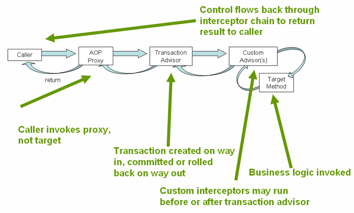
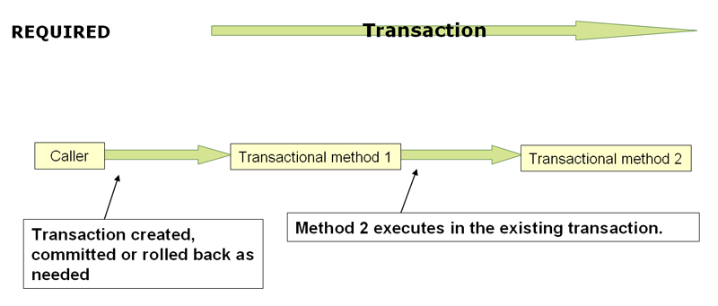
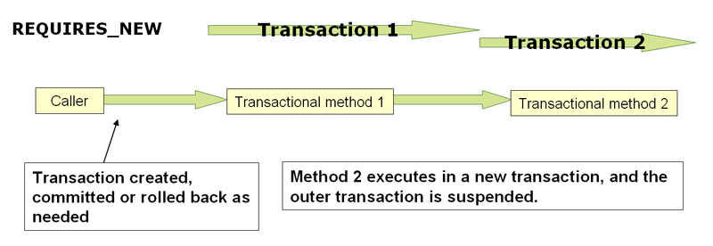

# 1.4. Declarative transaction management

<!-- tabs:start -->

#### ** English **

Most Spring Framework users choose declarative transaction management. This option has the least impact on application code and, hence, is most consistent with the ideals of a non-invasive lightweight container.
#### ** Chinese **

大多数Spring框架用户选择声明式事务管理。这个选项对应用程序代码的影响最小，因此最符合非侵入式轻量级容器的理想。

<!-- tabs:end -->


<!-- tabs:start -->

#### ** English **

The Spring Framework’s declarative transaction management is made possible with Spring aspect-oriented programming (AOP). However, as the transactional aspects code comes with the Spring Framework distribution and may be used in a boilerplate fashion, AOP concepts do not generally have to be understood to make effective use of this code.
#### ** Chinese **

Spring框架的声明式事务管理是通过Spring面向方面编程（AOP）实现的。但是，由于Spring框架发行版中自带的事务方面代码，可以以一种板式的方式使用，所以一般不需要理解AOP的概念就可以有效地利用这些代码。

<!-- tabs:end -->


<!-- tabs:start -->

#### ** English **

The Spring Framework’s declarative transaction management is similar to EJB CMT, in that you can specify transaction behavior (or lack of it) down to the individual method level. You can make a `setRollbackOnly()` call within a transaction context, if necessary. The differences between the two types of transaction management are:
#### ** Chinese **

Spring框架的声明式事务管理类似于EJB CMT，因为你可以指定事务行为（或不指定）到单个方法级。如果有必要，你可以在事务上下文中进行`setRollbackOnly()`调用。这两种类型的事务管理的区别在于。

<!-- tabs:end -->


<!-- tabs:start -->

#### ** English **

- Unlike EJB CMT, which is tied to JTA, the Spring Framework’s declarative transaction management works in any environment. It can work with JTA transactions or local transactions by using JDBC, JPA, or Hibernate by adjusting the configuration files.

- You can apply the Spring Framework declarative transaction management to any class, not merely special classes such as EJBs.

- The Spring Framework offers declarative [rollback rules](https://docs.spring.io/spring/docs/5.2.6.RELEASE/spring-framework-reference/data-access.html#transaction-declarative-rolling-back), a feature with no EJB equivalent. Both programmatic and declarative support for rollback rules is provided.

- The Spring Framework lets you customize transactional behavior by using AOP. For example, you can insert custom behavior in the case of transaction rollback. You can also add arbitrary advice, along with transactional advice. With EJB CMT, you cannot influence the container’s transaction management, except with `setRollbackOnly()`.

- The Spring Framework does not support propagation of transaction contexts across remote calls, as high-end application servers do. If you need this feature, we recommend that you use EJB. However, consider carefully before using such a feature, because, normally, one does not want transactions to span remote calls.

#### ** Chinese **

- 与EJB CMT与JTA绑定的EJB CMT不同，Spring框架的声明式事务管理可以在任何环境下工作。它可以通过调整配置文件，使用JDBC、JPA或Hibernate来处理JTA事务或本地事务。

- 你可以将Spring框架的声明式事务管理应用于任何类，而不仅仅是EJB等特殊类。

- Spring框架提供了声明式[回滚规则](https://docs.spring.io/spring/docs/5.2.6.RELEASE/spring-framework-reference/data-access.html#transaction-declarative-rolling-back)，这是一个没有EJB等效的功能。同时提供了对回滚规则的程序化和声明式支持。

- Spring框架允许你通过使用AOP来定制事务行为。例如，你可以在事务回滚的情况下插入自定义行为。你还可以在事务建议的同时，添加任意建议。使用EJB CMT，除了使用`setRollbackOnly()`外，你不能影响容器的事务管理。

- Spring框架不支持跨远程调用的事务上下文的传播，就像高端应用服务器那样。如果你需要这个功能，我们建议你使用EJB。但是，在使用这样的功能之前，请慎重考虑，因为通常情况下，人们不希望事务跨越远程调用。


通过www.DeepL.com/Translator（免费版）翻译
<!-- tabs:end -->

<!-- tabs:start -->

#### ** English **

The concept of rollback rules is important. They let you specify which exceptions (and throwables) should cause automatic rollback. You can specify this declaratively, in configuration, not in Java code. So, although you can still call `setRollbackOnly()` on the `TransactionStatus` object to roll back the current transaction back, most often you can specify a rule that `MyApplicationException` must always result in rollback. The significant advantage to this option is that business objects do not depend on the transaction infrastructure. For example, they typically do not need to import Spring transaction APIs or other Spring APIs.
#### ** Chinese **

回滚规则的概念很重要。它们可以让你指定哪些异常（和可抛物）应该导致自动回滚。你可以在配置中声明性地指定，而不是在Java代码中指定。因此，尽管你仍然可以在`TransactionStatus`对象上调用`setRollbackOnly()`来回滚当前事务，但大多数情况下，你可以指定一个规则，即`MyApplicationException`必须总是导致回滚。这个选项的显著优点是业务对象不依赖于事务基础架构。例如，它们通常不需要导入Spring事务API或其他Spring API。

<!-- tabs:end -->


<!-- tabs:start -->

#### ** English **

Although EJB container default behavior automatically rolls back the transaction on a system exception (usually a runtime exception), EJB CMT does not roll back the transaction automatically on an application exception (that is, a checked exception other than `java.rmi.RemoteException`). While the Spring default behavior for declarative transaction management follows EJB convention (roll back is automatic only on unchecked exceptions), it is often useful to customize this behavior.
#### ** Chinese **

尽管EJB容器的默认行为会在系统异常（通常是运行时异常）时自动回滚事务，但EJB CMT不会在应用程序异常（即除`java.rmi.RemoteException`以外的检查异常）时自动回滚事务。虽然Spring的声明式事务管理的默认行为遵循了EJB的惯例（只有在未检查的异常时才会自动回滚），但通常情况下，自定义这种行为是非常有用的。

<!-- tabs:end -->


### **1.4.1. Understanding the Spring Framework’s Declarative Transaction Implementation** 

<!-- tabs:start -->

#### ** English **

It is not sufficient merely to tell you to annotate your classes with the `@Transactional` annotation, add `@EnableTransactionManagement` to your configuration, and expect you to understand how it all works. To provide a deeper understanding, this section explains the inner workings of the Spring Framework’s declarative transaction infrastructure in the event of transaction-related issues.
#### ** Chinese **

仅仅告诉你用`@Transactional`注释来注释你的类，在你的配置中添加`@EnableTransactionManagement`，并期望你理解这一切是如何工作的，这还不够。为了提供更深入的理解，本节将解释Spring框架的声明式事务基础架构在事务相关问题时的内部工作原理。

<!-- tabs:end -->


<!-- tabs:start -->

#### ** English **

The most important concepts to grasp with regard to the Spring Framework’s declarative transaction support are that this support is enabled [via AOP proxies](https://docs.spring.io/spring/docs/5.2.6.RELEASE/spring-framework-reference/core.html#aop-understanding-aop-proxies) and that the transactional advice is driven by metadata (currently XML- or annotation-based). The combination of AOP with transactional metadata yields an AOP proxy that uses a `TransactionInterceptor` in conjunction with an appropriate `PlatformTransactionManager` implementation to drive transactions around method invocations.
#### ** Chinese **

关于Spring框架的声明性事务支持，需要掌握的最重要的概念是，这种支持是[通过AOP代理](https://docs.spring.io/spring/docs/5.2.6.RELEASE/spring-framework-reference/core.html#aop-understanding-aop-proxies)启用的，而且事务建议是由元数据驱动的(目前是基于XML或注释的)。AOP与事务元数据的结合产生了一个AOP代理，它使用一个 `TransactionInterceptor` 与适当的 `PlatformTransactionManager` 实现结合起来，围绕方法调用驱动事务。

<!-- tabs:end -->


<!-- tabs:start -->

#### ** English **

Spring AOP is covered in [the AOP section](https://docs.spring.io/spring/docs/5.2.6.RELEASE/spring-framework-reference/core.html#aop).
#### ** Chinese **

[Spring AOP部分](https://docs.spring.io/spring/docs/5.2.6.RELEASE/spring-framework-reference/core.html#aop)涉及到春季AOP。

<!-- tabs:end -->


<!-- tabs:start -->

#### ** English **

The following images shows a Conceptual view of calling a method on a transactional proxy:
#### ** Chinese **

下图是在事务代理上调用方法的概念视图。

<!-- tabs:end -->




### **1.4.2. Example of Declarative Transaction Implementation** 

<!-- tabs:start -->

#### ** English **

Consider the following interface and its attendant implementation. This example uses `Foo` and `Bar` classes as placeholders so that you can concentrate on the transaction usage without focusing on a particular domain model. For the purposes of this example, the fact that the `DefaultFooService` class throws `UnsupportedOperationException` instances in the body of each implemented method is good. That behavior lets you see transactions be created and then rolled back in response to the `UnsupportedOperationException` instance. The following listing shows the `FooService` interface:
#### ** Chinese **

考虑一下下面的接口及其附带的实现。这个例子使用了`Foo`和`Bar`类作为占位符，这样你就可以专注于事务的使用，而不需要关注特定的域模型。在这个例子中，`DefaultFooService`类会在每个实现的方法的正文中抛出`UnsupportedOperationException`实例，这一点很好。这种行为可以让你看到事务被创建，然后回滚响应于`UnsupportedOperationException`实例。下面的列表显示了`FooService`接口。

<!-- tabs:end -->


```java
// the service interface that we want to make transactional

package x.y.service;

public interface FooService {

    Foo getFoo(String fooName);

    Foo getFoo(String fooName, String barName);

    void insertFoo(Foo foo);

    void updateFoo(Foo foo);

}
```

<!-- tabs:start -->

#### ** English **

The following example shows an implementation of the preceding interface:
#### ** Chinese **

下面的例子显示了前述接口的一个实现。

<!-- tabs:end -->


```java
package x.y.service;

public class DefaultFooService implements FooService {

    @Override
    public Foo getFoo(String fooName) {
        // ...
    }

    @Override
    public Foo getFoo(String fooName, String barName) {
        // ...
    }

    @Override
    public void insertFoo(Foo foo) {
        // ...
    }

    @Override
    public void updateFoo(Foo foo) {
        // ...
    }
}
```

<!-- tabs:start -->

#### ** English **

Assume that the first two methods of the `FooService` interface, `getFoo(String)` and `getFoo(String, String)`, must execute in the context of a transaction with read-only semantics, and that the other methods, `insertFoo(Foo)` and `updateFoo(Foo)`, must execute in the context of a transaction with read-write semantics. The following configuration is explained in detail in the next few paragraphs:
#### ** Chinese **

假设`FooService`接口的前两个方法，即`getFoo(String)`和`getFoo(String, String)`，必须在只读语义的事务上下文中执行。以及其他方法，`insertFoo(Foo)`和`updateFoo(Foo)`，必须在具有读写语义的事务中执行。下面的配置将在接下来的几段中详细说明。

<!-- tabs:end -->


```xml
<!-- from the file 'context.xml' -->
<?xml version="1.0" encoding="UTF-8"?>
<beans xmlns="http://www.springframework.org/schema/beans"
    xmlns:xsi="http://www.w3.org/2001/XMLSchema-instance"
    xmlns:aop="http://www.springframework.org/schema/aop"
    xmlns:tx="http://www.springframework.org/schema/tx"
    xsi:schemaLocation="
        http://www.springframework.org/schema/beans
        https://www.springframework.org/schema/beans/spring-beans.xsd
        http://www.springframework.org/schema/tx
        https://www.springframework.org/schema/tx/spring-tx.xsd
        http://www.springframework.org/schema/aop
        https://www.springframework.org/schema/aop/spring-aop.xsd">

    <!-- this is the service object that we want to make transactional -->
    <bean id="fooService" class="x.y.service.DefaultFooService"/>

    <!-- the transactional advice (what 'happens'; see the <aop:advisor/> bean below) -->
    <tx:advice id="txAdvice" transaction-manager="txManager">
        <!-- the transactional semantics... -->
        <tx:attributes>
            <!-- all methods starting with 'get' are read-only -->
            <tx:method name="get*" read-only="true"/>
            <!-- other methods use the default transaction settings (see below) -->
            <tx:method name="*"/>
        </tx:attributes>
    </tx:advice>

    <!-- ensure that the above transactional advice runs for any execution
        of an operation defined by the FooService interface -->
    <aop:config>
        <aop:pointcut id="fooServiceOperation" expression="execution(* x.y.service.FooService.*(..))"/>
        <aop:advisor advice-ref="txAdvice" pointcut-ref="fooServiceOperation"/>
    </aop:config>

    <!-- don't forget the DataSource -->
    <bean id="dataSource" class="org.apache.commons.dbcp.BasicDataSource" destroy-method="close">
        <property name="driverClassName" value="oracle.jdbc.driver.OracleDriver"/>
        <property name="url" value="jdbc:oracle:thin:@rj-t42:1521:elvis"/>
        <property name="username" value="scott"/>
        <property name="password" value="tiger"/>
    </bean>

    <!-- similarly, don't forget the PlatformTransactionManager -->
    <bean id="txManager" class="org.springframework.jdbc.datasource.DataSourceTransactionManager">
        <property name="dataSource" ref="dataSource"/>
    </bean>

    <!-- other <bean/> definitions here -->

</beans>
```

<!-- tabs:start -->

#### ** English **

Examine the preceding configuration. It assumes that you want to make a service object, the `fooService` bean, transactional. The transaction semantics to apply are encapsulated in the `<tx:advice/>` definition. The `<tx:advice/>` definition reads as “all methods, on starting with `get`, are to execute in the context of a read-only transaction, and all other methods are to execute with the default transaction semantics”. The `transaction-manager` attribute of the `<tx:advice/>` tag is set to the name of the `PlatformTransactionManager` bean that is going to drive the transactions (in this case, the `txManager` bean).
#### ** Chinese **

检查一下前面的配置。它假定你想让一个服务对象，即`fooService` bean，成为事务性的。要应用的事务语义被封装在`<tx:advance/>`定义中。`<tx:advice/>`定义为 "所有的方法，以`get`开始，都要在只读事务的上下文中执行，其他所有的方法都要用默认的事务语义执行"。`<tx:advice/>`标签的`transaction-manager`属性被设置为要驱动事务的`PlatformTransactionManager` bean（在本例中是`txManager` bean）的名称。

<!-- tabs:end -->


<!-- tabs:start -->

#### ** English **

You can omit the `transaction-manager` attribute in the transactional advice (`<tx:advice/>`) if the bean name of the `PlatformTransactionManager` that you want to wire in has the name `transactionManager`. If the `PlatformTransactionManager` bean that you want to wire in has any other name, you must use the `transaction-manager` attribute explicitly, as in the preceding example.
#### ** Chinese **

如果你想导入的`PlatformTransactionManager` Bean的名称为`transactionManager`，你可以在事务处理建议(`<tx: advice/>`)中省略`transaction-manager`属性。如果您要连接的`PlatformTransactionManager` Bean有其他名称，您必须显式地使用`transaction-manager`属性，就像前面的例子一样。

<!-- tabs:end -->


<!-- tabs:start -->

#### ** English **

The `<aop:config/>` definition ensures that the transactional advice defined by the `txAdvice` bean executes at the appropriate points in the program. First, you define a pointcut that matches the execution of any operation defined in the `FooService` interface (`fooServiceOperation`). Then you associate the pointcut with the `txAdvice` by using an advisor. The result indicates that, at the execution of a `fooServiceOperation`, the advice defined by `txAdvice` is run.
#### ** Chinese **

`<aop:config/>`定义确保由`txAdvice` bean定义的事务性建议在程序中的适当位置执行。首先，您定义了一个点cut，它与在`FooService`接口中定义的任何操作的执行相匹配（`fooServiceOperation`）。然后通过使用顾问将点cut与`txAdvice`关联起来。结果表明，在执行`fooServiceOperation`时，由`txAdvice`定义的建议被运行。

<!-- tabs:end -->


<!-- tabs:start -->

#### ** English **

The expression defined within the `<aop:pointcut/>` element is an AspectJ pointcut expression. See [the AOP section](https://docs.spring.io/spring/docs/5.2.6.RELEASE/spring-framework-reference/core.html#aop) for more details on pointcut expressions in Spring.
#### ** Chinese **

在 `<aop:pointcut/>`元素中定义的表达式是一个AspectJ点切表达式。有关Spring中点切口表达式的更多详情，请参阅[AOP部分](https://docs.spring.io/spring/docs/5.2.6.RELEASE/spring-framework-reference/core.html#aop)。

<!-- tabs:end -->


<!-- tabs:start -->

#### ** English **

A common requirement is to make an entire service layer transactional. The best way to do this is to change the pointcut expression to match any operation in your service layer. The following example shows how to do so:
#### ** Chinese **

一个常见的需求是将整个服务层变成事务性的。最好的方法是改变点切表达式，使其与服务层中的任何操作相匹配。下面的例子显示了如何做到这一点。

<!-- tabs:end -->


```java
<aop:config>
    <aop:pointcut id="fooServiceMethods" expression="execution(* x.y.service.*.*(..))"/>
    <aop:advisor advice-ref="txAdvice" pointcut-ref="fooServiceMethods"/>
</aop:config>
```

<!-- tabs:start -->

#### ** English **

In the preceding example, it is assumed that all your service interfaces are defined in the `x.y.service` package. See [the AOP section](https://docs.spring.io/spring/docs/5.2.6.RELEASE/spring-framework-reference/core.html#aop) for more details.
#### ** Chinese **

在前面的例子中，假定你的所有服务接口都定义在`x.y.service`包中。更多细节请参见[AOP部分](https://docs.spring.io/spring/docs/5.2.6.RELEASE/spring-framework-reference/core.html#aop)。

<!-- tabs:end -->


<!-- tabs:start -->

#### ** English **

Now that we have analyzed the configuration, you may be asking yourself, “What does all this configuration actually do?”
#### ** Chinese **

现在我们分析了配置，你可能会问自己，这些配置到底是做什么的？

<!-- tabs:end -->


<!-- tabs:start -->

#### ** English **

The configuration shown earlier is used to create a transactional proxy around the object that is created from the `fooService` bean definition. The proxy is configured with the transactional advice so that, when an appropriate method is invoked on the proxy, a transaction is started, suspended, marked as read-only, and so on, depending on the transaction configuration associated with that method. Consider the following program that test drives the configuration shown earlier:
#### ** Chinese **

前面所示的配置用于在`fooService` bean定义中创建的对象周围创建一个事务代理。该代理被配置了事务建议，这样，当在代理上调用适当的方法时，根据与该方法相关联的事务配置，事务会被启动、暂停、标记为只读等。考虑一下下面的程序，测试一下前面所示的配置。

<!-- tabs:end -->


```java
public final class Boot {

    public static void main(final String[] args) throws Exception {
        ApplicationContext ctx = new ClassPathXmlApplicationContext("context.xml", Boot.class);
        FooService fooService = (FooService) ctx.getBean("fooService");
        fooService.insertFoo (new Foo());
    }
}
```

<!-- tabs:start -->

#### ** English **

The output from running the preceding program should resemble the following (the Log4J output and the stack trace from the UnsupportedOperationException thrown by the insertFoo(..) method of the DefaultFooService class have been truncated for clarity):
#### ** Chinese **

运行前面程序的输出应该类似于下面的输出（为了清楚起见，Log4J的输出和DefaultFooService类的insertFoo(...)方法抛出的UnsupportedOperationException的堆栈跟踪被截断了）。

<!-- tabs:end -->


```xml
<!-- the Spring container is starting up... -->
[AspectJInvocationContextExposingAdvisorAutoProxyCreator] - Creating implicit proxy for bean 'fooService' with 0 common interceptors and 1 specific interceptors

<!-- the DefaultFooService is actually proxied -->
[JdkDynamicAopProxy] - Creating JDK dynamic proxy for [x.y.service.DefaultFooService]

<!-- ... the insertFoo(..) method is now being invoked on the proxy -->
[TransactionInterceptor] - Getting transaction for x.y.service.FooService.insertFoo

<!-- the transactional advice kicks in here... -->
[DataSourceTransactionManager] - Creating new transaction with name [x.y.service.FooService.insertFoo]
[DataSourceTransactionManager] - Acquired Connection [org.apache.commons.dbcp.PoolableConnection@a53de4] for JDBC transaction

<!-- the insertFoo(..) method from DefaultFooService throws an exception... -->
[RuleBasedTransactionAttribute] - Applying rules to determine whether transaction should rollback on java.lang.UnsupportedOperationException
[TransactionInterceptor] - Invoking rollback for transaction on x.y.service.FooService.insertFoo due to throwable [java.lang.UnsupportedOperationException]

<!-- and the transaction is rolled back (by default, RuntimeException instances cause rollback) -->
[DataSourceTransactionManager] - Rolling back JDBC transaction on Connection [org.apache.commons.dbcp.PoolableConnection@a53de4]
[DataSourceTransactionManager] - Releasing JDBC Connection after transaction
[DataSourceUtils] - Returning JDBC Connection to DataSource

Exception in thread "main" java.lang.UnsupportedOperationException at x.y.service.DefaultFooService.insertFoo(DefaultFooService.java:14)
<!-- AOP infrastructure stack trace elements removed for clarity -->
at $Proxy0.insertFoo(Unknown Source)
at Boot.main(Boot.java:11)
```

### **1.4.3. Rolling Back a Declarative Transaction** 

<!-- tabs:start -->

#### ** English **

The previous section outlined the basics of how to specify transactional settings for classes, typically service layer classes, declaratively in your application. This section describes how you can control the rollback of transactions in a simple, declarative fashion.
#### ** Chinese **

上一节概述了如何在你的应用程序中声明性地指定类（通常是服务层类）的事务设置的基础知识。本节介绍了如何以简单、声明式的方式控制事务的回滚。

<!-- tabs:end -->


<!-- tabs:start -->

#### ** English **

The recommended way to indicate to the Spring Framework’s transaction infrastructure that a transaction’s work is to be rolled back is to throw an `Exception` from code that is currently executing in the context of a transaction. The Spring Framework’s transaction infrastructure code catches any unhandled `Exception` as it bubbles up the call stack and makes a determination whether to mark the transaction for rollback.
#### ** Chinese **

向Spring框架的事务基础架构指示事务的工作要回滚的推荐方法是从当前正在执行事务上下文中的代码中抛出一个`Exception`。Spring框架的事务基础架构代码会在调用栈中捕获任何未处理的`Exception`，并决定是否将事务标记为回滚。

<!-- tabs:end -->


<!-- tabs:start -->

#### ** English **

In its default configuration, the Spring Framework’s transaction infrastructure code marks a transaction for rollback only in the case of runtime, unchecked exceptions. That is, when the thrown exception is an instance or subclass of `RuntimeException`. ( `Error` instances also, by default, result in a rollback). Checked exceptions that are thrown from a transactional method do not result in rollback in the default configuration.
#### ** Chinese **

在其默认配置中，Spring框架的事务基础架构代码仅在运行时、未选中的异常情况下，才会标记一个事务进行回滚。也就是说，当抛出的异常是`RuntimeException`的实例或子类时。(`Error`实例也默认情况下会导致回滚)。从事务性方法抛出的检查异常在默认配置中不会导致回滚。

<!-- tabs:end -->


<!-- tabs:start -->

#### ** English **

You can configure exactly which `Exception` types mark a transaction for rollback, including checked exceptions. The following XML snippet demonstrates how you configure rollback for a checked, application-specific `Exception` type:
#### ** Chinese **

您可以精确地配置哪些 `Exception` 类型标记事务的回滚，包括检查过的异常。下面的 XML 代码片段演示了如何为检查过的、特定于应用程序的 `Exception`类型配置回滚。

<!-- tabs:end -->


```xml
<tx:advice id="txAdvice" transaction-manager="txManager">
    <tx:attributes>
    <tx:method name="get*" read-only="true" rollback-for="NoProductInStockException"/>
    <tx:method name="*"/>
    </tx:attributes>
</tx:advice>
```

<!-- tabs:start -->

#### ** English **

If you do not want a transaction rolled back when an exception is thrown, you can also specify 'no rollback rules'. The following example tells the Spring Framework’s transaction infrastructure to commit the attendant transaction even in the face of an unhandled `InstrumentNotFoundException`:
#### ** Chinese **

如果你不希望事务在抛出异常时回滚，你也可以指定 不回滚规则。下面的例子告诉Spring框架的事务基础架构，即使面对未处理的`InstrumentNotFoundException`，也要提交相应的事务。

<!-- tabs:end -->


```xml
<tx:advice id="txAdvice">
    <tx:attributes>
    <tx:method name="updateStock" no-rollback-for="InstrumentNotFoundException"/>
    <tx:method name="*"/>
    </tx:attributes>
</tx:advice>
```

<!-- tabs:start -->

#### ** English **

When the Spring Framework’s transaction infrastructure catches an exception and it consults the configured rollback rules to determine whether to mark the transaction for rollback, the strongest matching rule wins. So, in the case of the following configuration, any exception other than an `InstrumentNotFoundException` results in a rollback of the attendant transaction:
#### ** Chinese **

当Spring框架的事务基础架构捕捉到一个异常时，它检查配置的回滚规则以决定是否标记事务进行回滚，最强的匹配规则获胜。因此，在下面的配置中，除了`InstrumentNotFoundException`以外的任何异常都会导致回滚相应的事务。

<!-- tabs:end -->


```xml
<tx:advice id="txAdvice">
    <tx:attributes>
    <tx:method name="*" rollback-for="Throwable" no-rollback-for="InstrumentNotFoundException"/>
    </tx:attributes>
</tx:advice>
```

<!-- tabs:start -->

#### ** English **

You can also indicate a required rollback programmatically. Although simple, this process is quite invasive and tightly couples your code to the Spring Framework’s transaction infrastructure. The following example shows how to programmatically indicate a required rollback:
#### ** Chinese **

你也可以通过程序化的方式来指示需要的回滚。虽然很简单，但这个过程是相当具有侵入性的，并且将你的代码与Spring框架的事务基础架构紧密地耦合在一起。下面的例子显示了如何通过程序化方式来指示所需的回滚。

<!-- tabs:end -->


```java
public void resolvePosition() {
    try {
        // some business logic...
    } catch (NoProductInStockException ex) {
        // trigger rollback programmatically
        TransactionAspectSupport.currentTransactionStatus().setRollbackOnly();
    }
}
```

<!-- tabs:start -->

#### ** English **

You are strongly encouraged to use the declarative approach to rollback, if at all possible. Programmatic rollback is available should you absolutely need it, but its usage flies in the face of achieving a clean POJO-based architecture.
#### ** Chinese **

如果可能的话，我们强烈鼓励你使用声明式回滚方法。如果你绝对需要的话，可以使用程序化回滚，但它的使用会影响到基于POJO架构的干净架构。

<!-- tabs:end -->


### **1.4.4. Configuring Different Transactional Semantics for Different Beans** 

<!-- tabs:start -->

#### ** English **

Consider the scenario where you have a number of service layer objects, and you want to apply a totally different transactional configuration to each of them. You can do so by defining distinct `<aop:advisor/>` elements with differing `pointcut` and `advice-ref` attribute values.
#### ** Chinese **

考虑这样的场景：你有许多服务层对象，你想给每个对象应用一个完全不同的事务配置。您可以通过定义不同的`<aop:advisor/>`元素，并定义不同的`pointcut`和`advice-ref`属性值来实现。

<!-- tabs:end -->


<!-- tabs:start -->

#### ** English **

As a point of comparison, first assume that all of your service layer classes are defined in a root `x.y.service` package. To make all beans that are instances of classes defined in that package (or in subpackages) and that have names ending in `Service` have the default transactional configuration, you could write the following:
#### ** Chinese **

作为一个比较点，首先假设你的服务层的所有类都定义在一个根包`x.y.service`中。为了使所有在该包中定义的类的实例（或子包中的类），并且名称以`Service`结尾的bean都有默认的事务配置，你可以写以下内容。

<!-- tabs:end -->


```xml
<?xml version="1.0" encoding="UTF-8"?>
<beans xmlns="http://www.springframework.org/schema/beans"
    xmlns:xsi="http://www.w3.org/2001/XMLSchema-instance"
    xmlns:aop="http://www.springframework.org/schema/aop"
    xmlns:tx="http://www.springframework.org/schema/tx"
    xsi:schemaLocation="
        http://www.springframework.org/schema/beans
        https://www.springframework.org/schema/beans/spring-beans.xsd
        http://www.springframework.org/schema/tx
        https://www.springframework.org/schema/tx/spring-tx.xsd
        http://www.springframework.org/schema/aop
        https://www.springframework.org/schema/aop/spring-aop.xsd">

    <aop:config>

        <aop:pointcut id="serviceOperation"
                expression="execution(* x.y.service..*Service.*(..))"/>

        <aop:advisor pointcut-ref="serviceOperation" advice-ref="txAdvice"/>

    </aop:config>

    <!-- these two beans will be transactional... -->
    <bean id="fooService" class="x.y.service.DefaultFooService"/>
    <bean id="barService" class="x.y.service.extras.SimpleBarService"/>

    <!-- ... and these two beans won't -->
    <bean id="anotherService" class="org.xyz.SomeService"/> <!-- (not in the right package) -->
    <bean id="barManager" class="x.y.service.SimpleBarManager"/> <!-- (doesn't end in 'Service') -->

    <tx:advice id="txAdvice">
        <tx:attributes>
            <tx:method name="get*" read-only="true"/>
            <tx:method name="*"/>
        </tx:attributes>
    </tx:advice>

    <!-- other transaction infrastructure beans such as a PlatformTransactionManager omitted... -->

</beans>
```

<!-- tabs:start -->

#### ** English **

The following example shows how to configure two distinct beans with totally different transactional settings:
#### ** Chinese **

下面的例子显示了如何配置两个具有完全不同事务设置的不同豆子。

<!-- tabs:end -->


```xml
<?xml version="1.0" encoding="UTF-8"?>
<beans xmlns="http://www.springframework.org/schema/beans"
    xmlns:xsi="http://www.w3.org/2001/XMLSchema-instance"
    xmlns:aop="http://www.springframework.org/schema/aop"
    xmlns:tx="http://www.springframework.org/schema/tx"
    xsi:schemaLocation="
        http://www.springframework.org/schema/beans
        https://www.springframework.org/schema/beans/spring-beans.xsd
        http://www.springframework.org/schema/tx
        https://www.springframework.org/schema/tx/spring-tx.xsd
        http://www.springframework.org/schema/aop
        https://www.springframework.org/schema/aop/spring-aop.xsd">

    <aop:config>

        <aop:pointcut id="defaultServiceOperation"
                expression="execution(* x.y.service.*Service.*(..))"/>

        <aop:pointcut id="noTxServiceOperation"
                expression="execution(* x.y.service.ddl.DefaultDdlManager.*(..))"/>

        <aop:advisor pointcut-ref="defaultServiceOperation" advice-ref="defaultTxAdvice"/>

        <aop:advisor pointcut-ref="noTxServiceOperation" advice-ref="noTxAdvice"/>

    </aop:config>

    <!-- this bean will be transactional (see the 'defaultServiceOperation' pointcut) -->
    <bean id="fooService" class="x.y.service.DefaultFooService"/>

    <!-- this bean will also be transactional, but with totally different transactional settings -->
    <bean id="anotherFooService" class="x.y.service.ddl.DefaultDdlManager"/>

    <tx:advice id="defaultTxAdvice">
        <tx:attributes>
            <tx:method name="get*" read-only="true"/>
            <tx:method name="*"/>
        </tx:attributes>
    </tx:advice>

    <tx:advice id="noTxAdvice">
        <tx:attributes>
            <tx:method name="*" propagation="NEVER"/>
        </tx:attributes>
    </tx:advice>

    <!-- other transaction infrastructure beans such as a PlatformTransactionManager omitted... -->

</beans>
```

### **1.4.5. <tx:advice/> Settings** 

<!-- tabs:start -->

#### ** English **

This section summarizes the various transactional settings that you can specify by using the `<tx:advice/>` tag. The default `<tx:advice/>` settings are:
#### ** Chinese **

本节总结了您可以通过使用 `<tx:advice/>`标记指定的各种事务处理设置。默认的 `<tx:advice/>`设置是。

<!-- tabs:end -->


<!-- tabs:start -->

#### ** English **

- The [propagation setting](https://docs.spring.io/spring/docs/5.2.6.RELEASE/spring-framework-reference/data-access.html#tx-propagation) is `REQUIRED.`

- The isolation level is `DEFAULT.`

- The transaction is read-write.

- The transaction timeout defaults to the default timeout of the underlying transaction system or none if timeouts are not supported.

- Any `RuntimeException` triggers rollback, and any checked `Exception` does not.

#### ** Chinese **

- 传播设置](https://docs.spring.io/spring/docs/5.2.6.RELEASE/spring-framework-reference/data-access.html#tx-propagation)是`REQUIRED.`。

- 隔离级别为`DEFAULT.`。

- 该事务是读写的。

- 事务超时默认为底层事务系统的默认超时，如果不支持超时，则无超时。

- 任何`RuntimeException`都会触发回滚，而任何检查过的`Exception`都不会触发回滚。


<!-- tabs:end -->

<!-- tabs:start -->

#### ** English **

You can change these default settings. The following table summarizes the various attributes of the `<tx:method/>` tags that are nested within `<tx:advice/>` and `<tx:attributes/>` tags:
#### ** Chinese **

您可以更改这些默认设置。下表总结了嵌套在 `<tx:advice/>`和`<tx:attributes/>`标签中的`<tx:method/>`标签的各种属性。
<!-- tabs:end -->


Attribute | Required? | Default | Description 
-|-|-|-
name | Yes |  | Method names with which the transaction attributes are to be associated. The wildcard (*) character can be used to associate the same transaction attribute settings with a number of methods (for example, get*, handle*, on*Event, and so forth). 
propagation | No | REQUIRED | Transaction propagation behavior. 
isolation | No | DEFAULT | Transaction isolation level. Only applicable to propagation settings of REQUIRED or REQUIRES_NEW. 
timeout | No | -1 | Transaction timeout (seconds). Only applicable to propagation REQUIRED or REQUIRES_NEW. 
read-only | No | false | Read-write versus read-only transaction. Applies only to REQUIRED or REQUIRES_NEW. 
rollback-for | No |  | Comma-delimited list of Exception instances that trigger rollback. For example, com.foo.MyBusinessException,ServletException. 
no-rollback-for | No |  | Comma-delimited list of Exception instances that do not trigger rollback. For example, com.foo.MyBusinessException,ServletException. 


### **1.4.6. Using** **`@Transactional`** 

<!-- tabs:start -->

#### ** English **

In addition to the XML-based declarative approach to transaction configuration, you can use an annotation-based approach. Declaring transaction semantics directly in the Java source code puts the declarations much closer to the affected code. There is not much danger of undue coupling, because code that is meant to be used transactionally is almost always deployed that way anyway.
#### ** Chinese **

除了基于XML的声明式事务配置方法之外，还可以使用基于注释的方法。直接在Java源码中声明事务语义，使声明更接近于受影响的代码。不会有太大的不适当的耦合危险，因为无论如何，要用事务化的代码几乎都是这样部署的。

<!-- tabs:end -->


<!-- tabs:start -->

#### ** English **

The standard `javax.transaction.Transactional` annotation is also supported as a drop-in replacement to Spring’s own annotation. Please refer to JTA 1.2 documentation for more details.
#### ** Chinese **

标准的`javax.transaction.Transactional`注释也支持作为Spring自己的注释的替换方式。请参考 JTA 1.2 文档了解更多细节。

<!-- tabs:end -->


<!-- tabs:start -->

#### ** English **

The ease-of-use afforded by the use of the `@Transactional` annotation is best illustrated with an example, which is explained in the text that follows. Consider the following class definition:
#### ** Chinese **

使用`@Transactional`注释所提供的易用性，可以用一个例子来说明，下面的文字中会解释。考虑下面这个类的定义。

<!-- tabs:end -->


```java
// the service class that we want to make transactional
@Transactional
public class DefaultFooService implements FooService {

    Foo getFoo(String fooName) {
        // ...
    }

    Foo getFoo(String fooName, String barName) {
        // ...
    }

    void insertFoo(Foo foo) {
        // ...
    }

    void updateFoo(Foo foo) {
        // ...
    }
}
```

<!-- tabs:start -->

#### ** English **

Used at the class level as above, the annotation indicates a default for all methods of the declaring class (as well as its subclasses). Alternatively, each method can get annotated individually. Note that a class-level annotation does not apply to ancestor classes up the class hierarchy; in such a scenario, methods need to be locally redeclared in order to participate in a subclass-level annotation.
#### ** Chinese **

如上所述，在类级使用时，注解表示声明类的所有方法（以及它的子类）的默认值。或者，每个方法都可以被单独注释。注意，类级注解不适用于类层次结构上的祖类；在这种情况下，方法需要在本地重新声明才能参与子类级注解。

<!-- tabs:end -->


<!-- tabs:start -->

#### ** English **

When a POJO class such as the one above is defined as a bean in a Spring context, you can make the bean instance transactional through an `@EnableTransactionManagement` annotation in a `@Configuration` class. See the [javadoc](https://docs.spring.io/spring-framework/docs/5.2.6.RELEASE/javadoc-api/org/springframework/transaction/annotation/EnableTransactionManagement.html) for full details.
#### ** Chinese **

当一个POJO类（如上图所示）被定义为Spring上下文中的Bean时，可以通过在`@Configuration`类中的`@EnableTransactionManagement`注解使Bean实例成为事务性的。详情请参阅 [javadoc](https://docs.spring.io/spring-framework/docs/5.2.6.RELEASE/javadoc-api/org/springframework/transaction/annotation/EnableTransactionManagement.html)。

<!-- tabs:end -->


<!-- tabs:start -->

#### ** English **

In XML configuration, the `<tx:annotation-driven/>` tag provides similar convenience:
#### ** Chinese **

在XML配置中，`<tx:annotation-driven/>`标签提供了类似的方便。

<!-- tabs:end -->


```xml
<!-- from the file 'context.xml' -->
<?xml version="1.0" encoding="UTF-8"?>
<beans xmlns="http://www.springframework.org/schema/beans"
    xmlns:xsi="http://www.w3.org/2001/XMLSchema-instance"
    xmlns:aop="http://www.springframework.org/schema/aop"
    xmlns:tx="http://www.springframework.org/schema/tx"
    xsi:schemaLocation="
        http://www.springframework.org/schema/beans
        https://www.springframework.org/schema/beans/spring-beans.xsd
        http://www.springframework.org/schema/tx
        https://www.springframework.org/schema/tx/spring-tx.xsd
        http://www.springframework.org/schema/aop
        https://www.springframework.org/schema/aop/spring-aop.xsd">

    <!-- this is the service object that we want to make transactional -->
    <bean id="fooService" class="x.y.service.DefaultFooService"/>

    <!-- enable the configuration of transactional behavior based on annotations -->
    <tx:annotation-driven transaction-manager="txManager"/><!-- a PlatformTransactionManager is still required --> (1)

    <bean id="txManager" class="org.springframework.jdbc.datasource.DataSourceTransactionManager">
        <!-- (this dependency is defined somewhere else) -->
        <property name="dataSource" ref="dataSource"/>
    </bean>

    <!-- other <bean/> definitions here -->

</beans>
```

<!-- tabs:start -->

#### ** English **

(1)The line that makes the bean instance transactional.
#### ** Chinese **

(1)使豆子实例交易的线。

<!-- tabs:end -->


<!-- tabs:start -->

#### ** English **

You can omit the `transaction-manager` attribute in the `<tx:annotation-driven/>` tag if the bean name of the `PlatformTransactionManager` that you want to wire in has the name, `transactionManager`. If the `PlatformTransactionManager` bean that you want to dependency-inject has any other name, you have to use the `transaction-manager` attribute, as in the preceding example.
#### ** Chinese **

如果你想要导入的`PlatformTransactionManager`的Bean名称为`transactionManager`，你可以省略`<tx:annotation-driven/>`标记中的`transaction-manager`属性。如果你要依赖注入的`PlatformTransactionManager` Bean有其他名称，你必须使用`transaction-manager`属性，就像前面的例子一样。

<!-- tabs:end -->


<!-- tabs:start -->

#### ** English **

Method visibility and `@Transactional`
#### ** Chinese **

方法的可见性和`@Transactional`

<!-- tabs:end -->


<!-- tabs:start -->

#### ** English **

When you use proxies, you should apply the `@Transactional` annotation only to methods with public visibility. If you do annotate protected, private or package-visible methods with the `@Transactional` annotation, no error is raised, but the annotated method does not exhibit the configured transactional settings. If you need to annotate non-public methods, consider using AspectJ (described later).
#### ** Chinese **

当你使用代理时，你应该只将 `@Transactional` 注解应用到具有公共可见性的方法上。如果使用 `@事务处理` 注释对受保护的、私有的或包可见的方法进行注解，则不会产生错误，但被注解的方法不会显示配置的事务处理设置。如果你需要对非公开方法进行注释，可以考虑使用AspectJ（后面会介绍）。

<!-- tabs:end -->


<!-- tabs:start -->

#### ** English **

You can apply the `@Transactional` annotation to an interface definition, a method on an interface, a class definition, or a public method on a class. However, the mere presence of the `@Transactional` annotation is not enough to activate the transactional behavior. The `@Transactional` annotation is merely metadata that can be consumed by some runtime infrastructure that is `@Transactional`-aware and that can use the metadata to configure the appropriate beans with transactional behavior. In the preceding example, the `<tx:annotation-driven/>` element switches on the transactional behavior.
#### ** Chinese **

你可以将 `@Transactional` 注解应用到接口定义、接口上的方法、类定义或类上的公共方法。但是，仅有`@Transactional`注解的存在还不足以激活事务行为。`@Transactional`注解只是一个元数据，它可以被一些运行时基础架构所消耗，而这些基础架构是有`@Transactional`意识的，它可以使用这些元数据来配置具有事务行为的适当的Bean。在前面的例子中，`<tx:annotation-driven/>`元素开启了事务行为。

<!-- tabs:end -->


<!-- tabs:start -->

#### ** English **

The Spring team recommends that you annotate only concrete classes (and methods of concrete classes) with the `@Transactional` annotation, as opposed to annotating interfaces. You certainly can place the `@Transactional` annotation on an interface (or an interface method), but this works only as you would expect it to if you use interface-based proxies. The fact that Java annotations are not inherited from interfaces means that, if you use class-based proxies (`proxy-target-class="true"`) or the weaving-based aspect (`mode="aspectj"`), the transaction settings are not recognized by the proxying and weaving infrastructure, and the object is not wrapped in a transactional proxy.
#### ** Chinese **

Spring团队建议你只用`@Transactional`注释来注释具体类（以及具体类的方法），而不是注释接口。你当然可以将 `@Transactional` 注解放在接口（或接口方法）上，但这只在你使用基于接口的代理时才会起作用。Java 注释没有从接口继承的事实意味着，如果使用基于类的代理(`proxy-target-class="true"`)或基于编织的 aspect(`mode="aspectj"`)，事务设置不会被代理和编织基础架构识别，并且对象不会被事务代理包裹。

<!-- tabs:end -->


<!-- tabs:start -->

#### ** English **

In proxy mode (which is the default), only external method calls coming in through the proxy are intercepted. This means that self-invocation (in effect, a method within the target object calling another method of the target object) does not lead to an actual transaction at runtime even if the invoked method is marked with `@Transactional`. Also, the proxy must be fully initialized to provide the expected behavior, so you should not rely on this feature in your initialization code (that is, `@PostConstruct`).
#### ** Chinese **

在代理模式下（默认情况下），只有通过代理进来的外部方法调用才会被拦截。这意味着，即使被调用的方法被标记为`@Transactional`，在运行时，自调用（实际上，目标对象中的方法调用目标对象的另一个方法）也不会导致实际的事务。另外，代理必须完全初始化才能提供预期的行为，所以在初始化代码中不应该依赖这个特性（也就是`@PostConstruct`）。

<!-- tabs:end -->


<!-- tabs:start -->

#### ** English **

Consider using of AspectJ mode (see the `mode` attribute in the following table) if you expect self-invocations to be wrapped with transactions as well. In this case, there no proxy in the first place. Instead, the target class is woven (that is, its byte code is modified) to turn `@Transactional` into runtime behavior on any kind of method.
#### ** Chinese **

如果你希望自调用也被事务包裹，请考虑使用AspectJ模式（见下表中的`mode`属性）。在这种情况下，首先没有代理。相反，目标类被编织了（也就是说，它的字节代码被修改了），将`@Transactional`变成任何类型的方法的运行时行为。

<!-- tabs:end -->


XML Attribute | Annotation Attribute | Default | Description 
-|-|-|-
transaction-manager | N/A (see TransactionManagementConfigurer javadoc) | transactionManager | Name of the transaction manager to use. Required only if the name of the transaction manager is not transactionManager, as in the preceding example. 
mode | mode | proxy | The default mode (proxy) processes annotated beans to be proxied by using Spring’s AOP framework (following proxy semantics, as discussed earlier, applying to method calls coming in through the proxy only). The alternative mode (aspectj) instead weaves the affected classes with Spring’s AspectJ transaction aspect, modifying the target class byte code to apply to any kind of method call. AspectJ weaving requires spring-aspects.jar in the classpath as well as having load-time weaving (or compile-time weaving) enabled. (See Spring configuration for details on how to set up load-time weaving.) 
proxy-target-class | proxyTargetClass | false | Applies to proxy mode only. Controls what type of transactional proxies are created for classes annotated with the @Transactional annotation. If the proxy-target-class attribute is set to true, class-based proxies are created. If proxy-target-class is false or if the attribute is omitted, then standard JDK interface-based proxies are created. (See Proxying Mechanisms for a detailed examination of the different proxy types.) 
order | order | Ordered.LOWEST_PRECEDENCE | Defines the order of the transaction advice that is applied to beans annotated with @Transactional. (For more information about the rules related to ordering of AOP advice, see Advice Ordering.) No specified ordering means that the AOP subsystem determines the order of the advice. 


<!-- tabs:start -->

#### ** English **

The default advice mode for processing `@Transactional` annotations is `proxy`, which allows for interception of calls through the proxy only. Local calls within the same class cannot get intercepted that way. For a more advanced mode of interception, consider switching to `aspectj` mode in combination with compile-time or load-time weaving.
#### ** Chinese **

处理`@Transactional`注释的默认建议模式是`proxy`，它只允许通过代理拦截调用。同一类中的本地调用不能以这种方式被拦截。对于更高级的拦截模式，可以考虑切换到`aspectj`模式，结合编译时或加载时编织。

<!-- tabs:end -->


<!-- tabs:start -->

#### ** English **

The `proxy-target-class` attribute controls what type of transactional proxies are created for classes annotated with the `@Transactional` annotation. If `proxy-target-class` is set to `true`, class-based proxies are created. If `proxy-target-class` is `false` or if the attribute is omitted, standard JDK interface-based proxies are created. (See [core.html](https://docs.spring.io/spring/docs/5.2.6.RELEASE/spring-framework-reference/core.html#aop-proxying) for a discussion of the different proxy types.)
#### ** Chinese **

`proxy-target-class` 属性控制为带有 `@Transactional` 注解的类创建何种类型的事务代理。如果`proxy-target-class`设置为`true`，则会创建基于类的代理。如果 `proxy-target-class`为 `false`，或者省略了该属性，则创建基于标准 JDK 接口的代理。(关于不同代理类型的讨论，请参见[core.html](https://docs.spring.io/spring/docs/5.2.6.RELEASE/spring-framework-reference/core.html#aop-proxying))。

<!-- tabs:end -->


<!-- tabs:start -->

#### ** English **

`@EnableTransactionManagement` and `<tx:annotation-driven/>` looks for `@Transactional` only on beans in the same application context in which they are defined. This means that, if you put annotation-driven configuration in a `WebApplicationContext` for a `DispatcherServlet`, it checks for `@Transactional` beans only in your controllers and not your services. See [MVC](https://docs.spring.io/spring/docs/5.2.6.RELEASE/spring-framework-reference/web.html#mvc-servlet) for more information.
#### ** Chinese **

`@EnableTransactionManagement`和`<tx:annotation-driven/>`只在定义了相同的应用程序上下文中的Bean上寻找`@Transactional`。这意味着，如果你把注解驱动的配置放在`WebApplicationContext`中的`DispatcherServlet`中，它只检查控制器中的`@Transactional` beans，而不是你的服务。更多信息请参见[MVC](https://docs.spring.io/spring/docs/5.2.6.RELEASE/spring-framework-reference/web.html#mvc-servlet)。

<!-- tabs:end -->


<!-- tabs:start -->

#### ** English **

The most derived location takes precedence when evaluating the transactional settings for a method. In the case of the following example, the `DefaultFooService` class is annotated at the class level with the settings for a read-only transaction, but the `@Transactional` annotation on the `updateFoo(Foo)` method in the same class takes precedence over the transactional settings defined at the class level.
#### ** Chinese **

在评估一个方法的事务设置时，最派生的位置优先。在下面的例子中，`DefaultFooService`类在类级别上被注释为只读事务的设置，但在同一类中的`updateFoo(Foo)`方法上的`@Transactional`注释优先于在类级别上定义的事务设置。

<!-- tabs:end -->


```java
@Transactional(readOnly = true)
public class DefaultFooService implements FooService {

    public Foo getFoo(String fooName) {
        // ...
    }

    // these settings have precedence for this method
    @Transactional(readOnly = false, propagation = Propagation.REQUIRES_NEW)
    public void updateFoo(Foo foo) {
        // ...
    }
}
```

### **`@Transactional`** ** Settings** 

<!-- tabs:start -->

#### ** English **

The `@Transactional` annotation is metadata that specifies that an interface, class, or method must have transactional semantics (for example, “start a brand new read-only transaction when this method is invoked, suspending any existing transaction”). The default `@Transactional` settings are as follows:
#### ** Chinese **

`@Transactional` 注解是元数据，它指定了接口、类或方法必须具有事务性语义（例如，当调用此方法时，启动一个新的只读事务，暂停任何现有事务）。默认的`@事务`设置如下。

<!-- tabs:end -->


<!-- tabs:start -->

#### ** English **

- The propagation setting is `PROPAGATION_REQUIRED.`

- The isolation level is `ISOLATION_DEFAULT.`

- The transaction is read-write.

- The transaction timeout defaults to the default timeout of the underlying transaction system, or to none if timeouts are not supported.

- Any `RuntimeException` triggers rollback, and any checked `Exception` does not.

#### ** Chinese **

- 传播设置为`PROPAGATION_REQUIRED.`。

- 隔离级别为`ISOLATION_DEFAULT.`。

- 该事务是读写的。

- 事务超时默认为底层事务系统的默认超时，如果不支持超时，则默认为无。

- 任何`RuntimeException`都会触发回滚，而任何检查过的`Exception`都不会触发回滚。


<!-- tabs:end -->

<!-- tabs:start -->

#### ** English **

You can change these default settings. The following table summarizes the various properties of the `@Transactional` annotation:
#### ** Chinese **

您可以更改这些默认设置。下表总结了`@Transactional`注释的各种属性。

<!-- tabs:end -->


Property | Type | Description 
-|-|-
value | String | Optional qualifier that specifies the transaction manager to be used. 
propagation | enum: Propagation | Optional propagation setting. 
isolation | enum: Isolation | Optional isolation level. Applies only to propagation values of REQUIRED or REQUIRES_NEW. 
timeout | int (in seconds of granularity) | Optional transaction timeout. Applies only to propagation values of REQUIRED or REQUIRES_NEW. 
readOnly | boolean | Read-write versus read-only transaction. Only applicable to values of REQUIRED or REQUIRES_NEW. 
rollbackFor | Array of Class objects, which must be derived from Throwable. | Optional array of exception classes that must cause rollback. 
rollbackForClassName | Array of class names. The classes must be derived from Throwable. | Optional array of names of exception classes that must cause rollback. 
noRollbackFor | Array of Class objects, which must be derived from Throwable. | Optional array of exception classes that must not cause rollback. 
noRollbackForClassName | Array of String class names, which must be derived from Throwable. | Optional array of names of exception classes that must not cause rollback. 


<!-- tabs:start -->

#### ** English **

Currently, you cannot have explicit control over the name of a transaction, where 'name' means the transaction name that appears in a transaction monitor, if applicable (for example, WebLogic’s transaction monitor), and in logging output. For declarative transactions, the transaction name is always the fully-qualified class name + `.` + the method name of the transactionally advised class. For example, if the `handlePayment(..)` method of the `BusinessService` class started a transaction, the name of the transaction would be: `com.example.BusinessService.handlePayment`.
#### ** Chinese **

目前，您无法显式控制事务的名称，其中 name 指的是在事务监控器（如适用的话）和日志输出中出现的事务名称。对于声明性事务，事务名称始终是完全限定的类名+`.`+事务建议类的方法名。例如，如果`BusinessService`类的`handlePayment(..)`方法启动了一个事务，那么事务的名称将是。 `com.example.BusinessService.handlePayment`。

<!-- tabs:end -->


### **Multiple Transaction Managers with** **`@Transactional`** 

<!-- tabs:start -->

#### ** English **

Most Spring applications need only a single transaction manager, but there may be situations where you want multiple independent transaction managers in a single application. You can use the `value` attribute of the `@Transactional` annotation to optionally specify the identity of the `PlatformTransactionManager` to be used. This can either be the bean name or the qualifier value of the transaction manager bean. For example, using the qualifier notation, you can combine the following Java code with the following transaction manager bean declarations in the application context:
#### ** Chinese **

大多数Spring应用程序只需要一个事务管理器，但在某些情况下，您可能希望在一个应用程序中拥有多个独立的事务管理器。您可以使用`@Transactional`注释中的`value`属性来可选地指定要使用的`PlatformTransactionManager`的身份。这可以是Bean名或者事务管理器Bean的修饰符值。例如，使用修饰符符号，可以将下面的Java代码与应用程序上下文中的事务管理器Bean声明结合起来。

<!-- tabs:end -->


```java
public class TransactionalService {

    @Transactional("order")
    public void setSomething(String name) { ... }

    @Transactional("account")
    public void doSomething() { ... }
}
```

<!-- tabs:start -->

#### ** English **

The following listing shows the bean declarations:
#### ** Chinese **

下面列出了豆子的声明。

<!-- tabs:end -->


```xml
<tx:annotation-driven/>

    <bean id="transactionManager1" class="org.springframework.jdbc.datasource.DataSourceTransactionManager">
        ...
        <qualifier value="order"/>
    </bean>

    <bean id="transactionManager2" class="org.springframework.jdbc.datasource.DataSourceTransactionManager">
        ...
        <qualifier value="account"/>
    </bean>
```

<!-- tabs:start -->

#### ** English **

In this case, the two methods on `TransactionalService` run under separate transaction managers, differentiated by the `order` and `account` qualifiers. The default `<tx:annotation-driven>` target bean name, `transactionManager`, is still used if no specifically qualified `PlatformTransactionManager` bean is found.
#### ** Chinese **

在这种情况下，`TransactionalService`上的两个方法在单独的事务管理器下运行，由`order`和`account`限定符区分。如果没有找到特别限定的 `PlatformTransactionManager` bean，默认的`<tx:annotation-driven>`目标Bean名`transactionManager`仍然被使用。

<!-- tabs:end -->


### **Custom Shortcut Annotations** 

<!-- tabs:start -->

#### ** English **

If you find you repeatedly use the same attributes with `@Transactional` on many different methods, [Spring’s meta-annotation support](https://docs.spring.io/spring/docs/5.2.6.RELEASE/spring-framework-reference/core.html#beans-meta-annotations) lets you define custom shortcut annotations for your specific use cases. For example, consider the following annotation definitions:
#### ** Chinese **

如果你发现在许多不同的方法上重复使用相同的属性`@Transactional`，[Spring的元注释支持](https://docs.spring.io/spring/docs/5.2.6.RELEASE/spring-framework-reference/core.html#beans-meta-annotations)可以让你为你的特定用例定义自定义快捷方式注释。例如，考虑下面的注释定义。

<!-- tabs:end -->


```java
@Target({ElementType.METHOD, ElementType.TYPE})
@Retention(RetentionPolicy.RUNTIME)
@Transactional("order")
public @interface OrderTx {
}

@Target({ElementType.METHOD, ElementType.TYPE})
@Retention(RetentionPolicy.RUNTIME)
@Transactional("account")
public @interface AccountTx {
}
```

<!-- tabs:start -->

#### ** English **

The preceding annotations lets us write the example from the previous section as follows:
#### ** Chinese **

前面的注释让我们把上一节的例子写成如下。

<!-- tabs:end -->


```java
public class TransactionalService {

    @OrderTx
    public void setSomething(String name) {
        // ...
    }

    @AccountTx
    public void doSomething() {
        // ...
    }
}
```

<!-- tabs:start -->

#### ** English **

In the preceding example, we used the syntax to define the transaction manager qualifier, but we could also have included propagation behavior, rollback rules, timeouts, and other features.
#### ** Chinese **

在前面的例子中，我们使用语法来定义事务管理器的限定符，但我们也可以包括传播行为、回滚规则、超时等功能。

<!-- tabs:end -->


### **1.4.7. Transaction Propagation** 

<!-- tabs:start -->

#### ** English **

This section describes some semantics of transaction propagation in Spring. Note that this section is not an introduction to transaction propagation proper. Rather, it details some of the semantics regarding transaction propagation in Spring.
#### ** Chinese **

本节介绍了Spring中事务传播的一些语义。请注意，这一节并不是对事务传播的介绍，而是详细介绍了关于Spring中事务传播的一些语义。相反，它详细介绍了关于Spring中事务传播的一些语义。

<!-- tabs:end -->


<!-- tabs:start -->

#### ** English **

In Spring-managed transactions, be aware of the difference between physical and logical transactions, and how the propagation setting applies to this difference.
#### ** Chinese **

在Spring管理的事务中，要注意物理事务和逻辑事务的区别，以及传播设置如何适用于这种区别。

<!-- tabs:end -->


### **Understanding** **`PROPAGATION_REQUIRED`** 



<!-- tabs:start -->

#### ** English **

`PROPAGATION_REQUIRED` enforces a physical transaction, either locally for the current scope if no transaction exists yet or participating in an existing 'outer' transaction defined for a larger scope. This is a fine default in common call stack arrangements within the same thread (for example, a service facade that delegates to several repository methods where all the underlying resources have to participate in the service-level transaction).
#### ** Chinese **

`PROPAGATION_REQUIRED`强制执行一个物理事务，如果当前作用域还不存在事务的话，可以在本地执行，也可以参与为更大的作用域定义的现有 外部 事务。这在同一线程内常见的调用堆栈安排中是一个很好的默认情况（例如，一个服务的门面委托给多个资源库方法，而所有的底层资源都必须参与服务级事务）。

<!-- tabs:end -->


<!-- tabs:start -->

#### ** English **

By default, a participating transaction joins the characteristics of the outer scope, silently ignoring the local isolation level, timeout value, or read-only flag (if any). Consider switching the `validateExistingTransactions` flag to `true` on your transaction manager if you want isolation level declarations to be rejected when participating in an existing transaction with a different isolation level. This non-lenient mode also rejects read-only mismatches (that is, an inner read-write transaction that tries to participate in a read-only outer scope).
#### ** Chinese **

默认情况下，参与的事务会加入外部作用域的特征，会默默地忽略本地隔离级别、超时值或只读标志（如果有的话）。如果您希望在参与具有不同隔离级别的现有事务时拒绝隔离级别声明，可以考虑将事务管理器上的`validateExistingTransactions`标志切换为`true`。这种非宽松模式也拒绝只读不匹配（即内部读写事务试图参与只读的外部作用域）。

<!-- tabs:end -->


<!-- tabs:start -->

#### ** English **

When the propagation setting is `PROPAGATION_REQUIRED`, a logical transaction scope is created for each method upon which the setting is applied. Each such logical transaction scope can determine rollback-only status individually, with an outer transaction scope being logically independent from the inner transaction scope. In the case of standard `PROPAGATION_REQUIRED` behavior, all these scopes are mapped to the same physical transaction. So a rollback-only marker set in the inner transaction scope does affect the outer transaction’s chance to actually commit.
#### ** Chinese **

当传播设置为`PROPAGATION_REQUIRED`时，将为应用该设置的每个方法创建一个逻辑事务作用域。每一个这样的逻辑事务作用域可以单独确定只回滚状态，外部事务作用域在逻辑上独立于内部事务作用域。在标准`PROPAGATION_REQUIRED`行为的情况下，所有这些作用域都映射到同一个物理事务中。因此，在内部事务作用域中设置的只回滚标记确实会影响到外部事务的实际提交机会。

<!-- tabs:end -->


<!-- tabs:start -->

#### ** English **

However, in the case where an inner transaction scope sets the rollback-only marker, the outer transaction has not decided on the rollback itself, so the rollback (silently triggered by the inner transaction scope) is unexpected. A corresponding `UnexpectedRollbackException` is thrown at that point. This is expected behavior so that the caller of a transaction can never be misled to assume that a commit was performed when it really was not. So, if an inner transaction (of which the outer caller is not aware) silently marks a transaction as rollback-only, the outer caller still calls commit. The outer caller needs to receive an `UnexpectedRollbackException` to indicate clearly that a rollback was performed instead.
#### ** Chinese **

但是，在内部事务作用域设置了只回滚标记的情况下，外部事务本身并没有决定回滚，所以回滚（由内部事务作用域默默地触发）是意外的。此时会抛出一个相应的`UnexpectedRollbackException`。这是预期的行为，这样事务的调用者就不会被误导，以为提交被执行了，而实际上并没有执行。因此，如果一个内部事务（外部调用者没有意识到）默默地将事务标记为只回滚，外部调用者仍然调用提交。外部调用者需要收到一个`UnexpectedRollbackException`来明确表示回滚执行了。

<!-- tabs:end -->


### **Understanding** **`PROPAGATION_REQUIRES_NEW`** 



<!-- tabs:start -->

#### ** English **

`PROPAGATION_REQUIRES_NEW`, in contrast to `PROPAGATION_REQUIRED`, always uses an independent physical transaction for each affected transaction scope, never participating in an existing transaction for an outer scope. In such an arrangement, the underlying resource transactions are different and, hence, can commit or roll back independently, with an outer transaction not affected by an inner transaction’s rollback status and with an inner transaction’s locks released immediately after its completion. Such an independent inner transaction can also declare its own isolation level, timeout, and read-only settings and not inherit an outer transaction’s characteristics.
#### ** Chinese **
`PROPAGATION_REQUIRES_NEW`与`PROPAGATION_REQUIRED`不同的是，PROPAGATION_REQUIRED</x>总是为每个受影响的事务范围使用一个独立的物理事务，从不参与外部范围的现有事务。在这样的安排中，底层资源事务是不同的，因此可以独立提交或回滚，外部事务不受内部事务的回滚状态的影响，内部事务的锁在完成后立即释放。这样独立的内部事务也可以声明自己的隔离级别、超时和只读设置，不继承外部事务的特性。

<!-- tabs:end -->


### **Understanding** **`PROPAGATION_NESTED`** 

<!-- tabs:start -->

#### ** English **

`PROPAGATION_NESTED` uses a single physical transaction with multiple savepoints that it can roll back to. Such partial rollbacks let an inner transaction scope trigger a rollback for its scope, with the outer transaction being able to continue the physical transaction despite some operations having been rolled back. This setting is typically mapped onto JDBC savepoints, so it works only with JDBC resource transactions. See Spring’s [`DataSourceTransactionManager`](https://docs.spring.io/spring-framework/docs/5.2.6.RELEASE/javadoc-api/org/springframework/jdbc/datasource/DataSourceTransactionManager.html).
#### ** Chinese **

`PROPAGATION_NESTED`使用了一个具有多个保存点的单个物理事务，它可以回滚到多个保存点。这样的部分回滚可以让内部事务作用域触发其作用域的回滚，而外部事务可以继续进行物理事务，尽管有些操作已经被回滚，但外部事务仍然可以继续进行物理事务。这个设置通常被映射到JDBC保存点上，所以它只适用于JDBC资源事务。参见Spring的[`DataSourceTransactionManager`](https://docs.spring.io/spring-framework/docs/5.2.6.RELEASE/javadoc-api/org/springframework/jdbc/datasource/DataSourceTransactionManager.html)。

<!-- tabs:end -->


### **1.4.8. Advising Transactional Operations** 

<!-- tabs:start -->

#### ** English **

Suppose you want to execute both transactional operations and some basic profiling advice. How do you effect this in the context of `<tx:annotation-driven/>`?
#### ** Chinese **

假设你想同时执行事务性操作和一些基本的剖析建议。在`<tx:annotation-driven/>`的上下文中如何实现？

<!-- tabs:end -->


<!-- tabs:start -->

#### ** English **

When you invoke the `updateFoo(Foo)` method, you want to see the following actions:
#### ** Chinese **

当你调用`updateFoo(Foo)`方法时，你希望看到以下操作。

<!-- tabs:end -->


<!-- tabs:start -->

#### ** English **

- The configured profiling aspect starts.

- The transactional advice executes.

- The method on the advised object executes.

- The transaction commits.

- The profiling aspect reports the exact duration of the whole transactional method invocation.

#### ** Chinese **

- 配置的剖析方面开始。

- 事务性建议执行。

- 建议对象上的方法执行。

- 事务提交。

- 剖析方面报告整个事务方法调用的确切时间。


<!-- tabs:end -->

<!-- tabs:start -->

#### ** English **

This chapter is not concerned with explaining AOP in any great detail (except as it applies to transactions). See [AOP](https://docs.spring.io/spring/docs/5.2.6.RELEASE/spring-framework-reference/core.html#aop) for detailed coverage of the AOP configuration and AOP in general.
#### ** Chinese **

本章不涉及对AOP的详细解释（除了适用于事务之外）。关于AOP配置和一般的AOP的详细内容，请参见[AOP](https://docs.spring.io/spring/docs/5.2.6.RELEASE/spring-framework-reference/core.html#aop)。

<!-- tabs:end -->


<!-- tabs:start -->

#### ** English **

The following code shows the simple profiling aspect discussed earlier:
#### ** Chinese **

下面的代码显示了前面讨论的简单分析方面。

<!-- tabs:end -->


```java
package x.y;

import org.aspectj.lang.ProceedingJoinPoint;
import org.springframework.util.StopWatch;
import org.springframework.core.Ordered;

public class SimpleProfiler implements Ordered {

    private int order;

    // allows us to control the ordering of advice
    public int getOrder() {
        return this.order;
    }

    public void setOrder(int order) {
        this.order = order;
    }

    // this method is the around advice
    public Object profile(ProceedingJoinPoint call) throws Throwable {
        Object returnValue;
        StopWatch clock = new StopWatch(getClass().getName());
        try {
            clock.start(call.toShortString());
            returnValue = call.proceed();
        } finally {
            clock.stop();
            System.out.println(clock.prettyPrint());
        }
        return returnValue;
    }
}
```

<!-- tabs:start -->

#### ** English **

The ordering of advice is controlled through the `Ordered` interface. For full details on advice ordering, see [Advice ordering](https://docs.spring.io/spring/docs/5.2.6.RELEASE/spring-framework-reference/core.html#aop-ataspectj-advice-ordering).
#### ** Chinese **

建议的排序是通过`Ordered`界面控制的。有关建议订购的完整细节，请参见[建议订购](https://docs.spring.io/spring/docs/5.2.6.RELEASE/spring-framework-reference/core.html#aop-ataspectj-advice-ordering)。

<!-- tabs:end -->


<!-- tabs:start -->

#### ** English **

The following configuration creates a `fooService` bean that has profiling and transactional aspects applied to it in the desired order:
#### ** Chinese **

下面的配置创建了一个`fooService` bean，该bean按照所需的顺序对其进行剖析和事务处理。

<!-- tabs:end -->


```xml
<?xml version="1.0" encoding="UTF-8"?>
<beans xmlns="http://www.springframework.org/schema/beans"
    xmlns:xsi="http://www.w3.org/2001/XMLSchema-instance"
    xmlns:aop="http://www.springframework.org/schema/aop"
    xmlns:tx="http://www.springframework.org/schema/tx"
    xsi:schemaLocation="
        http://www.springframework.org/schema/beans
        https://www.springframework.org/schema/beans/spring-beans.xsd
        http://www.springframework.org/schema/tx
        https://www.springframework.org/schema/tx/spring-tx.xsd
        http://www.springframework.org/schema/aop
        https://www.springframework.org/schema/aop/spring-aop.xsd">

    <bean id="fooService" class="x.y.service.DefaultFooService"/>

    <!-- this is the aspect -->
    <bean id="profiler" class="x.y.SimpleProfiler">
        <!-- execute before the transactional advice (hence the lower order number) -->
        <property name="order" value="1"/>
    </bean>

    <tx:annotation-driven transaction-manager="txManager" order="200"/>

    <aop:config>
            <!-- this advice will execute around the transactional advice -->
            <aop:aspect id="profilingAspect" ref="profiler">
                <aop:pointcut id="serviceMethodWithReturnValue"
                        expression="execution(!void x.y..*Service.*(..))"/>
                <aop:around method="profile" pointcut-ref="serviceMethodWithReturnValue"/>
            </aop:aspect>
    </aop:config>

    <bean id="dataSource" class="org.apache.commons.dbcp.BasicDataSource" destroy-method="close">
        <property name="driverClassName" value="oracle.jdbc.driver.OracleDriver"/>
        <property name="url" value="jdbc:oracle:thin:@rj-t42:1521:elvis"/>
        <property name="username" value="scott"/>
        <property name="password" value="tiger"/>
    </bean>

    <bean id="txManager" class="org.springframework.jdbc.datasource.DataSourceTransactionManager">
        <property name="dataSource" ref="dataSource"/>
    </bean>

</beans>
```

<!-- tabs:start -->

#### ** English **

You can configure any number of additional aspects in similar fashion.
#### ** Chinese **

你可以以类似的方式配置任何数量的附加方面。

<!-- tabs:end -->


<!-- tabs:start -->

#### ** English **

The following example creates the same setup as the previous two examples but uses the purely XML declarative approach:
#### ** Chinese **

下面的例子创建了与前两个例子相同的设置，但使用了纯XML声明式的方法。

<!-- tabs:end -->


```xml
<?xml version="1.0" encoding="UTF-8"?>
<beans xmlns="http://www.springframework.org/schema/beans"
    xmlns:xsi="http://www.w3.org/2001/XMLSchema-instance"
    xmlns:aop="http://www.springframework.org/schema/aop"
    xmlns:tx="http://www.springframework.org/schema/tx"
    xsi:schemaLocation="
        http://www.springframework.org/schema/beans
        https://www.springframework.org/schema/beans/spring-beans.xsd
        http://www.springframework.org/schema/tx
        https://www.springframework.org/schema/tx/spring-tx.xsd
        http://www.springframework.org/schema/aop
        https://www.springframework.org/schema/aop/spring-aop.xsd">

    <bean id="fooService" class="x.y.service.DefaultFooService"/>

    <!-- the profiling advice -->
    <bean id="profiler" class="x.y.SimpleProfiler">
        <!-- execute before the transactional advice (hence the lower order number) -->
        <property name="order" value="1"/>
    </bean>

    <aop:config>
        <aop:pointcut id="entryPointMethod" expression="execution(* x.y..*Service.*(..))"/>
        <!-- will execute after the profiling advice (c.f. the order attribute) -->

        <aop:advisor advice-ref="txAdvice" pointcut-ref="entryPointMethod" order="2"/>
        <!-- order value is higher than the profiling aspect -->

        <aop:aspect id="profilingAspect" ref="profiler">
            <aop:pointcut id="serviceMethodWithReturnValue"
                    expression="execution(!void x.y..*Service.*(..))"/>
            <aop:around method="profile" pointcut-ref="serviceMethodWithReturnValue"/>
        </aop:aspect>

    </aop:config>

    <tx:advice id="txAdvice" transaction-manager="txManager">
        <tx:attributes>
            <tx:method name="get*" read-only="true"/>
            <tx:method name="*"/>
        </tx:attributes>
    </tx:advice>

    <!-- other <bean/> definitions such as a DataSource and a PlatformTransactionManager here -->

</beans>
```

<!-- tabs:start -->

#### ** English **

The result of the preceding configuration is a `fooService` bean that has profiling and transactional aspects applied to it in that order. If you want the profiling advice to execute after the transactional advice on the way in and before the transactional advice on the way out, you can swap the value of the profiling aspect bean’s `order` property so that it is higher than the transactional advice’s order value.
#### ** Chinese **

上述配置的结果是一个`fooService` bean，它的profiling和事务处理方面按这个顺序应用于它。如果你想让profiling建议在进入时在事务性建议之后执行，而在退出时在事务性建议之前执行，你可以将profiling aspect bean的`order`属性的值调换，使其高于事务性建议的订单值。

<!-- tabs:end -->


<!-- tabs:start -->

#### ** English **

You can configure additional aspects in similar fashion.
#### ** Chinese **

你可以用类似的方式配置其他方面。

<!-- tabs:end -->


### **1.4.9. Using** **`@Transactional`** ** with AspectJ** 

<!-- tabs:start -->

#### ** English **

You can also use the Spring Framework’s `@Transactional` support outside of a Spring container by means of an AspectJ aspect. To do so, first annotate your classes (and optionally your classes' methods) with the `@Transactional` annotation, and then link (weave) your application with the `org.springframework.transaction.aspectj.AnnotationTransactionAspect` defined in the `spring-aspects.jar` file. You must also configure The aspect with a transaction manager. You can use the Spring Framework’s IoC container to take care of dependency-injecting the aspect. The simplest way to configure the transaction management aspect is to use the `<tx:annotation-driven/>` element and specify the `mode` attribute to `aspectj` as described in [Using ](https://docs.spring.io/spring/docs/5.2.6.RELEASE/spring-framework-reference/data-access.html#transaction-declarative-annotations)[`@Transactional`](https://docs.spring.io/spring/docs/5.2.6.RELEASE/spring-framework-reference/data-access.html#transaction-declarative-annotations). Because we focus here on applications that run outside of a Spring container, we show you how to do it programmatically.
#### ** Chinese **

你也可以通过AspectJ aspect在Spring容器之外使用Spring框架的`@Transactional`支持。要做到这一点，首先用 `@Transactional` 注解你的类（以及你的类的方法选项），然后用 `spring-aspects.jar`文件中定义的 `org.springframework.transaction.aspectj.AnnotationTransactionAspect`链接（编织）你的应用程序。你还必须用事务管理器来配置The aspect。你可以使用Spring框架的IoC容器来处理依赖注入方面。配置事务管理方面的最简单的方法是使用`<tx:annotation-driven/>`元素，并将`mode`属性指定为`aspectj`，如[使用](https://docs.spring.io/spring/docs/5.2.6.RELEASE/spring-framework-reference/data-access.html#transaction-declarative-annotations)[`@Transactional`](https://docs.spring.io/spring/docs/5.2.6.RELEASE/spring-framework-reference/data-access.html#transaction-declarative-annotations)中描述的那样。因为我们在这里关注的是在Spring容器之外运行的应用程序，所以我们向您展示如何通过编程来实现。

<!-- tabs:end -->


<!-- tabs:start -->

#### ** English **

Prior to continuing, you may want to read [Using ](https://docs.spring.io/spring/docs/5.2.6.RELEASE/spring-framework-reference/data-access.html#transaction-declarative-annotations)[`@Transactional`](https://docs.spring.io/spring/docs/5.2.6.RELEASE/spring-framework-reference/data-access.html#transaction-declarative-annotations) and [AOP](https://docs.spring.io/spring/docs/5.2.6.RELEASE/spring-framework-reference/core.html#aop) respectively.
#### ** Chinese **

在继续阅读之前，你可能需要分别阅读[使用](https://docs.spring.io/spring/docs/5.2.6.RELEASE/spring-framework-reference/data-access.html#transaction-declarative-annotations)[`@Transactional`](https://docs.spring.io/spring/docs/5.2.6.RELEASE/spring-framework-reference/data-access.html#transaction-declarative-annotations)和[AOP](https://docs.spring.io/spring/docs/5.2.6.RELEASE/spring-framework-reference/core.html#aop)。

<!-- tabs:end -->


<!-- tabs:start -->

#### ** English **

The following example shows how to create a transaction manager and configure the `AnnotationTransactionAspect` to use it:
#### ** Chinese **

下面的示例显示了如何创建一个事务管理器并配置`AnnotationTransactionAspect`来使用它。

<!-- tabs:end -->


```java
// construct an appropriate transaction manager
DataSourceTransactionManager txManager = new DataSourceTransactionManager(getDataSource());

// configure the AnnotationTransactionAspect to use it; this must be done before executing any transactional methods
AnnotationTransactionAspect.aspectOf().setTransactionManager(txManager);
```

<!-- tabs:start -->

#### ** English **

When you use this aspect, you must annotate the implementation class (or the methods within that class or both), not the interface (if any) that the class implements. AspectJ follows Java’s rule that annotations on interfaces are not inherited.
#### ** Chinese **

当你使用这个方面时，你必须对实现类（或该类中的方法或两者都有）进行注释，而不是对该类实现的接口（如果有的话）进行注释。AspectJ遵循Java的规则，即接口上的注释不被继承。

<!-- tabs:end -->


<!-- tabs:start -->

#### ** English **

The `@Transactional` annotation on a class specifies the default transaction semantics for the execution of any public method in the class.
#### ** Chinese **

类上的 `@Transactional` 注解指定了类中任何公共方法执行的默认事务语义。

<!-- tabs:end -->


<!-- tabs:start -->

#### ** English **

The `@Transactional` annotation on a method within the class overrides the default transaction semantics given by the class annotation (if present). You can annotate any method, regardless of visibility.
#### ** Chinese **

在类内的方法上的`@Transactional`注释覆盖了由类注释（如果存在的话）给出的默认事务语义。你可以对任何方法进行注解，无论可见性如何。

<!-- tabs:end -->


<!-- tabs:start -->

#### ** English **

To weave your applications with the `AnnotationTransactionAspect`, you must either build your application with AspectJ (see the [AspectJ Development Guide](https://www.eclipse.org/aspectj/doc/released/devguide/index.html)) or use load-time weaving. See [Load-time weaving with AspectJ in the Spring Framework](https://docs.spring.io/spring/docs/5.2.6.RELEASE/spring-framework-reference/core.html#aop-aj-ltw) for a discussion of load-time weaving with AspectJ.
#### ** Chinese **

要使用 `AnnotationTransactionAspect`来编织你的应用程序，你必须使用AspectJ来构建你的应用程序（参见[AspectJ开发指南](https://www.eclipse.org/aspectj/doc/released/devguide/index.html)）或者使用加载时编织。有关使用AspectJ进行加载时编织的讨论，请参阅[Spring框架中的AspectJ加载时编织](https://docs.spring.io/spring/docs/5.2.6.RELEASE/spring-framework-reference/core.html#aop-aj-ltw)。

<!-- tabs:end -->


[下一章](Spring-Framework-5.2.6.RELEASE/Data%20Access/1.5.%20Programmatic%20Transaction%20Management.md)


[回目录](Spring-Framework-5.2.6.RELEASE/summary.md)

[回首页](/README)
