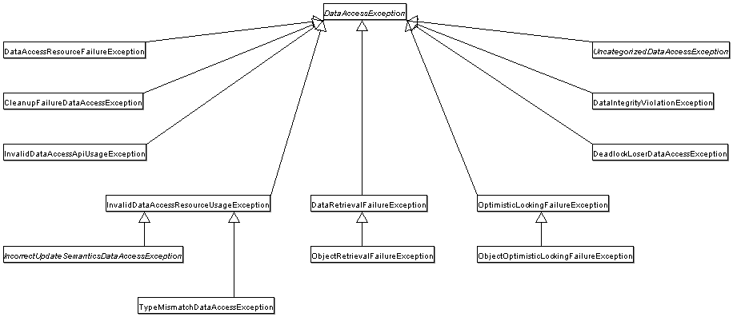

# 2. DAO Support

<!-- tabs:start -->

#### ** English **

The Data Access Object (DAO) support in Spring is aimed at making it easy to work with data access technologies (such as JDBC, Hibernate, or JPA) in a consistent way. This lets you switch between the aforementioned persistence technologies fairly easily, and it also lets you code without worrying about catching exceptions that are specific to each technology.
#### ** Chinese **

Spring中的数据访问对象(DAO)支持的目的是让你可以轻松地与数据访问技术(如JDBC、Hibernate或JPA)以一致的方式工作。这让你可以相当容易地在上述持久化技术之间进行切换，而且它还可以让你在编写代码时不必担心捕捉到每种技术特有的异常。

<!-- tabs:end -->


### **2.1. Consistent Exception Hierarchy** 

<!-- tabs:start -->

#### ** English **

Spring provides a convenient translation from technology-specific exceptions, such as `SQLException` to its own exception class hierarchy, which has `DataAccessException` as the root exception. These exceptions wrap the original exception so that there is never any risk that you might lose any information about what might have gone wrong.
#### ** Chinese **

Spring提供了一个方便的转换，从技术特定的异常，如`SQLException`到它自己的异常类层次结构，其中`DataAccessException`作为根异常。这些异常将原始异常包裹起来，这样就不会有任何可能丢失任何可能出错的信息。

<!-- tabs:end -->


<!-- tabs:start -->

#### ** English **

In addition to JDBC exceptions, Spring can also wrap JPA- and Hibernate-specific exceptions, converting them to a set of focused runtime exceptions. This lets you handle most non-recoverable persistence exceptions in only the appropriate layers, without having annoying boilerplate catch-and-throw blocks and exception declarations in your DAOs. (You can still trap and handle exceptions anywhere you need to though.) As mentioned above, JDBC exceptions (including database-specific dialects) are also converted to the same hierarchy, meaning that you can perform some operations with JDBC within a consistent programming model.
#### ** Chinese **

除了JDBC异常外，Spring还可以封装JPA和Hibernate特定的异常，将其转换为一组集中的运行时异常。这样，你可以只在适当的层中处理大多数不可恢复的持久化异常，而不需要在DAO中使用烦人的模板式的捕获和抛出块和异常声明。(不过你仍然可以在任何需要的地方捕获和处理异常。)如上所述，JDBC 异常(包括特定数据库的拨号)也被转换为相同的层次结构，这意味着你可以在一个一致的编程模型中使用JDBC执行一些操作。

<!-- tabs:end -->


<!-- tabs:start -->

#### ** English **

The preceding discussion holds true for the various template classes in Spring’s support for various ORM frameworks. If you use the interceptor-based classes, the application must care about handling `HibernateExceptions` and `PersistenceExceptions` itself, preferably by delegating to the `convertHibernateAccessException(..)` or `convertJpaAccessException()` methods, respectively, of `SessionFactoryUtils`. These methods convert the exceptions to exceptions that are compatible with the exceptions in the `org.springframework.dao` exception hierarchy. As `PersistenceExceptions` are unchecked, they can get thrown, too (sacrificing generic DAO abstraction in terms of exceptions, though).
#### ** Chinese **

前面的讨论对于Spring支持的各种ORM框架中的各种模板类也是如此。如果使用基于拦截器的类，应用程序必须关心处理 `HibernateExceptions`和`PersistenceExceptions`本身，最好是通过委托给`SessionFactoryUtils`的`convertHibernateAccessException(..)`或`convertJpaAccessException()`方法来处理。这些方法将异常转换为与`org.springframework.dao`异常层次结构中的异常兼容的异常。由于`PersistenceExceptions`没有被选中，所以它们也可以被抛出（不过，在异常方面牺牲了一般的DAO抽象）。

<!-- tabs:end -->


<!-- tabs:start -->

#### ** English **

The following image shows the exception hierarchy that Spring provides. (Note that the class hierarchy detailed in the image shows only a subset of the entire `DataAccessException` hierarchy.)
#### ** Chinese **

下图显示了Spring提供的异常层次结构。(注意，图片中详细说明的类层次结构只显示了整个`DataAccessException`层次结构的一个子集)

<!-- tabs:end -->




### **2.2. Annotations Used to Configure DAO or Repository Classes** 

<!-- tabs:start -->

#### ** English **

The best way to guarantee that your Data Access Objects (DAOs) or repositories provide exception translation is to use the `@Repository` annotation. This annotation also lets the component scanning support find and configure your DAOs and repositories without having to provide XML configuration entries for them. The following example shows how to use the `@Repository` annotation:
#### ** Chinese **

保证你的数据访问对象（DAO）或存储库提供异常转换的最好方法是使用`@Repository`注释。这个注释还可以让组件扫描支持查找和配置您的DAO和存储库，而无需为它们提供XML配置条目。下面的例子显示了如何使用 `@Repository` 注解。

<!-- tabs:end -->


```java
@Repository (1)
public class SomeMovieFinder implements MovieFinder {
    // ...
}

//(1) The @Repository annotation.
```

<!-- tabs:start -->

#### ** English **

Any DAO or repository implementation needs access to a persistence resource, depending on the persistence technology used. For example, a JDBC-based repository needs access to a JDBC `DataSource`, and a JPA-based repository needs access to an `EntityManager`. The easiest way to accomplish this is to have this resource dependency injected by using one of the `@Autowired`, `@Inject`, `@Resource` or `@PersistenceContext` annotations. The following example works for a JPA repository:
#### ** Chinese **

任何DAO或存储库实现都需要访问持久化资源，这取决于所使用的持久化技术。例如，基于JDBC的存储库需要访问JDBC `DataSource`，而基于JPA的存储库需要访问`EntityManager`。最简单的方法是通过使用`@Autowired`、`@Inject`、`@Resource`或`@PersistenceContext`注释中的一个来注入这个资源依赖关系。下面的例子适用于一个JPA仓库。

<!-- tabs:end -->


```java
@Repository
public class JpaMovieFinder implements MovieFinder {

    @PersistenceContext
    private EntityManager entityManager;

    // ...
}
```

<!-- tabs:start -->

#### ** English **

If you use the classic Hibernate APIs, you can inject `SessionFactory`, as the following example shows:
#### ** Chinese **

如果你使用经典的Hibernate API，你可以注入`SessionFactory`，如下例所示。

<!-- tabs:end -->


```java
@Repository
public class HibernateMovieFinder implements MovieFinder {

    private SessionFactory sessionFactory;

    @Autowired
    public void setSessionFactory(SessionFactory sessionFactory) {
        this.sessionFactory = sessionFactory;
    }

    // ...
}
```

<!-- tabs:start -->

#### ** English **

The last example we show here is for typical JDBC support. You could have the `DataSource` injected into an initialization method or a constructor, where you would create a `JdbcTemplate` and other data access support classes (such as `SimpleJdbcCall` and others) by using this `DataSource`. The following example autowires a `DataSource`:
#### ** Chinese **

我们这里展示的最后一个例子是典型的JDBC支持。你可以将`DataSource`注入到一个初始化方法或构造函数中，通过使用这个`DataSource`创建一个`JdbcTemplate`和其他数据访问支持类（如`SimpleJdbcCall`和其他）。下面的示例自动触发一个`DataSource`。

<!-- tabs:end -->


```java
@Repository
public class JdbcMovieFinder implements MovieFinder {

    private JdbcTemplate jdbcTemplate;

    @Autowired
    public void init(DataSource dataSource) {
        this.jdbcTemplate = new JdbcTemplate(dataSource);
    }

    // ...
}
```

<!-- tabs:start -->

#### ** English **

See the specific coverage of each persistence technology for details on how to configure the application context to take advantage of these annotations.
#### ** Chinese **

有关如何配置应用程序上下文以利用这些注释的详细信息，请参阅每种持久化技术的具体覆盖范围。

<!-- tabs:end -->


[下一章](Spring-Framework-5.2.6.RELEASE/Data%20Access/3.%20Data%20Access%20with%20JDBC.md)


[回目录](Spring-Framework-5.2.6.RELEASE/summary.md)

[回首页](/README)
