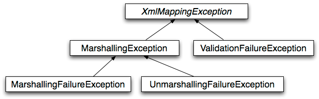

# 5. Marshalling XML by Using Object-XML Mappers

### **5.1. Introduction** 

<!-- tabs:start -->

#### ** English **

This chapter, describes Spring’s Object-XML Mapping support. Object-XML Mapping (O-X mapping for short) is the act of converting an XML document to and from an object. This conversion process is also known as XML Marshalling, or XML Serialization. This chapter uses these terms interchangeably.
#### ** Chinese **

本章介绍了Spring的对象-XML映射支持。对象-XML Mapping（简称O-X映射）是将XML文档转换为对象的行为。这个转换过程也被称为XML Marshalling，或XML序列化。本章互换使用这些术语。

<!-- tabs:end -->


<!-- tabs:start -->

#### ** English **

Within the field of O-X mapping, a marshaller is responsible for serializing an object (graph) to XML. In similar fashion, an unmarshaller deserializes the XML to an object graph. This XML can take the form of a DOM document, an input or output stream, or a SAX handler.
#### ** Chinese **

在O-X映射领域，marshaller负责将对象（图）序列化为XML。以类似的方式，unmarshaller将XML解序列化为对象图。这个XML可以采取DOM文档、输入或输出流或SAX处理程序的形式。

<!-- tabs:end -->


<!-- tabs:start -->

#### ** English **

Some of the benefits of using Spring for your O/X mapping needs are:
#### ** Chinese **

使用Spring来满足您的O/X映射需求的一些好处是。

<!-- tabs:end -->


### **5.1.1. Ease of configuration** 

<!-- tabs:start -->

#### ** English **

Spring’s bean factory makes it easy to configure marshallers, without needing to construct JAXB context, JiBX binding factories, and so on. You can configure the marshallers as you would any other bean in your application context. Additionally, XML namespace-based configuration is available for a number of marshallers, making the configuration even simpler.
#### ** Chinese **

Spring的Bean工厂使得配置marshallers变得非常容易，不需要构建JAXB上下文、JiBX绑定工厂等。你可以像配置应用程序上下文中的任何其他Bean一样配置marshallers。此外，基于 XML 命名空间的配置也适用于许多 marshallers，使配置更加简单。

<!-- tabs:end -->


### **5.1.2. Consistent Interfaces** 

<!-- tabs:start -->

#### ** English **

Spring’s O-X mapping operates through two global interfaces: [`Marshaller`](https://docs.spring.io/spring-framework/docs/5.2.6.RELEASE/javadoc-api/org/springframework/oxm/Marshaller.html) and [`Unmarshaller`](https://docs.spring.io/spring-framework/docs/5.2.6.RELEASE/javadoc-api/org/springframework/oxm/Unmarshaller.html). These abstractions let you switch O-X mapping frameworks with relative ease, with little or no change required on the classes that do the marshalling. This approach has the additional benefit of making it possible to do XML marshalling with a mix-and-match approach (for example, some marshalling performed using JAXB and some by XStream) in a non-intrusive fashion, letting you use the strength of each technology.
#### ** Chinese **

Spring的O-X映射通过两个全局接口运行。 `Marshaller`](https://docs.spring.io/spring-framework/docs/5.2.6.RELEASE/javadoc-api/org/springframework/oxm/Marshaller.html)和`Unmarshaller`](https://docs.spring.io/spring-framework/docs/5.2.6.RELEASE/javadoc-api/org/springframework/oxm/Unmarshaller.html)。这些抽象让你可以相对轻松地切换O-X映射框架，只需要对进行映射的类进行很少或不需要改变。这种方法还有一个额外的好处，那就是可以用混合和匹配的方法来进行XML映射（例如，有些映射使用JAXB，有些使用XStream），以一种非侵入性的方式来进行，让你可以利用每一种技术的优势。

<!-- tabs:end -->


### **5.1.3. Consistent Exception Hierarchy** 

<!-- tabs:start -->

#### ** English **

Spring provides a conversion from exceptions from the underlying O-X mapping tool to its own exception hierarchy with the `XmlMappingException` as the root exception. These runtime exceptions wrap the original exception so that no information is lost.
#### ** Chinese **Spring 提供了一个从底层 O-X 映射工具的异常到自己的异常层次结构的转换，其中 `XmlMappingException`作为根异常。 这些运行时异常将原始异常包裹起来，因此不会丢失任何信息。

<!-- tabs:end -->


### **5.2.** **`Marshaller`** ** and** **`Unmarshaller`** 

<!-- tabs:start -->

#### ** English **

As stated in the [introduction](https://docs.spring.io/spring/docs/5.2.6.RELEASE/spring-framework-reference/data-access.html#oxm-introduction), a marshaller serializes an object to XML, and an unmarshaller deserializes XML stream to an object. This section describes the two Spring interfaces used for this purpose.
#### ** Chinese **

正如[引言](https://docs.spring.io/spring/docs/5.2.6.RELEASE/spring-framework-reference/data-access.html#oxm-introduction)中所说，marshaller将对象序列化为XML，unmarshaller将XML流反序列化为对象。本节将介绍为此目的使用的两个Spring接口。

<!-- tabs:end -->


### **5.2.1. Understanding** **`Marshaller`** 

<!-- tabs:start -->

#### ** English **

Spring abstracts all marshalling operations behind the `org.springframework.oxm.Marshaller` interface, the main method of which follows:
#### ** Chinese **

Spring抽象出了`org.springframework.oxm.Marshaller`接口后面的所有拼接操作，其主要方法如下。

<!-- tabs:end -->


```java
public interface Marshaller {

    /**
     * Marshal the object graph with the given root into the provided Result.
     */
    void marshal(Object graph, Result result) throws XmlMappingException, IOException;
}
```

<!-- tabs:start -->

#### ** English **

The `Marshaller` interface has one main method, which marshals the given object to a given `javax.xml.transform.Result`. The result is a tagging interface that basically represents an XML output abstraction. Concrete implementations wrap various XML representations, as the following table indicates:
#### ** Chinese **

`Marshaller`接口有一个主要的方法，它将给定的对象转为给定的`javax.xml.transform.Result`。结果是一个标记接口，它基本上代表了一个XML输出抽象。具体的实现封装了各种XML表示方法，如下表所示。

<!-- tabs:end -->


Result implementation | Wraps XML representation 
-|-
DOMResult | org.w3c.dom.Node 
SAXResult | org.xml.sax.ContentHandler 
StreamResult | java.io.File, java.io.OutputStream, or java.io.Writer 


<!-- tabs:start -->

#### ** English **

Although the `marshal()` method accepts a plain object as its first parameter, most `Marshaller` implementations cannot handle arbitrary objects. Instead, an object class must be mapped in a mapping file, be marked with an annotation, be registered with the marshaller, or have a common base class. Refer to the later sections in this chapter to determine how your O-X technology manages this.
#### ** Chinese **

虽然`marshal()`方法接受一个纯对象作为其第一个参数，但大多数`Marshaller`实现不能处理任意对象。相反，一个对象类必须在映射文件中映射，用注释标记，在marshaller中注册，或者有一个通用的基类。请参阅本章后面的章节，以确定您的 O-X 技术如何管理这一点。

<!-- tabs:end -->


### **5.2.2. Understanding** **`Unmarshaller`** 

<!-- tabs:start -->

#### ** English **

Similar to the `Marshaller`, we have the `org.springframework.oxm.Unmarshaller` interface, which the following listing shows:
#### ** Chinese **

与`Marshaller`类似，我们有`org.springframework.oxm.Unmarshaller`接口，下面的列表显示了这个接口。

<!-- tabs:end -->


```java
public interface Unmarshaller {

    /**
     * Unmarshal the given provided Source into an object graph.
     */
    Object unmarshal(Source source) throws XmlMappingException, IOException;
}
```

<!-- tabs:start -->

#### ** English **

This interface also has one method, which reads from the given `javax.xml.transform.Source` (an XML input abstraction) and returns the object read. As with `Result`, `Source` is a tagging interface that has three concrete implementations. Each wraps a different XML representation, as the following table indicates:
#### ** Chinese **

这个接口也有一个方法，它从给定的`javax.xml.transform.Source`（一个XML输入抽象）中读取，并返回被读取的对象。与 `Result`一样，`Source`也是一个标记接口，它有三个具体的实现。如下表所示，每个接口都封装了不同的XML表示方式。

<!-- tabs:end -->


Source implementation | Wraps XML representation 
-|-
DOMSource | org.w3c.dom.Node 
SAXSource | org.xml.sax.InputSource, and org.xml.sax.XMLReader 
StreamSource | java.io.File, java.io.InputStream, or java.io.Reader 


<!-- tabs:start -->

#### ** English **

Even though there are two separate marshalling interfaces (`Marshaller` and `Unmarshaller`), all implementations in Spring-WS implement both in one class. This means that you can wire up one marshaller class and refer to it both as a marshaller and as an unmarshaller in your `applicationContext.xml`.
#### ** Chinese **

尽管有两个独立的marshaller接口（`Marshaller`和`Unmarshaller`），但Spring-WS中的所有实现都是在一个类中实现的。这意味着，你可以在`applicationContext.xml`中把它作为marshaller类和unmarshaller两个类来引用。

<!-- tabs:end -->


### **5.2.3. Understanding** **`XmlMappingException`** 

<!-- tabs:start -->

#### ** English **

Spring converts exceptions from the underlying O-X mapping tool to its own exception hierarchy with the `XmlMappingException` as the root exception. These runtime exceptions wrap the original exception so that no information will be lost.
#### ** Chinese **

Spring将来自底层O-X映射工具的异常转换为自己的异常层次结构，并将`XmlMappingException`作为根异常。这些运行时异常会对原始异常进行封装，因此不会丢失任何信息。

<!-- tabs:end -->


<!-- tabs:start -->

#### ** English **

Additionally, the `MarshallingFailureException` and `UnmarshallingFailureException` provide a distinction between marshalling and unmarshalling operations, even though the underlying O-X mapping tool does not do so.
#### ** Chinese **

此外，`MarshallingFailureException`和`UnmarshallingFailureException`提供了marshalling和unmarshalling操作的区别，尽管底层的O-X映射工具没有这样做。

<!-- tabs:end -->


<!-- tabs:start -->

#### ** English **

The O-X Mapping exception hierarchy is shown in the following figure:
#### ** Chinese **

O-X映射的异常层次结构如下图所示。

<!-- tabs:end -->




### **5.3. Using** **`Marshaller`** ** and** **`Unmarshaller`** 

<!-- tabs:start -->

#### ** English **

You can use Spring’s OXM for a wide variety of situations. In the following example, we use it to marshal the settings of a Spring-managed application as an XML file. In the following example, we use a simple JavaBean to represent the settings:
#### ** Chinese **

您可以将Spring的OXM用于各种情况。在下面的例子中，我们使用它来将Spring管理的应用程序的设置作为XML文件进行管理。在下面的例子中，我们使用一个简单的JavaBean来表示设置。

<!-- tabs:end -->


```java
public class Settings {

    private boolean fooEnabled;

    public boolean isFooEnabled() {
        return fooEnabled;
    }

    public void setFooEnabled(boolean fooEnabled) {
        this.fooEnabled = fooEnabled;
    }
}
```

<!-- tabs:start -->

#### ** English **

The application class uses this bean to store its settings. Besides a main method, the class has two methods: `saveSettings()` saves the settings bean to a file named `settings.xml`, and `loadSettings()` loads these settings again. The following `main()` method constructs a Spring application context and calls these two methods:
#### ** Chinese **

应用程序类使用这个Bean来存储它的设置。除了一个主方法，该类还有两个方法。 `saveSettings()`将设置bean保存到一个名为`settings.xml`的文件中，而`loadSettings()`再次加载这些设置。下面的 `main()`方法构造了一个Spring应用程序上下文，并调用这两个方法。

<!-- tabs:end -->


```java
import java.io.FileInputStream;
import java.io.FileOutputStream;
import java.io.IOException;
import javax.xml.transform.stream.StreamResult;
import javax.xml.transform.stream.StreamSource;
import org.springframework.context.ApplicationContext;
import org.springframework.context.support.ClassPathXmlApplicationContext;
import org.springframework.oxm.Marshaller;
import org.springframework.oxm.Unmarshaller;

public class Application {

    private static final String FILE_NAME = "settings.xml";
    private Settings settings = new Settings();
    private Marshaller marshaller;
    private Unmarshaller unmarshaller;

    public void setMarshaller(Marshaller marshaller) {
        this.marshaller = marshaller;
    }

    public void setUnmarshaller(Unmarshaller unmarshaller) {
        this.unmarshaller = unmarshaller;
    }

    public void saveSettings() throws IOException {
        try (FileOutputStream os = new FileOutputStream(FILE_NAME)) {
            this.marshaller.marshal(settings, new StreamResult(os));
        }
    }

    public void loadSettings() throws IOException {
        try (FileInputStream is = new FileInputStream(FILE_NAME)) {
            this.settings = (Settings) this.unmarshaller.unmarshal(new StreamSource(is));
        }
    }

    public static void main(String[] args) throws IOException {
        ApplicationContext appContext =
                new ClassPathXmlApplicationContext("applicationContext.xml");
        Application application = (Application) appContext.getBean("application");
        application.saveSettings();
        application.loadSettings();
    }
}
```

<!-- tabs:start -->

#### ** English **

The `Application` requires both a `marshaller` and an `unmarshaller` property to be set. We can do so by using the following `applicationContext.xml`:
#### ** Chinese **

`Application`需要设置`marshaller`和`unmarshaller`属性。我们可以通过使用下面的`applicationContext.xml`来实现。

<!-- tabs:end -->


```xml
<beans>
    <bean id="application" class="Application">
        <property name="marshaller" ref="xstreamMarshaller" />
        <property name="unmarshaller" ref="xstreamMarshaller" />
    </bean>
    <bean id="xstreamMarshaller" class="org.springframework.oxm.xstream.XStreamMarshaller"/>
</beans>
```

<!-- tabs:start -->

#### ** English **

This application context uses XStream, but we could have used any of the other marshaller instances described later in this chapter. Note that, by default, XStream does not require any further configuration, so the bean definition is rather simple. Also note that the `XStreamMarshaller` implements both `Marshaller` and `Unmarshaller`, so we can refer to the `xstreamMarshaller` bean in both the `marshaller` and `unmarshaller` property of the application.
#### ** Chinese **

这个应用上下文使用了XStream，但我们可以使用本章后面介绍的其他任何一个marshaller实例。注意，默认情况下，XStream不需要任何进一步的配置，所以Bean的定义相当简单。另外要注意的是，`XStreamMarshaller`同时实现了`Marshaller`和`Unmarshaller`，所以我们可以在应用程序的`marshaller`和`unmarshaller`属性中引用`xstreamMarshaller` bean。

<!-- tabs:end -->


<!-- tabs:start -->

#### ** English **

This sample application produces the following `settings.xml` file:
#### ** Chinese **

这个示例应用程序产生以下`settings.xml`文件。

<!-- tabs:end -->


```xml
<?xml version="1.0" encoding="UTF-8"?>
<settings foo-enabled="false"/>
```

### **5.4. XML Configuration Namespace** 

<!-- tabs:start -->

#### ** English **

You can configure marshallers more concisely by using tags from the OXM namespace. To make these tags available, you must first reference the appropriate schema in the preamble of the XML configuration file. The following example shows how to do so:
#### ** Chinese **

您可以通过使用 OXM 命名空间中的标记来更简洁地配置 marshallers。要使这些标记可用，您必须首先在 XML 配置文件的前言中引用相应的模式。下面的示例显示了如何做到这一点。

<!-- tabs:end -->


```xml
<?xml version="1.0" encoding="UTF-8"?>
<beans xmlns="http://www.springframework.org/schema/beans"
    xmlns:xsi="http://www.w3.org/2001/XMLSchema-instance"
    xmlns:oxm="http://www.springframework.org/schema/oxm" (1)
xsi:schemaLocation="http://www.springframework.org/schema/beans
  https://www.springframework.org/schema/beans/spring-beans.xsd
  http://www.springframework.org/schema/oxm https://www.springframework.org/schema/oxm/spring-oxm.xsd"> (2)
```

<!-- tabs:start -->

#### ** English **

(1)Reference the `oxm` schema.
#### ** Chinese **

(1)参考`oxm`模式。

<!-- tabs:end -->


<!-- tabs:start -->

#### ** English **

(2)Specify the `oxm` schema location.
#### ** Chinese **

(2)指定`oxm`模式的位置。

<!-- tabs:end -->


<!-- tabs:start -->

#### ** English **

The schema makes the following elements available:
#### ** Chinese **

该模式提供了以下要素：

<!-- tabs:end -->


<!-- tabs:start -->

#### ** English **

- [Ease of configuration](https://docs.spring.io/spring/docs/5.2.6.RELEASE/spring-framework-reference/data-access.html#oxm-ease-of-configuration)

- [Consistent Interfaces](https://docs.spring.io/spring/docs/5.2.6.RELEASE/spring-framework-reference/data-access.html#oxm-consistent-interfaces)

- [Consistent Exception Hierarchy](https://docs.spring.io/spring/docs/5.2.6.RELEASE/spring-framework-reference/data-access.html#oxm-consistent-exception-hierarchy)

- [`jaxb2-marshaller`](https://docs.spring.io/spring/docs/5.2.6.RELEASE/spring-framework-reference/data-access.html#oxm-jaxb2-xsd)

- [`jibx-marshaller`](https://docs.spring.io/spring/docs/5.2.6.RELEASE/spring-framework-reference/data-access.html#oxm-jibx-xsd)

#### ** Chinese **

- [易于配置](https://docs.spring.io/spring/docs/5.2.6.RELEASE/spring-framework-reference/data-access.html#oxm-ease-of-configuration)

- [一致的接口](https://docs.spring.io/spring/docs/5.2.6.RELEASE/spring-framework-reference/data-access.html#oxm-consistent-interfaces)

- [一致的例外层次结构](https://docs.spring.io/spring/docs/5.2.6.RELEASE/spring-framework-reference/data-access.html#oxm-consistent-exception-hierarchy)

- [`jaxb2-marshaller`](https://docs.spring.io/spring/docs/5.2.6.RELEASE/spring-framework-reference/data-access.html#oxm-jaxb2-xsd)

- [`jibx-marshaller`](https://docs.spring.io/spring/docs/5.2.6.RELEASE/spring-framework-reference/data-access.html#oxm-jibx-xsd)


<!-- tabs:end -->

<!-- tabs:start -->

#### ** English **

Each tag is explained in its respective marshaller’s section. As an example, though, the configuration of a JAXB2 marshaller might resemble the following:
#### ** Chinese **

每个标签在其各自的 marshaller 部分中都有解释。但作为一个例子，JAXB2 marshaller的配置可能类似于下面的配置。

<!-- tabs:end -->


```xml
<oxm:jaxb2-marshaller id="marshaller" contextPath="org.springframework.ws.samples.airline.schema"/>
```

### **5.5. JAXB** 

<!-- tabs:start -->

#### ** English **

The JAXB binding compiler translates a W3C XML Schema into one or more Java classes, a `jaxb.properties` file, and possibly some resource files. JAXB also offers a way to generate a schema from annotated Java classes.
#### ** Chinese **

JAXB绑定编译器将W3C XML Schema翻译成一个或多个Java类、一个`jaxb.properties`文件，可能还有一些资源文件。JAXB还提供了一种从注释的Java类中生成模式的方法。

<!-- tabs:end -->


<!-- tabs:start -->

#### ** English **

Spring supports the JAXB 2.0 API as XML marshalling strategies, following the `Marshaller` and `Unmarshaller` interfaces described in [`Marshaller`](https://docs.spring.io/spring/docs/5.2.6.RELEASE/spring-framework-reference/data-access.html#oxm-marshaller-unmarshaller)[ and ](https://docs.spring.io/spring/docs/5.2.6.RELEASE/spring-framework-reference/data-access.html#oxm-marshaller-unmarshaller)[`Unmarshaller`](https://docs.spring.io/spring/docs/5.2.6.RELEASE/spring-framework-reference/data-access.html#oxm-marshaller-unmarshaller). The corresponding integration classes reside in the `org.springframework.oxm.jaxb` package.
#### ** Chinese **

Spring 支持 JAXB 2.0 API 作为 XML 嫁接策略，遵循 `Marshaller`和 `Unmarshaller`接口，具体描述在 [`Marshaller`](https://docs.spring.io/spring/docs/5.2.6.RELEASE/spring-framework-reference/data-access.html#oxm-marshaller-unmarshaller)[ 和 ](https://docs.spring.io/spring/docs/5.2.6.RELEASE/spring-framework-reference/data-access.html#oxm-marshaller-unmarshaller)[`Unmarshaller`](https://docs.spring.io/spring/docs/5.2.6.RELEASE/spring-framework-reference/data-access.html#oxm-marshaller-unmarshaller)中。相应的集成类存在于 `org.springframework.oxm.jaxb`包中。

<!-- tabs:end -->


### **5.5.1. Using** **`Jaxb2Marshaller`** 

<!-- tabs:start -->

#### ** English **

The `Jaxb2Marshaller` class implements both of Spring’s `Marshaller` and `Unmarshaller` interfaces. It requires a context path to operate. You can set the context path by setting the `contextPath` property. The context path is a list of colon-separated Java package names that contain schema derived classes. It also offers a `classesToBeBound` property, which allows you to set an array of classes to be supported by the marshaller. Schema validation is performed by specifying one or more schema resources to the bean, as the following example shows:
#### ** Chinese **

`Jaxb2Marshaller`类实现了Spring的`Marshaller`和`Unmarshaller`接口。它需要一个上下文路径来操作。您可以通过设置`contextPath`属性来设置上下文路径。上下文路径是一个由冒号分隔的Java包名组成的列表，其中包含模式派生类。它还提供了一个`classesToBeBound`属性，它允许您设置一个数组类的数组来支持marshaller。模式验证是通过向Bean指定一个或多个模式资源来执行的，如下例所示。

<!-- tabs:end -->


```xml
<beans>
    <bean id="jaxb2Marshaller" class="org.springframework.oxm.jaxb.Jaxb2Marshaller">
        <property name="classesToBeBound">
            <list>
                <value>org.springframework.oxm.jaxb.Flight</value>
                <value>org.springframework.oxm.jaxb.Flights</value>
            </list>
        </property>
        <property name="schema" value="classpath:org/springframework/oxm/schema.xsd"/>
    </bean>

    ...

</beans>
```

### **XML Configuration Namespace** 

<!-- tabs:start -->

#### ** English **

The `jaxb2-marshaller` element configures a `org.springframework.oxm.jaxb.Jaxb2Marshaller`, as the following example shows:
#### ** Chinese **

`jaxb2-marshaller`元素配置了一个`org.springframework.oxm.jaxb.Jaxb2Marshaller`，如下图所示。

<!-- tabs:end -->


```xml
<oxm:jaxb2-marshaller id="marshaller" contextPath="org.springframework.ws.samples.airline.schema"/>
```

<!-- tabs:start -->

#### ** English **

Alternatively, you can provide the list of classes to bind to the marshaller by using the `class-to-be-bound` child element:
#### ** Chinese **

另外，您还可以通过使用`class-to-be-bound`子元素提供要绑定到marshaller的类列表。

<!-- tabs:end -->


```xml
<oxm:jaxb2-marshaller id="marshaller">
    <oxm:class-to-be-bound name="org.springframework.ws.samples.airline.schema.Airport"/>
    <oxm:class-to-be-bound name="org.springframework.ws.samples.airline.schema.Flight"/>
    ...
</oxm:jaxb2-marshaller>
```

<!-- tabs:start -->

#### ** English **

The following table describes the available attributes:
#### ** Chinese **

下表描述了可用的属性。

<!-- tabs:end -->


Attribute | Description | Required 
-|-|-
id | The ID of the marshaller | No 
contextPath | The JAXB Context path | No 


### **5.6. JiBX** 

<!-- tabs:start -->

#### ** English **

The JiBX framework offers a solution similar to that which Hibernate provides for ORM: A binding definition defines the rules for how your Java objects are converted to or from XML. After preparing the binding and compiling the classes, a JiBX binding compiler enhances the class files and adds code to handle converting instances of the classes from or to XML.
#### ** Chinese **

JiBX框架提供了类似于Hibernate为ORM提供的解决方案。绑定定义定义定义了如何将Java对象转换为或从XML中转换的规则。在准备好绑定和编译类之后，JiBX绑定编译器会增强类文件，并添加代码来处理将类的实例从XML转换为XML。

<!-- tabs:end -->


<!-- tabs:start -->

#### ** English **

For more information on JiBX, see the [JiBX web site](http://jibx.sourceforge.net/). The Spring integration classes reside in the `org.springframework.oxm.jibx` package.
#### ** Chinese **

有关 JiBX 的更多信息，请参阅 [JiBX 网站](http://jibx.sourceforge.net/)。Spring 集成类存在于 `org.springframework.oxm.jibx`包中。

<!-- tabs:end -->


### **5.6.1. Using** **`JibxMarshaller`** 

<!-- tabs:start -->

#### ** English **

The `JibxMarshaller` class implements both the `Marshaller` and `Unmarshaller` interface. To operate, it requires the name of the class to marshal in, which you can set using the `targetClass` property. Optionally, you can set the binding name by setting the `bindingName` property. In the following example, we bind the `Flights` class:
#### ** Chinese **

`JibxMarshaller`类同时实现了`Marshaller`和`Unmarshaller`接口。要运行，它需要在类的名称中进行调度，你可以使用`targetClass`属性来设置。另外，你可以通过设置`bindingName`属性来设置绑定名称。在下面的例子中，我们绑定了`Flights`类。

<!-- tabs:end -->


```xml
<beans>
    <bean id="jibxFlightsMarshaller" class="org.springframework.oxm.jibx.JibxMarshaller">
        <property name="targetClass">org.springframework.oxm.jibx.Flights</property>
    </bean>
    ...
</beans>
```

<!-- tabs:start -->

#### ** English **

A `JibxMarshaller` is configured for a single class. If you want to marshal multiple classes, you have to configure multiple `JibxMarshaller` instances with different `targetClass` property values.
#### ** Chinese **

一个`JibxMarshaller`是为一个类配置的。如果你想管理多个类，你必须配置多个 `JibxMarshaller` 实例，并带有不同的 `targetClass` 属性值。

<!-- tabs:end -->


### **XML Configuration Namespace** 

<!-- tabs:start -->

#### ** English **

The `jibx-marshaller` tag configures a `org.springframework.oxm.jibx.JibxMarshaller`, as the following example shows:
#### ** Chinese **

`jibx-marshaller`标签配置了一个`org.springframework.oxm.jibx.JibxMarshaller`，如下例所示。

<!-- tabs:end -->


```xml
<oxm:jibx-marshaller id="marshaller" target-class="org.springframework.ws.samples.airline.schema.Flight"/>
```

<!-- tabs:start -->

#### ** English **

The following table describes the available attributes:
#### ** Chinese **

下表描述了可用的属性。

<!-- tabs:end -->


Attribute | Description | Required 
-|-|-
id | The ID of the marshaller | No 
target-class | The target class for this marshaller | Yes 
bindingName | The binding name used by this marshaller | No 


### **5.7. XStream** 

<!-- tabs:start -->

#### ** English **

XStream is a simple library to serialize objects to XML and back again. It does not require any mapping and generates clean XML.
#### ** Chinese **

XStream是一个简单的库，它可以将对象序列化为XML，然后再回到XML。它不需要任何映射，并生成干净的XML。

<!-- tabs:end -->


<!-- tabs:start -->

#### ** English **

For more information on XStream, see the [XStream web site](https://x-stream.github.io/). The Spring integration classes reside in the `org.springframework.oxm.xstream` package.
#### ** Chinese **

有关 XStream 的更多信息，请参见 [XStream 网站](https://x-stream.github.io/)。Spring集成类存在于`org.springframework.oxm.xstream`包中。

<!-- tabs:end -->


### **5.7.1. Using** **`XStreamMarshaller`** 

<!-- tabs:start -->

#### ** English **

The `XStreamMarshaller` does not require any configuration and can be configured in an application context directly. To further customize the XML, you can set an alias map, which consists of string aliases mapped to classes, as the following example shows:
#### ** Chinese **

`XStreamMarshaller`不需要任何配置，可以直接在应用程序上下文中配置。为了进一步定制XML，你可以设置一个别名映射，它由映射到类的字符串别名组成，如下例所示。

<!-- tabs:end -->


```xml
<beans>
    <bean id="xstreamMarshaller" class="org.springframework.oxm.xstream.XStreamMarshaller">
        <property name="aliases">
            <props>
                <prop key="Flight">org.springframework.oxm.xstream.Flight</prop>
            </props>
        </property>
    </bean>
    ...
</beans>
```

<!-- tabs:start -->

#### ** English **

By default, XStream lets arbitrary classes be unmarshalled, which can lead to unsafe Java serialization effects. As such, we do not recommend using the `XStreamMarshaller` to unmarshal XML from external sources (that is, the Web), as this can result in security vulnerabilities.
#### ** Chinese **

默认情况下，XStream 允许任意类被取消marshaller，这可能导致不安全的Java序列化效果。因此，我们不建议使用`XStreamMarshaller`来解除来自外部源（即Web）的XML的marshaller，因为这会导致安全漏洞。

<!-- tabs:end -->


<!-- tabs:start -->

#### ** English **

If you choose to use the `XStreamMarshaller` to unmarshal XML from an external source, set the `supportedClasses` property on the `XStreamMarshaller`, as the following example shows:
#### ** Chinese **

如果您选择使用`XStreamMarshaller`来解读来自外部源的XML，请在`XStreamMarshaller`上设置`supportedClasses`属性，如下例所示。

<!-- tabs:end -->


```xml
<bean id="xstreamMarshaller" class="org.springframework.oxm.xstream.XStreamMarshaller">
    <property name="supportedClasses" value="org.springframework.oxm.xstream.Flight"/>
    ...
</bean>
```

<!-- tabs:start -->

#### ** English **

Doing so ensures that only the registered classes are eligible for unmarshalling.
#### ** Chinese **

这样做可以确保只有注册的班级才有资格进行解绑。

<!-- tabs:end -->


<!-- tabs:start -->

#### ** English **

Additionally, you can register [custom converters](https://docs.spring.io/spring-framework/docs/5.2.6.RELEASE/javadoc-api/org/springframework/oxm/xstream/XStreamMarshaller.html#setConverters(com.thoughtworks.xstream.converters.ConverterMatcher%E2%80%A6%E2%80%8B)) to make sure that only your supported classes can be unmarshalled. You might want to add a `CatchAllConverter` as the last converter in the list, in addition to converters that explicitly support the domain classes that should be supported. As a result, default XStream converters with lower priorities and possible security vulnerabilities do not get invoked.
#### ** Chinese **

此外，你可以注册[自定义转换器](https://docs.spring.io/spring-framework/docs/5.2.6.RELEASE/javadoc-api/org/springframework/oxm/xstream/XStreamMarshaller.html#setConverters(com.thoughtworks.xstream.converter.converterMatcher%E2%80%A6%E2%80%8B))，以确保只有你支持的类可以被解压。你可能想在列表中添加`CatchAllConverter`作为最后一个转换器，此外，还可以添加一个`CatchAllConverter`作为最后一个转换器，此外，还可以添加显式支持应该支持的域类的转换器。因此，具有较低优先级和可能存在安全漏洞的默认 XStream 转换器不会被调用。

<!-- tabs:end -->


<!-- tabs:start -->

#### ** English **

Note that XStream is an XML serialization library, not a data binding library. Therefore, it has limited namespace support. As a result, it is rather unsuitable for usage within Web services.
#### ** Chinese **

注意，XStream是一个XML序列化库，而不是数据绑定库。因此，它对命名空间的支持是有限的。因此，它相当不适合在 Web 服务中使用。

<!-- tabs:end -->


[下一章](Spring-Framework-5.2.6.RELEASE/Data%20Access/6.%20Appendix.md)


[回目录](Spring-Framework-5.2.6.RELEASE/summary.md)

[回首页](/README)
