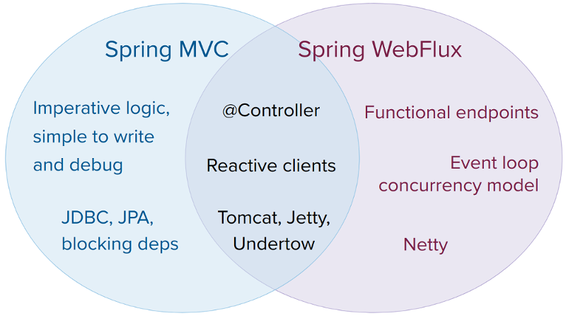

# 1. Spring WebFlux

<!-- tabs:start -->

#### ** English **

The original web framework included in the Spring Framework, Spring Web MVC, was purpose-built for the Servlet API and Servlet containers. The reactive-stack web framework, Spring WebFlux, was added later in version 5.0. It is fully non-blocking, supports [Reactive Streams](https://www.reactive-streams.org/) back pressure, and runs on such servers as Netty, Undertow, and Servlet 3.1+ containers.
#### ** Chinese **

Spring框架中包含的原始Web框架Spring Web MVC，是专门为Servlet API和Servlet容器设计的。反应堆栈式的Web框架Spring WebFlux是后来在5.0版本中加入的。它完全无阻塞，支持[Reactive Streams](https://www.reactive-streams.org/)背压，并在Netty、Undertow和Servlet 3.1+容器等服务器上运行。

<!-- tabs:end -->

<!-- tabs:start -->

#### ** English **

Both web frameworks mirror the names of their source modules ([spring-webmvc](https://github.com/spring-projects/spring-framework/tree/master/spring-webmvc) and [spring-webflux](https://github.com/spring-projects/spring-framework/tree/master/spring-webflux)) and co-exist side by side in the Spring Framework. Each module is optional. Applications can use one or the other module or, in some cases, both — for example, Spring MVC controllers with the reactive `WebClient`.
#### ** Chinese **

这两个Web框架都镜像了它们的源模块名称([[spring-webmvc](https://github.com/spring-projects/spring-framework/tree/master/spring-webmvc)和[spring-webflux](https://github.com/spring-projects/spring-framework/tree/master/spring-webflux))，并在Spring框架中并存。每个模块都是可选的。应用程序可以使用其中一个或另一个模块，或者在某些情况下，可以同时使用两个模块--例如，Spring MVC控制器与响应式`WebClient`。

<!-- tabs:end -->

### **1.1. Overview** 

<!-- tabs:start -->

#### ** English **

Why was Spring WebFlux created?
#### ** Chinese **

为什么要创建Spring WebFlux？

<!-- tabs:end -->

<!-- tabs:start -->

#### ** English **

Part of the answer is the need for a non-blocking web stack to handle concurrency with a small number of threads and scale with fewer hardware resources. Servlet 3.1 did provide an API for non-blocking I/O. However, using it leads away from the rest of the Servlet API, where contracts are synchronous (`Filter`, `Servlet`) or blocking (`getParameter`, `getPart`). This was the motivation for a new common API to serve as a foundation across any non-blocking runtime. That is important because of servers (such as Netty) that are well-established in the async, non-blocking space.
#### ** Chinese **

部分答案是需要一个非阻塞的Web堆栈，以少量线程处理并发，并以较少的硬件资源进行扩展。Servlet 3.1确实提供了一个非阻塞I/O的API。然而，使用它会导致远离Servlet API的其他部分，在这些部分中，契约是同步的（`Filter`、`Servlet`）或阻塞的（`getParameter`、`getPart`）。这是一个新的通用API的动机，它是作为任何非阻塞运行时的基础。这一点很重要，因为服务器（如Netty）在Async、非阻塞空间中已经很成熟了。

<!-- tabs:end -->

<!-- tabs:start -->

#### ** English **

The other part of the answer is functional programming. Much as the addition of annotations in Java 5 created opportunities (such as annotated REST controllers or unit tests), the addition of lambda expressions in Java 8 created opportunities for functional APIs in Java. This is a boon for non-blocking applications and continuation-style APIs (as popularized by `CompletableFuture` and [ReactiveX](http://reactivex.io/)) that allow declarative composition of asynchronous logic. At the programming-model level, Java 8 enabled Spring WebFlux to offer functional web endpoints alongside annotated controllers.
#### ** Chinese **

答案的另一部分是功能编程。就像Java 5中的注释的加入为Java 5创造了机会一样（比如注释的REST控制器或单元测试），Java 8中的lambda表达式的加入为Java中的功能API创造了机会。这对非阻塞式应用和延续式API（如`CompletableFuture`和[ReactiveX](http://reactivex.io/)所普及的那样）来说是一个福音，它允许异步逻辑的声明式组成。在编程模型层面，Java 8使Spring WebFlux能够提供功能化的Web端点和注释控制器。

<!-- tabs:end -->

### **1.1.1. Define “Reactive”** 

<!-- tabs:start -->

#### ** English **

We touched on “non-blocking” and “functional” but what does reactive mean?
#### ** Chinese **

我们触及到了 "非阻塞性 "和 "功能性"，但反应性是什么意思？

<!-- tabs:end -->

<!-- tabs:start -->

#### ** English **

The term, “reactive,” refers to programming models that are built around reacting to change — network components reacting to I/O events, UI controllers reacting to mouse events, and others. In that sense, non-blocking is reactive, because, instead of being blocked, we are now in the mode of reacting to notifications as operations complete or data becomes available.
#### ** Chinese **

所谓 "反应式"，指的是围绕着对变化做出反应的编程模型--网络组件对I/O事件做出反应，UI控制器对鼠标事件做出反应等等。从这个意义上说，非阻塞是反应式的，因为我们现在不是被阻塞，而是在操作完成或数据变得可用时对通知做出反应的模式。

<!-- tabs:end -->

<!-- tabs:start -->

#### ** English **

There is also another important mechanism that we on the Spring team associate with “reactive” and that is non-blocking back pressure. In synchronous, imperative code, blocking calls serve as a natural form of back pressure that forces the caller to wait. In non-blocking code, it becomes important to control the rate of events so that a fast producer does not overwhelm its destination.
#### ** Chinese **

还有另一个重要的机制，我们Spring团队的人将其与 "反应式 "联系在一起，那就是非阻塞回压。在同步的、 imperative 代码中，阻塞调用作为一种自然形式的回压，迫使调用者等待。在非阻塞代码中，控制事件的发生率就变得非常重要，这样快速的生产者就不会压倒它的目的地。

<!-- tabs:end -->

<!-- tabs:start -->

#### ** English **

Reactive Streams is a [small spec](https://github.com/reactive-streams/reactive-streams-jvm/blob/master/README.md#specification) (also [adopted](https://docs.oracle.com/javase/9/docs/api/java/util/concurrent/Flow.html) in Java 9) that defines the interaction between asynchronous components with back pressure. For example a data repository (acting as [Publisher](https://www.reactive-streams.org/reactive-streams-1.0.1-javadoc/org/reactivestreams/Publisher.html)) can produce data that an HTTP server (acting as [Subscriber](https://www.reactive-streams.org/reactive-streams-1.0.1-javadoc/org/reactivestreams/Subscriber.html)) can then write to the response. The main purpose of Reactive Streams is to let the subscriber control how quickly or how slowly the publisher produces data.
#### ** Chinese **

Reactive Streams是一个[小规范](https://github.com/reactive-streams/reactive-streams-jvm/blob/master/README.md#specification)(也是Java 9中的[采用](https://docs.oracle.com/javase/9/docs/api/java/util/concurrent/Flow.html))，它定义了异步组件之间的交互，并带有背压。例如一个数据存储库(作为[Publisher](https://www.reactive-streams.org/reactive-streams-1.0.1-javadoc/org/reactivestreams/Publisher.html))可以产生数据，然后HTTP服务器(作为[Subscriber](https://www.reactive-streams.org/reactive-streams-1.0.1-javadoc/org/reactivestreams/Subscriber.html))可以将数据写入响应。Reactive Streams的主要目的是让订阅者控制发布者产生数据的速度或速度较慢。

<!-- tabs:end -->

<!-- tabs:start -->

#### ** English **

**Common question: what if a publisher cannot slow down?** The purpose of Reactive Streams is only to establish the mechanism and a boundary. If a publisher cannot slow down, it has to decide whether to buffer, drop, or fail.
#### ** Chinese **

**常见的问题：如果发布者不能降速怎么办？ **反应流的目的只是建立机制和边界。如果发布者不能慢下来，它必须决定是缓冲、丢弃、还是失败。

<!-- tabs:end -->

### **1.1.2. Reactive API** 

<!-- tabs:start -->

#### ** English **

Reactive Streams plays an important role for interoperability. It is of interest to libraries and infrastructure components but less useful as an application API, because it is too low-level. Applications need a higher-level and richer, functional API to compose async logic — similar to the Java 8 `Stream` API but not only for collections. This is the role that reactive libraries play.
#### ** Chinese **

Reactive Streams在互操作性方面发挥着重要作用。它对库和基础架构组件很有意义，但作为应用程序的API却不那么有用，因为它太低级了。应用程序需要一个更高级别的、更丰富的、功能更强的API来组成异步逻辑--类似于Java 8 `Stream` API，但不只是针对集合。这就是反应式库所扮演的角色。

<!-- tabs:end -->

<!-- tabs:start -->

#### ** English **

[Reactor](https://github.com/reactor/reactor) is the reactive library of choice for Spring WebFlux. It provides the [`Mono`](https://projectreactor.io/docs/core/release/api/reactor/core/publisher/Mono.html) and [`Flux`](https://projectreactor.io/docs/core/release/api/reactor/core/publisher/Flux.html) API types to work on data sequences of 0..1 (`Mono`) and 0..N (`Flux`) through a rich set of operators aligned with the ReactiveX [vocabulary of operators](http://reactivex.io/documentation/operators.html). Reactor is a Reactive Streams library and, therefore, all of its operators support non-blocking back pressure. Reactor has a strong focus on server-side Java. It is developed in close collaboration with Spring.
#### ** Chinese **

Reactor](https://github.com/reactor/reactor)是Spring WebFlux的首选反应式库。它提供了 [`Mono`](https://projectreactor.io/docs/core/release/api/reactor/core/publisher/Mono.html)和[`Flux`](https://projectreactor.io/docs/core/release/api/reactor/core/publisher/Flux.html) API类型，通过与ReactiveX[运算符词汇库](http://reactivex.io/documentation/operators.html)对齐的丰富的运算符集，可以在0.1(`Mono`)和0.N(`Flux`)的数据序列上工作。Reactor是一个Reactive Streams库，因此，它的所有操作符都支持无阻塞的反压。Reactor非常注重服务器端Java。它是与Spring紧密合作开发的。

<!-- tabs:end -->

<!-- tabs:start -->

#### ** English **

WebFlux requires Reactor as a core dependency but it is interoperable with other reactive libraries via Reactive Streams. As a general rule, a WebFlux API accepts a plain `Publisher` as input, adapts it to a Reactor type internally, uses that, and returns either a `Flux` or a `Mono` as output. So, you can pass any `Publisher` as input and you can apply operations on the output, but you need to adapt the output for use with another reactive library. Whenever feasible (for example, annotated controllers), WebFlux adapts transparently to the use of RxJava or another reactive library. See [Reactive Libraries](https://docs.spring.io/spring/docs/5.2.6.RELEASE/spring-framework-reference/web-reactive.html#webflux-reactive-libraries) for more details.
#### ** Chinese **

WebFlux 需要 Reactor 作为核心依赖，但它可以通过 Reactive Streams 与其他反应式库互操作。作为一般规则，WebFlux API 接受一个普通的 `Publisher` 作为输入，在内部将其适配为 Reactor 类型，并使用该类型，然后返回 `Flux` 或 `Mono` 作为输出。因此，你可以传递任何`Publisher`作为输入，你可以对输出进行操作，但你需要对输出进行适配，以便与另一个反应式库一起使用。只要可行（例如，注释控制器），WebFlux会透明地适应RxJava或另一个反应式库的使用。有关详细信息，请参见 [Reactive Libraries](https://docs.spring.io/spring/docs/5.2.6.RELEASE/spring-framework-reference/web-reactive.html#webflux-reactive-libraries)。

<!-- tabs:end -->

<!-- tabs:start -->

#### ** English **

In addition to Reactive APIs, WebFlux can also be used with [Coroutines](https://docs.spring.io/spring/docs/5.2.6.RELEASE/spring-framework-reference/languages.html#coroutines) APIs in Kotlin which provides a more imperative style of programming. The following Kotlin code samples will be provided with Coroutines APIs.
#### ** Chinese **

除了Reactive API，WebFlux还可以与Kotlin中的[Coroutines](https://docs.spring.io/spring/docs/5.2.6.RELEASE/spring-framework-reference/languages.html#coroutines)API一起使用，后者提供了更多的必须式编程风格。下面的Kotlin代码示例将提供Coroutines APIs。

<!-- tabs:end -->

### **1.1.3. Programming Models** 

<!-- tabs:start -->

#### ** English **

The `spring-web` module contains the reactive foundation that underlies Spring WebFlux, including HTTP abstractions, Reactive Streams [adapters](https://docs.spring.io/spring/docs/5.2.6.RELEASE/spring-framework-reference/web-reactive.html#webflux-httphandler) for supported servers, [codecs](https://docs.spring.io/spring/docs/5.2.6.RELEASE/spring-framework-reference/web-reactive.html#webflux-codecs), and a core [`WebHandler`](https://docs.spring.io/spring/docs/5.2.6.RELEASE/spring-framework-reference/web-reactive.html#webflux-web-handler-api)[ API](https://docs.spring.io/spring/docs/5.2.6.RELEASE/spring-framework-reference/web-reactive.html#webflux-web-handler-api) comparable to the Servlet API but with non-blocking contracts.
#### ** Chinese **

`spring-web`模块包含支持Spring WebFlux的反应式基础，包括HTTP 抽象、支持服务器的反应式流[适配器](https://docs.spring.io/spring/docs/5.2.6.RELEASE/spring-framework-reference/web-reactive.html#webflux-httphandler)、[编解码器](https://docs.spring.io/spring/docs/5.2.6.RELEASE/spring-framework-reference/web-reactive.html#webflux-codecs)，以及与Servlet API类似的核心[`WebHandler`](https://docs.spring.io/spring/docs/5.2.6.RELEASE/spring-framework-reference/web-reactive.html#webflux-web-handler-api)[API](https://docs.spring.io/spring/docs/5.2.6.RELEASE/spring-framework-reference/web-reactive.html#webflux-web-handler-api)，但具有非阻塞合约。

<!-- tabs:end -->

<!-- tabs:start -->

#### ** English **

On that foundation, Spring WebFlux provides a choice of two programming models:
#### ** Chinese **

在此基础上，Spring WebFlux提供了两种编程模式可供选择。

<!-- tabs:end -->

### **1.1.4. Applicability** 

<!-- tabs:start -->

#### ** English **

Spring MVC or WebFlux?
#### ** Chinese **

Spring MVC还是WebFlux？

<!-- tabs:end -->

<!-- tabs:start -->

#### ** English **

A natural question to ask but one that sets up an unsound dichotomy. Actually, both work together to expand the range of available options. The two are designed for continuity and consistency with each other, they are available side by side, and feedback from each side benefits both sides. The following diagram shows how the two relate, what they have in common, and what each supports uniquely:
#### ** Chinese **

这是一个自然而然的问题，但却提出了一个不靠谱的二分法。其实，二者共同作用是为了扩大可供选择的范围。两者在设计上是相辅相成的，二者是并肩而行的，双方的反馈对双方都有好处。下图展示了二者之间的关系，它们有什么共同点，以及各自支持的独特之处。

<!-- tabs:end -->

<!-- tabs:start -->

#### ** English **

We suggest that you consider the following specific points:
#### ** Chinese **

建议大家具体考虑以下几点。

<!-- tabs:end -->

### **1.1.5. Servers** 

<!-- tabs:start -->

#### ** English **

Spring WebFlux is supported on Tomcat, Jetty, Servlet 3.1+ containers, as well as on non-Servlet runtimes such as Netty and Undertow. All servers are adapted to a low-level, [common API](https://docs.spring.io/spring/docs/5.2.6.RELEASE/spring-framework-reference/web-reactive.html#webflux-httphandler) so that higher-level [programming models](https://docs.spring.io/spring/docs/5.2.6.RELEASE/spring-framework-reference/web-reactive.html#webflux-programming-models) can be supported across servers.
#### ** Chinese **

Spring WebFlux支持Tomcat、Jetty、Servlet 3.1+容器，以及Netty和Undertow等非Servlet运行时，也支持Spring WebFlux。所有服务器都适应于一个低级的[通用API](https://docs.spring.io/spring/docs/5.2.6.RELEASE/spring-framework-reference/web-reactive.html#webflux-httphandler)，因此可以跨服务器支持更高级别的[编程模型](https://docs.spring.io/spring/docs/5.2.6.RELEASE/spring-framework-reference/web-reactive.html#webflux-programming-models)。

<!-- tabs:end -->

<!-- tabs:start -->

#### ** English **

Spring WebFlux does not have built-in support to start or stop a server. However, it is easy to [assemble](https://docs.spring.io/spring/docs/5.2.6.RELEASE/spring-framework-reference/web-reactive.html#webflux-web-handler-api) an application from Spring configuration and [WebFlux infrastructure](https://docs.spring.io/spring/docs/5.2.6.RELEASE/spring-framework-reference/web-reactive.html#webflux-config) and [run it](https://docs.spring.io/spring/docs/5.2.6.RELEASE/spring-framework-reference/web-reactive.html#webflux-httphandler) with a few lines of code.
#### ** Chinese **

Spring WebFlux没有内置支持启动或停止服务器。但是，只需几行代码就可以轻松地从Spring配置和[WebFlux基础架构](https://docs.spring.io/spring/docs/5.2.6.RELEASE/spring-framework-reference/web-reactive.html#webflux-web-handler-api)中[组装](https://docs.spring.io/spring/docs/5.2.6.RELEASE/spring-framework-reference/web-reactive.html#webflux-web-handler-api)一个应用程序，并[运行它](https://docs.spring.io/spring/docs/5.2.6.RELEASE/spring-framework-reference/web-reactive.html#webflux-httphandler)。

<!-- tabs:end -->

<!-- tabs:start -->

#### ** English **

Spring Boot has a WebFlux starter that automates these steps. By default, the starter uses Netty, but it is easy to switch to Tomcat, Jetty, or Undertow by changing your Maven or Gradle dependencies. Spring Boot defaults to Netty, because it is more widely used in the asynchronous, non-blocking space and lets a client and a server share resources.
#### ** Chinese **

Spring Boot 有一个 WebFlux 启动器，可以自动完成这些步骤。默认情况下，启动器使用 Netty，但通过改变 Maven 或 Gradle 依赖关系，很容易切换到 Tomcat、Jetty 或 Undertow。Spring Boot默认使用Netty，因为它在异步、非阻塞空间中使用得更广泛，可以让客户端和服务器共享资源。

<!-- tabs:end -->

<!-- tabs:start -->

#### ** English **

Tomcat and Jetty can be used with both Spring MVC and WebFlux. Keep in mind, however, that the way they are used is very different. Spring MVC relies on Servlet blocking I/O and lets applications use the Servlet API directly if they need to. Spring WebFlux relies on Servlet 3.1 non-blocking I/O and uses the Servlet API behind a low-level adapter. It is not exposed for direct use.
#### ** Chinese **

Tomcat和Jetty可以与Spring MVC和WebFlux同时使用。但是请记住，它们的使用方式是非常不同的。Spring MVC依赖于Servlet阻止I/O，如果需要，应用程序可以直接使用Servlet API。Spring WebFlux依赖于Servlet 3.1的非阻塞I/O，并在低级适配器后面使用Servlet API。它不暴露于直接使用。

<!-- tabs:end -->

<!-- tabs:start -->

#### ** English **

For Undertow, Spring WebFlux uses Undertow APIs directly without the Servlet API.
#### ** Chinese **

对于Undertow，Spring WebFlux直接使用Undertow API，而不使用Servlet API。

<!-- tabs:end -->

### **1.1.6. Performance** 

<!-- tabs:start -->

#### ** English **

Performance has many characteristics and meanings. Reactive and non-blocking generally do not make applications run faster. They can, in some cases, (for example, if using the `WebClient` to execute remote calls in parallel). On the whole, it requires more work to do things the non-blocking way and that can slightly increase the required processing time.
#### ** Chinese **

性能有很多特点和含义。反应式和非阻塞一般不会使应用程序运行得更快。在某些情况下，它们可以（例如，如果使用`WebClient`并行执行远程调用）。总的来说，用非阻塞的方式做事情需要更多的工作，这可能会稍微增加所需的处理时间。

<!-- tabs:end -->

<!-- tabs:start -->

#### ** English **

The key expected benefit of reactive and non-blocking is the ability to scale with a small, fixed number of threads and less memory. That makes applications more resilient under load, because they scale in a more predictable way. In order to observe those benefits, however, you need to have some latency (including a mix of slow and unpredictable network I/O). That is where the reactive stack begins to show its strengths, and the differences can be dramatic.
#### ** Chinese **

反应式和非阻塞的关键预期好处是能够以较小的固定线程数和较少的内存进行扩展。这使得应用程序在负载下更有弹性，因为它们以更可预测的方式进行扩展。然而，为了观察到这些好处，你需要有一定的延迟（包括缓慢和不可预测的网络I/O混合）。这就是反应式堆栈开始显示其优势的地方，而且差异可能是巨大的。

<!-- tabs:end -->

### **1.1.7. Concurrency Model** 

<!-- tabs:start -->

#### ** English **

Both Spring MVC and Spring WebFlux support annotated controllers, but there is a key difference in the concurrency model and the default assumptions for blocking and threads.
#### ** Chinese **

Spring MVC和Spring WebFlux都支持注释控制器，但在并发模型和阻塞和线程的默认假设上有一个关键的区别。

<!-- tabs:end -->

<!-- tabs:start -->

#### ** English **

In Spring MVC (and servlet applications in general), it is assumed that applications can block the current thread, (for example, for remote calls). For this reason, servlet containers use a large thread pool to absorb potential blocking during request handling.
#### ** Chinese **

在Spring MVC（以及一般的servlet应用程序）中，假设应用程序可以阻塞当前线程，（例如，对于远程调用）。出于这个原因，servlet容器使用一个大的线程池来吸收请求处理过程中的潜在阻塞。

<!-- tabs:end -->

<!-- tabs:start -->

#### ** English **

In Spring WebFlux (and non-blocking servers in general), it is assumed that applications do not block. Therefore, non-blocking servers use a small, fixed-size thread pool (event loop workers) to handle requests.
#### ** Chinese **

在Spring WebFlux（以及一般的无阻塞服务器）中，假定应用程序不阻塞。因此，非阻塞服务器使用一个小的、固定大小的线程池（事件循环工作者）来处理请求。

<!-- tabs:end -->

<!-- tabs:start -->

#### ** English **

“To scale” and “small number of threads” may sound contradictory but to never block the current thread (and rely on callbacks instead) means that you do not need extra threads, as there are no blocking calls to absorb.
#### ** Chinese **

"To scale "和 "少量线程 "听起来可能是矛盾的，但从不阻塞当前线程（而依靠回调来代替），意味着你不需要额外的线程，因为没有阻塞调用来吸收。

<!-- tabs:end -->

<!-- tabs:start -->

#### ** English **

**Invoking a Blocking API** 
#### ** Chinese **

***调用阻断API*** 

<!-- tabs:end -->

<!-- tabs:start -->

#### ** English **

What if you do need to use a blocking library? Both Reactor and RxJava provide the `publishOn` operator to continue processing on a different thread. That means there is an easy escape hatch. Keep in mind, however, that blocking APIs are not a good fit for this concurrency model.
#### ** Chinese **

如果你确实需要使用阻塞库怎么办？Reactor和RxJava都提供了`publishOn`操作符，可以在不同的线程上继续处理。这意味着有一个简单的逃生舱口。但是，请记住，阻塞API并不适合这种并发模型。

<!-- tabs:end -->

<!-- tabs:start -->

#### ** English **

**Mutable State** 
#### ** Chinese **

可变状态**** 

<!-- tabs:end -->

<!-- tabs:start -->

#### ** English **

In Reactor and RxJava, you declare logic through operators. At runtime, a reactive pipeline is formed where data is processed sequentially, in distinct stages. A key benefit of this is that it frees applications from having to protect mutable state because application code within that pipeline is never invoked concurrently.
#### ** Chinese **

在Reactor和RxJava中，你通过操作符声明逻辑。在运行时，会形成一个反应式流水线，在这个流水线中，数据在不同的阶段按顺序处理。这样做的一个关键好处是，它使应用程序不必保护可变状态，因为该管道中的应用程序代码永远不会被并发地调用。

<!-- tabs:end -->

<!-- tabs:start -->

#### ** English **

**Threading Model** 
#### ** Chinese **

***线程模型*** 

<!-- tabs:end -->

<!-- tabs:start -->

#### ** English **

What threads should you expect to see on a server running with Spring WebFlux?
#### ** Chinese **

在使用Spring WebFlux运行的服务器上应该看到哪些线程？

<!-- tabs:end -->

<!-- tabs:start -->

#### ** English **

- [Annotated Controllers](https://docs.spring.io/spring/docs/5.2.6.RELEASE/spring-framework-reference/web-reactive.html#webflux-controller): Consistent with Spring MVC and based on the same annotations from the `spring-web` module. Both Spring MVC and WebFlux controllers support reactive (Reactor and RxJava) return types, and, as a result, it is not easy to tell them apart. One notable difference is that WebFlux also supports reactive `@RequestBody` arguments.

- [Functional Endpoints](https://docs.spring.io/spring/docs/5.2.6.RELEASE/spring-framework-reference/web-reactive.html#webflux-fn): Lambda-based, lightweight, and functional programming model. You can think of this as a small library or a set of utilities that an application can use to route and handle requests. The big difference with annotated controllers is that the application is in charge of request handling from start to finish versus declaring intent through annotations and being called back.

- If you have a Spring MVC application that works fine, there is no need to change. Imperative programming is the easiest way to write, understand, and debug code. You have maximum choice of libraries, since, historically, most are blocking.

- If you are already shopping for a non-blocking web stack, Spring WebFlux offers the same execution model benefits as others in this space and also provides a choice of servers (Netty, Tomcat, Jetty, Undertow, and Servlet 3.1+ containers), a choice of programming models (annotated controllers and functional web endpoints), and a choice of reactive libraries (Reactor, RxJava, or other).

- If you are interested in a lightweight, functional web framework for use with Java 8 lambdas or Kotlin, you can use the Spring WebFlux functional web endpoints. That can also be a good choice for smaller applications or microservices with less complex requirements that can benefit from greater transparency and control.

- In a microservice architecture, you can have a mix of applications with either Spring MVC or Spring WebFlux controllers or with Spring WebFlux functional endpoints. Having support for the same annotation-based programming model in both frameworks makes it easier to re-use knowledge while also selecting the right tool for the right job.

- A simple way to evaluate an application is to check its dependencies. If you have blocking persistence APIs (JPA, JDBC) or networking APIs to use, Spring MVC is the best choice for common architectures at least. It is technically feasible with both Reactor and RxJava to perform blocking calls on a separate thread but you would not be making the most of a non-blocking web stack.

- If you have a Spring MVC application with calls to remote services, try the reactive `WebClient`. You can return reactive types (Reactor, RxJava, [or other](https://docs.spring.io/spring/docs/5.2.6.RELEASE/spring-framework-reference/web-reactive.html#webflux-reactive-libraries)) directly from Spring MVC controller methods. The greater the latency per call or the interdependency among calls, the more dramatic the benefits. Spring MVC controllers can call other reactive components too.

- If you have a large team, keep in mind the steep learning curve in the shift to non-blocking, functional, and declarative programming. A practical way to start without a full switch is to use the reactive `WebClient`. Beyond that, start small and measure the benefits. We expect that, for a wide range of applications, the shift is unnecessary. If you are unsure what benefits to look for, start by learning about how non-blocking I/O works (for example, concurrency on single-threaded Node.js) and its effects.

- On a “vanilla” Spring WebFlux server (for example, no data access nor other optional dependencies), you can expect one thread for the server and several others for request processing (typically as many as the number of CPU cores). Servlet containers, however, may start with more threads (for example, 10 on Tomcat), in support of both servlet (blocking) I/O and servlet 3.1 (non-blocking) I/O usage.

- The reactive `WebClient` operates in event loop style. So you can see a small, fixed number of processing threads related to that (for example, `reactor-http-nio-` with the Reactor Netty connector). However, if Reactor Netty is used for both client and server, the two share event loop resources by default.

- Reactor and RxJava provide thread pool abstractions, called schedulers, to use with the `publishOn` operator that is used to switch processing to a different thread pool. The schedulers have names that suggest a specific concurrency strategy — for example, “parallel” (for CPU-bound work with a limited number of threads) or “elastic” (for I/O-bound work with a large number of threads). If you see such threads, it means some code is using a specific thread pool `Scheduler` strategy.

- Data access libraries and other third party dependencies can also create and use threads of their own.

#### ** Chinese **

- Annotated Controllers](https://docs.spring.io/spring/docs/5.2.6.RELEASE/spring-framework-reference/web-reactive.html#webflux-controller)。与Spring MVC一致，并基于`spring-web`模块的相同注释。Spring MVC和WebFlux控制器都支持反应式（Reactor和RxJava）返回类型，因此，不容易区分它们。一个明显的区别是，WebFlux也支持反应式`@RequestBody`参数。

- 功能端点](https://docs.spring.io/spring/docs/5.2.6.RELEASE/spring-framework-reference/web-reactive.html#webflux-fn)。基于Lambda的、轻量级的、功能化的编程模型。你可以把它看作是一个小库或一组实用工具，应用程序可以用来路由和处理请求。与注解控制器的最大区别在于，应用程序从头到尾负责处理请求，而不是通过注解声明意图并被回调。

- 如果你有一个Spring MVC应用程序工作得很好，就没有必要改变。逼迫式编程是最容易编写、理解和调试代码的方法。你可以最大限度地选择库，因为从历史上看，大多数都是阻塞的。

- 如果你已经在选购无阻塞的Web堆栈，Spring WebFlux提供了与该领域中其他的执行模型的好处，而且还提供了服务器（Netty、Tomcat、Jetty、Undertow和Servlet 3.1+容器）、编程模型的选择（注释控制器和功能化的Web端点），以及反应式库的选择（Reactor、RxJava或其他）。

- 如果你对使用Java 8 lambdas或Kotlin的轻量级、功能型Web框架感兴趣，可以使用Spring WebFlux功能型Web端点。这也可以成为较小的应用程序或需求不那么复杂的微服务的好选择，因为它们可以从更大的透明度和控制力中受益。

- 在微服务架构中，您可以使用Spring MVC或Spring WebFlux控制器，也可以使用Spring WebFlux功能型Web端点来混合应用。在这两种框架中都支持相同的基于注释的编程模型，这使得知识的重用更加容易，同时也可以选择合适的工具来完成合适的工作。

- 评估一个应用程序的一个简单方法是检查其依赖关系。如果你有阻塞的持久化API（JPA、JDBC）或网络API需要使用，那么Spring MVC至少是普通架构的最佳选择。使用Reactor和RxJava在单独的线程上执行阻塞调用在技术上是可行的，但你将无法充分利用非阻塞的Web栈。

- 如果你有一个Spring MVC应用程序，有对远程服务的调用，可以试试反应式`WebClient`。你可以直接从Spring MVC控制器方法中返回反应式类型（Reactor、RxJava、[或其他](https://docs.spring.io/spring/docs/5.2.6.RELEASE/spring-framework-reference/web-reactive.html#webflux-reactive-libraries)）。每次调用的延迟或调用之间的相互依赖性越大，好处就越显著。Spring MVC控制器也可以调用其他反应式组件。

- 如果你有一个庞大的团队，请牢记向非阻塞式、功能化和声明式编程转变过程中的陡峭学习曲线。一个实用的方法是使用响应式`WebClient`</x>，在没有完全转换的情况下开始学习。除此以外，从小事做起，并衡量效益。我们预计，对于广泛的应用来说，这种转变是没有必要的。如果你不确定要寻找什么好处，可以从了解非阻塞I/O的工作原理（例如，单线程Node.js上的并发性）及其影响开始。

- 在一个 "vanilla "的Spring WebFlux服务器上（例如，没有数据访问也没有其他可选的依赖），你可以期待一个线程用于服务器，其他几个线程用于请求处理（通常是和CPU内核数量一样多）。然而，Servlet容器可能会有更多的线程（例如Tomcat上的10个），以支持servlet（阻塞式）I/O和servlet 3.1（非阻塞式）I/O的使用。

- 反应式`WebClient`以事件循环的方式运行。因此，你可以看到与此相关的处理线程数量很少、固定的（例如，`reactor-http-nio-`与Reactor Netty连接器的</x>）。但是，如果Reactor Netty同时用于客户端和服务器，两者默认共享事件循环资源。

- Reactor 和 RxJava 提供了线程池抽象，称为调度器，可与 `publishOn` 操作符一起使用，该操作符用于将处理切换到不同的线程池。这些调度器的名称暗示了特定的并发策略--例如，"并行"（用于具有有限数量线程的CPU绑定工作）或 "弹性"（用于具有大量线程的I/O绑定工作）。如果你看到这样的线程，这意味着某些代码正在使用特定的线程池`Scheduler`策略。

- 数据访问库和其他第三方依赖库也可以创建和使用线程 o

<!-- tabs:end -->

<!-- tabs:start -->

#### ** English **

**Configuring** 
#### ** Chinese **

***配置*** 

<!-- tabs:end -->

<!-- tabs:start -->

#### ** English **

The Spring Framework does not provide support for starting and stopping [servers](https://docs.spring.io/spring/docs/5.2.6.RELEASE/spring-framework-reference/web-reactive.html#webflux-server-choice). To configure the threading model for a server, you need to use server-specific configuration APIs, or, if you use Spring Boot, check the Spring Boot configuration options for each server. You can [configure](https://docs.spring.io/spring/docs/5.2.6.RELEASE/spring-framework-reference/web-reactive.html#webflux-client-builder) the `WebClient` directly. For all other libraries, see their respective documentation.
#### ** Chinese **

Spring框架不提供启动和停止[服务器](https://docs.spring.io/spring/docs/5.2.6.RELEASE/spring-framework-reference/web-reactive.html#webflux-server-choice)的支持。要为服务器配置线程模型，您需要使用服务器专用的配置API，或者，如果您使用Spring Boot，请检查每个服务器的Spring Boot配置选项。你可以直接[配置](https://docs.spring.io/spring/docs/5.2.6.RELEASE/spring-framework-reference/web-reactive.html#webflux-client-builder)`WebClient`。关于所有其他的库，请参阅它们各自的文档。

<!-- tabs:end -->

[下一章](Spring-Framework-5.2.6.RELEASE/Web%20on%20Reactive%20Stack/1.2.%20Reactive%20Core.md)

[回目录](Spring-Framework-5.2.6.RELEASE/summary.md)

[回首页](/README)
