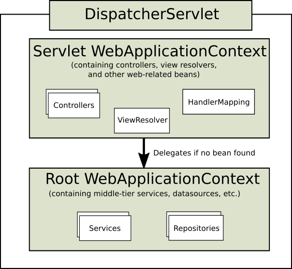

# 1.1. DispatcherServlet

<!-- tabs:start -->

#### ** English **

[WebFlux](https://docs.spring.io/spring/docs/5.2.6.RELEASE/spring-framework-reference/web-reactive.html#webflux-dispatcher-handler)
#### ** Chinese **

[WebFlux](https://docs.spring.io/spring/docs/5.2.6.RELEASE/spring-framework-reference/web-reactive.html#webflux-dispatcher-handler)

<!-- tabs:end -->


<!-- tabs:start -->

#### ** English **

Spring MVC, as many other web frameworks, is designed around the front controller pattern where a central `Servlet`, the `DispatcherServlet`, provides a shared algorithm for request processing, while actual work is performed by configurable delegate components. This model is flexible and supports diverse workflows.
#### ** Chinese **

和许多其他web框架一样，Spring MVC也是围绕着前台控制器模式设计的，其中一个中心的`Servlet`，即`DispatcherServlet`，为请求处理提供共享算法，而实际工作由可配置的委托组件来完成。这种模式非常灵活，支持多种工作流程。

<!-- tabs:end -->


<!-- tabs:start -->

#### ** English **

The `DispatcherServlet`, as any `Servlet`, needs to be declared and mapped according to the Servlet specification by using Java configuration or in `web.xml`. In turn, the `DispatcherServlet` uses Spring configuration to discover the delegate components it needs for request mapping, view resolution, exception handling, [and more](https://docs.spring.io/spring/docs/5.2.6.RELEASE/spring-framework-reference/web.html#mvc-servlet-special-bean-types).
#### ** Chinese **

`DispatcherServlet`和任何`Servlet`一样，需要通过使用Java配置或在`web.xml`中根据Servlet规范进行声明和映射。反过来，`DispatcherServlet`使用Spring配置来发现它所需要的委托组件，以实现请求映射、视图解析、异常处理，[等等](https://docs.spring.io/spring/docs/5.2.6.RELEASE/spring-framework-reference/web.html#mvc-servlet-special-bean-types)。

<!-- tabs:end -->


<!-- tabs:start -->

#### ** English **

The following example of the Java configuration registers and initializes the `DispatcherServlet`, which is auto-detected by the Servlet container (see [Servlet Config](https://docs.spring.io/spring/docs/5.2.6.RELEASE/spring-framework-reference/web.html#mvc-container-config)):
#### ** Chinese **

下面是Java配置注册和初始化`DispatcherServlet`的例子，它是由Servlet容器自动检测到的（参见[Servlet Config](https://docs.spring.io/spring/docs/5.2.6.RELEASE/spring-framework-reference/web.html#mvc-container-config)）。

<!-- tabs:end -->


```java
public class MyWebApplicationInitializer implements WebApplicationInitializer {

    @Override
    public void onStartup(ServletContext servletCxt) {

        // Load Spring web application configuration
        AnnotationConfigWebApplicationContext ac = new AnnotationConfigWebApplicationContext();
        ac.register(AppConfig.class);
        ac.refresh();

        // Create and register the DispatcherServlet
        DispatcherServlet servlet = new DispatcherServlet(ac);
        ServletRegistration.Dynamic registration = servletCxt.addServlet("app", servlet);
        registration.setLoadOnStartup(1);
        registration.addMapping("/app/*");
    }
}
```

<!-- tabs:start -->

#### ** English **

In addition to using the ServletContext API directly, you can also extend `AbstractAnnotationConfigDispatcherServletInitializer` and override specific methods (see the example under [Context Hierarchy](https://docs.spring.io/spring/docs/5.2.6.RELEASE/spring-framework-reference/web.html#mvc-servlet-context-hierarchy)).
#### ** Chinese **

除了直接使用ServletContext API，你还可以扩展`AbstractAnnotationConfigDispatcherServletInitializer`，并覆盖特定的方法（参见[Context Hierarchy](https://docs.spring.io/spring/docs/5.2.6.RELEASE/spring-framework-reference/web.html#mvc-servlet-context-hierarchy)下的示例）。

<!-- tabs:end -->


<!-- tabs:start -->

#### ** English **

The following example of `web.xml` configuration registers and initializes the `DispatcherServlet`:
#### ** Chinese **

下面是`web.xml`配置注册和初始化`DispatcherServlet`的例子。

<!-- tabs:end -->


```xml
<web-app>

    <listener>
        <listener-class>org.springframework.web.context.ContextLoaderListener</listener-class>
    </listener>

    <context-param>
        <param-name>contextConfigLocation</param-name>
        <param-value>/WEB-INF/app-context.xml</param-value>
    </context-param>

    <servlet>
        <servlet-name>app</servlet-name>
        <servlet-class>org.springframework.web.servlet.DispatcherServlet</servlet-class>
        <init-param>
            <param-name>contextConfigLocation</param-name>
            <param-value></param-value>
        </init-param>
        <load-on-startup>1</load-on-startup>
    </servlet>

    <servlet-mapping>
        <servlet-name>app</servlet-name>
        <url-pattern>/app/*</url-pattern>
    </servlet-mapping>

</web-app>
```

<!-- tabs:start -->

#### ** English **

Spring Boot follows a different initialization sequence. Rather than hooking into the lifecycle of the Servlet container, Spring Boot uses Spring configuration to bootstrap itself and the embedded Servlet container. `Filter` and `Servlet` declarations are detected in Spring configuration and registered with the Servlet container. For more details, see the [Spring Boot documentation](https://docs.spring.io/spring-boot/docs/current/reference/htmlsingle/#boot-features-embedded-container).
#### ** Chinese **

Spring Boot遵循不同的初始化顺序。Spring Boot 并不是挂钩到 Servlet 容器的生命周期，而是使用 Spring 配置来引导自己和嵌入的 Servlet 容器。 `Filter`和`Servlet`声明会在Spring配置中检测到并注册到Servlet容器。有关详细信息，请参阅[Spring Boot文档](https://docs.spring.io/spring-boot/docs/current/reference/htmlsingle/#boot-features-embedded-container)。

<!-- tabs:end -->


### **1.1.1. Context Hierarchy** 

<!-- tabs:start -->

#### ** English **

`DispatcherServlet` expects a `WebApplicationContext` (an extension of a plain `ApplicationContext`) for its own configuration. `WebApplicationContext` has a link to the `ServletContext` and the `Servlet` with which it is associated. It is also bound to the `ServletContext` such that applications can use static methods on `RequestContextUtils` to look up the `WebApplicationContext` if they need access to it.
#### ** Chinese **

`DispatcherServlet`期待一个`WebApplicationContext`（普通的`ApplicationContext`的扩展）来进行自己的配置。 `WebApplicationContext`有一个链接到`ServletContext`和它所关联的`Servlet`。它还与 `ServletContext`绑定在一起，这样，如果应用程序需要访问`RequestContextUtils`，可以使用静态方法在`RequestContextUtils`上查找`WebApplicationContext`。

<!-- tabs:end -->


<!-- tabs:start -->

#### ** English **

For many applications, having a single `WebApplicationContext` is simple and suffices. It is also possible to have a context hierarchy where one root `WebApplicationContext` is shared across multiple `DispatcherServlet` (or other `Servlet`) instances, each with its own child `WebApplicationContext` configuration. See [Additional Capabilities of the ](https://docs.spring.io/spring/docs/5.2.6.RELEASE/spring-framework-reference/core.html#context-introduction)[`ApplicationContext`](https://docs.spring.io/spring/docs/5.2.6.RELEASE/spring-framework-reference/core.html#context-introduction) for more on the context hierarchy feature.
#### ** Chinese **

对于许多应用程序来说，拥有一个单一的`WebApplicationContext`就足够了。也可以有一个上下文层次结构，其中一个根`WebApplicationContext`在多个`DispatcherServlet`（或其他`Servlet`）实例之间共享，每个实例都有自己的子`WebApplicationContext`配置。有关上下文分层功能的更多信息，请参见[附加功能](https://docs.spring.io/spring/docs/5.2.6.RELEASE/spring-framework-reference/core.html#context-introduction)[`ApplicationContext`](https://docs.spring.io/spring/docs/5.2.6.RELEASE/spring-framework-reference/core.html#context-introduction)。

<!-- tabs:end -->


<!-- tabs:start -->

#### ** English **

The root `WebApplicationContext` typically contains infrastructure beans, such as data repositories and business services that need to be shared across multiple `Servlet` instances. Those beans are effectively inherited and can be overridden (that is, re-declared) in the Servlet-specific child `WebApplicationContext`, which typically contains beans local to the given `Servlet`. The following image shows this relationship:
#### ** Chinese **

根`WebApplicationContext`通常包含基础架构Bean，例如需要在多个`Servlet`实例之间共享的数据存储库和业务服务。这些Bean是有效继承的，并且可以在Servlet特定的子`WebApplicationContext`中被重写（也就是重新声明），它通常包含给定的`Servlet`的本地Bean。下面的图片显示了这种关系。

<!-- tabs:end -->




<!-- tabs:start -->

#### ** English **

The following example configures a `WebApplicationContext` hierarchy:
#### ** Chinese **

下面的示例配置了一个`WebApplicationContext`层次结构。

<!-- tabs:end -->


```java
public class MyWebAppInitializer extends AbstractAnnotationConfigDispatcherServletInitializer {

    @Override
    protected Class<?>[] getRootConfigClasses() {
        return new Class<?>[] { RootConfig.class };
    }

    @Override
    protected Class<?>[] getServletConfigClasses() {
        return new Class<?>[] { App1Config.class };
    }

    @Override
    protected String[] getServletMappings() {
        return new String[] { "/app1/*" };
    }
}
```

<!-- tabs:start -->

#### ** English **

If an application context hierarchy is not required, applications can return all configuration through `getRootConfigClasses()` and `null` from `getServletConfigClasses()`.
#### ** Chinese **

如果不需要应用程序上下文层次结构，应用程序可以通过`getRootConfigClasses()`所有配置和`ServletConfigClasses()`返回null。

<!-- tabs:end -->


<!-- tabs:start -->

#### ** English **

The following example shows the `web.xml` equivalent:
#### ** Chinese **

下面的例子显示了`web.xml`的等效。

<!-- tabs:end -->


```xml
<web-app>

    <listener>
        <listener-class>org.springframework.web.context.ContextLoaderListener</listener-class>
    </listener>

    <context-param>
        <param-name>contextConfigLocation</param-name>
        <param-value>/WEB-INF/root-context.xml</param-value>
    </context-param>

    <servlet>
        <servlet-name>app1</servlet-name>
        <servlet-class>org.springframework.web.servlet.DispatcherServlet</servlet-class>
        <init-param>
            <param-name>contextConfigLocation</param-name>
            <param-value>/WEB-INF/app1-context.xml</param-value>
        </init-param>
        <load-on-startup>1</load-on-startup>
    </servlet>

    <servlet-mapping>
        <servlet-name>app1</servlet-name>
        <url-pattern>/app1/*</url-pattern>
    </servlet-mapping>

</web-app>
```

<!-- tabs:start -->

#### ** English **

If an application context hierarchy is not required, applications may configure a “root” context only and leave the `contextConfigLocation` Servlet parameter empty.
#### ** Chinese **

如果不需要应用程序上下文层次结构，应用程序可以只配置 "根 "上下文，并将`contextConfigLocation` Servlet参数留空。

<!-- tabs:end -->


### **1.1.2. Special Bean Types** 

<!-- tabs:start -->

#### ** English **

[WebFlux](https://docs.spring.io/spring/docs/5.2.6.RELEASE/spring-framework-reference/web-reactive.html#webflux-special-bean-types)
#### ** Chinese **

[WebFlux](https://docs.spring.io/spring/docs/5.2.6.RELEASE/spring-framework-reference/web-reactive.html#webflux-special-bean-types)

<!-- tabs:end -->


<!-- tabs:start -->

#### ** English **

The `DispatcherServlet` delegates to special beans to process requests and render the appropriate responses. By “special beans” we mean Spring-managed `Object` instances that implement framework contracts. Those usually come with built-in contracts, but you can customize their properties and extend or replace them.
#### ** Chinese **

`DispatcherServlet`委托给特殊的Bean来处理请求并呈现相应的响应。我们所说的 "特殊Bean "指的是Spring管理的`Object`实例，这些实例实现了框架合约。这些实例通常带有内置的契约，但你可以自定义它们的属性，并扩展或替换它们。

<!-- tabs:end -->


<!-- tabs:start -->

#### ** English **

The following table lists the special beans detected by the `DispatcherServlet`:
#### ** Chinese **

下表列出了被`DispatcherServlet`检测到的特殊Bean。

<!-- tabs:end -->


Bean type | Explanation 
-|-
HandlerMapping | Map a request to a handler along with a list of interceptors for pre- and post-processing. The mapping is based on some criteria, the details of which vary by HandlerMapping implementation.The two main HandlerMapping implementations are RequestMappingHandlerMapping (which supports @RequestMapping annotated methods) and SimpleUrlHandlerMapping (which maintains explicit registrations of URI path patterns to handlers). 
HandlerAdapter | Help the DispatcherServlet to invoke a handler mapped to a request, regardless of how the handler is actually invoked. For example, invoking an annotated controller requires resolving annotations. The main purpose of a HandlerAdapter is to shield the DispatcherServlet from such details. 
HandlerExceptionResolver | Strategy to resolve exceptions, possibly mapping them to handlers, to HTML error views, or other targets. See Exceptions. 
ViewResolver | Resolve logical String-based view names returned from a handler to an actual View with which to render to the response. See View Resolution and View Technologies. 
LocaleResolver, LocaleContextResolver | Resolve the Locale a client is using and possibly their time zone, in order to be able to offer internationalized views. See Locale. 
ThemeResolver | Resolve themes your web application can use — for example, to offer personalized layouts. See Themes. 
MultipartResolver | Abstraction for parsing a multi-part request (for example, browser form file upload) with the help of some multipart parsing library. See Multipart Resolver. 
FlashMapManager | Store and retrieve the “input” and the “output” FlashMap that can be used to pass attributes from one request to another, usually across a redirect. See Flash Attributes. 


### **1.1.3. Web MVC Config** 

<!-- tabs:start -->

#### ** English **

[WebFlux](https://docs.spring.io/spring/docs/5.2.6.RELEASE/spring-framework-reference/web-reactive.html#webflux-framework-config)
#### ** Chinese **

[WebFlux](https://docs.spring.io/spring/docs/5.2.6.RELEASE/spring-framework-reference/web-reactive.html#webflux-framework-config)

<!-- tabs:end -->


<!-- tabs:start -->

#### ** English **

Applications can declare the infrastructure beans listed in [Special Bean Types](https://docs.spring.io/spring/docs/5.2.6.RELEASE/spring-framework-reference/web.html#mvc-servlet-special-bean-types) that are required to process requests. The `DispatcherServlet` checks the `WebApplicationContext` for each special bean. If there are no matching bean types, it falls back on the default types listed in [`DispatcherServlet.properties`](https://github.com/spring-projects/spring-framework/blob/master/spring-webmvc/src/main/resources/org/springframework/web/servlet/DispatcherServlet.properties).
#### ** Chinese **

应用程序可以声明[特殊Bean类型](https://docs.spring.io/spring/docs/5.2.6.RELEASE/spring-framework-reference/web.html#mvc-servlet-special-bean-types)中列出的处理请求所需的基础设施Bean。`DispatcherServlet`检查每个特殊Bean的`WebApplicationContext`。如果没有匹配的Bean类型，它将返回[`DispatcherServlet.properties`](https://github.com/spring-projects/spring-framework/blob/master/spring-webmvc/src/main/resources/org/springframework/web/servlet/DispatcherServlet.properties)中列出的默认类型。

<!-- tabs:end -->


<!-- tabs:start -->

#### ** English **

In most cases, the [MVC Config](https://docs.spring.io/spring/docs/5.2.6.RELEASE/spring-framework-reference/web.html#mvc-config) is the best starting point. It declares the required beans in either Java or XML and provides a higher-level configuration callback API to customize it.
#### ** Chinese **

在大多数情况下，[MVC Config](https://docs.spring.io/spring/docs/5.2.6.RELEASE/spring-framework-reference/web.html#mvc-config)是最好的出发点。它用Java或XML声明了所需的Bean，并提供了一个更高级别的配置回调API来定制它。

<!-- tabs:end -->


<!-- tabs:start -->

#### ** English **

Spring Boot relies on the MVC Java configuration to configure Spring MVC and provides many extra convenient options.
#### ** Chinese **

Spring Boot依靠MVC Java配置来配置Spring MVC，并提供了许多额外的方便选项。

<!-- tabs:end -->


### **1.1.4. Servlet Config** 

<!-- tabs:start -->

#### ** English **

In a Servlet 3.0+ environment, you have the option of configuring the Servlet container programmatically as an alternative or in combination with a `web.xml` file. The following example registers a `DispatcherServlet`:
#### ** Chinese **

在 Servlet 3.0+ 环境中，你可以选择以程序化方式配置 Servlet 容器作为替代方案，或者与 `web.xml`文件结合使用。下面的例子注册了一个`DispatcherServlet`。

<!-- tabs:end -->


```java
import org.springframework.web.WebApplicationInitializer;

public class MyWebApplicationInitializer implements WebApplicationInitializer {

    @Override
    public void onStartup(ServletContext container) {
        XmlWebApplicationContext appContext = new XmlWebApplicationContext();
        appContext.setConfigLocation("/WEB-INF/spring/dispatcher-config.xml");

        ServletRegistration.Dynamic registration = container.addServlet("dispatcher", new DispatcherServlet(appContext));
        registration.setLoadOnStartup(1);
        registration.addMapping("/");
    }
}
```

<!-- tabs:start -->

#### ** English **

`WebApplicationInitializer` is an interface provided by Spring MVC that ensures your implementation is detected and automatically used to initialize any Servlet 3 container. An abstract base class implementation of `WebApplicationInitializer` named `AbstractDispatcherServletInitializer` makes it even easier to register the `DispatcherServlet` by overriding methods to specify the servlet mapping and the location of the `DispatcherServlet` configuration.
#### ** Chinese **

`WebApplicationInitializer`是Spring MVC提供的一个接口，可以确保你的实现被检测到并自动用于初始化任何Servlet 3容器。`WebApplicationInitializer`的抽象基类实现</x>命名为`AbstractDispatcherServletInitializer`，通过重载方法来指定servlet映射和`DispatcherServlet`配置的位置，使得注册`DispatcherServlet`变得更加容易。

<!-- tabs:end -->


<!-- tabs:start -->

#### ** English **

This is recommended for applications that use Java-based Spring configuration, as the following example shows:
#### ** Chinese **

这是对使用基于Java的Spring配置的应用程序的建议，如下例所示。

<!-- tabs:end -->


```java
public class MyWebAppInitializer extends AbstractAnnotationConfigDispatcherServletInitializer {

    @Override
    protected Class<?>[] getRootConfigClasses() {
        return null;
    }

    @Override
    protected Class<?>[] getServletConfigClasses() {
        return new Class<?>[] { MyWebConfig.class };
    }

    @Override
    protected String[] getServletMappings() {
        return new String[] { "/" };
    }
}
```

<!-- tabs:start -->

#### ** English **

If you use XML-based Spring configuration, you should extend directly from `AbstractDispatcherServletInitializer`, as the following example shows:
#### ** Chinese **

如果你使用基于XML的Spring配置，应该直接从`AbstractDispatcherServletInitializer`中扩展，如下例所示。

<!-- tabs:end -->


```java
public class MyWebAppInitializer extends AbstractDispatcherServletInitializer {

    @Override
    protected WebApplicationContext createRootApplicationContext() {
        return null;
    }

    @Override
    protected WebApplicationContext createServletApplicationContext() {
        XmlWebApplicationContext cxt = new XmlWebApplicationContext();
        cxt.setConfigLocation("/WEB-INF/spring/dispatcher-config.xml");
        return cxt;
    }

    @Override
    protected String[] getServletMappings() {
        return new String[] { "/" };
    }
}
```

<!-- tabs:start -->

#### ** English **

`AbstractDispatcherServletInitializer` also provides a convenient way to add `Filter` instances and have them be automatically mapped to the `DispatcherServlet`, as the following example shows:
#### ** Chinese **

`AbstractDispatcherServletInitializer`还提供了一个方便的方法来添加`Filter`实例，并让它们自动映射到`DispatcherServlet`中，如下例所示。

<!-- tabs:end -->


```java
public class MyWebAppInitializer extends AbstractDispatcherServletInitializer {

    // ...

    @Override
    protected Filter[] getServletFilters() {
        return new Filter[] {
            new HiddenHttpMethodFilter(), new CharacterEncodingFilter() };
    }
}
```

<!-- tabs:start -->

#### ** English **

Each filter is added with a default name based on its concrete type and automatically mapped to the `DispatcherServlet`.
#### ** Chinese **

每个过滤器都会根据其具体类型添加一个默认名称，并自动映射到`DispatcherServlet`。

<!-- tabs:end -->


<!-- tabs:start -->

#### ** English **

The `isAsyncSupported` protected method of `AbstractDispatcherServletInitializer` provides a single place to enable async support on the `DispatcherServlet` and all filters mapped to it. By default, this flag is set to `true`.
#### ** Chinese **

`AbstractDispatcherServletInitializer`中的`isAsyncSupported`protected方法为`DispatcherServlet`和所有映射到它的过滤器提供了一个单一的地方，以启用异步支持。默认情况下，这个标志被设置为`true`。

<!-- tabs:end -->


<!-- tabs:start -->

#### ** English **

Finally, if you need to further customize the `DispatcherServlet` itself, you can override the `createDispatcherServlet` method.
#### ** Chinese **

最后，如果你需要进一步定制`DispatcherServlet`本身，你可以覆盖`createDispatcherServlet`方法。

<!-- tabs:end -->


### **1.1.5. Processing** 

<!-- tabs:start -->

#### ** English **

[WebFlux](https://docs.spring.io/spring/docs/5.2.6.RELEASE/spring-framework-reference/web-reactive.html#webflux-dispatcher-handler-sequence)
#### ** Chinese **

[WebFlux](https://docs.spring.io/spring/docs/5.2.6.RELEASE/spring-framework-reference/web-reactive.html#webflux-dispatcher-handler-sequence)

<!-- tabs:end -->


<!-- tabs:start -->

#### ** English **

The `DispatcherServlet` processes requests as follows:
#### ** Chinese **

`DispatcherServlet`处理请求如下。

<!-- tabs:end -->


<!-- tabs:start -->

#### ** English **

- The `WebApplicationContext` is searched for and bound in the request as an attribute that the controller and other elements in the process can use. It is bound by default under the `DispatcherServlet.WEB_APPLICATION_CONTEXT_ATTRIBUTE` key.

- The locale resolver is bound to the request to let elements in the process resolve the locale to use when processing the request (rendering the view, preparing data, and so on). If you do not need locale resolving, you do not need the locale resolver.

- The theme resolver is bound to the request to let elements such as views determine which theme to use. If you do not use themes, you can ignore it.

- If you specify a multipart file resolver, the request is inspected for multiparts. If multiparts are found, the request is wrapped in a `MultipartHttpServletRequest` for further processing by other elements in the process. See [Multipart Resolver](https://docs.spring.io/spring/docs/5.2.6.RELEASE/spring-framework-reference/web.html#mvc-multipart) for further information about multipart handling.

- An appropriate handler is searched for. If a handler is found, the execution chain associated with the handler (preprocessors, postprocessors, and controllers) is executed in order to prepare a model or rendering. Alternatively, for annotated controllers, the response can be rendered (within the `HandlerAdapter`) instead of returning a view.

- If a model is returned, the view is rendered. If no model is returned (maybe due to a preprocessor or postprocessor intercepting the request, perhaps for security reasons), no view is rendered, because the request could already have been fulfilled.

#### ** Chinese **

- `WebApplicationContext`被搜索并绑定在请求中，作为控制器和进程中其他元素可以使用的属性。它默认在`DispatcherServlet.WEB_APPLICATION_CONTEXT_ATTRIBUTE`键下绑定。

- locale resolver被绑定到请求中，以便让进程中的元素在处理请求时（渲染视图、准备数据等）解析要使用的locale。如果不需要locale解析，就不需要locale解析器。

- 主题解析器被绑定到请求中，让视图等元素决定使用哪个主题。如果您不使用主题，可以忽略它。

- 如果您指定了多部分文件解析器，则会检查请求是否有多部分。如果发现了多部分，则会将请求封装在 `MultipartHttpServletRequest`中，以便由进程中的其他元素进一步处理。有关多部分处理的更多信息，请参阅[Multipart Resolver](https://docs.spring.io/spring/docs/5.2.6.RELEASE/spring-framework-reference/web.html#mvc-multipart)。

- 搜索一个合适的处理程序。如果找到了一个处理程序，就会执行与该处理程序相关联的执行链（前处理程序、后处理程序和控制器），以准备模型或渲染。或者，对于注释控制器，响应可以被渲染（在`HandlerAdapter`中），而不是返回视图。

- 如果返回了一个模型，就会渲染视图。如果没有返回模型（也许是由于前处理程序或后处理程序拦截请求，也许是出于安全原因），则不会渲染视图，因为请求可能已经被满足。


<!-- tabs:end -->

<!-- tabs:start -->

#### ** English **

The `HandlerExceptionResolver` beans declared in the `WebApplicationContext` are used to resolve exceptions thrown during request processing. Those exception resolvers allow customizing the logic to address exceptions. See [Exceptions](https://docs.spring.io/spring/docs/5.2.6.RELEASE/spring-framework-reference/web.html#mvc-exceptionhandlers) for more details.
#### ** Chinese **

`WebApplicationContext`中声明的`HandlerExceptionResolver` bean用于解决请求处理过程中抛出的异常。这些异常解析器允许自定义逻辑来处理异常。更多详情，请参阅[Exceptions](https://docs.spring.io/spring/docs/5.2.6.RELEASE/spring-framework-reference/web.html#mvc-exceptionhandlers)。

<!-- tabs:end -->


<!-- tabs:start -->

#### ** English **

The Spring `DispatcherServlet` also supports the return of the `last-modification-date`, as specified by the Servlet API. The process of determining the last modification date for a specific request is straightforward: The `DispatcherServlet` looks up an appropriate handler mapping and tests whether the handler that is found implements the `LastModified` interface. If so, the value of the `long getLastModified(request)` method of the `LastModified` interface is returned to the client.
#### ** Chinese **

Spring `DispatcherServlet`还支持返回`last-modification-date`，如Servlet API所指定的那样。确定特定请求的最后修改日期的过程很简单。`DispatcherServlet`查找合适的处理程序映射，并测试找到的处理程序是否实现了`LastModified`接口。如果是，则返回给客户端的`LastModified`接口的`long getLastModified(request)`方法的值。

<!-- tabs:end -->


<!-- tabs:start -->

#### ** English **

You can customize individual `DispatcherServlet` instances by adding Servlet initialization parameters (`init-param` elements) to the Servlet declaration in the `web.xml` file. The following table lists the supported parameters:
#### ** Chinese **

您可以通过在 `web.xml` 文件中的 Servlet 声明中添加 Servlet 初始化参数（`init-param` 元素）来自定义单个 `DispatcherServlet` 实例。下表列出了支持的参数。

<!-- tabs:end -->


Parameter | Explanation 
-|-
contextClass | Class that implements ConfigurableWebApplicationContext, to be instantiated and locally configured by this Servlet. By default, XmlWebApplicationContext is used. 
contextConfigLocation | String that is passed to the context instance (specified by contextClass) to indicate where contexts can be found. The string consists potentially of multiple strings (using a comma as a delimiter) to support multiple contexts. In the case of multiple context locations with beans that are defined twice, the latest location takes precedence. 
namespace | Namespace of the WebApplicationContext. Defaults to [servlet-name]-servlet. 
throwExceptionIfNoHandlerFound | Whether to throw a NoHandlerFoundException when no handler was found for a request. The exception can then be caught with a HandlerExceptionResolver (for example, by using an @ExceptionHandler controller method) and handled as any others.By default, this is set to false, in which case the DispatcherServlet sets the response status to 404 (NOT_FOUND) without raising an exception.Note that, if default servlet handling is also configured, unresolved requests are always forwarded to the default servlet and a 404 is never raised. 


### **1.1.6. Interception** 

<!-- tabs:start -->

#### ** English **

All `HandlerMapping` implementations support handler interceptors that are useful when you want to apply specific functionality to certain requests — for example, checking for a principal. Interceptors must implement `HandlerInterceptor` from the `org.springframework.web.servlet` package with three methods that should provide enough flexibility to do all kinds of pre-processing and post-processing:
#### ** Chinese **

所有`HandlerMapping`实现都支持句柄拦截器，当你想将特定的功能应用到特定的请求时，这些拦截器是非常有用的--例如，检查一个委托人。拦截器必须从`org.springframework.web.servlet`包中实现`HandlerInterceptor`，其中的三个方法应该可以提供足够的灵活性来进行各种前处理和后处理。

<!-- tabs:end -->


<!-- tabs:start -->

#### ** English **

- `preHandle(..)`: Before the actual handler is executed

- `postHandle(..)`: After the handler is executed

- `afterCompletion(..)`: After the complete request has finished

#### ** Chinese **

- `preHandle(..)`: 在实际处理程序执行之前

- `postHandle(..)`:处理程序被执行后

- `afterCompletion(..)`:完整的请求完成后


<!-- tabs:end -->

<!-- tabs:start -->

#### ** English **

The `preHandle(..)` method returns a boolean value. You can use this method to break or continue the processing of the execution chain. When this method returns `true`, the handler execution chain continues. When it returns false, the `DispatcherServlet` assumes the interceptor itself has taken care of requests (and, for example, rendered an appropriate view) and does not continue executing the other interceptors and the actual handler in the execution chain.
#### ** Chinese **

`preHandle(..)`方法返回一个布尔值。你可以使用这个方法来中断或继续处理执行链。当该方法返回`true`时，处理程序执行链继续执行。当它返回false时，`DispatcherServlet`会假定拦截器本身已经处理了请求（例如，渲染了一个适当的视图），而不会继续执行执行链中的其他拦截器和实际处理程序。

<!-- tabs:end -->


<!-- tabs:start -->

#### ** English **

See [Interceptors](https://docs.spring.io/spring/docs/5.2.6.RELEASE/spring-framework-reference/web.html#mvc-config-interceptors) in the section on MVC configuration for examples of how to configure interceptors. You can also register them directly by using setters on individual `HandlerMapping` implementations.
#### ** Chinese **

有关如何配置拦截器的例子，请参见MVC配置部分中的[拦截器](https://docs.spring.io/spring/docs/5.2.6.RELEASE/spring-framework-reference/web.html#mvc-config-interceptors)。你也可以通过在单个 `HandlerMapping`实现中使用设置器直接注册它们。

<!-- tabs:end -->


<!-- tabs:start -->

#### ** English **

Note that `postHandle` is less useful with `@ResponseBody` and `ResponseEntity` methods for which the response is written and committed within the `HandlerAdapter` and before `postHandle`. That means it is too late to make any changes to the response, such as adding an extra header. For such scenarios, you can implement `ResponseBodyAdvice` and either declare it as an [Controller Advice](https://docs.spring.io/spring/docs/5.2.6.RELEASE/spring-framework-reference/web.html#mvc-ann-controller-advice) bean or configure it directly on `RequestMappingHandlerAdapter`.
#### ** Chinese **

请注意，`postHandle`对`@ResponseBody`和`ResponseEntity`方法的作用不大，因为响应是在`HandlerAdapter`中写的，并且在`postHandle`之前提交。这就意味着，如果要对响应进行任何更改，比如添加额外的头，已经太晚了。对于这种情况，你可以实现`ResponseBodyAdvice`，并将其声明为[ControllerAdvice](https://docs.spring.io/spring/docs/5.2.6.RELEASE/spring-framework-reference/web.html#mvc-ann-controller-advice)Bean，或者直接在`RequestMappingHandlerAdapter`上配置。

<!-- tabs:end -->


### **1.1.7. Exceptions** 

<!-- tabs:start -->

#### ** English **

[WebFlux](https://docs.spring.io/spring/docs/5.2.6.RELEASE/spring-framework-reference/web-reactive.html#webflux-dispatcher-exceptions)
#### ** Chinese **

[WebFlux](https://docs.spring.io/spring/docs/5.2.6.RELEASE/spring-framework-reference/web-reactive.html#webflux-dispatcher-exceptions)

<!-- tabs:end -->


<!-- tabs:start -->

#### ** English **

If an exception occurs during request mapping or is thrown from a request handler (such as a `@Controller`), the `DispatcherServlet` delegates to a chain of `HandlerExceptionResolver` beans to resolve the exception and provide alternative handling, which is typically an error response.
#### ** Chinese **

如果在请求映射过程中发生异常或从请求处理程序（如`@Controller`）抛出的异常，`DispatcherServlet`会委托给一串`HandlerExceptionResolver` bean来解决异常并提供替代处理，通常是错误响应。

<!-- tabs:end -->


<!-- tabs:start -->

#### ** English **

The following table lists the available `HandlerExceptionResolver` implementations:
#### ** Chinese **

下表列出了可用的`HandlerExceptionResolver`实现。

<!-- tabs:end -->


HandlerExceptionResolver | Description 
-|-
SimpleMappingExceptionResolver | A mapping between exception class names and error view names. Useful for rendering error pages in a browser application. 
DefaultHandlerExceptionResolver | Resolves exceptions raised by Spring MVC and maps them to HTTP status codes. See also alternative ResponseEntityExceptionHandler and REST API exceptions. 
ResponseStatusExceptionResolver | Resolves exceptions with the @ResponseStatus annotation and maps them to HTTP status codes based on the value in the annotation. 
ExceptionHandlerExceptionResolver | Resolves exceptions by invoking an @ExceptionHandler method in a @Controller or a @ControllerAdvice class. See @ExceptionHandler methods. 


### **Chain of Resolvers** 

<!-- tabs:start -->

#### ** English **

You can form an exception resolver chain by declaring multiple `HandlerExceptionResolver` beans in your Spring configuration and setting their `order` properties as needed. The higher the order property, the later the exception resolver is positioned.
#### ** Chinese **

您可以通过在Spring配置中声明多个`HandlerExceptionResolver` bean，并根据需要设置它们的`order`属性，形成一个异常解析器链。顺序属性越高，异常解析器的定位越晚。

<!-- tabs:end -->


<!-- tabs:start -->

#### ** English **

The contract of `HandlerExceptionResolver` specifies that it can return:
#### ** Chinese **

`HandlerExceptionResolver`的契约规定，它可以返回。

<!-- tabs:end -->


<!-- tabs:start -->

#### ** English **

- a `ModelAndView` that points to an error view.

- An empty `ModelAndView` if the exception was handled within the resolver.

- `null` if the exception remains unresolved, for subsequent resolvers to try, and, if the exception remains at the end, it is allowed to bubble up to the Servlet container.

#### ** Chinese **

- 一个指向错误视图的 `ModelAndView`。

- 如果异常已在解析器中处理，则为空的 `ModelAndView`。

- `null`，如果异常仍未解决，则为空</x>，以便后续的解析器尝试，如果异常仍在最后，则允许将其泡到Servlet容器中。


<!-- tabs:end -->

<!-- tabs:start -->

#### ** English **

The [MVC Config](https://docs.spring.io/spring/docs/5.2.6.RELEASE/spring-framework-reference/web.html#mvc-config) automatically declares built-in resolvers for default Spring MVC exceptions, for `@ResponseStatus` annotated exceptions, and for support of `@ExceptionHandler` methods. You can customize that list or replace it.
#### ** Chinese **

MVC Config](https://docs.spring.io/spring/docs/5.2.6.RELEASE/spring-framework-reference/web.html#mvc-config)自动为默认的Spring MVC异常、`@ResponseStatus`注释的异常和支持`@ExceptionHandler`方法的内置解析器声明。你可以自定义该列表或替换它。

<!-- tabs:end -->


### **Container Error Page** 

<!-- tabs:start -->

#### ** English **

If an exception remains unresolved by any `HandlerExceptionResolver` and is, therefore, left to propagate or if the response status is set to an error status (that is, 4xx, 5xx), Servlet containers can render a default error page in HTML. To customize the default error page of the container, you can declare an error page mapping in `web.xml`. The following example shows how to do so:
#### ** Chinese **

如果一个异常仍未被任何`HandlerExceptionResolver`所解决，因此，如果响应状态被设置为错误状态（即4xx、5xx），那么Servlet容器可以在HTML中渲染一个默认的错误页面。要自定义容器的默认错误页面，可以在`web.xml`中声明一个错误页面映射。下面的例子显示了如何做到这一点。

<!-- tabs:end -->


```xml
<error-page>
    <location>/error</location>
</error-page>
```

<!-- tabs:start -->

#### ** English **

Given the preceding example, when an exception bubbles up or the response has an error status, the Servlet container makes an ERROR dispatch within the container to the configured URL (for example, `/error`). This is then processed by the `DispatcherServlet`, possibly mapping it to a `@Controller`, which could be implemented to return an error view name with a model or to render a JSON response, as the following example shows:
#### ** Chinese **

考虑到前面的例子，当异常冒泡或响应有错误状态时，Servlet容器会在容器内向配置的URL（例如，`/error`）进行ERROR调度。然后由`DispatcherServlet`处理，可能会将其映射到`@Controller`，它可以通过模型返回一个错误视图名或渲染一个JSON响应来实现，如下例所示。

<!-- tabs:end -->


```java
@RestController
public class ErrorController {

    @RequestMapping(path = "/error")
    public Map<String, Object> handle(HttpServletRequest request) {
        Map<String, Object> map = new HashMap<String, Object>();
        map.put("status", request.getAttribute("javax.servlet.error.status_code"));
        map.put("reason", request.getAttribute("javax.servlet.error.message"));
        return map;
    }
}
```

<!-- tabs:start -->

#### ** English **

The Servlet API does not provide a way to create error page mappings in Java. You can, however, use both a `WebApplicationInitializer` and a minimal `web.xml`.
#### ** Chinese **

Servlet API 没有提供在 Java 中创建错误页面映射的方法。但是，你可以使用`WebApplicationInitializer`和最小的`web.xml`。

<!-- tabs:end -->


### **1.1.8. View Resolution** 

<!-- tabs:start -->

#### ** English **

[WebFlux](https://docs.spring.io/spring/docs/5.2.6.RELEASE/spring-framework-reference/web-reactive.html#webflux-viewresolution)
#### ** Chinese **

[WebFlux](https://docs.spring.io/spring/docs/5.2.6.RELEASE/spring-framework-reference/web-reactive.html#webflux-viewresolution)

<!-- tabs:end -->


<!-- tabs:start -->

#### ** English **

Spring MVC defines the `ViewResolver` and `View` interfaces that let you render models in a browser without tying you to a specific view technology. `ViewResolver` provides a mapping between view names and actual views. `View` addresses the preparation of data before handing over to a specific view technology.
#### ** Chinese **

Spring MVC定义了`ViewResolver`和`View`接口，可以让你在浏览器中渲染模型，而无需绑定到特定的视图技术。 `ViewResolver`提供了视图名称和实际视图之间的映射。 `视图`解决了在交给特定视图技术之前的数据准备问题。

<!-- tabs:end -->


<!-- tabs:start -->

#### ** English **

The following table provides more details on the `ViewResolver` hierarchy:
#### ** Chinese **

下表提供了关于`ViewResolver`层次结构的详细信息。

<!-- tabs:end -->


ViewResolver | Description 
-|-
AbstractCachingViewResolver | Sub-classes of AbstractCachingViewResolver cache view instances that they resolve. Caching improves performance of certain view technologies. You can turn off the cache by setting the cache property to false. Furthermore, if you must refresh a certain view at runtime (for example, when a FreeMarker template is modified), you can use the removeFromCache(String viewName, Locale loc) method. 
XmlViewResolver | Implementation of ViewResolver that accepts a configuration file written in XML with the same DTD as Spring’s XML bean factories. The default configuration file is /WEB-INF/views.xml. 
ResourceBundleViewResolver | Implementation of ViewResolver that uses bean definitions in a ResourceBundle, specified by the bundle base name. For each view it is supposed to resolve, it uses the value of the property [viewname].(class) as the view class and the value of the property [viewname].url as the view URL. You can find examples in the chapter on View Technologies. 
UrlBasedViewResolver | Simple implementation of the ViewResolver interface that affects the direct resolution of logical view names to URLs without an explicit mapping definition. This is appropriate if your logical names match the names of your view resources in a straightforward manner, without the need for arbitrary mappings. 
InternalResourceViewResolver | Convenient subclass of UrlBasedViewResolver that supports InternalResourceView (in effect, Servlets and JSPs) and subclasses such as JstlView and TilesView. You can specify the view class for all views generated by this resolver by using setViewClass(..). See the UrlBasedViewResolver javadoc for details. 
FreeMarkerViewResolver | Convenient subclass of UrlBasedViewResolver that supports FreeMarkerView and custom subclasses of them. 
ContentNegotiatingViewResolver | Implementation of the ViewResolver interface that resolves a view based on the request file name or Accept header. See Content Negotiation. 


### **Handling** 

<!-- tabs:start -->

#### ** English **

[WebFlux](https://docs.spring.io/spring/docs/5.2.6.RELEASE/spring-framework-reference/web-reactive.html#webflux-viewresolution-handling)
#### ** Chinese **

[WebFlux](https://docs.spring.io/spring/docs/5.2.6.RELEASE/spring-framework-reference/web-reactive.html#webflux-viewresolution-handling)

<!-- tabs:end -->


<!-- tabs:start -->

#### ** English **

You can chain view resolvers by declaring more than one resolver bean and, if necessary, by setting the `order` property to specify ordering. Remember, the higher the order property, the later the view resolver is positioned in the chain.
#### ** Chinese **

您可以通过声明一个以上的 resolver bean，并在必要时设置 `order` 属性来指定排序，从而对视图解析器进行连锁。请记住，顺序属性越高，视图解析器在链中的位置越晚。

<!-- tabs:end -->


<!-- tabs:start -->

#### ** English **

The contract of a `ViewResolver` specifies that it can return null to indicate that the view could not be found. However, in the case of JSPs and `InternalResourceViewResolver`, the only way to figure out if a JSP exists is to perform a dispatch through `RequestDispatcher`. Therefore, you must always configure an `InternalResourceViewResolver` to be last in the overall order of view resolvers.
#### ** Chinese **

`ViewResolver`的契约规定，它可以返回null来表示无法找到视图。但是，对于JSP和`InternalResourceViewResolver`来说，唯一的方法是通过`RequestDispatcher`执行调度。因此，您必须始终将 `InternalResourceViewResolver`配置为视图解析器中的最后一个。

<!-- tabs:end -->


<!-- tabs:start -->

#### ** English **

Configuring view resolution is as simple as adding `ViewResolver` beans to your Spring configuration. The [MVC Config](https://docs.spring.io/spring/docs/5.2.6.RELEASE/spring-framework-reference/web.html#mvc-config) provides a dedicated configuration API for [View Resolvers](https://docs.spring.io/spring/docs/5.2.6.RELEASE/spring-framework-reference/web.html#mvc-config-view-resolvers) and for adding logic-less [View Controllers](https://docs.spring.io/spring/docs/5.2.6.RELEASE/spring-framework-reference/web.html#mvc-config-view-controller) which are useful for HTML template rendering without controller logic.
#### ** Chinese **

配置视图解析就像在Spring配置中添加`ViewResolver` bean一样简单。MVC Config](https://docs.spring.io/spring/docs/5.2.6.RELEASE/spring-framework-reference/web.html#mvc-config)为[View Resolvers](https://docs.spring.io/spring/docs/5.2.6.RELEASE/spring-framework-reference/web.html#mvc-config-view-resolvers)和添加无逻辑的[View Controllers](https://docs.spring.io/spring/docs/5.2.6.RELEASE/spring-framework-reference/web.html#mvc-config-view-controller)提供了一个专门的配置API，这对于没有控制器逻辑的HTML模板渲染非常有用。

<!-- tabs:end -->


### **Redirecting** 

<!-- tabs:start -->

#### ** English **

[WebFlux](https://docs.spring.io/spring/docs/5.2.6.RELEASE/spring-framework-reference/web-reactive.html#webflux-redirecting-redirect-prefix)
#### ** Chinese **

[WebFlux](https://docs.spring.io/spring/docs/5.2.6.RELEASE/spring-framework-reference/web-reactive.html#webflux-redirecting-redirect-prefix)

<!-- tabs:end -->


<!-- tabs:start -->

#### ** English **

The special `redirect:` prefix in a view name lets you perform a redirect. The `UrlBasedViewResolver` (and its subclasses) recognize this as an instruction that a redirect is needed. The rest of the view name is the redirect URL.
#### ** Chinese **

视图名称中的特殊`redirect:`前缀允许你执行重定向。`UrlBasedViewResolver`(及其子类)将其识别为需要重定向的指令。视图名称的其余部分就是重定向的URL。

<!-- tabs:end -->


<!-- tabs:start -->

#### ** English **

The net effect is the same as if the controller had returned a `RedirectView`, but now the controller itself can operate in terms of logical view names. A logical view name (such as `redirect:/myapp/some/resource`) redirects relative to the current Servlet context, while a name such as `redirect:https://myhost.com/some/arbitrary/path` redirects to an absolute URL.
#### ** Chinese **

净效果与控制器返回的`RedirectView`相同，但现在控制器本身可以用逻辑视图名来操作。一个逻辑视图名称（如 `redirect:/myapp/some/resource`）相对于当前Servlet上下文重定向，而像`redirect:https://myhost.com/some/arbitrary/path`这样的名称则重定向到一个绝对的URL。

<!-- tabs:end -->


<!-- tabs:start -->

#### ** English **

Note that, if a controller method is annotated with the `@ResponseStatus`, the annotation value takes precedence over the response status set by `RedirectView`.
#### ** Chinese **

注意，如果一个控制器方法被注释了`@ResponseStatus`，则注释值优先于`RedirectView`设置的响应状态。

<!-- tabs:end -->


### **Forwarding** 

<!-- tabs:start -->

#### ** English **

You can also use a special `forward:` prefix for view names that are ultimately resolved by `UrlBasedViewResolver` and subclasses. This creates an `InternalResourceView`, which does a `RequestDispatcher.forward()`. Therefore, this prefix is not useful with `InternalResourceViewResolver` and `InternalResourceView` (for JSPs), but it can be helpful if you use another view technology but still want to force a forward of a resource to be handled by the Servlet/JSP engine. Note that you may also chain multiple view resolvers, instead.
#### ** Chinese **

你也可以使用一个特殊的`forward:`前缀，用于最终由`UrlBasedViewResolver`和子类解析的视图名称。这就创建了一个`InternalResourceView`，它做了一个`RequestDispatcher.forward()`。因此，这个前缀对于`InternalResourceViewResolver`和`InternalResourceView`（对于JSP来说）并没有什么用处，但如果你使用另一种视图技术，但仍然希望强制转发资源由Servlet/JSP引擎处理，那么这个前缀就会有帮助。请注意，你也可以连锁多个视图解析器来代替。

<!-- tabs:end -->


### **Content Negotiation** 

<!-- tabs:start -->

#### ** English **

[WebFlux](https://docs.spring.io/spring/docs/5.2.6.RELEASE/spring-framework-reference/web-reactive.html#webflux-multiple-representations)
#### ** Chinese **

[WebFlux](https://docs.spring.io/spring/docs/5.2.6.RELEASE/spring-framework-reference/web-reactive.html#webflux-multiple-representations)

<!-- tabs:end -->


<!-- tabs:start -->

#### ** English **

[`ContentNegotiatingViewResolver`](https://docs.spring.io/spring-framework/docs/5.2.6.RELEASE/javadoc-api/org/springframework/web/servlet/view/ContentNegotiatingViewResolver.html) does not resolve views itself but rather delegates to other view resolvers and selects the view that resembles the representation requested by the client. The representation can be determined from the `Accept` header or from a query parameter (for example, `"/path?format=pdf"`).
#### ** Chinese **

[`ContentNegotiatingViewResolver`](https://docs.spring.io/spring-framework/docs/5.2.6.RELEASE/javadoc-api/org/springframework/web/servlet/view/ContentNegotiatingViewResolver.html)本身并不解析视图，而是委托给其他视图解析器，并选择与客户端请求的表示方式相似的视图。表示方式可以通过`Accept`头或查询参数（例如，`"/path?format=pdf"`）来确定。

<!-- tabs:end -->


<!-- tabs:start -->

#### ** English **

The `ContentNegotiatingViewResolver` selects an appropriate `View` to handle the request by comparing the request media types with the media type (also known as `Content-Type`) supported by the `View` associated with each of its `ViewResolvers`. The first `View` in the list that has a compatible `Content-Type` returns the representation to the client. If a compatible view cannot be supplied by the `ViewResolver` chain, the list of views specified through the `DefaultViews` property is consulted. This latter option is appropriate for singleton `Views` that can render an appropriate representation of the current resource regardless of the logical view name. The `Accept` header can include wildcards (for example `text/*`), in which case a `View` whose `Content-Type` is `text/xml` is a compatible match.
#### ** Chinese **

`ContentNegotiatingViewResolver`通过比较请求的媒体类型和与每个`ViewResolvers`相关联的`View`所支持的媒体类型（也称为`Content-Type`），选择一个合适的`View`来处理请求。列表中第一个有兼容的 `View`的`Content-Type`的 `View`将返回给客户端。如果`ViewResolver`链不能提供兼容的视图，则会查询通过`DefaultViews`属性指定的视图列表。后一个选项适用于单子块`Views`，无论逻辑视图的名称如何，它都可以呈现当前资源的适当表示。`Accept`头可以包含通配符（例如`text/*`），在这种情况下，`View`的`Content-Type`为`text/xml`的`View`是兼容的。

<!-- tabs:end -->


<!-- tabs:start -->

#### ** English **

See [View Resolvers](https://docs.spring.io/spring/docs/5.2.6.RELEASE/spring-framework-reference/web.html#mvc-config-view-resolvers) under [MVC Config](https://docs.spring.io/spring/docs/5.2.6.RELEASE/spring-framework-reference/web.html#mvc-config) for configuration details.
#### ** Chinese **

有关配置细节，请参阅[MVC配置](https://docs.spring.io/spring/docs/5.2.6.RELEASE/spring-framework-reference/web.html#mvc-config)下的[View Resolvers](https://docs.spring.io/spring/docs/5.2.6.RELEASE/spring-framework-reference/web.html#mvc-config-view-resolvers)。

<!-- tabs:end -->


### **1.1.9. Locale** 

<!-- tabs:start -->

#### ** English **

Most parts of Spring’s architecture support internationalization, as the Spring web MVC framework does. `DispatcherServlet` lets you automatically resolve messages by using the client’s locale. This is done with `LocaleResolver` objects.
#### ** Chinese **

Spring架构的大多数部分都支持国际化，Spring web MVC框架也是如此。 `DispatcherServlet`允许你通过使用客户端的locale自动解析消息。这可以通过`LocaleResolver`对象来实现。

<!-- tabs:end -->


<!-- tabs:start -->

#### ** English **

When a request comes in, the `DispatcherServlet` looks for a locale resolver and, if it finds one, it tries to use it to set the locale. By using the `RequestContext.getLocale()` method, you can always retrieve the locale that was resolved by the locale resolver.
#### ** Chinese **

当有请求进来时，`DispatcherServlet`会寻找一个locale解析器，如果找到一个，它将尝试使用它来设置locale。通过使用`RequestContext.getLocale()`方法，您总是可以检索到由locale解析器解析的locale。

<!-- tabs:end -->


<!-- tabs:start -->

#### ** English **

In addition to automatic locale resolution, you can also attach an interceptor to the handler mapping (see [Interception](https://docs.spring.io/spring/docs/5.2.6.RELEASE/spring-framework-reference/web.html#mvc-handlermapping-interceptor) for more information on handler mapping interceptors) to change the locale under specific circumstances (for example, based on a parameter in the request).
#### ** Chinese **

除了自动解析locale之外，你还可以在处理程序映射中附加一个拦截器（关于处理程序映射拦截器的更多信息，请参见[拦截](https://docs.spring.io/spring/docs/5.2.6.RELEASE/spring-framework-reference/web.html#mvc-handlermapping-interceptor)），以便在特定情况下改变locale（例如，基于请求中的参数）。

<!-- tabs:end -->


<!-- tabs:start -->

#### ** English **

Locale resolvers and interceptors are defined in the `org.springframework.web.servlet.i18n` package and are configured in your application context in the normal way. The following selection of locale resolvers is included in Spring.
#### ** Chinese **

本地化解析器和拦截器在`org.springframework.web.servlet.i18n`包中定义，并在你的应用程序上下文中以正常方式配置。以下是Spring中包含的locale解析器的选择。

<!-- tabs:end -->


### **Time Zone** 

<!-- tabs:start -->

#### ** English **

In addition to obtaining the client’s locale, it is often useful to know its time zone. The `LocaleContextResolver` interface offers an extension to `LocaleResolver` that lets resolvers provide a richer `LocaleContext`, which may include time zone information.
#### ** Chinese **

除了获取客户机的地域，了解其时区也是非常有用的。`LocaleContextResolver`接口为`LocaleResolver`提供了一个扩展，可以让解析器提供更丰富的`LocaleContext`，其中可能包括时区信息。

<!-- tabs:end -->


<!-- tabs:start -->

#### ** English **

When available, the user’s `TimeZone` can be obtained by using the `RequestContext.getTimeZone()` method. Time zone information is automatically used by any Date/Time `Converter` and `Formatter` objects that are registered with Spring’s `ConversionService`.
#### ** Chinese **

当可用时，可以通过使用 `RequestContext.getTimeZone()`方法获得用户的 `TimeZone`。时区信息会被任何在 Spring 的 `ConversionService` 中注册的 Date/Time `Converter` 和 `Formatter` 对象自动使用。

<!-- tabs:end -->


### **Header Resolver** 

<!-- tabs:start -->

#### ** English **

This locale resolver inspects the `accept-language` header in the request that was sent by the client (for example, a web browser). Usually, this header field contains the locale of the client’s operating system. Note that this resolver does not support time zone information.
#### ** Chinese **

此 locale 解析器会检查客户端（例如，Web 浏览器）发送的请求中的 `accept-language` 标头。通常情况下，此头字段包含客户机操作系统的语言。请注意，此解析器不支持时区信息。

<!-- tabs:end -->


### **Cookie Resolver** 

<!-- tabs:start -->

#### ** English **

This locale resolver inspects a `Cookie` that might exist on the client to see if a `Locale` or `TimeZone` is specified. If so, it uses the specified details. By using the properties of this locale resolver, you can specify the name of the cookie as well as the maximum age. The following example defines a `CookieLocaleResolver`:
#### ** Chinese **

此 locale 解析器会检查客户端上可能存在的 `Cookie`，以查看是否指定了 `Locale` 或 `TimeZone`。如果指定了，它将使用指定的详细信息。通过使用此 locale 解析器的属性，您可以指定 cookie 的名称以及最大年龄。下面的示例定义了一个`CookieLocaleResolver`。

<!-- tabs:end -->


```xml
<bean id="localeResolver" class="org.springframework.web.servlet.i18n.CookieLocaleResolver">

    <property name="cookieName" value="clientlanguage"/>

    <!-- in seconds. If set to -1, the cookie is not persisted (deleted when browser shuts down) -->
    <property name="cookieMaxAge" value="100000"/>

</bean>
```

<!-- tabs:start -->

#### ** English **

The following table describes the properties `CookieLocaleResolver`:
#### ** Chinese **

下表描述了`CookieLocaleResolver`属性。

<!-- tabs:end -->


Property | Default | Description 
-|-|-
cookieName | classname + LOCALE | The name of the cookie 
cookieMaxAge | Servlet container default | The maximum time a cookie persists on the client. If -1 is specified, the cookie will not be persisted. It is available only until the client shuts down the browser. 
cookiePath | / | Limits the visibility of the cookie to a certain part of your site. When cookiePath is specified, the cookie is visible only to that path and the paths below it. 


### **Session Resolver** 

<!-- tabs:start -->

#### ** English **

The `SessionLocaleResolver` lets you retrieve `Locale` and `TimeZone` from the session that might be associated with the user’s request. In contrast to `CookieLocaleResolver`, this strategy stores locally chosen locale settings in the Servlet container’s `HttpSession`. As a consequence, those settings are temporary for each session and are, therefore, lost when each session terminates.
#### ** Chinese **

`SessionLocaleResolver`可以让你从可能与用户的请求相关联的会话中获取`Locale`和`TimeZone`。与`CookieLocaleResolver`不同的是，该策略将本地选择的本地化设置存储在Servlet容器的`HttpSession`中。因此，这些设置在每个会话中都是临时的，因此，当每个会话终止时，这些设置都会丢失。

<!-- tabs:end -->


<!-- tabs:start -->

#### ** English **

Note that there is no direct relationship with external session management mechanisms, such as the Spring Session project. This `SessionLocaleResolver` evaluates and modifies the corresponding `HttpSession` attributes against the current `HttpServletRequest`.
#### ** Chinese **

请注意，与外部会话管理机制（如Spring Session项目）没有直接关系。这个`SessionLocaleResolver`会根据当前的`HttpServletRequest`评估和修改相应的`HttpSession`属性。

<!-- tabs:end -->


### **Locale Interceptor** 

<!-- tabs:start -->

#### ** English **

You can enable changing of locales by adding the `LocaleChangeInterceptor` to one of the `HandlerMapping` definitions. It detects a parameter in the request and changes the locale accordingly, calling the `setLocale` method on the `LocaleResolver` in the dispatcher’s application context. The next example shows that calls to all `*.view` resources that contain a parameter named `siteLanguage` now changes the locale. So, for example, a request for the URL, [`https://www.sf.net/home.view?siteLanguage=nl`](https://www.sf.net/home.view?siteLanguage=nl), changes the site language to Dutch. The following example shows how to intercept the locale:
#### ** Chinese **

您可以通过在`HandlerMapping`定义中添加`LocaleChangeInterceptor`来启用更改locale。它检测到请求中的参数，并相应地改变locale，在调度器的应用程序上下文中调用`LocaleResolver`上的`setLocale`方法。接下来的例子显示，调用所有包含参数名为 `siteLanguage`的所有 `*.view`资源，现在会改变locale。因此，例如，对 URL [`https://www.sf.net/home.view?siteLanguage=nl`](https://www.sf.net/home.view?siteLanguage=nl)的请求，就会将网站语言更改为荷兰语。下面的例子显示了如何拦截locale。

<!-- tabs:end -->


```xml
<bean id="localeChangeInterceptor"
        class="org.springframework.web.servlet.i18n.LocaleChangeInterceptor">
    <property name="paramName" value="siteLanguage"/>
</bean>

<bean id="localeResolver"
        class="org.springframework.web.servlet.i18n.CookieLocaleResolver"/>

<bean id="urlMapping"
        class="org.springframework.web.servlet.handler.SimpleUrlHandlerMapping">
    <property name="interceptors">
        <list>
            <ref bean="localeChangeInterceptor"/>
        </list>
    </property>
    <property name="mappings">
        <value>/**/*.view=someController</value>
    </property>
</bean>
```

### **1.1.10. Themes** 

<!-- tabs:start -->

#### ** English **

You can apply Spring Web MVC framework themes to set the overall look-and-feel of your application, thereby enhancing user experience. A theme is a collection of static resources, typically style sheets and images, that affect the visual style of the application.
#### ** Chinese **

您可以应用Spring Web MVC框架主题来设置应用程序的整体外观风格，从而提升用户体验。主题是一个静态资源的集合，通常是样式表和图片，它影响着应用程序的视觉风格。

<!-- tabs:end -->


### **Defining a theme** 

<!-- tabs:start -->

#### ** English **

To use themes in your web application, you must set up an implementation of the `org.springframework.ui.context.ThemeSource` interface. The `WebApplicationContext` interface extends `ThemeSource` but delegates its responsibilities to a dedicated implementation. By default, the delegate is an `org.springframework.ui.context.support.ResourceBundleThemeSource` implementation that loads properties files from the root of the classpath. To use a custom `ThemeSource` implementation or to configure the base name prefix of the `ResourceBundleThemeSource`, you can register a bean in the application context with the reserved name, `themeSource`. The web application context automatically detects a bean with that name and uses it.
#### ** Chinese **

要在Web应用程序中使用主题，必须设置一个`org.springframework.ui.context.ThemeSource`接口的实现。`WebApplicationContext`接口扩展了`ThemeSource`，但将其职责委托给一个专门的实现。默认情况下，委托方是一个`org.springframework.ui.context.support.ResourceBundleThemeSource`实现，该实现从classpath的根目录加载属性文件。要使用自定义的`ThemeSource`实现或配置`ResourceBundleThemeSource`的基本名称前缀，可以在应用程序上下文中注册一个保留名称为`themeSource`的Bean。Web 应用程序上下文会自动检测到带有该名称的Bean并使用它。

<!-- tabs:end -->


<!-- tabs:start -->

#### ** English **

When you use the `ResourceBundleThemeSource`, a theme is defined in a simple properties file. The properties file lists the resources that make up the theme, as the following example shows:
#### ** Chinese **

当您使用`ResourceBundleThemeSource`时，一个主题会在一个简单的属性文件中定义。该属性文件列出了组成主题的资源，如下面的例子所示。

<!-- tabs:end -->


<!-- tabs:start -->

#### ** English **

styleSheet=/themes/cool/style.css
#### ** Chinese **

styleSheet=/themes/cool/style.css

<!-- tabs:end -->

<!-- tabs:start -->

#### ** English **

background=/themes/cool/img/coolBg.jpg
#### ** Chinese **

background=/themes/cool/img/coolBg.jpg

<!-- tabs:end -->


<!-- tabs:start -->

#### ** English **

The keys of the properties are the names that refer to the themed elements from view code. For a JSP, you typically do this using the `spring:theme` custom tag, which is very similar to the `spring:message` tag. The following JSP fragment uses the theme defined in the previous example to customize the look and feel:
#### ** Chinese **

属性的键是指视图代码中的主题元素的名称。对于一个JSP来说，你通常会使用`spring:theme`自定义标签来完成，这与`spring:message`标签非常相似。下面的JSP片段使用前面的例子中定义的主题来定制外观和感觉。

<!-- tabs:end -->


```xml
<%@ taglib prefix="spring" uri="http://www.springframework.org/tags"%>
<html>
    <head>
        <link rel="stylesheet" href="<spring:theme code='styleSheet'/>" type="text/css"/>
    </head>
    <body style="background=<spring:theme code='background'/>">
        ...
    </body>
</html>
```

<!-- tabs:start -->

#### ** English **

By default, the `ResourceBundleThemeSource` uses an empty base name prefix. As a result, the properties files are loaded from the root of the classpath. Thus, you would put the `cool.properties` theme definition in a directory at the root of the classpath (for example, in `/WEB-INF/classes`). The `ResourceBundleThemeSource` uses the standard Java resource bundle loading mechanism, allowing for full internationalization of themes. For example, we could have a `/WEB-INF/classes/cool_nl.properties` that references a special background image with Dutch text on it.
#### ** Chinese **

默认情况下，`ResourceBundleThemeSource`使用一个空的基名前缀。因此，属性文件从classpath的根目录中加载。因此，你会把`cool.properties`主题定义放在classpath根目录下（例如，在`/WEB-INF/classes`中）。`ResourceBundleThemeSource`使用了标准的Java资源包加载机制，允许主题完全国际化。例如，我们可以有一个`/WEB-INF/classes/cool_nl.properties`，它引用了一个特殊的背景图片，上面有荷兰文。

<!-- tabs:end -->


### **Resolving Themes** 

<!-- tabs:start -->

#### ** English **

After you define themes, as described in the [preceding section](https://docs.spring.io/spring/docs/5.2.6.RELEASE/spring-framework-reference/web.html#mvc-themeresolver-defining), you decide which theme to use. The `DispatcherServlet` looks for a bean named `themeResolver` to find out which `ThemeResolver` implementation to use. A theme resolver works in much the same way as a `LocaleResolver`. It detects the theme to use for a particular request and can also alter the request’s theme. The following table describes the theme resolvers provided by Spring:
#### ** Chinese **

在你定义了主题之后，正如[上一节](https://docs.spring.io/spring/docs/5.2.6.RELEASE/spring-framework-reference/web.html#mvc-themeresolver-defining)中描述的那样，你决定使用哪个主题。`DispatcherServlet`会寻找一个名为`themeResolver`的Bean，以找出要使用哪个`ThemeResolver`实现。主题解析器的工作原理与 `LocaleResolver`的工作原理基本相同。它可以检测到要为特定请求使用的主题，并可以改变请求的主题。下表描述了 Spring 提供的主题解析器。

<!-- tabs:end -->


Class | Description 
-|-
FixedThemeResolver | Selects a fixed theme, set by using the defaultThemeName property. 
SessionThemeResolver | The theme is maintained in the user’s HTTP session. It needs to be set only once for each session but is not persisted between sessions. 
CookieThemeResolver | The selected theme is stored in a cookie on the client. 


<!-- tabs:start -->

#### ** English **

Spring also provides a `ThemeChangeInterceptor` that lets theme changes on every request with a simple request parameter.
#### ** Chinese **

Spring还提供了一个`ThemeChangeInterceptor`，它可以通过一个简单的请求参数在每次请求时更改主题。

<!-- tabs:end -->


### **1.1.11. Multipart Resolver** 

<!-- tabs:start -->

#### ** English **

[WebFlux](https://docs.spring.io/spring/docs/5.2.6.RELEASE/spring-framework-reference/web-reactive.html#webflux-multipart)
#### ** Chinese **

[WebFlux](https://docs.spring.io/spring/docs/5.2.6.RELEASE/spring-framework-reference/web-reactive.html#webflux-multipart)

<!-- tabs:end -->


<!-- tabs:start -->

#### ** English **

`MultipartResolver` from the `org.springframework.web.multipart` package is a strategy for parsing multipart requests including file uploads. There is one implementation based on [Commons FileUpload](https://jakarta.apache.org/commons/fileupload) and another based on Servlet 3.0 multipart request parsing.
#### ** Chinese **

`org.springframework.web.multipart`包中的`MultipartResolver`是一种解析多部分请求（包括文件上传）的策略。有一个基于[Commons FileUpload](https://jakarta.apache.org/commons/fileupload)的实现，另一个基于Servlet 3.0多部分请求解析。

<!-- tabs:end -->


<!-- tabs:start -->

#### ** English **

To enable multipart handling, you need to declare a `MultipartResolver` bean in your `DispatcherServlet` Spring configuration with a name of `multipartResolver`. The `DispatcherServlet` detects it and applies it to the incoming request. When a POST with content-type of `multipart/form-data` is received, the resolver parses the content and wraps the current `HttpServletRequest` as `MultipartHttpServletRequest` to provide access to resolved parts in addition to exposing them as request parameters.
#### ** Chinese **

要启用多部分处理，您需要在您的 `DispatcherServlet`Spring配置中声明一个`MultipartResolver` bean，其名称为`multipartResolver`。`DispatcherServlet`会检测到它，并将其应用到传入的请求中。当收到内容类型为 `multipart/form-data`的 POST 时，解析器会解析内容，并将当前的 `HttpServletRequest`包装成 `MultipartHttpServletRequest`，除了作为请求参数公开外，还提供对已解析部分的访问。

<!-- tabs:end -->


### **Apache Commons** **`FileUpload`** 

<!-- tabs:start -->

#### ** English **

To use Apache Commons `FileUpload`, you can configure a bean of type `CommonsMultipartResolver` with a name of `multipartResolver`. You also need to have `commons-fileupload` as a dependency on your classpath.
#### ** Chinese **

要使用Apache Commons `FileUpload`，你可以配置一个类型为`CommonsMultipartResolver`的Bean，其名称为`multipartResolver`。你还需要将 `commons-fileupload`作为你的classpath上的依赖项。

<!-- tabs:end -->


### **Servlet 3.0** 

<!-- tabs:start -->

#### ** English **

Servlet 3.0 multipart parsing needs to be enabled through Servlet container configuration. To do so:
#### ** Chinese **

Servlet 3.0多部分解析需要通过Servlet容器配置启用。要做到这一点。

<!-- tabs:end -->


<!-- tabs:start -->

#### ** English **

- [Time Zone](https://docs.spring.io/spring/docs/5.2.6.RELEASE/spring-framework-reference/web.html#mvc-timezone)

- [Header Resolver](https://docs.spring.io/spring/docs/5.2.6.RELEASE/spring-framework-reference/web.html#mvc-localeresolver-acceptheader)

- [Cookie Resolver](https://docs.spring.io/spring/docs/5.2.6.RELEASE/spring-framework-reference/web.html#mvc-localeresolver-cookie)

- [Session Resolver](https://docs.spring.io/spring/docs/5.2.6.RELEASE/spring-framework-reference/web.html#mvc-localeresolver-session)

- [Locale Interceptor](https://docs.spring.io/spring/docs/5.2.6.RELEASE/spring-framework-reference/web.html#mvc-localeresolver-interceptor)

- In Java, set a `MultipartConfigElement` on the Servlet registration.

- In `web.xml`, add a `"<multipart-config>"` section to the servlet declaration.

#### ** Chinese **

- [时区](https://docs.spring.io/spring/docs/5.2.6.RELEASE/spring-framework-reference/web.html#mvc-timezone)

- [标题解析器](https://docs.spring.io/spring/docs/5.2.6.RELEASE/spring-framework-reference/web.html#mvc-localeresolver-acceptheader)

- [Cookie Resolver](https://docs.spring.io/spring/docs/5.2.6.RELEASE/spring-framework-reference/web.html#mvc-localeresolver-cookie)

- [会话解析器](https://docs.spring.io/spring/docs/5.2.6.RELEASE/spring-framework-reference/web.html#mvc-localeresolver-session)

- [Locale Interceptor](https://docs.spring.io/spring/docs/5.2.6.RELEASE/spring-framework-reference/web.html#mvc-localeresolver-interceptor)

- 在Java中，在Servlet注册中设置一个`MultipartConfigElement`。

- 在`web.xml`中，在Servlet声明中添加一个`"<multipart-config>"`部分。


<!-- tabs:end -->

<!-- tabs:start -->

#### ** English **

The following example shows how to set a `MultipartConfigElement` on the Servlet registration:
#### ** Chinese **

下面的例子显示了如何在Servlet注册时设置`MultipartConfigElement`。

<!-- tabs:end -->


```java
public class AppInitializer extends AbstractAnnotationConfigDispatcherServletInitializer {

    // ...

    @Override
    protected void customizeRegistration(ServletRegistration.Dynamic registration) {

        // Optionally also set maxFileSize, maxRequestSize, fileSizeThreshold
        registration.setMultipartConfig(new MultipartConfigElement("/tmp"));
    }

}
```

<!-- tabs:start -->

#### ** English **

Once the Servlet 3.0 configuration is in place, you can add a bean of type `StandardServletMultipartResolver` with a name of `multipartResolver`.
#### ** Chinese **

一旦Servlet 3.0配置到位，你可以添加一个类型为`StandardServletMultipartResolver`的Bean，名称为`multipartResolver`。

<!-- tabs:end -->


### **1.1.12. Logging** 

<!-- tabs:start -->

#### ** English **

[WebFlux](https://docs.spring.io/spring/docs/5.2.6.RELEASE/spring-framework-reference/web-reactive.html#webflux-logging)
#### ** Chinese **

[WebFlux](https://docs.spring.io/spring/docs/5.2.6.RELEASE/spring-framework-reference/web-reactive.html#webflux-logging)

<!-- tabs:end -->


<!-- tabs:start -->

#### ** English **

DEBUG-level logging in Spring MVC is designed to be compact, minimal, and human-friendly. It focuses on high-value bits of information that are useful over and over again versus others that are useful only when debugging a specific issue.
#### ** Chinese **

Spring MVC 中的 DEBUG 级日志被设计成紧凑、最小化和人性化。它关注的是那些反复有用的高价值信息，而其他只有在调试特定问题时才有用的信息。

<!-- tabs:end -->


<!-- tabs:start -->

#### ** English **

TRACE-level logging generally follows the same principles as DEBUG (and, for example, also should not be a fire hose) but can be used for debugging any issue. In addition, some log messages may show a different level of detail at TRACE versus DEBUG.
#### ** Chinese **

TRACE级别的日志记录一般遵循与DEBUG相同的原则（例如，也不应该是火线），但可以用于调试任何问题。此外，有些日志消息可能会在TRACE和DEBUG处显示不同的细节。

<!-- tabs:end -->


<!-- tabs:start -->

#### ** English **

Good logging comes from the experience of using the logs. If you spot anything that does not meet the stated goals, please let us know.
#### ** Chinese **

好的日志来自于对日志的使用体验。如果您发现有什么不符合既定目标的地方，请告知我们。

<!-- tabs:end -->


### **Sensitive Data** 

<!-- tabs:start -->

#### ** English **

[WebFlux](https://docs.spring.io/spring/docs/5.2.6.RELEASE/spring-framework-reference/web-reactive.html#webflux-logging-sensitive-data)
#### ** Chinese **

[WebFlux](https://docs.spring.io/spring/docs/5.2.6.RELEASE/spring-framework-reference/web-reactive.html#webflux-logging-sensitive-data)

<!-- tabs:end -->


<!-- tabs:start -->

#### ** English **

DEBUG and TRACE logging may log sensitive information. This is why request parameters and headers are masked by default and their logging in full must be enabled explicitly through the `enableLoggingRequestDetails` property on `DispatcherServlet`.
#### ** Chinese **

DEBUG和TRACE记录可能会记录敏感信息。这就是为什么默认情况下，请求参数和标题被屏蔽，并且必须通过`DispatcherServlet`上的`enableLoggingRequestDetails`属性显式地启用完整的日志记录。

<!-- tabs:end -->


<!-- tabs:start -->

#### ** English **

The following example shows how to do so by using Java configuration:
#### ** Chinese **

下面的例子显示了如何通过使用Java配置来实现。

<!-- tabs:end -->


```java
public class MyInitializer
        extends AbstractAnnotationConfigDispatcherServletInitializer {

    @Override
    protected Class<?>[] getRootConfigClasses() {
        return ... ;
    }

    @Override
    protected Class<?>[] getServletConfigClasses() {
        return ... ;
    }

    @Override
    protected String[] getServletMappings() {
        return ... ;
    }

    @Override
    protected void customizeRegistration(ServletRegistration.Dynamic registration) {
        registration.setInitParameter("enableLoggingRequestDetails", "true");
    }

}
```


[下一章](Spring-Framework-5.2.6.RELEASE/Web%20on%20Servlet%20Stack/1.2.%20Filters.md)


[回目录](Spring-Framework-5.2.6.RELEASE/summary.md)

[回首页](/README)
